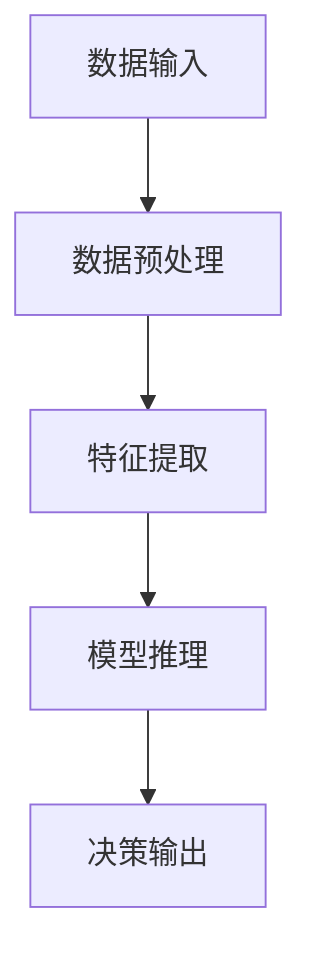
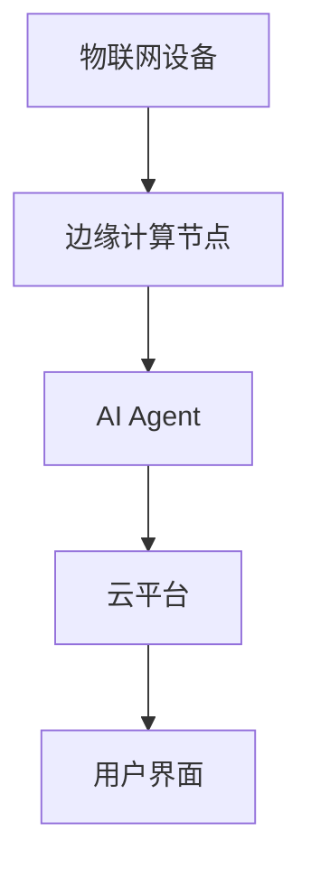

                 


# 企业AI Agent的边缘计算在物联网场景中的实践

> 关键词：企业AI Agent、边缘计算、物联网、分布式系统、智能决策、实时数据处理、协同算法

> 摘要：本文详细探讨了企业AI Agent在边缘计算中的应用，结合物联网场景，分析了AI Agent与边缘计算的协同工作模式，提出了基于边缘计算的AI Agent设计方法，并通过实际案例展示了其在智能制造、智慧城市等领域的应用。

---

## 第1章：背景介绍

### 1.1 AI Agent的基本概念
AI Agent是一种能够感知环境、自主决策并执行任务的智能实体。它具备主动性、反应性、社会性等特征，广泛应用于推荐系统、自动驾驶等领域。

### 1.2 边缘计算的基本概念
边缘计算是在靠近数据源的地方进行数据处理和存储的技术，减少了数据传输延迟，提高了系统的实时性和安全性。

### 1.3 物联网的背景与现状
物联网通过各种传感器和设备，将物理世界与数字世界连接。边缘计算在其中起到关键作用，AI Agent则增强了系统的智能决策能力。

---

## 第2章：核心概念与联系

### 2.1 核心概念对比
| 特性      | AI Agent                          | 边缘计算                          |
|-----------|------------------------------------|------------------------------------|
| 定义      | 智能实体，感知环境并执行任务     | 在数据源附近处理数据             |
| 场景      | 智能助手、自动化决策            | 工业自动化、实时监控             |
| 优势      | 自主决策、适应性强              | 低延迟、高带宽                   |

### 2.2 ER实体关系图
```mermaid
er
    entity AI-Agent {
        id
        type
        function
    }
    entity Edge-Computing {
        id
        resource
        location
    }
    AI-Agent --> Edge-Computing: uses
    Edge-Computing --> AI-Agent: provides
```

---

## 第3章：算法原理

### 3.1 数据处理算法
- **数据预处理**：清洗和转换数据，确保质量。
- **特征提取**：使用主成分分析提取关键特征。

### 3.2 AI Agent决策算法
- **实时决策模型**：基于边缘数据快速做出决策。
- **分布式决策**：多AI Agent协同决策，确保全局最优。

### 3.3 算法流程图


---

## 第4章：系统分析与架构设计

### 4.1 应用场景：智能制造
AI Agent监控生产线，边缘计算处理传感器数据，实现实时故障检测和预测性维护。

### 4.2 系统功能设计
- **数据采集**：传感器数据采集和预处理。
- **智能决策**：AI Agent分析数据并做出决策。
- **执行反馈**：执行决策并反馈结果。

### 4.3 系统架构图


---

## 第5章：项目实战

### 5.1 环境搭建
- **硬件**：树莓派、传感器节点。
- **软件**：安装边缘计算框架（如K3s）、AI Agent框架（如Django）。

### 5.2 核心代码实现
```python
import numpy as np

# 数据预处理
def preprocess(data):
    return data.dropna().astype(float)

# 特征提取
def feature_extract(data):
    return np.log(data)

# 模型训练
from sklearn.ensemble import RandomForestClassifier

model = RandomForestClassifier()
model.fit(X_train, y_train)

# 决策函数
def decide(model, features):
    return model.predict(features)
```

### 5.3 案例分析：智能工厂
通过实时监控设备状态，AI Agent预测故障，减少停机时间，提升生产效率。

---

## 第6章：总结与拓展

### 6.1 最佳实践
- 数据安全：确保边缘数据的加密传输。
- 系统维护：定期更新模型和固件，防止漏洞。

### 6.2 小结
企业AI Agent结合边缘计算，为物联网提供了智能化解决方案，提升了实时性和效率。

### 6.3 注意事项
- 数据隐私：遵守相关法律法规，保护用户隐私。
- 系统兼容性：确保不同设备和平台的兼容性。

### 6.4 拓展阅读
建议阅读《边缘计算：架构与应用》和《AI Agent原理与实践》。

---

作者：AI天才研究院 & 禅与计算机程序设计艺术

