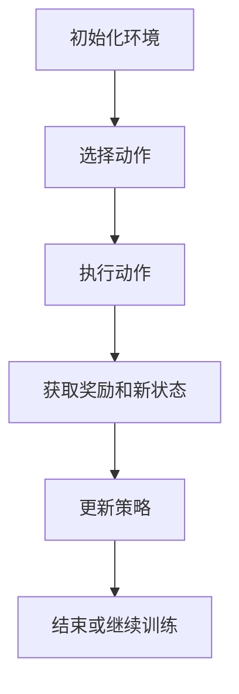
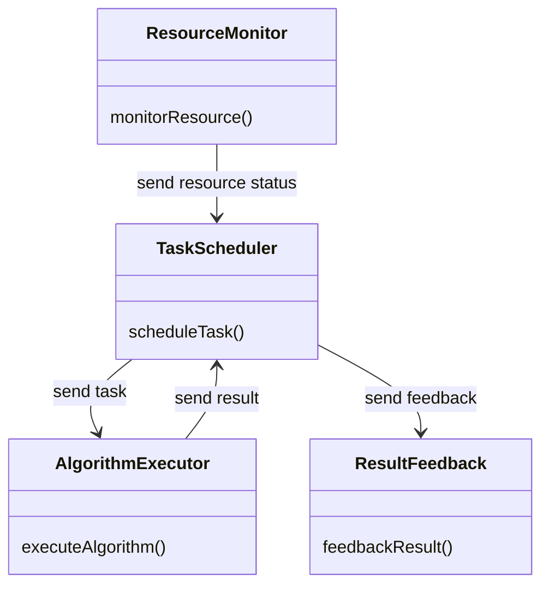
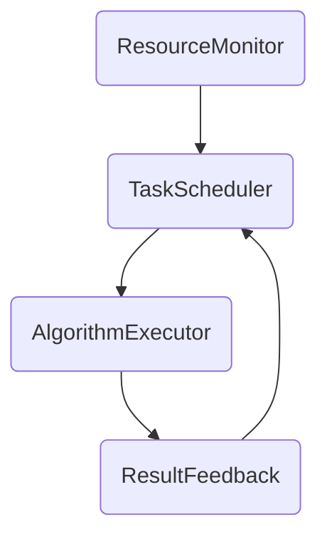

                 


# 《企业AI Agent的边缘计算资源优化配置》

---

## 关键词：企业AI Agent，边缘计算，资源优化，分布式计算，人工智能，资源分配算法

---

## 摘要：

本文探讨了企业在边缘计算环境中如何优化AI Agent的资源分配问题。随着边缘计算技术的快速发展，企业AI Agent在边缘设备上的部署日益增多，如何高效利用计算资源、降低能耗、提升性能成为关键挑战。本文从AI Agent的基本概念出发，结合边缘计算的特点，详细分析了资源优化配置的核心原理、算法设计、系统架构，并通过具体案例展示了资源优化的实际应用。文章还总结了最佳实践和未来发展方向，为企业在边缘计算环境下的AI Agent资源优化提供理论支持和实践指导。

---

# 第一部分: 企业AI Agent与边缘计算背景

---

## 第1章: AI Agent与边缘计算概述

### 1.1 AI Agent的基本概念

#### 1.1.1 AI Agent的定义与特点

AI Agent（人工智能代理）是指能够感知环境、自主决策并执行任务的智能实体。与传统AI系统不同，AI Agent具有以下特点：

- **自主性**：AI Agent能够在没有外部干预的情况下自主运行。
- **反应性**：能够实时感知环境变化并做出相应反应。
- **目标导向**：具备明确的目标，能够通过规划和推理实现目标。
- **学习能力**：能够通过数据和经验不断优化自身行为。

#### 1.1.2 AI Agent的核心功能与应用场景

AI Agent的核心功能包括感知、推理、规划、学习和执行。其应用场景广泛，如自动驾驶、智能助手、机器人控制、智能推荐等。

#### 1.1.3 AI Agent与传统AI的区别

AI Agent与传统AI的区别主要体现在自主性和目标导向性上。传统AI系统通常依赖外部输入，而AI Agent能够自主决策并执行任务。

### 1.2 边缘计算的基本概念

#### 1.2.1 边缘计算的定义与特点

边缘计算是指在靠近数据源或用户的边缘设备上进行数据处理和计算的技术。其特点包括低延迟、高实时性、分布式架构和本地化数据处理。

#### 1.2.2 边缘计算的核心技术与优势

边缘计算的核心技术包括分布式计算、数据流处理、边缘设备管理等。其优势在于能够减少数据传输延迟，降低中心化计算的负载压力。

#### 1.2.3 边缘计算的应用场景与挑战

边缘计算的应用场景包括智能制造、智慧城市、自动驾驶、智能家居等。其挑战在于设备资源受限、网络不稳定、数据隐私保护等。

### 1.3 AI Agent与边缘计算的结合背景

#### 1.3.1 边缘计算中的资源优化需求

在边缘计算环境中，资源分配问题尤为突出，如计算资源不足、网络带宽受限等。

#### 1.3.2 AI Agent在边缘计算中的角色与价值

AI Agent能够通过智能决策优化边缘设备的资源分配，提升系统性能和效率。

#### 1.3.3 当前技术发展与行业趋势

随着5G、物联网和AI技术的快速发展，AI Agent在边缘计算中的应用日益广泛。

### 1.4 本章小结

本章介绍了AI Agent和边缘计算的基本概念，分析了它们的结合背景和行业发展趋势。

---

## 第2章: 企业AI Agent的边缘计算资源优化背景

### 2.1 企业AI Agent的资源分配问题

#### 2.1.1 资源分配的基本概念

资源分配是指在多设备、多任务的环境中，合理分配计算资源以满足系统需求。

#### 2.1.2 资源分配的挑战与难点

资源分配的挑战包括设备资源受限、任务优先级不同、动态环境变化等。

#### 2.1.3 企业AI Agent的资源优化目标

企业AI Agent的目标是通过优化资源分配，提升系统性能、降低能耗、减少成本。

### 2.2 边缘计算中的资源分配问题

#### 2.2.1 边缘计算资源的特点

边缘设备的资源通常有限，包括计算能力、存储空间和网络带宽。

#### 2.2.2 边缘计算中的资源分配问题

资源分配问题主要表现为设备负载不均衡、任务响应延迟高等。

#### 2.2.3 企业AI Agent在边缘计算中的资源优化需求

企业AI Agent需要在边缘计算环境中实现资源的动态优化和高效利用。

### 2.3 本章小结

本章分析了企业AI Agent在边缘计算中的资源分配问题和优化需求。

---

# 第二部分: 企业AI Agent的边缘计算资源优化核心概念

---

## 第3章: AI Agent的边缘计算资源优化原理

### 3.1 AI Agent的资源优化原理

#### 3.1.1 资源分配的基本原理

资源分配的基本原理包括任务优先级排序、资源负载均衡、动态调整等。

#### 3.1.2 AI Agent在资源优化中的角色

AI Agent通过智能决策和学习优化资源分配策略。

#### 3.1.3 资源优化的核心要素

资源优化的核心要素包括任务需求分析、设备状态监测、资源分配策略设计等。

### 3.2 边缘计算中的资源优化配置

#### 3.2.1 资源优化配置的核心思想

资源优化配置的核心思想是通过动态调整资源分配策略，实现资源的高效利用。

#### 3.2.2 资源优化配置的实现方法

资源优化配置的实现方法包括基于强化学习的资源分配算法、基于遗传算法的优化策略等。

#### 3.2.3 资源优化配置的关键技术

关键技术包括动态资源分配、负载均衡、能量效率优化等。

### 3.3 本章小结

本章详细分析了AI Agent在边缘计算中的资源优化原理和实现方法。

---

## 第4章: 基于强化学习的资源分配算法

### 4.1 算法原理

#### 4.1.1 强化学习的基本概念

强化学习是一种通过智能体与环境交互，通过试错学习优化决策策略的技术。

#### 4.1.2 基于强化学习的资源分配算法设计

设计基于强化学习的资源分配算法，用于动态优化边缘设备的资源分配。

#### 4.1.3 算法的数学模型

资源分配算法的数学模型包括状态空间、动作空间、奖励函数等。

### 4.2 算法实现

#### 4.2.1 算法实现的代码框架

以下是基于强化学习的资源分配算法的Python代码框架：

```python
import numpy as np
import gym

class ResourceAllocator:
    def __init__(self, env):
        self.env = env
        self.agent = Agent()

    def train(self, episodes=1000):
        for episode in range(episodes):
            state = self.env.reset()
            total_reward = 0
            done = False
            while not done:
                action = self.agent.act(state)
                next_state, reward, done, info = self.env.step(action)
                self.agent.learn(state, action, reward, next_state)
                state = next_state
                total_reward += reward
            print(f"Episode {episode}: Total Reward = {total_reward}")

class Agent:
    def __init__(self):
        # 初始化网络和记忆库
        pass

    def act(self, state):
        # 根据状态选择动作
        pass

    def learn(self, state, action, reward, next_state):
        # 网络更新
        pass
```

#### 4.2.2 算法流程图

以下是基于强化学习的资源分配算法的流程图：



### 4.3 本章小结

本章详细介绍了基于强化学习的资源分配算法，并通过代码和流程图展示了算法的实现过程。

---

## 第5章: 系统架构设计

### 5.1 系统功能设计

#### 5.1.1 系统功能模块划分

系统功能模块包括资源监控模块、任务调度模块、算法执行模块和结果反馈模块。

#### 5.1.2 系统功能模块的交互关系

以下是系统功能模块的交互关系图：



#### 5.1.3 系统功能的实现目标

系统功能的实现目标是实现资源监控、任务调度、算法执行和结果反馈的自动化。

### 5.2 系统架构设计

#### 5.2.1 系统架构的模块化设计

系统架构采用模块化设计，包括资源监控模块、任务调度模块、算法执行模块和结果反馈模块。

#### 5.2.2 系统架构图

以下是系统架构图：



#### 5.2.3 系统接口设计

系统接口设计包括资源监控接口、任务调度接口、算法执行接口和结果反馈接口。

### 5.3 本章小结

本章详细设计了系统的功能模块和架构，并展示了模块之间的交互关系。

---

## 第6章: 项目实战

### 6.1 项目环境配置

#### 6.1.1 环境需求

需要安装Python 3.8及以上版本、TensorFlow、Keras、OpenAI Gym等库。

#### 6.1.2 环境配置步骤

1. 安装Python和相关库。
2. 下载OpenAI Gym环境。
3. 配置开发环境（如Jupyter Notebook）。

### 6.2 系统核心实现

#### 6.2.1 算法实现代码

以下是基于强化学习的资源分配算法的实现代码：

```python
import gym
import numpy as np

class Agent:
    def __init__(self, state_space, action_space):
        self.state_space = state_space
        self.action_space = action_space
        self.theta = np.random.randn(4, 1)  # 简单的参数化策略

    def act(self, state):
        action_probs = np.exp(np.dot(self.theta.T, state)) / np.sum(np.exp(np.dot(self.theta.T, state)))
        action = np.random.choice(self.action_space, p=action_probs)
        return action

    def learn(self, state, action, reward, next_state):
        # 简单的策略梯度方法
        action_probs = np.exp(np.dot(self.theta.T, state)) / np.sum(np.exp(np.dot(self.theta.T, state)))
        loss = -action_probs[action] * (reward + np.dot(self.theta.T, next_state))
        self.theta += 0.1 * loss

class ResourceAllocator:
    def __init__(self, env):
        self.env = env
        self.agent = Agent(env.observation_space.shape[0], env.action_space.n)

    def train(self, episodes=1000):
        for episode in range(episodes):
            state = self.env.reset()
            total_reward = 0
            done = False
            while not done:
                action = self.agent.act(state)
                next_state, reward, done, info = self.env.step(action)
                self.agent.learn(state, action, reward, next_state)
                state = next_state
                total_reward += reward
            print(f"Episode {episode}: Total Reward = {total_reward}")

env = gym.make('Multi-armed-bandit-v0')
allocator = ResourceAllocator(env)
allocator.train(episodes=10)
```

#### 6.2.2 代码实现解读

代码实现了一个简单的基于强化学习的资源分配算法，用于在多臂老虎机环境中优化资源分配。

#### 6.2.3 系统功能实现

系统功能实现包括资源监控、任务调度、算法执行和结果反馈。

### 6.3 项目案例分析

#### 6.3.1 项目案例介绍

以边缘工厂设备监控为例，展示AI Agent如何优化资源分配。

#### 6.3.2 项目案例实现

以下是边缘工厂设备监控的实现步骤：

1. 数据采集：通过边缘设备采集设备运行数据。
2. 数据处理：分析设备状态，识别异常情况。
3. 资源分配：通过AI Agent优化计算资源分配。
4. 结果反馈：将优化结果反馈给设备管理系统。

#### 6.3.3 项目案例分析

通过AI Agent优化资源分配，降低了设备故障率，提升了系统性能。

### 6.4 本章小结

本章通过具体案例展示了AI Agent在边缘计算中的实际应用，并详细解读了系统的实现过程。

---

## 第7章: 最佳实践与总结

### 7.1 最佳实践

#### 7.1.1 资源分配策略

建议采用动态资源分配策略，根据任务需求和设备状态实时调整资源分配。

#### 7.1.2 系统设计建议

建议采用模块化系统设计，便于功能扩展和维护。

#### 7.1.3 算法优化建议

建议根据具体场景选择合适的算法，并进行参数调优。

### 7.2 本章小结

本章总结了企业AI Agent在边缘计算中的资源优化配置的关键点和最佳实践。

---

## 作者：AI天才研究院/AI Genius Institute & 禅与计算机程序设计艺术 /Zen And The Art of Computer Programming

---

**本文由AI天才研究院原创，转载请注明出处。**

