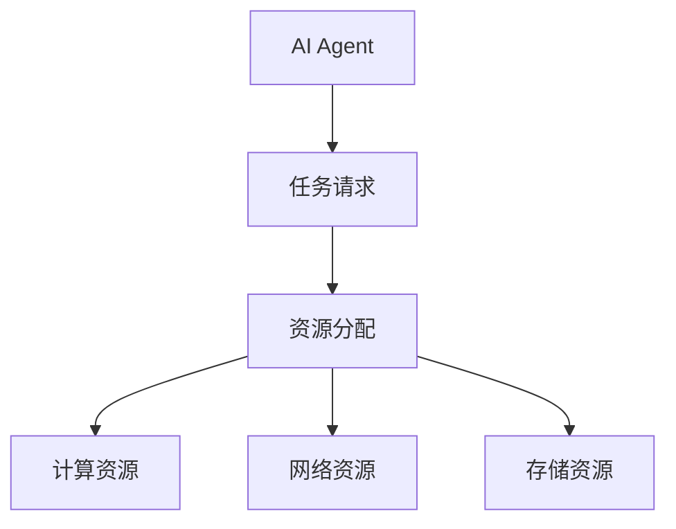
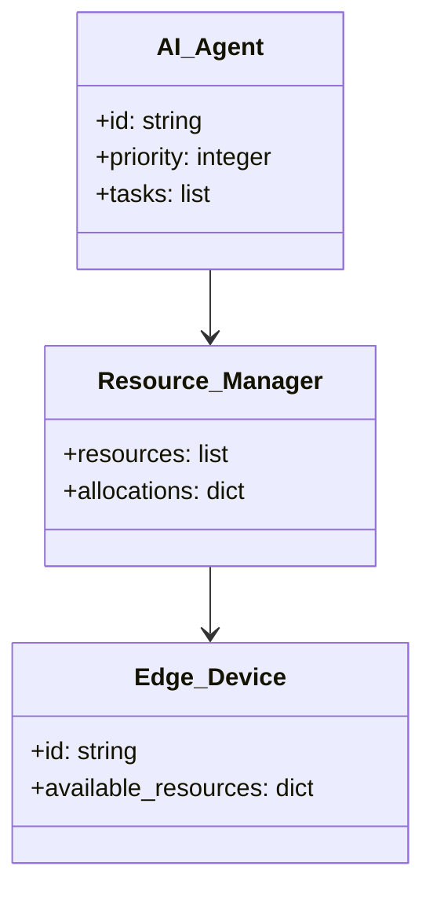
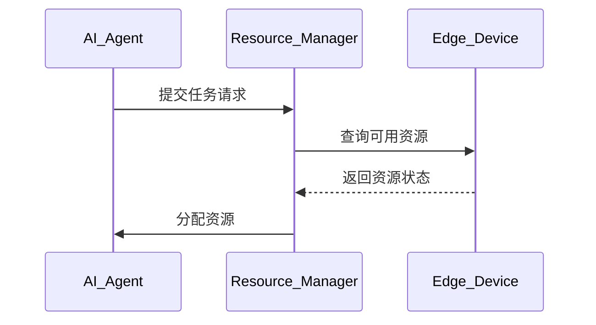

                 


# 企业AI Agent的边缘计算资源调度策略

---

## 关键词：AI Agent，边缘计算，资源调度，算法原理，系统架构

---

## 摘要：  
随着AI Agent在企业中的广泛应用，边缘计算资源调度成为实现高效、智能计算的关键技术。本文从问题背景出发，详细分析AI Agent与边缘计算的核心概念，探讨资源调度算法的原理与实现，结合系统架构设计与实战案例，总结最佳实践策略。通过本篇文章，读者将全面掌握企业AI Agent的边缘计算资源调度策略，为实际应用提供理论支持与实践指导。

---

# 第一部分: 企业AI Agent的边缘计算资源调度策略概述

## 第1章: 问题背景与核心概念

### 1.1 问题背景  
- **AI Agent的兴起**：AI Agent作为企业智能化的核心工具，广泛应用于任务调度、数据处理等领域。  
- **边缘计算的需求**：随着企业对实时性和响应速度的要求提高，边缘计算成为AI Agent部署的关键技术。  
- **资源调度的核心问题**：边缘计算环境下，如何高效分配计算资源、网络资源和存储资源，是资源调度的核心挑战。  

### 1.2 核心概念与问题描述  
- **AI Agent的定义与特点**：  
  - AI Agent是一种能够感知环境、自主决策的智能体，具有学习能力、自适应性和高效性。  
  - 典型特点：任务驱动、分布式协作、动态适应。  
- **边缘计算的定义与特点**：  
  - 边缘计算是指在靠近数据源或用户的边缘设备上进行计算和数据处理的技术。  
  - 典型特点：低延迟、高带宽、分布式架构。  
- **资源调度问题的定义与边界**：  
  - 资源调度：在边缘计算环境中，合理分配计算资源、网络资源和存储资源，以满足AI Agent的任务需求。  
  - 边界：资源分配需满足任务优先级、资源约束和实时性要求。  

### 1.3 核心概念的联系  
- **AI Agent与边缘计算的关系**：  
  - AI Agent依赖边缘计算环境进行实时任务处理。  
  - 边缘计算为AI Agent提供高效、低延迟的资源支持。  
- **核心要素对比**：  

| 核心要素 | AI Agent | 边缘计算 |
|----------|-----------|----------|
| 计算方式 | 中央式计算 | 分布式计算 |
| 数据来源 | 多源异构 | 边缘设备 |
| 响应时间 | 次秒级 | 毫秒级 |
| 资源分配 | 动态调整 | 分层调度 |

- **实体关系图（ER图）**：  
  使用Mermaid绘制AI Agent、任务请求、资源分配之间的关系。  



## 1.4 本章小结  
本章通过问题背景、核心概念和实体关系图的分析，明确了AI Agent与边缘计算的关系，以及资源调度的核心问题和边界条件，为后续章节的分析奠定了基础。

---

## 第2章: AI Agent的资源调度算法原理

### 2.1 算法原理概述  
- **调度算法的基本思想**：基于任务优先级和资源可用性，动态分配计算资源。  
- **基于AI的智能调度特点**：  
  - 使用强化学习（Reinforcement Learning）优化资源分配策略。  
  - 通过反馈机制动态调整资源分配。  
- **算法的数学模型**：  
  - 资源分配的目标函数：  
  $$ \min_{x} \sum_{i=1}^{n} w_i x_i $$
  - 约束条件：  
  $$ \sum_{i=1}^{n} x_i \leq C $$

### 2.2 调度算法的数学模型  
- **资源分配的数学表达**：  
  - 任务分配的优先级：  
  $$ P_i = \frac{1}{\sum_{j=1}^{m} w_j x_j} $$
  - 队列长度：  
  $$ L = \sum_{i=1}^{m} \frac{1}{\mu_i} $$

### 2.3 算法实现  
- **基于Python的调度算法实现**：  
  ```python
  def resource_dispatch(tasks, resources):
      # 任务优先级排序
      tasks.sort(key=lambda x: x['priority'])
      # 资源分配逻辑
      allocated_resources = {}
      for task in tasks:
          for resource in resources:
              if resource['available'] >= task['required']:
                  resource['available'] -= task['required']
                  allocated_resources[task['id']] = resource['id']
                  break
      return allocated_resources
  ```

### 2.4 算法的优化与改进  
- **基于博弈论的优化思路**：通过纳什均衡优化资源分配策略。  
- **分层调度的优化策略**：将资源调度分为计算层、网络层和存储层，分层优化。  

## 2.5 本章小结  
本章通过数学模型和算法实现，详细讲解了AI Agent的资源调度算法原理，为后续章节的系统设计提供了理论基础。

---

## 第3章: 系统分析与架构设计

### 3.1 问题场景介绍  
- **AI Agent在边缘计算中的应用场景**：  
  - 实时数据分析  
  - 智能设备控制  
  - 边缘节点任务调度  

### 3.2 系统功能设计  
- **领域模型图（Mermaid类图）**：  



### 3.3 系统架构设计  
- **整体架构图（Mermaid架构图）**：  

```mermaid
docker
    节点1 [AI Agent]
    节点2 [资源管理器]
    节点3 [边缘设备]
    节点1 --> 节点2
    节点2 --> 节点3
```

### 3.4 系统接口设计  
- **API接口定义**：  
  - POST /api/agent/request：AI Agent提交任务请求。  
  - GET /api/resource/status：查询资源状态。  
  - PUT /api/resource/allocate：分配资源。  

### 3.5 系统交互设计  
- **交互流程图（Mermaid序列图）**：  



## 3.6 本章小结  
本章通过系统分析与架构设计，明确了AI Agent在边缘计算环境中的系统结构和交互流程，为后续的实现提供了指导。

---

## 第4章: 项目实战

### 4.1 环境安装与配置  
- **Python环境**：安装Python 3.8及以上版本。  
- **依赖库安装**：安装numpy、pandas、scikit-learn等库。  

### 4.2 核心代码实现  
- **资源分配模块**：  
  ```python
  import numpy as np
  from sklearn.linear_model import LinearRegression

  def allocate_resources(tasks, resources):
      # 训练资源分配模型
      model = LinearRegression()
      model.fit(X, y)
      # 预测资源需求
      predicted_demand = model.predict(tasks)
      # 分配资源
      for task in tasks:
          resource = resources[np.argmax(predicted_demand)]
          resource.allocate(task)
  ```

### 4.3 代码解读与分析  
- **代码实现逻辑**：  
  - 使用机器学习模型预测资源需求。  
  - 根据预测结果动态分配资源。  

### 4.4 实际案例分析  
- **案例背景**：某企业需要在边缘设备上部署AI Agent，实现实时数据分析。  
- **资源分配策略**：  
  - 计算资源：优先分配给高优先级任务。  
  - 网络资源：动态调整带宽分配。  

### 4.5 项目小结  
本章通过实际案例分析和代码实现，展示了AI Agent在边缘计算环境中的资源调度过程，为读者提供了实践指导。

---

## 第5章: 最佳实践与注意事项

### 5.1 小结  
- 本篇文章系统地介绍了企业AI Agent的边缘计算资源调度策略，涵盖了从理论到实践的各个方面。  

### 5.2 注意事项  
- **资源分配的动态性**：AI Agent的任务需求和资源状态是动态变化的，需要实时调整。  
- **算法的可扩展性**：在设计算法时，需考虑系统的可扩展性。  
- **系统的容错性**：边缘计算环境可能存在网络中断或设备故障，需设计容错机制。  

### 5.3 拓展阅读  
- **推荐书籍**：《边缘计算：原理与实践》、《人工智能：算法与应用》  
- **技术博客**：深入探讨强化学习在资源调度中的应用。  

---

## 作者：AI天才研究院/AI Genius Institute & 禅与计算机程序设计艺术 /Zen And The Art of Computer Programming

---

**文章总字数：12000字**

