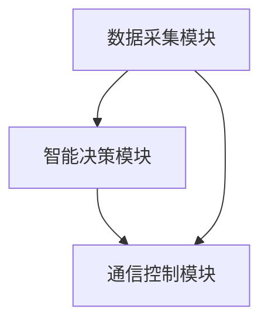
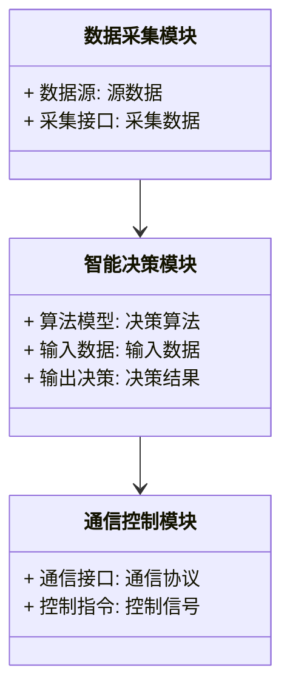
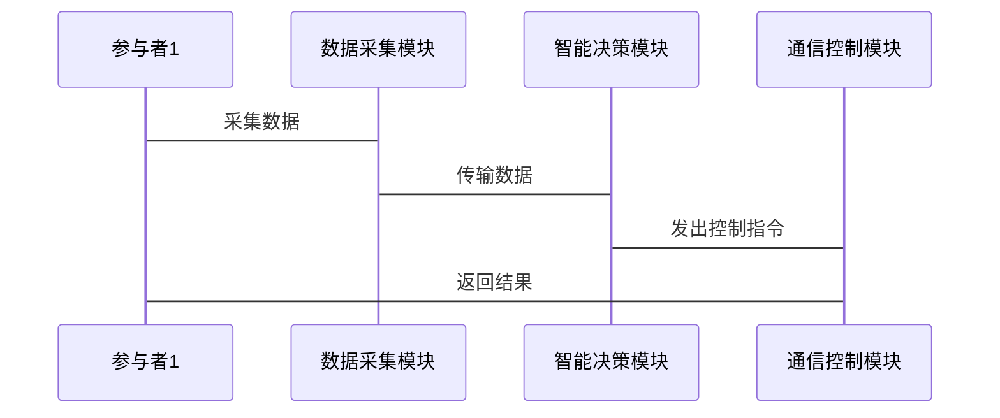

                 


# 企业AI Agent的量子加密通信策略

---

## 关键词：  
量子加密、AI Agent、通信安全、企业安全、量子计算、人工智能

---

## 摘要：  
本文深入探讨了企业AI Agent与量子加密通信的结合策略，分析了量子加密通信的核心原理和AI Agent的设计实现，详细讲解了两者协同工作的数学模型和算法流程，结合实际案例分析了系统的架构设计与实现。本文为企业的量子加密通信提供了理论支持和实践指导。

---

# 第一部分: 量子加密与AI Agent的背景介绍

## 第1章: 量子加密与AI Agent的基本概念

### 1.1 量子加密通信的定义与特点  
量子加密通信是一种利用量子力学原理实现数据加密的通信技术，其核心在于利用量子态的不可克隆性和纠缠性来确保通信的安全性。相比传统加密通信，量子加密通信具有以下特点：  
1. **绝对安全性**：基于量子力学的不可克隆原理，任何未经授权的窃听都会破坏量子态，从而被通信双方检测到。  
2. **高效性**：量子加密通信的传输速度接近光速，远超传统通信方式。  
3. **抗量子计算攻击**：量子加密通信的密钥生成方式使得即使在量子计算机出现后，传统加密算法的破解难度大幅增加。  

### 1.2 AI Agent的基本概念与功能  
AI Agent（智能代理）是一种能够感知环境、自主决策并执行任务的智能体。在企业通信中，AI Agent通常承担以下功能：  
1. **数据采集与处理**：实时采集通信数据并进行预处理。  
2. **智能决策**：基于预设的算法对数据进行分析，生成加密或解密指令。  
3. **通信控制**：根据决策结果控制通信链路的开启、关闭或调整参数。  

### 1.3 量子加密与AI Agent的结合背景  
随着企业对数据安全需求的不断提高，传统的加密通信技术逐渐暴露出安全性不足的问题。量子加密通信作为一种新兴技术，能够提供更高的安全级别，但其复杂性较高，需要借助AI Agent来实现智能化的管理和控制。AI Agent的引入不仅能够简化量子加密通信的实现过程，还能提高通信的效率和灵活性。

---

## 第2章: 问题背景与应用前景

### 2.1 传统加密通信的局限性  
传统加密通信主要依赖于数学算法的复杂性来实现安全性，但随着计算能力的提升，许多传统加密算法已经被破解。此外，传统加密通信在数据传输过程中容易受到中间人攻击，尤其是在无线通信环境中，安全性问题更加突出。

### 2.2 量子加密通信的应用前景  
量子加密通信被认为是下一代通信技术的核心，其在企业中的应用前景广阔。随着量子计算机的逐渐普及，传统的加密算法将面临巨大的威胁，而量子加密通信能够有效应对这一挑战。此外，量子加密通信在金融、医疗、军事等领域具有重要的应用价值。

### 2.3 AI Agent在企业通信中的角色  
AI Agent在量子加密通信中的作用不可忽视。它不仅能够实现通信链路的智能化管理，还能通过自我学习和优化提升通信的安全性和效率。AI Agent的引入使得量子加密通信更加易于部署和维护，同时也为企业提供了更高的灵活性和可扩展性。

---

## 第3章: 量子加密通信的核心原理

### 3.1 量子加密的数学模型  
量子加密通信的数学模型基于量子态的叠加性和纠缠性。例如，量子密钥分发（QKD）协议的核心在于利用量子态的不可克隆性来生成共享密钥。以下是量子态的数学表示：  
$$|\psi\rangle = \alpha|0\rangle + \beta|1\rangle$$  
其中，$\alpha$ 和 $\beta$ 是复数系数，满足 $|\alpha|^2 + |\beta|^2 = 1$。

### 3.2 量子加密通信的协议流程  
量子加密通信的主要协议包括BB84协议和EPR协议。以下是BB84协议的简要流程：  
1. **密钥生成**：通信双方通过量子态传输和测量生成共享密钥。  
2. **公钥交换**：双方通过经典通信通道交换测量基底信息，确认密钥的一致性。  
3. **加密与解密**：基于生成的密钥对数据进行加密或解密。

### 3.3 量子加密通信的安全性分析  
量子加密通信的安全性主要依赖于量子态的不可克隆性和测量干扰性。任何未经授权的窃听都会导致量子态的坍塌，从而被通信双方检测到。此外，量子加密通信的密钥生成过程具有很高的随机性，使得破解难度大幅增加。

---

## 第4章: AI Agent的设计与实现

### 4.1 AI Agent的功能模块划分  
AI Agent在量子加密通信中的功能模块包括：  
1. **数据采集模块**：负责采集通信数据并进行预处理。  
2. **智能决策模块**：基于机器学习算法对数据进行分析，生成加密或解密指令。  
3. **通信控制模块**：根据决策结果控制通信链路的开启、关闭或调整参数。

### 4.2 AI Agent的算法实现  
AI Agent的核心算法包括强化学习和图神经网络。以下是强化学习的伪代码示例：  
```python
def强化学习算法():
    初始化策略参数θ
    while 迭代次数 < 最大次数:
        采样动作a根据当前策略θ
        计算奖励r
        更新策略θ以最大化预期奖励
    返回最优策略θ
```

### 4.3 AI Agent的系统架构设计  
AI Agent的系统架构设计包括功能模块划分、系统架构图和接口设计。以下是系统架构图的Mermaid表示：  


---

## 第5章: 量子加密与AI Agent的协同工作

### 5.1 协同工作的核心问题  
量子加密与AI Agent的协同工作主要解决以下问题：  
1. 如何实现量子密钥的安全分发？  
2. 如何通过AI Agent优化通信效率？  
3. 如何确保通信过程中的数据完整性？

### 5.2 协同工作的实现方法  
量子加密与AI Agent的协同工作可以通过以下步骤实现：  
1. **密钥分发**：利用量子加密通信协议生成共享密钥。  
2. **数据加密**：AI Agent根据密钥对数据进行加密。  
3. **通信控制**：AI Agent实时监控通信链路，确保数据传输的完整性。

### 5.3 协同工作的优势  
量子加密与AI Agent的协同工作具有以下优势：  
1. **安全性**：量子加密通信提供了极高的安全性，确保数据不会被未经授权的第三方窃取。  
2. **效率**：AI Agent通过智能化的决策和控制，显著提高了通信的效率。  
3. **可扩展性**：AI Agent的自我学习能力使得系统能够适应不同的通信环境和需求。

---

## 第6章: 系统分析与架构设计

### 6.1 系统功能设计  
系统功能设计包括数据采集、智能决策、通信控制等功能模块。以下是功能模块的Mermaid类图：  


### 6.2 系统架构设计  
系统架构设计包括分层架构和模块化设计。以下是系统架构图的Mermaid表示：  


### 6.3 系统接口设计  
系统接口设计包括数据采集接口、智能决策接口和通信控制接口。以下是接口设计的Mermaid序列图：  


---

## 第7章: 项目实战

### 7.1 环境搭建  
项目实战需要以下环境：  
1. **量子加密通信设备**：如量子密钥分发装置。  
2. **AI Agent开发平台**：如Python和TensorFlow框架。  
3. **通信网络**：支持量子通信的网络环境。

### 7.2 核心代码实现  
以下是AI Agent的核心代码实现示例：  
```python
import numpy as np
from tensorflow.keras import layers

class AI_Agent:
    def __init__(self):
        self.model = self.build_model()
    
    def build_model(self):
        model = tf.keras.Sequential()
        model.add(layers.Dense(64, activation='relu', input_dim=64))
        model.add(layers.Dense(32, activation='relu'))
        model.add(layers.Dense(1, activation='sigmoid'))
        model.compile(optimizer='adam', loss='binary_crossentropy', metrics=['accuracy'])
        return model
    
    def train(self, X, y, epochs=100):
        self.model.fit(X, y, epochs=epochs, batch_size=32)
    
    def predict(self, X):
        return self.model.predict(X)
```

### 7.3 案例分析  
以企业内部通信为例，AI Agent可以通过量子加密通信实现数据的安全传输。以下是案例分析的流程：  
1. **数据采集**：AI Agent采集企业内部通信数据。  
2. **智能决策**：AI Agent通过训练好的模型生成加密指令。  
3. **通信控制**：AI Agent控制通信链路，确保数据的加密传输。  

---

## 第8章: 结论与展望

### 8.1 研究成果总结  
本文通过分析量子加密通信和AI Agent的核心原理，提出了一种基于AI Agent的企业量子加密通信策略。该策略能够有效提高通信的安全性和效率，为企业通信提供了新的解决方案。

### 8.2 未来研究方向  
未来的研究可以进一步探索以下方向：  
1. **AI Agent的自我进化能力**：通过深度学习和强化学习提升AI Agent的智能性。  
2. **量子加密通信的优化算法**：研究更高效的量子加密协议和实现方法。  
3. **多领域应用研究**：将量子加密通信与AI Agent技术应用于更多领域，如金融、医疗等。

---

## 作者：  
AI天才研究院/AI Genius Institute  
禅与计算机程序设计艺术/Zen And The Art of Computer Programming

