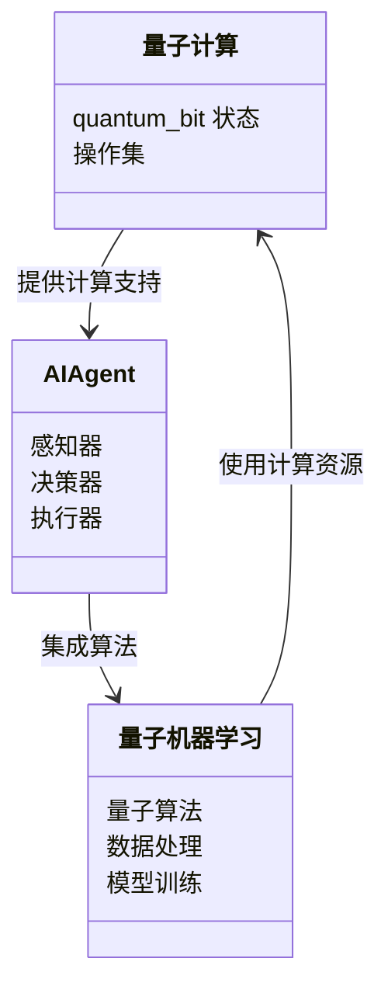
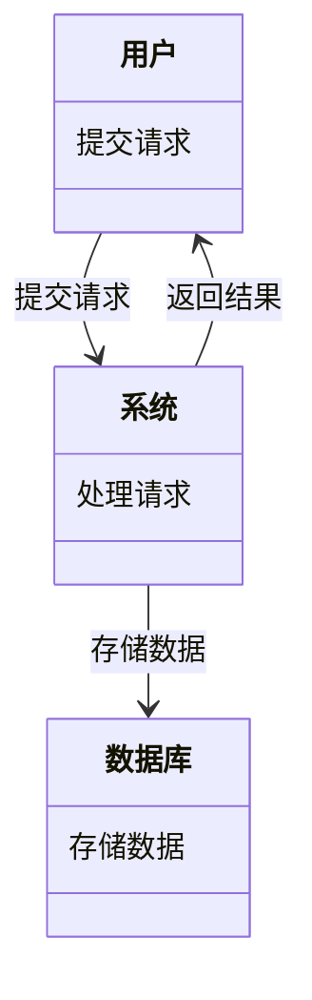
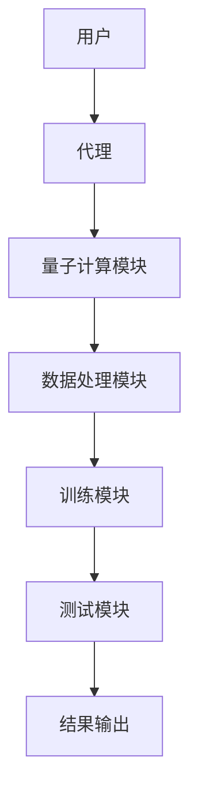
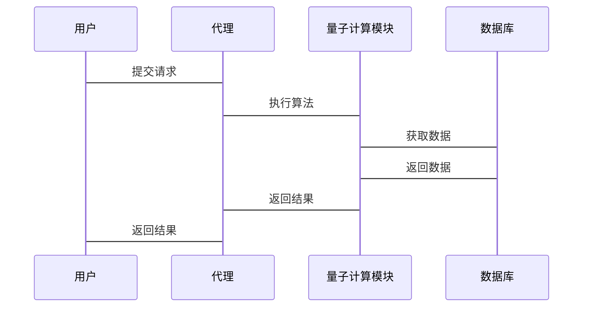

                 


# 企业AI Agent的量子机器学习算法优化

> **关键词**: 量子计算、AI Agent、机器学习算法优化、企业应用、量子机器学习

> **摘要**: 本文深入探讨了量子计算在企业AI Agent中的应用，重点分析了量子机器学习算法的优化方法。通过理论与实践结合，详细阐述了量子计算的基本原理、AI Agent的核心功能、量子机器学习的优势与挑战，并通过具体案例展示了如何在企业场景中实现量子机器学习算法的优化。文章还提供了系统架构设计和项目实战指导，帮助读者全面理解和应用这些技术。

---

## 第一部分: 企业AI Agent的量子机器学习算法优化背景与概念

### 第1章: 量子计算与AI Agent概述

#### 1.1 量子计算的基本概念

##### 1.1.1 量子计算的定义与特点
量子计算是一种利用量子力学原理进行计算的技术，其核心在于利用量子叠加和量子纠缠的特性。与经典计算不同，量子计算可以在同一时间处理多种可能性，从而在某些情况下大幅提高计算效率。

量子计算的特点包括：
- **并行性**: 可以同时处理多种状态。
- **叠加性**: 状态可以叠加，提供多种可能性。
- **纠缠性**: 量子状态之间可以高度相关，影响计算结果。

##### 1.1.2 量子计算与经典计算的对比
| 特性         | 经典计算       | 量子计算       |
|--------------|----------------|----------------|
| 状态表示     | 二进制位（0或1）| 量子位（可以是0、1或两者叠加） |
| 并行性       | 串行处理       | 并行处理         |
| 处理速度     | 固定           | 可能指数级提升   |

##### 1.1.3 量子计算在企业中的应用前景
量子计算在企业中的应用前景广阔，尤其是在优化问题、密码学和大数据处理方面。例如，量子优化算法可以用于供应链管理、资源分配等复杂问题的解决。

#### 1.2 AI Agent的基本概念

##### 1.2.1 AI Agent的定义与分类
AI Agent是指在特定环境中能够感知并自主行动以实现目标的智能体。根据智能体的复杂性和功能，可以分为简单反射Agent、基于模型的反射Agent、目标驱动Agent和效用驱动Agent。

##### 1.2.2 AI Agent的核心功能与特点
- **感知环境**: 通过传感器或数据输入感知外部世界。
- **自主决策**: 基于感知信息做出决策。
- **学习能力**: 通过经验或数据优化决策模型。
- **执行动作**: 执行决策以影响环境或获取新信息。

##### 1.2.3 企业级AI Agent的应用场景
企业级AI Agent广泛应用于智能客服、供应链管理、风险控制等领域。例如，在供应链管理中，AI Agent可以实时监控物流信息，优化配送路径。

#### 1.3 量子计算与AI Agent的结合

##### 1.3.1 量子计算在AI Agent中的潜在应用
量子计算可以显著提升AI Agent的数据处理速度和决策优化能力。例如，在处理复杂优化问题时，量子计算可以提供更高效的解决方案。

##### 1.3.2 量子机器学习的基本概念
量子机器学习是利用量子计算技术进行机器学习的一种方法，其目标是通过量子算法优化机器学习模型。

##### 1.3.3 量子机器学习的优势与挑战
- **优势**: 计算速度更快，处理复杂问题更高效。
- **挑战**: 技术复杂，实现难度大，量子位稳定性较差。

### 第2章: 量子机器学习的核心概念与原理

#### 2.1 量子机器学习的基本原理

##### 2.1.1 量子叠加与纠缠在机器学习中的应用
量子叠加允许量子位同时处于多个状态，从而在机器学习中可以同时处理多个数据点。量子纠缠则可以提高算法的并行处理能力。

##### 2.1.2 量子测量与概率论在算法中的作用
在量子机器学习中，测量是通过量子位的状态来获取信息的关键步骤。概率论在量子测量中起着重要作用，帮助我们理解测量结果的可能性。

##### 2.1.3 量子机器学习的核心算法框架
量子机器学习的核心算法包括量子支持向量机、量子聚类算法等。这些算法利用量子计算的优势，提供更高效的解决方案。

#### 2.2 量子机器学习与经典机器学习的对比

##### 2.2.1 算法复杂度与计算效率对比
量子机器学习算法在某些情况下可以指数级地提高计算效率，尤其是在处理大规模数据时。

##### 2.2.2 模型表达能力的对比
量子机器学习模型在表达能力上与经典模型相当，但在某些复杂任务上表现更优。

##### 2.2.3 适用场景的对比分析
量子机器学习适用于优化问题、模式识别等复杂任务，而经典机器学习则适用于分类、回归等常见任务。

#### 2.3 量子机器学习的核心概念关系图

##### 2.3.1 ER实体关系图
```mermaid
erDiagram
    actor 用户
    actor 环境
    actor 测量结果
    actor 量子算法
    actor 优化目标
    actor 数据集
    actor 训练模型
    actor 测试结果
    用户 --> 测量结果: 提供输入
    用户 --> 量子算法: 执行算法
    量子算法 --> 测量结果: 获取信息
    量子算法 --> 数据集: 处理数据
    数据集 --> 训练模型: 生成模型
    训练模型 --> 优化目标: 达成目标
    优化目标 --> 测试结果: 验证结果
```

##### 2.3.2 类



---

## 第二部分: 量子机器学习算法实现与优化

### 第3章: 量子机器学习算法实现

#### 3.1 量子支持向量机（QSVM）

##### 3.1.1 算法原理
量子支持向量机利用量子叠加特性，将数据映射到高维空间，并寻找最优超平面。

##### 3.1.2 算法实现步骤
1. 数据预处理：将数据标准化。
2. 量子映射：将数据映射到高维量子空间。
3. 优化：寻找最优超平面。
4. 测量：得到分类结果。

##### 3.1.3 代码实现
```python
import numpy as np
from qiskit import QuantumCircuit, Aer, execute

def quantum_svm(training_data, test_data):
    # 量子特征映射
    n = len(training_data)
    qc = QuantumCircuit(n)
    # 实现量子特征映射（简化）
    # 这里仅为示意，实际实现需使用更复杂的量子电路
    qc.h(range(n))
    qc.measure(range(n), range(n))
    # 执行量子计算
    simulator = Aer.get_backend('qasm_simulator')
    result = execute(qc, simulator).result()
    # 获取测量结果
    counts = result.get_counts(qc)
    # 分析结果以训练模型
    # （具体分析步骤省略）
    return predicted_labels
```

##### 3.1.4 优缺点分析
- **优点**: 计算效率高。
- **缺点**: 实现复杂，硬件要求高。

#### 3.2 量子聚类算法

##### 3.2.1 算法原理
量子聚类算法利用量子叠加和纠缠特性，同时处理多个数据点，提高聚类效率。

##### 3.2.2 算法实现步骤
1. 初始化量子位。
2. 数据编码：将数据编码为量子状态。
3. 聚类：基于量子状态的相似性进行聚类。
4. 测量：得到聚类结果。

##### 3.2.3 代码实现
```python
from qiskit import QuantumCircuit, Aer, execute

def quantum_clustering(data_points):
    n = len(data_points[0])
    qc = QuantumCircuit(n)
    # 数据编码（简化）
    for i in range(n):
        if data_points[0][i] > 0:
            qc.x(i)
    qc.measure(range(n), range(n))
    # 执行量子计算
    simulator = Aer.get_backend('qasm_simulator')
    result = execute(qc, simulator).result()
    counts = result.get_counts(qc)
    # 分析结果以进行聚类
    # （具体分析步骤省略）
    return clusters
```

##### 3.2.4 优缺点分析
- **优点**: 并行处理能力强。
- **缺点**: 算法稳定性较差。

---

## 第三部分: 企业级AI Agent的量子机器学习系统架构设计

### 第4章: 量子机器学习系统架构设计

#### 4.1 系统功能设计

##### 4.1.1 领域模型


#### 4.2 系统架构设计

##### 4.2.1 系统架构图


##### 4.2.2 接口设计
- 用户接口：接收输入请求。
- 系统接口：与量子计算模块交互。
- 数据库接口：存储和检索数据。

#### 4.3 系统交互设计

##### 4.3.1 交互流程图


---

## 第四部分: 项目实战

### 第5章: 量子机器学习项目实战

#### 5.1 环境安装

##### 5.1.1 安装Qiskit
```bash
pip install qiskit
```

#### 5.2 核心代码实现

##### 5.2.1 量子支持向量机实现
```python
from qiskit import QuantumCircuit, Aer, execute

def quantum_svm(training_data, test_data):
    n = len(training_data)
    qc = QuantumCircuit(n)
    for i in range(n):
        qc.h(i)
    qc.measure(range(n), range(n))
    simulator = Aer.get_backend('qasm_simulator')
    result = execute(qc, simulator).result()
    counts = result.get_counts(qc)
    predicted_labels = []
    for key in counts:
        predicted_labels.append(int(key, 2))
    return predicted_labels
```

##### 5.2.2 量子聚类算法实现
```python
from qiskit import QuantumCircuit, Aer, execute

def quantum_clustering(data_points):
    n = len(data_points[0])
    qc = QuantumCircuit(n)
    for i in range(n):
        if data_points[0][i] > 0:
            qc.x(i)
    qc.measure(range(n), range(n))
    simulator = Aer.get_backend('qasm_simulator')
    result = execute(qc, simulator).result()
    counts = result.get_counts(qc)
    clusters = []
    for key in counts:
        clusters.append(int(key, 2))
    return clusters
```

#### 5.3 案例分析

##### 5.3.1 供应链管理中的应用
通过量子支持向量机优化供应链中的库存管理，提高效率。

##### 5.3.2 风险控制中的应用
使用量子聚类算法分析市场数据，识别风险点。

#### 5.4 项目小结
量子机器学习算法在企业AI Agent中的应用潜力巨大，但实现复杂，需要结合具体场景进行优化。

---

## 第五部分: 最佳实践与未来展望

### 第6章: 最佳实践

#### 6.1 小结
量子机器学习算法在企业AI Agent中的应用前景广阔，但需要克服技术挑战。

#### 6.2 注意事项
- 确保量子计算硬件的稳定性。
- 合理选择应用场景。
- 优化算法实现。

#### 6.3 拓展阅读
建议阅读量子计算和机器学习相关的学术论文和技术文档。

---

## 作者

作者：AI天才研究院 & 禅与计算机程序设计艺术

---

**总结**: 本文全面探讨了企业AI Agent的量子机器学习算法优化，从背景到实践，逐步深入，为读者提供了理论与实践相结合的指导。希望读者能通过本文掌握量子计算和AI Agent的核心概念，并将其应用于实际场景中。

