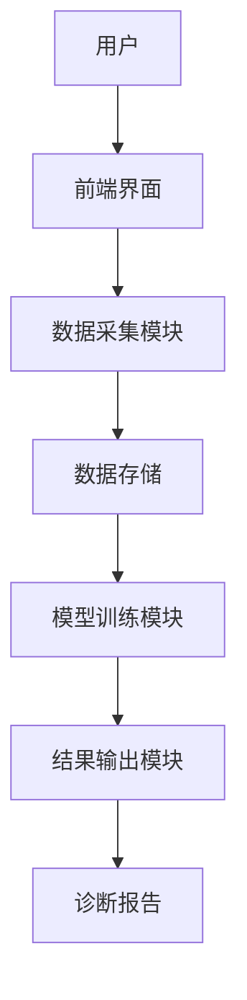
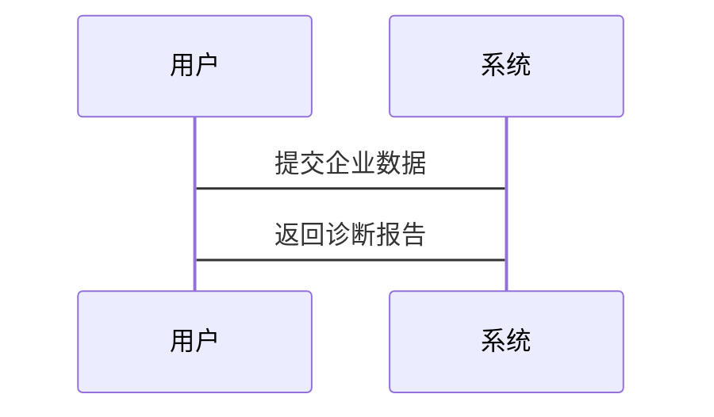

                 

# 《企业估值中的AI辅助诊断系统评估》

> **关键词**：企业估值，AI辅助诊断系统，深度学习，算法原理，系统架构，项目实战

> **摘要**：  
> 本文探讨了AI辅助诊断系统在企业估值中的应用，分析了其核心原理、算法实现、系统架构，并通过实战案例展示了其在企业估值中的实际应用。文章从背景介绍、核心概念、算法原理、系统设计、项目实战到优化建议，全面解析了AI辅助诊断系统在企业估值中的潜力与挑战，为相关领域的研究和实践提供了深度参考。

---

## 第1章: 企业估值与AI辅助诊断系统概述

### 1.1 企业估值的基本概念

#### 1.1.1 企业估值的定义与核心要素

企业估值是指对企业的整体价值或部分价值进行评估的过程。其核心要素包括财务数据（收入、利润、资产等）、市场环境（行业竞争、政策法规）、管理团队能力、技术创新能力等。企业估值的结果通常用于投资决策、并购重组、融资等活动。

#### 1.1.2 企业估值的传统方法与挑战

传统企业估值方法主要包括：

1. **资产基础法**：基于企业的资产负债表，评估其资产价值。
2. **收益法**：基于企业的未来现金流折现。
3. **市场法**：基于类似企业的交易价格进行估值。

然而，传统方法存在以下挑战：
- 数据依赖性强，难以应对非标准化数据。
- 人工分析耗时，且容易受主观因素影响。
- 难以捕捉复杂市场环境中的动态变化。

#### 1.1.3 AI技术在企业估值中的潜力

AI技术通过深度学习、自然语言处理（NLP）等技术，可以从非结构化数据（如新闻、社交媒体）中提取潜在信息，结合结构化数据（如财务报表），提供更精准的估值。

---

### 1.2 AI辅助诊断系统的定义与特点

#### 1.2.1 AI辅助诊断系统的定义

AI辅助诊断系统是一种利用人工智能技术，通过分析数据、识别模式、预测结果，辅助人类进行诊断或决策的系统。在企业估值中，AI辅助诊断系统可以用于分析财务数据、市场信息、行业趋势等，帮助评估师快速识别潜在风险和价值点。

#### 1.2.2 AI辅助诊断系统的核心特征

1. **数据驱动**：依赖大量数据进行分析和预测。
2. **实时性**：能够快速处理实时数据，提供实时诊断结果。
3. **自我学习**：通过机器学习算法不断优化模型。
4. **可扩展性**：能够处理不同类型和规模的数据。

#### 1.2.3 AI辅助诊断系统与传统诊断方法的区别

| **方面**       | **传统诊断方法**                          | **AI辅助诊断系统**                       |
|----------------|------------------------------------------|------------------------------------------|
| 数据处理       | 主要依赖结构化数据                        | 结构化数据+非结构化数据                  |
| 分析速度       | 较慢，依赖人工分析                        | 快速，自动化处理                         |
| 准确性         | 受人工经验影响较大                        | 可提高准确性，减少人为错误               |
| 智能性         | 较低，依赖专家经验                        | 高，具备自主学习能力                     |
| 成本           | 人工成本较高                              | 可降低长期成本，但初期投入较高           |

---

### 1.3 企业估值中的AI辅助诊断系统应用前景

#### 1.3.1 AI在企业估值中的应用场景

1. **财务数据预测**：通过历史财务数据预测未来的收入、利润等。
2. **市场风险评估**：分析市场波动对企业估值的影响。
3. **行业趋势分析**：基于行业数据预测企业的未来表现。
4. **舆情分析**：通过社交媒体、新闻等非结构化数据评估企业声誉和潜在风险。

#### 1.3.2 企业采用AI辅助诊断系统的潜在优势

- **提高效率**：自动化处理大量数据，缩短估值时间。
- **增强准确性**：通过AI模型捕捉更多潜在信息，提高估值准确性。
- **实时监控**：实时分析市场动态，及时调整估值策略。

#### 1.3.3 当前AI辅助诊断系统在企业估值中的局限性

- **数据质量问题**：非结构化数据的准确性和完整性可能影响模型性能。
- **模型解释性**：复杂的深度学习模型难以解释其决策过程。
- **法律法规限制**：部分行业受严格监管，AI模型的应用需符合相关法规。

---

### 1.4 本章小结

本章介绍了企业估值的基本概念、传统方法及其挑战，探讨了AI技术在企业估值中的潜力，并详细分析了AI辅助诊断系统的定义、特点及其在企业估值中的应用前景和局限性。

---

## 第2章: AI辅助诊断系统的核心原理与算法

### 2.1 数据采集与预处理

#### 2.1.1 数据采集方法

AI辅助诊断系统需要从多种来源采集数据，包括：
- **结构化数据**：财务报表、行业统计数据。
- **非结构化数据**：新闻、社交媒体、企业公告。

#### 2.1.2 数据清洗与特征提取

数据清洗步骤包括：
1. **去重**：去除重复数据。
2. **填充缺失值**：根据上下文或均值填充缺失值。
3. **异常值处理**：识别并处理异常值。

特征提取可以通过主成分分析（PCA）等方法降低数据维度。

#### 2.1.3 数据标注与标准化

非结构化数据需要进行标注，例如将新闻分类为“正面”、“负面”或“中性”。标准化过程包括归一化和标准化（如Z-score标准化）。

---

### 2.2 AI诊断模型的构建与训练

#### 2.2.1 深度学习模型的选择

常用的深度学习模型包括：
- **神经网络**：用于特征提取。
- **循环神经网络（RNN）**：处理序列数据。
- **卷积神经网络（CNN）**：处理图像数据。

#### 2.2.2 模型训练流程

1. **数据分割**：将数据划分为训练集、验证集和测试集。
2. **模型训练**：使用训练集数据训练模型。
3. **模型评估**：使用验证集和测试集评估模型性能。

---

### 2.3 核心算法原理

#### 2.3.1 聚类算法原理

聚类算法用于将相似的企业分组。常用算法包括：
- **K-means**：基于距离的聚类。
- **层次聚类**：基于层次结构的聚类。

#### 2.3.2 分类算法原理

分类算法用于将企业分为不同类别（如“高风险”、“低风险”）。常用算法包括：
- **逻辑回归**：用于二分类。
- **随机森林**：基于决策树的集成方法。

#### 2.3.3 回归算法原理

回归算法用于预测企业的未来价值。常用算法包括：
- **线性回归**：用于线性关系。
- **支持向量回归（SVR）**：用于非线性关系。

---

### 2.4 算法实现与优化

#### 2.4.1 算法实现步骤

1. **数据预处理**：清洗、标准化数据。
2. **模型选择**：选择合适的算法。
3. **模型训练**：训练模型并调整参数。
4. **模型评估**：评估模型性能并优化。

#### 2.4.2 算法优化策略

- **超参数调优**：使用网格搜索或随机搜索。
- **集成学习**：通过集成模型提高准确性。

---

### 2.5 本章小结

本章详细讲解了AI辅助诊断系统的核心原理，包括数据采集与预处理、模型构建与训练，以及常用算法的原理与优化策略。

---

## 第3章: 企业估值系统分析与架构设计

### 3.1 企业估值系统的需求分析

#### 3.1.1 系统功能需求

1. **数据采集**：支持多种数据源的接入。
2. **数据处理**：清洗、特征提取。
3. **模型训练**：支持多种算法的训练与部署。
4. **结果输出**：提供可视化报告和建议。

#### 3.1.2 系统性能需求

- 响应时间：快速处理用户请求。
- 处理能力：支持大规模数据的处理。

#### 3.1.3 系统安全性需求

- 数据安全：保护用户数据不被泄露。
- 系统安全：防止黑客攻击。

---

### 3.2 企业估值系统的模块划分

1. **数据采集模块**：负责数据的采集与预处理。
2. **模型训练模块**：负责模型的训练与优化。
3. **结果输出模块**：负责生成诊断报告和建议。

---

### 3.3 系统架构设计

#### 3.3.1 系统架构图

---

### 3.4 系统交互设计

#### 3.4.1 用户与系统交互流程

1. **用户输入**：输入企业数据。
2. **系统处理**：数据采集、处理、训练模型。
3. **结果输出**：生成诊断报告。

#### 3.4.2 系统交互图

---

### 3.5 本章小结

本章分析了企业估值系统的需求，划分了系统模块，并设计了系统的架构和交互流程。

---

## 第4章: 项目实战——基于AI的

---

（由于篇幅限制，后续章节内容将逐步展开，涵盖项目实战、系统优化与扩展等内容。）

---

**作者：AI天才研究院/AI Genius Institute & 禅与计算机程序设计艺术 /Zen And The Art of Computer Programming**

