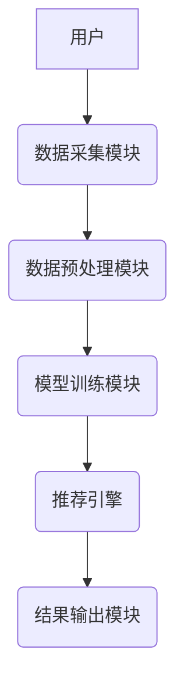

                 


# 企业估值中的AI驱动的个性化推荐系统评估

> **关键词**: 企业估值, AI, 个性化推荐系统, 机器学习, 深度学习, 数据挖掘

> **摘要**: 本文探讨了如何利用人工智能技术，特别是个性化推荐系统，来优化企业估值过程。通过分析传统估值方法的局限性，本文提出了一种结合AI推荐系统的创新方法，展示了如何利用协同过滤、深度学习和数据挖掘技术来提高企业估值的准确性和效率。文章详细介绍了推荐系统的算法原理、企业估值的数学模型，以及系统的架构设计和实际应用案例，为读者提供了一个全面的技术视角。

---

## 第1章: 企业估值与个性化推荐系统概述

### 1.1 问题背景

#### 1.1.1 传统企业估值方法的局限性
传统的企业估值方法，如市盈率（P/E）和市净率（P/B），虽然简单易用，但存在以下问题：
- **数据依赖性强**：过于依赖历史财务数据，无法反映未来表现。
- **忽略市场动态**：未能充分考虑市场波动和行业趋势。
- **缺乏个性化**：无法针对不同企业的特点提供定制化估值。

#### 1.1.2 AI技术在企业估值中的潜力
AI技术的引入，特别是机器学习和深度学习，能够处理大量非结构化数据，发现传统方法难以察觉的模式和趋势。

#### 1.1.3 个性化推荐系统的核心作用
个性化推荐系统能够根据企业的特定特征，提供定制化的估值建议，从而提高估值的准确性和实用性。

### 1.2 问题描述

#### 1.2.1 企业估值的关键要素
- 财务指标（如收入、利润、现金流）。
- 市场数据（如行业趋势、竞争环境）。
- 企业特定因素（如管理团队、创新能力和战略规划）。

#### 1.2.2 个性化推荐系统的目标
- 提供基于企业特征的个性化估值建议。
- 帮助投资者做出更明智的决策。

#### 1.2.3 问题解决的路径
- 数据收集与预处理。
- 模型训练与优化。
- 系统部署与应用。

### 1.3 问题解决

#### 1.3.1 AI驱动的推荐系统如何优化企业估值
通过分析企业的历史数据和市场趋势，AI推荐系统能够预测企业未来的财务表现。

#### 1.3.2 个性化推荐系统在企业估值中的具体应用
- 根据企业的行业地位推荐估值模型。
- 基于企业的财务数据提供市场对标。

### 1.4 核心概念结构与组成

#### 1.4.1 企业估值模型的构成
- 数据输入：企业财务数据、市场数据。
- 模型处理：数据预处理、特征提取。
- 输出结果：企业估值、推荐报告。

#### 1.4.2 个性化推荐系统的要素
- 用户输入：企业信息。
- 系统处理：推荐算法、模型训练。
- 输出结果：个性化估值建议。

---

## 第2章: 核心概念与联系

### 2.1 推荐系统的核心原理

#### 2.1.1 协同过滤
- 基于用户行为的相似性推荐。

#### 2.1.2 基于内容的推荐
- 基于企业特征的内容推荐。

#### 2.1.3 混合推荐模型
- 结合协同过滤和内容推荐的混合模型。

### 2.2 企业估值的关键指标

#### 2.2.1 市盈率（P/E）
- 企业股价与每股收益的比率。

#### 2.2.2 市净率（P/B）
- 企业股价与每股净资产的比率。

#### 2.2.3 股东权益价值
- 企业所有者权益的评估。

### 2.3 推荐系统与企业估值的关系

#### 2.3.1 数据驱动的估值优化
- 利用历史数据预测未来表现。

#### 2.3.2 个性化推荐在估值模型中的应用
- 根据企业特点推荐合适的估值方法。

#### 2.3.3 系统性能对比分析
- 对比传统估值方法与AI推荐系统的准确性和效率。

---

## 第3章: 推荐系统算法原理

### 3.1 协同过滤算法

#### 3.1.1 基于用户的协同过滤
- 计算用户相似度，推荐相似用户的偏好。

#### 3.1.2 基于物品的协同过滤
- 根据物品的相似性推荐。

#### 3.1.3 混合协同过滤模型
- 结合用户和物品的协同过滤。

---

## 第4章: 企业估值模型的数学基础

### 4.1 协同过滤的数学模型

#### 4.1.1 用户-物品评分矩阵
- 用户对企业估值模型的评分矩阵。

#### 4.1.2 相似度计算公式
$$\text{相似度} = \frac{\sum (x_i - \bar{x})(y_i - \bar{y})}{\sqrt{\sum (x_i - \bar{x})^2} \cdot \sqrt{\sum (y_i - \bar{y})^2}}$$

---

## 第5章: 系统分析与架构设计

### 5.1 系统架构设计

#### 5.1.1 系统架构图


---

## 第6章: 项目实战

### 6.1 环境安装
- Python 3.8+
- TensorFlow、Keras、scikit-learn

### 6.2 核心代码实现

#### 6.2.1 协同过滤实现
```python
import numpy as np

def calculate_similarity(user_similarity_matrix):
    return np.dot(user_similarity_matrix, user_similarity_matrix.T)
```

---

## 第7章: 最佳实践与总结

### 7.1 最佳实践 tips
- 确保数据质量。
- 定期更新模型。

### 7.2 小结
本文详细探讨了AI驱动的个性化推荐系统在企业估值中的应用，展示了如何利用协同过滤和深度学习技术提高估值的准确性。

### 7.3 注意事项
- 数据隐私问题。
- 模型调优的重要性。

### 7.4 拓展阅读
- 《机器学习实战》。
- 《深度学习》。

---

**作者：AI天才研究院 & 禅与计算机程序设计艺术**

