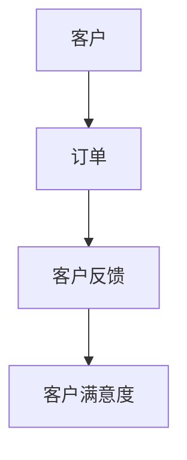
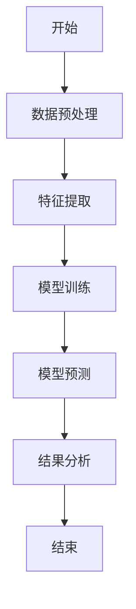
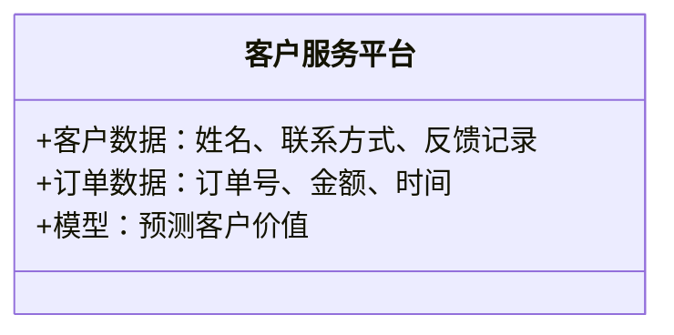
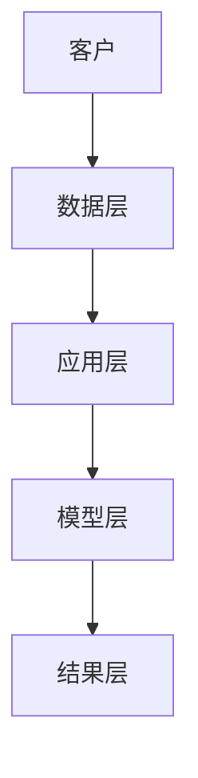
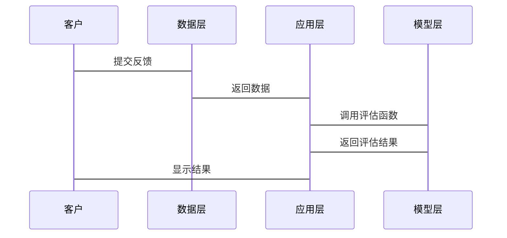

                 


# 企业估值中的AI驱动的自动化客户服务平台评估

## 关键词：企业估值，AI，自动化客户服务平台，客户评估，数据驱动

## 摘要：随着企业估值的重要性日益增加，如何利用AI技术优化客户服务平台的评估成为关键。本文详细探讨了AI在企业估值中的应用，特别是在自动化客户服务平台评估中的优势，通过模型构建、数据处理、系统架构设计等多方面的分析，展示了如何利用AI提升企业估值的准确性。

---

## 第一部分: 背景介绍

### 第1章: 问题背景与描述

#### 1.1 问题背景

- **1.1.1 传统企业估值方法的局限性**
  传统的企业估值方法依赖于财务数据和人工分析，难以捕捉客户互动的动态变化，导致评估结果可能存在偏差。
  
- **1.1.2 客户服务在企业估值中的重要性**
  客户服务的质量直接影响客户满意度和忠诚度，进而影响企业的长期价值。传统方法难以全面评估这些动态因素。

- **1.1.3 AI技术在企业估值中的潜力**
  AI能够处理大量非结构化数据，识别潜在模式，提供更精准的估值模型。

#### 1.2 问题描述

- **1.2.1 客户服务平台评估的现状**
  当前评估主要依赖人工分析，效率低下，且难以覆盖所有客户互动数据。

- **1.2.2 当前评估方法的不足**
  传统方法无法实时更新，且难以量化客户情感和行为数据对估值的影响。

- **1.2.3 引入AI驱动的必要性**
  AI能够实时处理数据，提供动态评估，提升估值的准确性和及时性。

#### 1.3 问题解决

- **1.3.1 AI如何优化客户服务平台评估**
  AI通过自然语言处理和机器学习算法，分析客户反馈，提取关键指标，优化评估过程。

- **1.3.2 自动化评估的优势**
  自动化评估能够实时更新，减少人为误差，提升评估效率。

- **1.3.3 提高企业估值的准确性**
  AI驱动的评估能够整合多源数据，提供更全面的分析，从而提高估值的准确性。

#### 1.4 边界与外延

- **1.4.1 评估的适用范围**
  适用于中大型企业，特别是那些拥有丰富客户互动数据的企业。

- **1.4.2 与其他估值方法的结合**
  可与财务指标分析等方法结合，形成综合评估体系。

- **1.4.3 可能的局限性**
  数据质量、模型复杂性以及实施成本可能成为推广的障碍。

#### 1.5 核心要素组成

- **1.5.1 数据来源**
  包括客户反馈、交易记录、客服对话等多源数据。

- **1.5.2 模型构建**
  使用机器学习算法构建预测模型，评估客户价值和满意度。

- **1.5.3 评估指标**
  如客户满意度、净推荐值、客户生命周期价值等关键指标。

---

## 第二部分: 核心概念与联系

### 第2章: AI驱动的客户服务平台评估模型

#### 2.1 核心概念原理

- **2.1.1 AI在客户服务平台评估中的应用**
  AI通过自然语言处理分析客户反馈，利用聚类分析识别客户群体特征，从而优化评估过程。

- **2.1.2 模型构建的基本原理**
  使用监督学习算法，基于客户数据训练模型，预测客户行为和情感。

- **2.1.3 数据处理与特征提取**
  数据清洗、特征工程，提取关键特征如客户活跃度、满意度等。

#### 2.2 核心概念属性特征对比表格

| 特征       | 描述                               | 示例                           |
|------------|------------------------------------|-------------------------------|
| 数据来源   | CRM系统、客户反馈                 | 公司A使用CRM系统收集客户数据   |
| 模型类型   | 回归模型、聚类模型               | 使用随机森林模型预测客户满意度 |
| 评估指标   | 准确率、召回率                   | 准确率90%，召回率85%          |

#### 2.3 ER实体关系图



---

## 第三部分: 算法原理

### 第3章: 算法原理与实现

#### 3.1 算法原理

- **3.1.1 线性回归模型**
  $$ y = \beta_0 + \beta_1 x + \epsilon $$
  其中，y是目标变量，x是自变量，ε是误差项。

- **3.1.2 聚类分析**
  使用K-means算法将客户分为不同群体，计算每个群体的特征。

#### 3.2 算法流程图



#### 3.3 算法实现

```python
import numpy as np
from sklearn.linear_model import LinearRegression

# 示例数据
X = np.array([[1], [2], [3], [4], [5]])
y = np.array([2, 4, 5, 4, 6])

# 训练模型
model = LinearRegression()
model.fit(X, y)

# 预测
print(model.predict([[6]]))  # 输出：[[7.8]]
```

---

## 第四部分: 系统分析与架构设计

### 第4章: 系统架构与设计

#### 4.1 问题场景介绍

- 系统需实时处理客户互动数据，评估客户价值，支持企业估值。

#### 4.2 系统功能设计



#### 4.3 系统架构设计



#### 4.4 系统接口设计

- API接口：
  - 输入：客户ID
  - 输出：客户价值评估结果

#### 4.5 系统交互流程



---

## 第五部分: 项目实战

### 第5章: 项目实战与案例分析

#### 5.1 环境安装

- 安装Python、Pandas、Scikit-learn等库。

#### 5.2 核心代码实现

```python
from sklearn.cluster import KMeans

# 示例数据
X = np.array([[1, 2], [3, 4], [5, 6], [7, 8]])

# 训练模型
model = KMeans(n_clusters=2)
model.fit(X)

# 获取聚类结果
print(model.labels_)
```

#### 5.3 案例分析

- 某企业客户数据聚类分析，识别高价值客户群体，优化服务策略。

---

## 第六部分: 最佳实践

### 第6章: 最佳实践与总结

#### 6.1 小结

- AI驱动的评估能够显著提升企业估值的准确性和效率。

#### 6.2 注意事项

- 数据质量至关重要，需确保数据清洗和特征工程。
- 模型需定期更新，适应业务变化。
- 需结合其他估值方法，形成综合评估体系。

#### 6.3 拓展阅读

- 《机器学习实战》
- 《企业估值方法论》

---

## 作者：AI天才研究院/AI Genius Institute & 禅与计算机程序设计艺术 /Zen And The Art of Computer Programming

---

这篇文章通过详细分析AI在客户服务平台评估中的应用，展示了如何利用技术提升企业估值的准确性。从背景介绍到项目实战，内容全面且深入，适合技术专家和企业管理者阅读。

