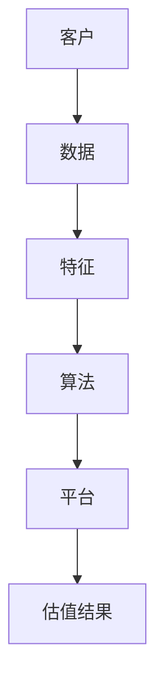
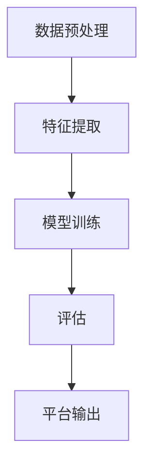
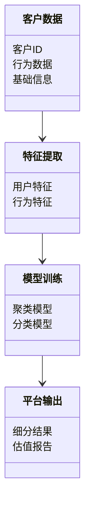
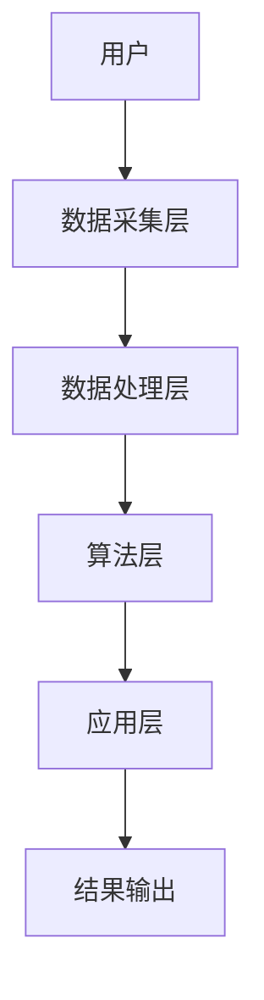
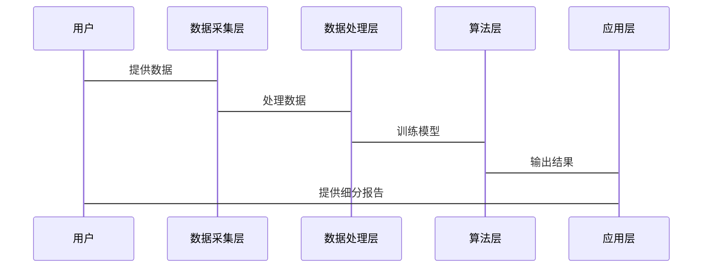

                 


# 企业估值中的AI驱动的自动化客户细分平台评估

## 关键词：
企业估值、客户细分、人工智能、自动化评估、数据驱动决策

## 摘要：
本文探讨了在企业估值过程中，如何利用人工智能技术实现客户细分的自动化评估。通过分析传统客户细分方法的局限性，提出了一种基于AI的解决方案，详细介绍了一个自动化客户细分平台的设计与实现，包括数据预处理、特征提取、算法选择、系统架构以及项目实战等内容。最后，本文总结了该平台在企业估值中的应用价值，并提出了未来的研究方向。

---

# 第一部分: 企业估值中的AI驱动的客户细分平台背景介绍

## 第1章: 问题背景与描述

### 1.1 问题背景
#### 1.1.1 传统企业估值中的客户细分挑战
企业估值是一个复杂的决策过程，其中客户细分是关键环节。传统客户细分方法依赖人工分析，耗时且容易出错，难以应对海量数据和复杂场景。

#### 1.1.2 数据驱动决策的重要性
在大数据时代，企业需要通过数据驱动的决策来提高效率和准确性。客户细分是数据驱动决策的核心之一，直接影响企业的市场策略和估值结果。

#### 1.1.3 AI技术在客户细分中的应用潜力
AI技术，尤其是机器学习算法，能够高效处理复杂数据，发现隐藏模式，为客户提供精准的细分策略，提升企业估值的准确性。

### 1.2 问题描述
#### 1.2.1 客户细分的核心问题
客户细分的目标是将客户按特征分成若干群体，每个群体具有相似的行为和需求，以便制定针对性的市场策略。

#### 1.2.2 企业估值中的客户细分需求
准确的客户细分能够帮助企业更好地评估客户价值，优化资源配置，提升整体估值的准确性。

#### 1.2.3 当前客户细分方法的局限性
传统客户细分方法依赖人工经验，难以处理大数据量和复杂场景，且容易受主观因素影响。

### 1.3 问题解决
#### 1.3.1 AI驱动的客户细分解决方案
通过机器学习算法，实现客户数据的自动化处理和细分，提高效率和准确性。

#### 1.3.2 自动化客户细分平台的优势
自动化平台能够快速处理海量数据，实时更新客户细分结果，支持动态调整市场策略。

#### 1.3.3 平台如何提升企业估值准确性
通过精准的客户细分，企业能够更准确地评估客户价值，优化资源配置，提升整体估值。

### 1.4 边界与外延
#### 1.4.1 客户细分的边界条件
客户细分的边界包括数据来源、数据质量和数据量等因素。

#### 1.4.2 平台的适用范围与限制
平台适用于数据量大、客户特征复杂的场景，但在数据不足或数据质量低的情况下，效果可能受限。

#### 1.4.3 与其他估值方法的结合
客户细分平台可以与其他估值方法（如财务指标分析）结合，形成更全面的估值模型。

### 1.5 概念结构与核心要素
#### 1.5.1 客户细分的核心要素
客户细分的核心要素包括客户特征、行为数据和市场表现。

#### 1.5.2 平台的功能模块组成
平台功能模块包括数据采集、数据预处理、特征提取、模型训练和结果输出。

#### 1.5.3 企业估值的关键指标
企业估值的关键指标包括客户生命周期价值、客户 acquisition cost 和客户 retention rate。

---

## 第2章: 核心概念与联系

### 2.1 核心概念原理
#### 2.1.1 客户细分的定义与分类
客户细分是根据客户特征和行为，将客户划分为不同群体的过程。

#### 2.1.2 AI驱动的客户细分算法
常用的AI算法包括聚类算法（K-means、DBSCAN）和分类算法（决策树、随机森林）。

#### 2.1.3 平台的自动化流程
平台通过自动化处理数据、训练模型和输出结果，实现客户细分的全流程管理。

### 2.2 概念属性特征对比表格
| 概念       | 属性特征               |
|------------|------------------------|
| 客户细分    | 数据驱动、动态调整       |
| AI算法      | 高效、可扩展           |
| 平台架构    | 集成化、模块化           |

### 2.3 ER实体关系图


---

## 第3章: 算法原理讲解

### 3.1 算法流程


### 3.2 核心算法代码
```python
def customer_segmentation(data):
    # 数据预处理
    processed_data = preprocess(data)
    # 特征提取
    features = extract_features(processed_data)
    # 模型训练
    model = train_model(features)
    # 模型预测
    predictions = model.predict(features)
    return predictions
```

### 3.3 数学公式
#### K-means算法的目标函数
$$ \text{目标函数} = \sum_{i=1}^{k} \sum_{j=1}^{n_i} \|x_j - c_i\|^2 $$
其中，$k$ 是聚类数，$n_i$ 是第 $i$ 个聚类的样本数，$x_j$ 是样本，$c_i$ 是第 $i$ 个聚类的中心。

---

## 第4章: 系统分析与架构设计

### 4.1 问题场景介绍
系统需要处理海量客户数据，实现客户细分的自动化评估。

### 4.2 项目介绍
项目目标是开发一个基于AI的客户细分平台，支持企业估值的自动化决策。

### 4.3 系统功能设计
#### 领域模型


### 4.4 系统架构设计


### 4.5 接口设计
接口设计包括数据输入接口、模型训练接口和结果输出接口。

### 4.6 系统交互


---

## 第5章: 项目实战

### 5.1 环境安装
安装Python和相关库（pandas、numpy、scikit-learn）。

### 5.2 核心实现
```python
import pandas as pd
from sklearn.cluster import KMeans

def preprocess(data):
    # 数据清洗和转换
    data = data.dropna()
    data = pd.get_dummies(data)
    return data

def extract_features(data):
    # 提取特征
    features = data[['age', 'income', 'purchase_frequency']]
    return features

def train_model(features):
    # 训练模型
    model = KMeans(n_clusters=3, random_state=42)
    model.fit(features)
    return model

data = pd.read_csv('customer_data.csv')
processed_data = preprocess(data)
features = extract_features(processed_data)
model = train_model(features)
predictions = model.predict(features)
print(predictions)
```

### 5.3 案例分析
以实际数据为例，展示如何应用上述代码进行客户细分，并分析结果。

### 5.4 项目总结
总结项目成果，分析成功和需要改进的地方。

---

## 第6章: 最佳实践

### 6.1 小结
本文详细介绍了AI驱动的客户细分平台在企业估值中的应用，展示了如何通过自动化流程提高效率和准确性。

### 6.2 注意事项
数据质量和模型选择对结果影响重大，需谨慎处理。

### 6.3 拓展阅读
建议读者深入学习机器学习算法和数据处理技术，探索更多应用场景。

---

# 作者：AI天才研究院 & 禅与计算机程序设计艺术

