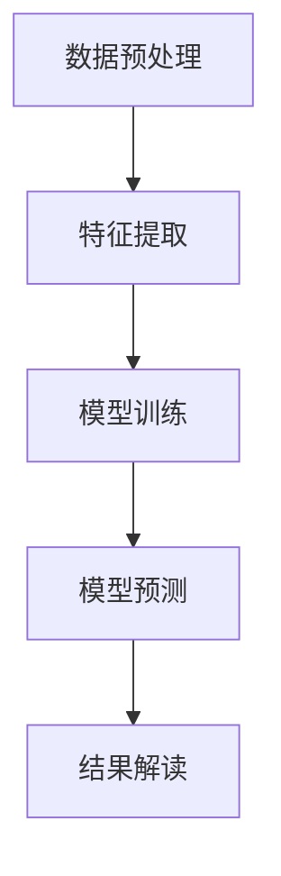
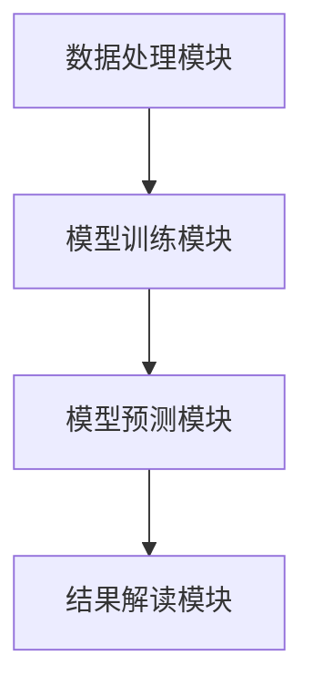
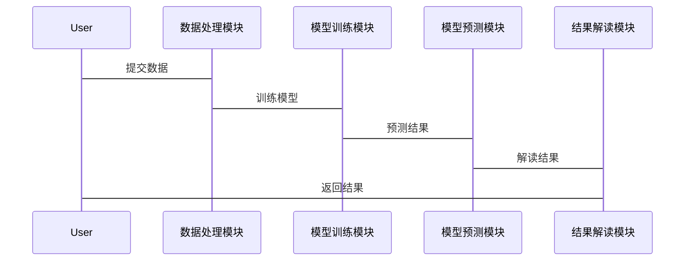

                 


# 企业估值中的AI驱动的药物再利用平台评估

## 关键词：企业估值, AI驱动, 药物再利用, 平台评估, 技术博客

## 摘要：  
随着人工智能（AI）技术的快速发展，AI在药物研发领域的应用日益广泛。本文探讨了AI驱动的药物再利用平台在企业估值中的重要性。通过分析药物再利用的定义、AI驱动平台的核心算法、系统架构设计以及实际案例，本文详细阐述了AI如何优化药物再利用的过程，提升企业估值。文章还提供了代码实现和数学模型，帮助读者理解如何构建和评估AI驱动的药物再利用平台。

---

# 第一部分: 企业估值中的AI驱动的药物再利用平台评估

## 第1章: 背景介绍

### 1.1 问题背景
#### 1.1.1 药物再利用的定义与重要性
药物再利用是指将已批准的药物用于新的疾病治疗。这种方法可以显著缩短研发周期，降低研发成本，同时提高药物的可用性。AI技术的应用为药物再利用提供了新的可能性，通过分析海量数据，AI可以识别药物的潜在新用途。

#### 1.1.2 传统药物研发的高成本与低效率
传统药物研发过程漫长且成本高昂，通常需要10-15年时间，且失败率高达90%。这种低效和高成本的模式使得许多企业难以承担药物研发的风险，尤其是对于中小型企业而言。

#### 1.1.3 AI技术在药物研发中的潜力
AI技术可以通过分析大量的生物医学数据，快速识别潜在的药物候选，并预测其疗效和安全性。这种数据驱动的方法可以显著提高药物研发的效率和成功率。

### 1.2 问题描述
#### 1.2.1 药物再利用平台的核心目标
药物再利用平台的目标是通过AI技术，快速筛选出具有潜在新用途的药物，降低药物研发的成本和时间。

#### 1.2.2 AI驱动的药物再利用平台的独特优势
AI驱动的平台可以利用机器学习算法，分析大量的生物医学数据，发现药物与疾病之间的潜在关联，从而提高药物再利用的成功率。

#### 1.2.3 当前药物再利用评估的主要挑战
当前药物再利用评估的主要挑战包括数据质量问题、算法的准确性以及如何将AI模型应用于实际药物研发过程中。

### 1.3 问题解决
#### 1.3.1 AI在药物再利用中的具体应用场景
AI可以用于药物分子的特征提取、疾病靶点识别以及药物与疾病关联预测等应用场景。

#### 1.3.2 数据驱动的药物再利用评估方法
数据驱动的方法通过分析大量的生物医学数据，利用机器学习模型预测药物的潜在用途。

#### 1.3.3 平台化解决方案的优势
平台化解决方案可以整合多种AI算法和数据源，提供一个统一的界面供研究人员使用，从而提高药物再利用的效率。

### 1.4 边界与外延
#### 1.4.1 药物再利用平台的边界
药物再利用平台的边界包括数据来源、算法选择以及评估指标的选择。

#### 1.4.2 平台与传统药物研发的区别
与传统药物研发相比，AI驱动的药物再利用平台更加高效、成本低，并且能够快速筛选出潜在的药物候选。

#### 1.4.3 平台的可扩展性与适用范围
平台具有良好的可扩展性，可以应用于多种疾病和药物的再利用评估。

### 1.5 核心要素组成
#### 1.5.1 数据来源与处理
数据来源包括公共数据库、文献数据以及实验数据。数据处理包括数据清洗、特征提取以及数据标注。

#### 1.5.2 AI算法的选择与实现
选择合适的机器学习算法，如随机森林、神经网络等，并通过训练数据进行模型训练。

#### 1.5.3 评估指标与结果解读
评估指标包括准确率、召回率以及F1分数等。结果解读包括预测的置信度以及潜在药物的优先级排序。

---

## 第2章: 核心概念与联系

### 2.1 核心概念原理
#### 2.1.1 药物再利用的定义与属性
药物再利用是指将已批准的药物用于新的疾病治疗。其属性包括安全性、有效性以及经济性。

#### 2.1.2 AI驱动的药物再利用模型原理
AI驱动的药物再利用模型通过机器学习算法，分析生物医学数据，预测药物的潜在用途。

#### 2.1.3 平台的评估逻辑
平台的评估逻辑包括数据预处理、模型训练、结果预测以及结果解读。

### 2.2 核心概念对比
#### 2.2.1 药物再利用与新药研发的对比
药物再利用的成本低、时间短，而新药研发成本高、时间长。

#### 2.2.2 AI驱动与传统方法的对比
AI驱动方法高效、准确，传统方法效率低、成本高。

#### 2.2.3 不同AI模型的性能对比
不同AI模型在药物再利用中的性能对比，包括准确率、召回率等指标。

### 2.3 ER实体关系图
```mermaid
er
    entity 药物再利用平台 {
        key 药物分子ID
        attribute 药物名称, 适应症, 现有疗效, 数据来源
    }
    entity AI模型 {
        key 模型ID
        attribute 模型名称, 模型类型, 训练数据来源
    }
    entity 评估结果 {
        key 结果ID
        attribute 预测疾病, 置信度, 优先级
    }
```

---

## 第3章: 算法原理讲解

### 3.1 机器学习模型的选择与实现
#### 3.1.1 随机森林算法
随机森林是一种基于树的集成算法，适用于分类和回归问题。其优点是能够处理高维数据，并且具有较强的抗过拟合能力。

#### 3.1.2 神经网络算法
神经网络是一种深度学习算法，适用于复杂的数据模式识别。其优点是能够处理非线性关系，并且能够自动提取特征。

#### 3.1.3 模型训练与预测
通过训练数据训练模型，并使用测试数据进行预测。

### 3.2 算法流程图


### 3.3 Python代码实现
```python
import pandas as pd
from sklearn.ensemble import RandomForestClassifier
from sklearn.metrics import accuracy_score

# 数据加载与预处理
data = pd.read_csv('drug_data.csv')
X = data.drop('target_disease', axis=1)
y = data['target_disease']

# 模型训练
model = RandomForestClassifier()
model.fit(X, y)

# 模型预测
y_pred = model.predict(X)

# 模型评估
accuracy = accuracy_score(y, y_pred)
print(f'Accuracy: {accuracy}')
```

---

## 第4章: 数学公式与模型

### 4.1 机器学习模型的数学公式
#### 4.1.1 随机森林模型
随机森林模型通过集成多个决策树模型，提高模型的准确性和鲁棒性。

#### 4.1.2 神经网络模型
神经网络模型通过多层感知机，学习数据的非线性关系。

### 4.2 优化目标与约束条件
#### 4.2.1 优化目标
最大化预测准确率。

#### 4.2.2 约束条件
模型的复杂度不能过高，以避免过拟合。

### 4.3 优化过程
通过交叉验证和超参数调优，优化模型的性能。

---

## 第5章: 系统分析与架构设计

### 5.1 问题场景介绍
#### 5.1.1 系统目标
构建一个AI驱动的药物再利用平台，提供药物再利用的评估服务。

#### 5.1.2 系统范围
平台包括数据处理、模型训练、结果预测和结果解读等功能。

### 5.2 系统功能设计
#### 5.2.1 数据处理模块
负责数据的加载、清洗和预处理。

#### 5.2.2 模型训练模块
负责选择合适的机器学习模型，并进行模型训练。

#### 5.2.3 模型预测模块
负责使用训练好的模型进行预测，并输出结果。

#### 5.2.4 结果解读模块
负责解释模型预测结果，并提供药物再利用的优先级排序。

### 5.3 系统架构设计
#### 5.3.1 系统架构图


#### 5.3.2 接口设计
系统提供API接口，供外部调用模型预测功能。

#### 5.3.3 交互序列图


---

## 第6章: 项目实战

### 6.1 环境安装
安装必要的Python库，如pandas、scikit-learn、tensorflow等。

### 6.2 核心代码实现
#### 6.2.1 数据预处理
```python
import pandas as pd
data = pd.read_csv('drug_data.csv')
```

#### 6.2.2 模型训练
```python
from sklearn.ensemble import RandomForestClassifier
model = RandomForestClassifier()
model.fit(X, y)
```

#### 6.2.3 模型预测
```python
y_pred = model.predict(X)
```

#### 6.2.4 模型评估
```python
from sklearn.metrics import accuracy_score
accuracy = accuracy_score(y, y_pred)
print(f'Accuracy: {accuracy}')
```

### 6.3 实际案例分析
以某种疾病为例，分析如何利用AI驱动的药物再利用平台进行药物评估。

### 6.4 代码应用解读与分析
解释代码实现的每一步，并分析其在药物再利用中的作用。

### 6.5 项目小结
总结项目实现的过程，并提出改进建议。

---

## 第7章: 最佳实践与小结

### 7.1 最佳实践
#### 7.1.1 数据质量的重要性
数据质量直接影响模型的性能，需重视数据清洗和特征工程。

#### 7.1.2 模型选择与调优
选择合适的模型，并进行超参数调优，以提高模型的性能。

#### 7.1.3 结果解读与可视化
通过可视化工具，帮助用户更好地理解模型预测结果。

### 7.2 小结
总结本文的主要内容，并强调AI在药物再利用中的重要性。

### 7.3 注意事项
在实际应用中，需注意数据隐私和模型的泛化能力。

### 7.4 拓展阅读
推荐一些相关的技术书籍和论文，供读者进一步学习。

---

## 作者：AI天才研究院/AI Genius Institute & 禅与计算机程序设计艺术 /Zen And The Art of Computer Programming

---

以上是《企业估值中的AI驱动的药物再利用平台评估》的技术博客文章的详细内容，涵盖了从背景介绍到实际项目的完整流程。通过本文，读者可以全面了解AI在药物再利用中的应用，并掌握如何构建和评估AI驱动的药物再利用平台。

