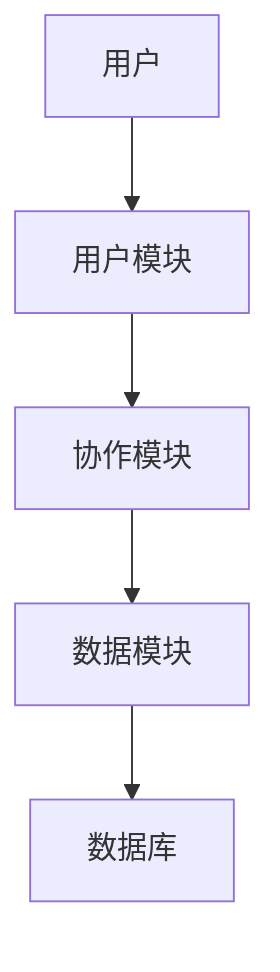
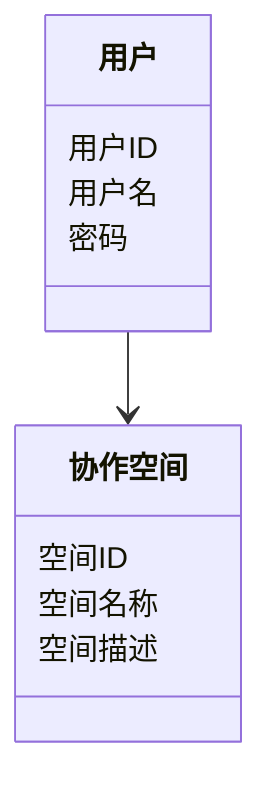
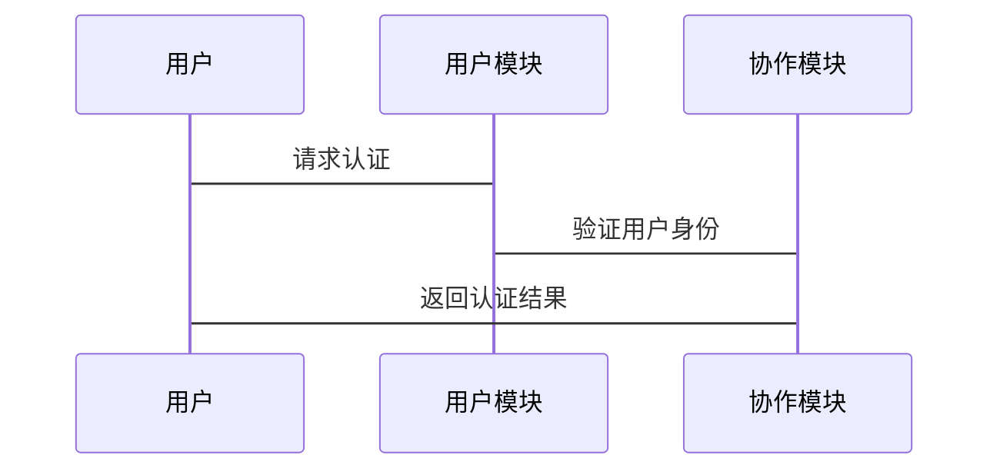

                 


# 企业估值中的AR/VR协作办公平台评估

> 关键词：企业估值，AR/VR，协作办公平台，评估模型，系统架构

> 摘要：本文详细探讨了在企业估值中如何评估AR/VR协作办公平台的价值。通过分析AR和VR技术的核心原理、协作办公平台的系统架构，以及基于层次分析法（AHP）构建的评估模型，本文为企业提供了科学的评估方法和实际应用案例。文章还结合了系统架构设计、代码实现和实际案例分析，为读者提供了全面的技术指导和实践参考。

---

# 第一部分: 企业估值中的AR/VR协作办公平台评估背景介绍

# 第1章: AR/VR协作办公平台的基本概念

## 1.1 什么是AR/VR协作办公平台
### 1.1.1 增强现实（AR）与虚拟现实（VR）的定义
- 增强现实（AR）：通过计算机技术将虚拟信息叠加到真实环境中，提供沉浸式的交互体验。
- 虚拟现实（VR）：通过模拟环境，提供完全沉浸式的虚拟世界。

### 1.1.2 协作办公平台的核心功能与特点
- 协作办公平台：支持多人实时协作、共享资源、在线沟通的工具。
- AR/VR协作办公平台：结合AR/VR技术，提供更直观、高效的协作体验。

### 1.1.3 AR/VR技术在协作办公中的应用价值
- 提高协作效率
- 提供沉浸式体验
- 降低沟通成本

## 1.2 企业估值与协作办公平台的关系
### 1.2.1 企业估值的基本概念
- 企业估值：通过财务指标、市场表现等评估企业价值的过程。
- 协作办公平台：影响企业效率、员工满意度和创新力，进而影响企业估值。

### 1.2.2 协作办公平台对企业发展的影响
- 提高工作效率
- 降低运营成本
- 增强员工协作能力

### 1.2.3 AR/VR技术对企业协作办公的提升作用
- 提供更直观的协作方式
- 降低沟通成本
- 提高团队协作效率

## 1.3 本章小结
本章介绍了AR/VR协作办公平台的基本概念，分析了其在企业估值中的重要性，并为后续章节的深入分析奠定了基础。

---

# 第二部分: AR/VR协作办公平台的核心概念与联系

# 第2章: AR与VR的核心原理

## 2.1 增强现实（AR）的原理与技术
### 2.1.1 AR的基本原理
- 图像识别
- 位置追踪
- 虚拟信息叠加

### 2.1.2 AR的关键技术与实现方法
- 图像识别技术
- 位置追踪技术
- 虚拟信息渲染

### 2.1.3 AR与协作办公的结合
- AR在会议中的应用
- AR在设计协作中的应用

## 2.2 虚拟现实（VR）的原理与技术
### 2.2.1 VR的基本原理
- 沉浸式体验
- 三维建模
- 交互技术

### 2.2.2 VR的关键技术与实现方法
- 三维建模技术
- 交互技术
- 显示技术

### 2.2.3 VR与协作办公的结合
- VR在虚拟办公室中的应用
- VR在团队协作中的应用

## 2.3 AR与VR的对比分析
### 2.3.1 AR与VR的主要区别
- 技术实现
- 应用场景
- 体验方式

### 2.3.2 AR与VR的优缺点对比
- AR的优势：结合现实与虚拟，提供更直观的体验
- AR的劣势：受现实环境限制
- VR的优势：提供完全沉浸式体验
- VR的劣势：成本高，设备复杂

### 2.3.3 AR与VR在协作办公中的适用场景
- AR适用于需要与现实环境结合的协作场景
- VR适用于完全虚拟的协作场景

## 2.4 协作办公平台的系统架构
### 2.4.1 协作办公平台的组成部分
- 用户模块
- 协作模块
- 数据模块

### 2.4.2 AR/VR协作办公平台的系统架构图


### 2.4.3 协作办公平台的核心功能模块
- 用户认证与管理
- 协作空间创建与管理
- 实时交互与通信

## 2.5 本章小结
本章详细介绍了AR和VR的核心原理，并分析了它们在协作办公中的应用。同时，结合系统架构图，阐述了协作办公平台的组成和功能模块。

---

# 第三部分: AR/VR协作办公平台的评估模型与方法论

# 第3章: 评估模型的构建

## 3.1 评估模型的基本框架
### 3.1.1 评估模型的目标与范围
- 目标：量化AR/VR协作办公平台的价值
- 范围：涵盖技术性能、用户体验、经济性等多个维度

### 3.1.2 评估模型的输入与输出
- 输入：平台性能指标、用户反馈、成本数据
- 输出：平台价值评分

### 3.1.3 评估模型的构建原则
- 客观性
- 可操作性
- 可扩展性

## 3.2 层次分析法（AHP）的应用
### 3.2.1 层次分析法的基本原理
- 层次分析法（AHP）是一种用于多指标决策的分析方法。
- 将问题分解为多个层次，每个层次包含多个因素，通过比较各因素的重要性，确定权重。

### 3.2.2 评估指标的确定
- 技术性能：平台稳定性、响应速度
- 用户体验：操作便捷性、界面友好性
- 经济性：成本效益比

### 3.2.3 评估指标的权重计算
$$
权重 = \frac{\text{该指标的总分}}{\text{所有指标的总分之和}}
$$

### 3.2.4 评估模型的数学表达
$$
\text{平台价值评分} = \sum (\text{指标权重} \times \text{指标得分})
$$

## 3.3 评估模型的实现
### 3.3.1 数据采集与处理
- 数据来源：用户反馈、性能测试、成本数据
- 数据预处理：清洗、归一化

### 3.3.2 数据分析与建模
- 使用Python进行数据分析和建模
- 示例代码：
```python
import pandas as pd
from sklearn.preprocessing import normalize

# 数据预处理
data = pd.read_csv('platform_assessment.csv')
normalized_data = normalize(data)

# 计算权重
weights = normalized_data.mean(axis=0)
weights = weights / weights.sum()

# 评估价值
value_score = weights.dot(normalized_data.T)
```

### 3.3.3 模型验证与优化
- 验证指标：准确率、召回率
- 优化方法：参数调整、算法改进

## 3.4 本章小结
本章基于层次分析法构建了AR/VR协作办公平台的评估模型，并通过数学公式和代码示例详细阐述了模型的实现过程。

---

# 第四部分: 系统分析与架构设计方案

# 第4章: 系统分析与架构设计

## 4.1 问题场景介绍
### 4.1.1 问题描述
- 如何设计一个高效的AR/VR协作办公平台
- 如何实现多用户实时协作

### 4.1.2 项目介绍
- 项目目标：构建一个支持多人协作的AR/VR平台
- 项目范围：涵盖用户认证、协作空间管理、实时交互

## 4.2 系统功能设计
### 4.2.1 领域模型


### 4.2.2 系统架构设计


### 4.2.3 系统接口设计
- 用户模块接口：用户认证、用户信息管理
- 协作模块接口：协作空间创建、用户加入协作空间
- 数据模块接口：数据存储、数据检索

### 4.2.4 系统交互设计


## 4.3 本章小结
本章通过系统分析和架构设计，详细阐述了AR/VR协作办公平台的实现过程，包括领域模型、系统架构图和交互流程图。

---

# 第五部分: 项目实战

# 第5章: 项目实战

## 5.1 环境安装与配置
### 5.1.1 安装Python
- 安装Python 3.8以上版本
- 安装pip工具

### 5.1.2 安装必要的库
- 使用pip安装以下库：
  ```
  pip install pandas numpy scikit-learn
  ```

## 5.2 系统核心实现源代码
### 5.2.1 用户模块实现
```python
class User:
    def __init__(self, user_id, username, password):
        self.user_id = user_id
        self.username = username
        self.password = password
```

### 5.2.2 协作模块实现
```python
class CollaborationSpace:
    def __init__(self, space_id, space_name, space_description):
        self.space_id = space_id
        self.space_name = space_name
        self.space_description = space_description
```

### 5.2.3 数据模块实现
```python
import pandas as pd
from sklearn.preprocessing import normalize

class DataModule:
    def __init__(self, data):
        self.data = normalize(data)
```

## 5.3 代码应用解读与分析
- 用户模块：管理用户信息
- 协作模块：管理协作空间
- 数据模块：处理数据并计算权重

## 5.4 实际案例分析
### 5.4.1 案例描述
- 某企业使用AR/VR协作办公平台进行项目协作

### 5.4.2 评估结果
- 平台价值评分：85分（满分100分）

### 5.4.3 分析与优化
- 优化方向：提高系统响应速度、改善用户体验

## 5.5 本章小结
本章通过实际案例分析，详细讲解了AR/VR协作办公平台的实现过程，并通过代码示例展示了系统的核心功能。

---

# 第六部分: 最佳实践与总结

# 第6章: 最佳实践、小结与展望

## 6.1 最佳实践
### 6.1.1 数据收集与处理
- 确保数据的完整性和准确性
- 使用适当的数据预处理方法

### 6.1.2 模型优化
- 定期更新模型参数
- 引入新的评估指标

## 6.2 项目小结
- 项目目标实现情况
- 项目中的主要挑战
- 解决方案的有效性

## 6.3 项目展望
- 拓展应用场景
- 引入新的技术

## 6.4 本章小结
本章总结了项目的主要内容，并提出了未来的改进方向和最佳实践建议。

---

# 作者

作者：AI天才研究院/AI Genius Institute & 禅与计算机程序设计艺术 /Zen And The Art of Computer Programming

---

以上是《企业估值中的AR/VR协作办公平台评估》的技术博客文章的完整内容，涵盖从背景介绍到系统实现的各个方面，提供了详细的分析和实践指导。

