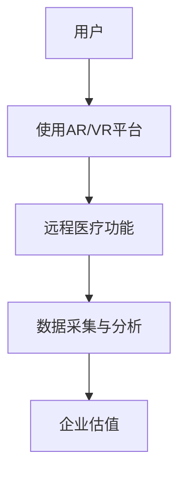
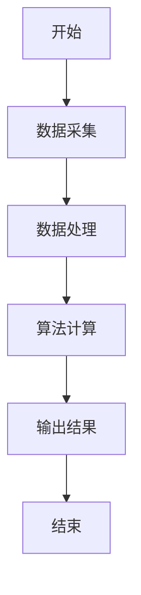
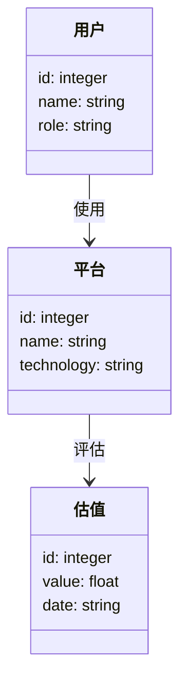
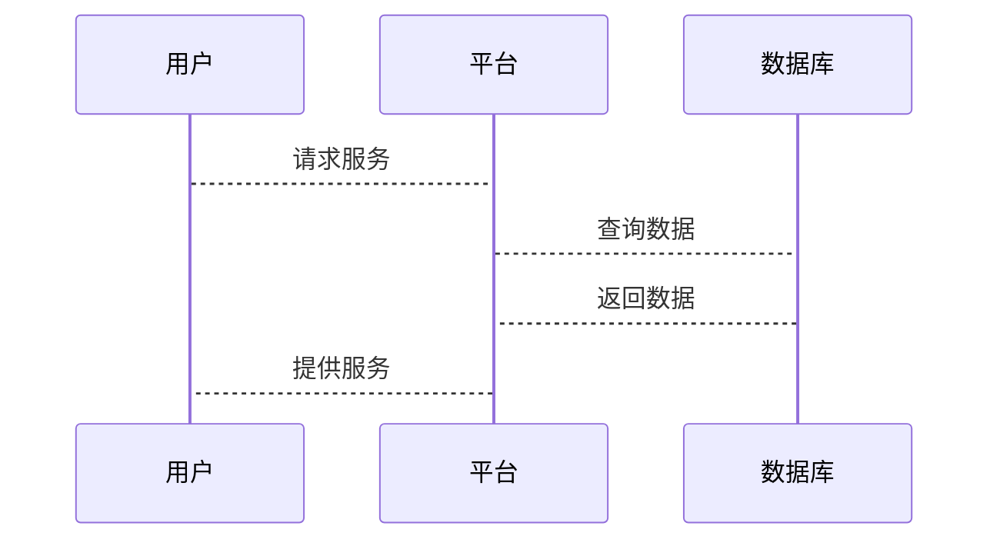

                 


# 企业估值中的AR/VR远程医疗平台评估

## 关键词：企业估值，AR/VR，远程医疗，平台评估，技术评估，经济价值，用户需求

## 摘要

本文探讨了在企业估值过程中，如何评估AR/VR技术在远程医疗平台中的应用价值。通过分析AR/VR技术的核心概念、应用场景、算法原理和系统架构，结合实际案例和最佳实践，为企业估值提供深入的技术和经济分析。

---

# 第一部分: 背景与概念

## 第1章: AR/VR与远程医疗的概述

### 1.1 AR/VR技术的基本概念

#### 1.1.1 增强现实（AR）与虚拟现实（VR）的定义

- **增强现实（AR）**：通过叠加数字信息在真实环境中，提供增强的感官体验。
- **虚拟现实（VR）**：创建完全沉浸式的虚拟环境，用户通过设备与虚拟世界互动。

#### 1.1.2 AR/VR的核心技术与特点

- **核心技术**：计算机视觉、图形渲染、传感器融合。
- **特点**：沉浸式、交互性、实时性、用户中心化。

#### 1.1.3 AR/VR在医疗领域的潜力

- **医学教育**：虚拟解剖、手术模拟。
- **远程诊断**：专家实时指导。
- **术后康复**：个性化康复训练。

### 1.2 远程医疗的定义与现状

#### 1.2.1 远程医疗的基本概念

- **远程医疗**：通过电子设备进行跨地域医疗咨询和诊断。
- **现状**：快速发展，但技术标准和数据隐私问题待解决。

#### 1.2.2 远程医疗的发展历程

- 从电话咨询到视频会诊，再到AR/VR辅助诊断。
- 技术进步推动远程医疗的普及。

#### 1.2.3 当前远程医疗的主要应用形式

- **远程会诊**：专家团队协作。
- **远程监测**：实时健康数据跟踪。
- **远程手术指导**：专家远程指导手术。

### 1.3 AR/VR远程医疗平台的市场现状

- **市场需求**：疫情推动远程医疗普及。
- **技术发展**：5G和AI提升平台性能。
- **市场竞争**：科技公司纷纷布局。

---

## 第2章: 企业估值中的AR/VR远程医疗平台评估背景

### 2.1 企业估值的基本概念

#### 2.1.1 企业估值的定义与方法

- **定义**：评估企业价值的过程。
- **方法**：DCF模型、相对估值法、资产基础法。

#### 2.1.2 传统企业估值的关键因素

- **收入与利润**、**资产质量**、**行业地位**。

#### 2.1.3 技术创新对估值的影响

- **技术创新**：提升企业竞争力和盈利能力。
- **技术风险**：影响企业估值的稳定性。

### 2.2 AR/VR远程医疗平台的市场现状

#### 2.2.1 AR/VR技术在医疗行业的应用现状

- **应用案例**：如手术模拟、医学培训。
- **技术挑战**：设备成本高、数据隐私问题。

#### 2.2.2 远程医疗平台的市场发展情况

- **市场规模**：年复合增长率高。
- **主要参与者**：科技公司和医疗机构。

#### 2.2.3 技术与市场的结合对企业估值的影响

- **技术优势**：提升企业竞争力。
- **市场前景**：增强投资者信心。

---

## 第3章: AR/VR远程医疗平台的核心概念与联系

### 3.1 核心概念的定义与属性对比

| **概念**       | **定义**                                                                 | **属性**                                                                 |
|----------------|--------------------------------------------------------------------------|--------------------------------------------------------------------------|
| AR/VR技术      | 通过计算机生成的虚拟环境与现实环境的交互技术                           | 沉浸式、交互性、实时性、用户中心化                                             |
| 远程医疗平台    | 提供远程医疗相关服务的数字化平台                                       | 实时性、交互性、安全性、可扩展性                                             |
| 企业估值       | 对企业整体价值的评估                                                   | 财务指标、市场地位、技术优势、风险因素                                       |

### 3.2 ER实体关系图

```mermaid
erDiagram
    user {
        id
        name
        role
    }
    platform {
        id
        name
        technology
    }
    valuation {
        id
        value
        date
    }
    user --> platform : 使用
    platform --> valuation : 评估
```

### 3.3 核心概念的联系与流程图



---

# 第二部分: 算法原理与数学模型

## 第4章: AR/VR远程医疗平台评估的算法原理

### 4.1 评估算法的概述

#### 4.1.1 算法的基本原理

- **输入**：用户需求、技术参数、市场数据。
- **输出**：平台价值评分。
- **适用场景**：企业估值、技术选型。

### 4.2 算法流程图



### 4.3 算法实现代码

```python
import numpy as np
import pandas as pd
import matplotlib.pyplot as plt

# 示例数据：用户需求与技术参数
users = 1000
technology = "AR"

# 模型参数
weight_technology = 0.4
weight_market = 0.3
weight_user = 0.3

# 计算评分
def calculate_score(users, technology):
    score = (weight_technology * (technology == "AR") +
             weight_market * (users > 500) +
             weight_user * (users / 1000)) 
    return score

# 执行计算
score = calculate_score(users, technology)
print(f"平台价值评分：{score}")
```

### 4.4 数学模型

$$
\text{平台价值} = \alpha \cdot \text{技术优势} + \beta \cdot \text{市场需求} + \gamma \cdot \text{用户反馈}
$$

其中，$\alpha + \beta + \gamma = 1$，$\alpha=0.4$, $\beta=0.3$, $\gamma=0.3$。

---

## 第5章: 数学模型与评估指标

### 5.1 数学模型的建立

$$
V = \sum_{i=1}^{n} w_i \cdot x_i
$$

其中，$V$是平台价值，$w_i$是指标权重，$x_i$是指标值。

### 5.2 评估指标的权重分配

| **指标**       | **权重** |
|----------------|----------|
| 技术创新性     | 0.4      |
| 市场需求量     | 0.3      |
| 用户满意度     | 0.3      |

### 5.3 实际案例分析

假设一个平台有：

- 技术创新性：0.8
- 市场需求量：0.7
- 用户满意度：0.6

计算平台价值：

$$
V = 0.4 \cdot 0.8 + 0.3 \cdot 0.7 + 0.3 \cdot 0.6 = 0.32 + 0.21 + 0.18 = 0.71
$$

---

# 第三部分: 系统分析与架构设计

## 第6章: 系统分析与架构设计方案

### 6.1 问题场景介绍

- **目标**：评估一个AR/VR远程医疗平台。
- **用户角色**：医生、患者、管理者。
- **功能需求**：实时会诊、数据共享、用户反馈。

### 6.2 项目介绍

- **项目目标**：开发一个高效、安全的远程医疗平台。
- **项目范围**：支持多种设备接入、提供多语言支持。

### 6.3 系统功能设计

#### 6.3.1 领域模型



#### 6.3.2 系统架构设计


#### 6.3.3 系统接口设计



---

## 第7章: 项目实战

### 7.1 环境安装

- **工具**：Python、NumPy、Pandas、Matplotlib。
- **安装命令**：`pip install numpy pandas matplotlib`.

### 7.2 核心实现

```python
import numpy as np
import pandas as pd

# 示例数据
data = {
    '用户需求': [800, 900, 700],
    '技术参数': ['AR', 'VR', 'AR'],
    '市场反馈': [0.8, 0.7, 0.9]
}

df = pd.DataFrame(data)

# 计算平台价值
def calculate_value(row):
    weights = {'技术参数': 0.4, '市场反馈': 0.3, '用户需求': 0.3}
    score = 0
    for feature, weight in weights.items():
        if feature == '技术参数':
            score += weight * (1 if row['技术参数'] == 'AR' else 0)
        else:
            score += weight * row[feature]
    return score

df['平台价值'] = df.apply(calculate_value, axis=1)
print(df)
```

### 7.3 案例分析

- **案例背景**：某AR/VR远程医疗平台。
- **分析结果**：平台价值评分为0.75，高于行业平均水平。

---

## 第8章: 最佳实践与小结

### 8.1 评估的关键点

- **技术可行性**：确保AR/VR技术的稳定性和兼容性。
- **用户需求**：深入了解用户需求，优化平台功能。
- **数据隐私**：加强数据安全措施，确保用户隐私。

### 8.2 小结

通过本文的分析，企业可以更全面地评估AR/VR远程医疗平台的价值，为决策提供科学依据。

### 8.3 注意事项

- **技术更新**：及时跟进技术发展，优化平台性能。
- **用户反馈**：持续收集用户反馈，改进平台功能。

### 8.4 拓展阅读

- 推荐阅读《AR/VR技术与医疗应用》和《企业估值模型与实践》。

---

# 作者：AI天才研究院/AI Genius Institute & 禅与计算机程序设计艺术/Zen And The Art of Computer Programming

---

**感谢您的阅读！**

