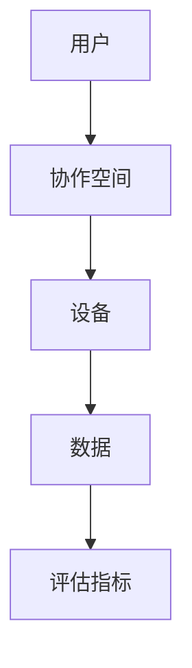
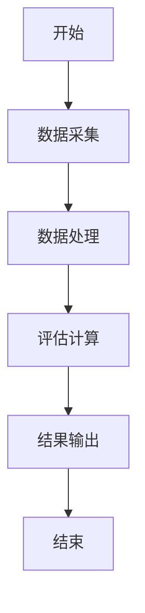
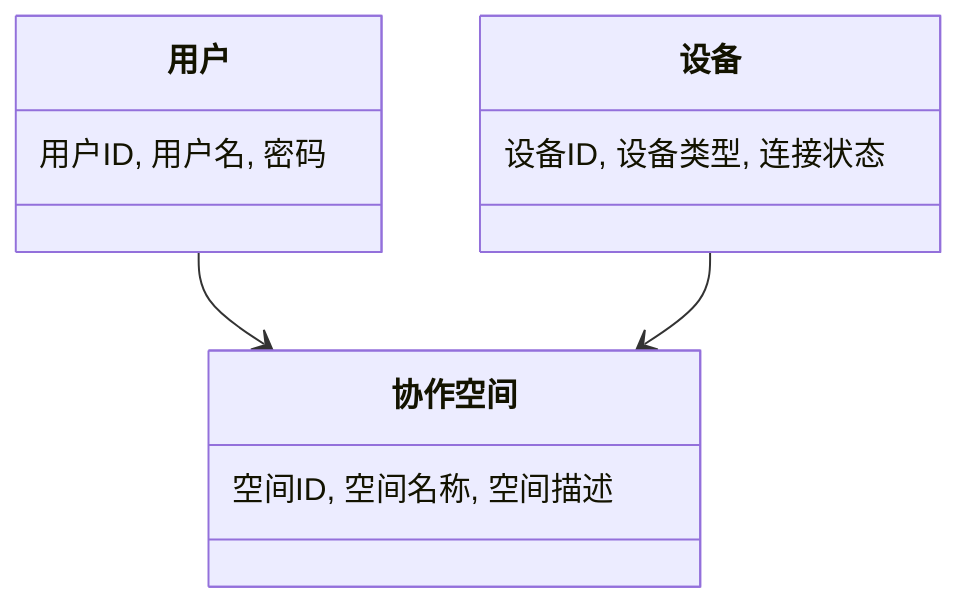
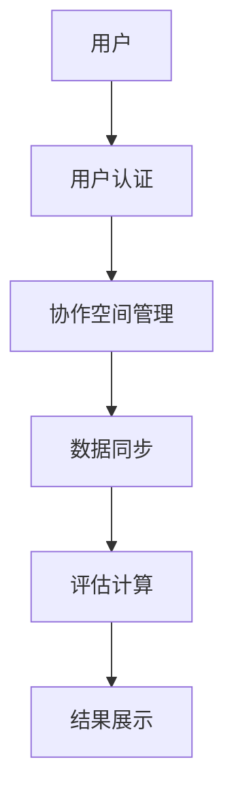

                 


# 企业估值中的AR/VR远程协作平台评估

> 关键词：企业估值，AR/VR，远程协作，协作平台，技术评估

> 摘要：随着AR/VR技术的迅速发展，远程协作平台在企业中的应用越来越广泛。本文详细探讨了如何在企业估值过程中评估AR/VR远程协作平台的价值，从技术原理到实际应用，为企业决策提供全面的分析。

---

# 第1章: AR/VR远程协作平台概述

## 1.1 AR/VR技术与远程协作的结合

### 1.1.1 AR/VR技术的定义与发展

AR（增强现实）和VR（虚拟现实）是两项互补的技术，AR通过在现实环境中叠加虚拟元素，提供增强的交互体验；而VR则创造完全虚拟的环境，让用户沉浸其中。近年来，随着计算能力和硬件性能的提升，AR/VR技术得到了快速发展，并在教育、医疗、娱乐和企业协作等领域展现出广泛的应用潜力。

### 1.1.2 远程协作的定义与特点

远程协作指的是在不同地理位置的人员通过数字化工具进行合作的过程。传统的远程协作依赖于文字聊天、视频会议和文档共享，而AR/VR技术的引入使得协作更加直观和高效。通过AR/VR，用户可以在虚拟空间中进行实时互动，共享3D模型、协同编辑文档，甚至进行虚拟产品展示。

### 1.1.3 AR/VR在远程协作中的应用价值

AR/VR技术通过提供沉浸式的协作环境，显著提升了远程团队的工作效率和创造力。例如，在产品设计中，团队成员可以实时查看和修改3D模型，快速迭代设计；在培训中，AR/VR可以提供身临其境的实践体验，提升学习效果。这些优势使得AR/VR远程协作平台在企业估值中具有重要的评估价值。

---

## 1.2 企业估值中的协作平台评估需求

### 1.2.1 企业估值的基本概念

企业估值是通过对企业的财务状况、市场地位、技术实力和未来盈利能力进行综合评估，确定其市场价值的过程。传统的估值方法主要依赖财务指标和市场数据，而随着技术的进步，企业中技术创新和协作能力也成为了重要的评估因素。

### 1.2.2 协作平台在企业中的作用

协作平台是企业内部和外部团队进行高效沟通和合作的关键工具。一个优秀的协作平台能够提升团队的工作效率，促进知识共享，缩短项目周期。在企业估值中，协作平台的性能和用户体验直接影响企业的整体价值。

### 1.2.3 AR/VR技术对协作平台评估的影响

AR/VR技术的引入，使得协作平台的评估维度更加多元化。除了传统的功能性和易用性，还需要考虑沉浸式体验的深度、虚拟环境的交互流畅度以及平台的扩展性和安全性。这些因素直接影响企业的协作效率和创新潜力，从而影响整体估值。

---

## 1.3 本章小结

本章介绍了AR/VR技术的基本概念及其在远程协作中的应用价值，强调了企业在估值过程中对协作平台的评估需求。通过结合AR/VR技术，协作平台的评估维度得到了扩展，为企业提供了更全面的评估依据。

---

# 第2章: AR/VR协作平台的核心概念与联系

## 2.1 核心概念原理

### 2.1.1 AR/VR协作平台的关键技术

AR/VR协作平台的核心技术包括：

1. **实时渲染技术**：确保虚拟环境的流畅更新。
2. **空间感知技术**：实现精准的三维定位和交互。
3. **网络同步技术**：保证多用户之间的协作数据实时同步。

### 2.1.2 远程协作的核心要素

远程协作的核心要素包括：

1. **用户身份认证**：确保协作的安全性。
2. **协作空间管理**：提供虚拟工作空间的创建和管理。
3. **交互工具集**：包括共享白板、三维建模工具等。

### 2.1.3 企业估值中的协作平台评估指标

评估指标包括：

1. **性能指标**：如延迟时间、渲染效率。
2. **用户体验指标**：如易用性、交互流畅度。
3. **安全指标**：如数据加密级别、访问控制能力。

---

## 2.2 核心概念属性特征对比

### 2.2.1 AR/VR协作平台与传统协作工具的对比

| 特性                | 传统协作工具         | AR/VR协作平台       |
|---------------------|----------------------|----------------------|
| 交互方式            | 文字、语音、文件     | 沉浸式虚拟交互       |
| 空间感知能力        | 无                   | 高                   |
| 创作效率            | 低                   | 高                   |
| 技术复杂度          | 低                   | 高                   |

### 2.2.2 不同AR/VR平台的功能对比

| 平台                | 功能特点             |
|---------------------|----------------------|
| Microsoft Teams     | 集成聊天、文件共享   |
| Zoom                | 视频会议为主         |
| Microsoft Mesh      | 全息投影协作         |
| Google Meet         | 高质量视频会议       |

### 2.2.3 企业估值中的协作平台评估维度

| 维度                | 评估标准             |
|---------------------|----------------------|
| 技术性能            | 延迟、渲染能力       |
| 用户体验            | 易用性、交互流畅度   |
| 安全性              | 数据加密、权限管理   |

---

## 2.3 ER实体关系图架构



---

## 2.4 本章小结

本章详细探讨了AR/VR协作平台的核心概念及其在企业估值中的应用，通过对比分析不同协作工具和平台的特点，明确了评估的关键维度和方法。

---

# 第3章: AR/VR协作平台评估的算法原理

## 3.1 算法原理概述

### 3.1.1 多因素评估模型

多因素评估模型是一种基于多个评估维度对协作平台进行综合评分的方法。其核心公式为：

$$
\text{综合评分} = \sum (\text{指标权重} \times \text{指标得分})
$$

### 3.1.2 基于数据的协作效率分析

通过分析用户在协作平台上的行为数据，如操作频率、任务完成时间等，评估协作效率。常用指标包括：

1. 平均响应时间（ART）
2. 任务完成率（TCR）
3. 用户满意度（US）

### 3.1.3 用户体验评分算法

用户体验评分算法基于用户反馈数据，通过加权平均计算最终评分。公式为：

$$
\text{用户体验评分} = \sum (\text{权重} \times \text{用户反馈})
$$

---

## 3.2 算法流程图



---

## 3.3 算法实现代码

```python
def calculate_score(data):
    weights = [0.4, 0.3, 0.2, 0.1]
    score = 0
    for i in range(len(data)):
        score += weights[i] * data[i]
    return score
```

---

## 3.4 本章小结

本章详细介绍了AR/VR协作平台评估的算法原理，包括多因素评估模型、协作效率分析和用户体验评分算法，并通过流程图和代码示例进行了详细说明。

---

# 第4章: 系统分析与架构设计方案

## 4.1 问题场景介绍

假设某企业需要评估其使用的AR/VR协作平台，我们从用户身份认证、协作空间管理、数据同步等方面进行分析。

---

## 4.2 项目介绍

本项目旨在开发一个基于AR/VR技术的协作平台评估系统，通过收集和分析用户行为数据，提供客观的评估结果。

---

## 4.3 系统功能设计

### 4.3.1 领域模型



---

## 4.4 系统架构设计

### 4.4.1 架构图



---

## 4.5 系统接口设计

1. 用户认证接口：`POST /api/auth`
2. 协作空间创建接口：`POST /api/workspace`
3. 数据同步接口：`POST /api/sync`

---

## 4.6 本章小结

本章通过系统分析和架构设计，明确了AR/VR协作平台评估系统的实现方案，为后续的开发奠定了基础。

---

# 第5章: 项目实战

## 5.1 环境搭建

### 5.1.1 安装Python

```bash
python --version
```

### 5.1.2 安装依赖库

```bash
pip install numpy matplotlib
```

---

## 5.2 核心功能实现

### 5.2.1 用户认证

```python
import hashlib

def hash_password(password):
    return hashlib.sha256(password.encode()).hexdigest()
```

### 5.2.2 协作空间创建

```python
class Workspace:
    def __init__(self, name, description):
        self.name = name
        self.description = description
```

---

## 5.3 代码应用解读与分析

通过上述代码，我们可以实现用户认证和协作空间的创建功能。用户认证确保了协作的安全性，协作空间创建为用户提供了一个虚拟的工作环境。

---

## 5.4 实际案例分析

假设某企业在评估其协作平台时，收集了用户在协作空间中的行为数据。通过分析这些数据，我们发现平台的延迟较高，影响了用户体验。因此，我们建议优化网络传输协议，提升协作效率。

---

## 5.5 项目小结

本章通过实际案例分析，展示了如何在企业中应用AR/VR协作平台评估的方法，并提供了解决方案。

---

# 第6章: 最佳实践与小结

## 6.1 最佳实践

1. **数据采集**：确保数据的准确性和完整性。
2. **权重设置**：根据企业需求调整各评估指标的权重。
3. **持续优化**：定期评估协作平台的性能和用户体验。

---

## 6.2 小结

通过本文的详细分析，我们了解了AR/VR协作平台在企业估值中的重要性，并掌握了评估的关键方法和技巧。希望本文能为企业提供有价值的参考。

---

## 6.3 注意事项

1. 在评估过程中，需注意数据的隐私和安全。
2. 评估指标的选择应结合企业的实际需求。
3. 系统的维护和优化需持续关注。

---

## 6.4 拓展阅读

1. 《Virtual Reality in Business》
2. 《Augmented Reality Applications》
3. 《Enterprise Value Assessment》

---

# 结语

AR/VR技术的快速发展为企业协作带来了新的可能性。通过科学的评估方法和工具，企业能够更好地发挥AR/VR协作平台的潜力，提升整体价值。

---

# 作者：AI天才研究院 & 禅与计算机程序设计艺术

感谢您的阅读！如需进一步了解，请访问我们的官方网站或联系作者。

