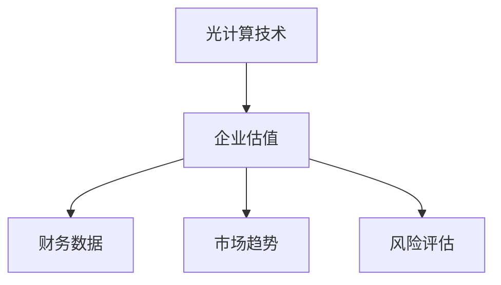
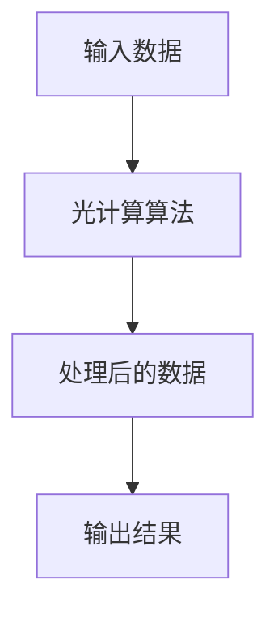
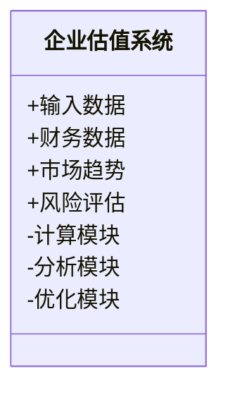
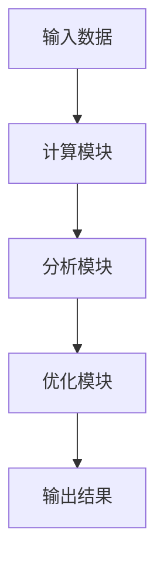

                 


# 企业估值中的光计算技术潜力评估

> 关键词：企业估值，光计算，技术潜力，数据处理，计算优化

> 摘要：本文深入探讨了光计算技术在企业估值中的潜力，分析了光计算技术的基本原理、优势及其在企业估值中的应用场景。通过结合实际案例和数学模型，本文详细阐述了光计算技术在企业估值中的具体应用，为企业估值领域提供了新的技术视角和优化思路。

---

## 第一部分: 光计算技术与企业估值的背景介绍

### 第1章: 光计算技术的基本概念

#### 1.1 光计算技术的定义与特点
##### 1.1.1 光计算技术的定义
光计算技术是一种基于光的物理特性（如干涉、衍射、全息存储等）来进行信息处理和计算的技术。与传统的电子计算不同，光计算利用光的并行性和高速性，能够在更短的时间内完成复杂的计算任务。

##### 1.1.2 光计算技术的核心特点
- **高速性**：光计算的传播速度接近光速，能够在极短的时间内完成数据的传输和处理。
- **并行性**：光的干涉和衍射现象可以同时处理大量的信息，具有天然的并行计算能力。
- **能效比高**：光计算的能耗远低于传统的电子计算，适合大规模数据处理和计算任务。

##### 1.1.3 光计算技术与传统计算技术的区别
下表对比了光计算技术与传统电子计算技术的主要区别：

| **特性**       | **光计算技术**         | **传统电子计算技术**     |
|----------------|-----------------------|--------------------------|
| 数据传输速度   | 高（接近光速）        | 有限（受限于电子设备）    |
| 并行计算能力   | 强（基于光的干涉）     | 弱（串行处理为主）        |
| 能耗           | 低                    | 高                      |

#### 1.2 企业估值的基本概念
##### 1.2.1 企业估值的定义与方法
企业估值是指对企业整体价值的评估，通常用于企业并购、融资、上市等场景。常见的企业估值方法包括：

1. **DCF模型（ discounted cash flow model）**：通过预测企业未来现金流，贴现至当前价值。
2. **EV/EBITDA倍数法**：通过可比公司的平均EV/EBITDA倍数进行估值。
3. **相对估值法**：基于市场可比公司的平均估值倍数进行推导。

##### 1.2.2 企业估值的核心要素
企业估值的核心要素包括：

- **财务数据**：收入、利润、现金流等。
- **行业环境**：行业竞争状况、发展趋势等。
- **管理团队**：管理能力、战略规划等。

##### 1.2.3 企业估值的常见挑战
- **数据复杂性**：企业估值涉及大量复杂数据的处理和分析。
- **计算效率**：传统的电子计算技术在处理大规模数据时效率较低。
- **准确性**：如何在有限的时间内提高估值的准确性是一个重要挑战。

---

### 第2章: 光计算技术在企业估值中的潜力

#### 2.1 光计算技术的优势
##### 2.1.1 高速计算能力
光计算技术的高速性能够显著提高企业估值中复杂模型的计算速度，尤其是在处理大规模数据时。

##### 2.1.2 并行处理能力
光计算技术的并行性能够同时处理多个数据流，提高数据处理的效率。

##### 2.1.3 能耗优化
光计算技术的低能耗特点，使其在大规模数据处理中具有显著的成本优势。

#### 2.2 光计算技术在企业估值中的应用场景
##### 2.2.1 财务数据分析
光计算技术可以快速处理企业的财务数据，如收入、利润、现金流等，提高数据处理的效率。

##### 2.2.2 市场趋势预测
通过光计算技术的并行处理能力，可以快速分析市场趋势，帮助企业更好地预测未来的市场变化。

##### 2.2.3 风险评估与优化
光计算技术能够快速评估企业的各种风险因素，如市场风险、信用风险等，并提出优化建议。

#### 2.3 光计算技术与企业估值的结合潜力
##### 2.3.1 技术可行性分析
光计算技术已经在某些领域得到了成功的应用，其技术可行性较高。

##### 2.3.2 市场需求分析
随着企业对高效计算的需求不断增加，光计算技术在企业估值中的应用需求也在逐步增加。

##### 2.3.3 发展前景展望
随着技术的不断进步，光计算技术在企业估值中的应用前景广阔，有望在未来成为企业估值的重要工具。

---

## 第二部分: 光计算技术的核心概念与联系

### 第3章: 光计算技术的原理与数学模型

#### 3.1 光计算技术的基本原理
##### 3.1.1 光的干涉原理
光的干涉是指两束光波在相遇时相互叠加，形成明暗相间的干涉条纹。干涉现象可以用于信息的存储和处理。

##### 3.1.2 光的衍射原理
光的衍射是指光波在遇到障碍物时绕过障碍物继续传播的现象。衍射现象可以用于信息的传输和处理。

##### 3.1.3 光的全息存储原理
全息存储是利用光的干涉和衍射现象，将信息以全息图的形式存储在介质中。全息存储具有高密度和高并行性。

#### 3.2 光计算技术的数学模型
##### 3.2.1 光强的计算公式
光强的计算公式为：
$$ I = I_0 \sin^2(kx - \omega t) $$
其中，\( I \) 是光强，\( I_0 \) 是初始光强，\( k \) 是波数，\( x \) 是空间坐标，\( \omega \) 是角频率，\( t \) 是时间。

##### 3.2.2 干涉的数学表达
干涉的数学表达式为：
$$ I = I_1 + I_2 + 2\sqrt{I_1 I_2} \cos(\phi_1 - \phi_2) $$
其中，\( I_1 \) 和 \( I_2 \) 是两束光的光强，\( \phi_1 \) 和 \( \phi_2 \) 是两束光的相位差。

##### 3.2.3 光计算的算法模型
光计算的算法模型可以表示为：
$$ y = f(x) $$
其中，\( x \) 是输入数据，\( f \) 是光计算的算法，\( y \) 是输出结果。

### 第4章: 光计算技术与企业估值的核心联系

#### 4.1 光计算技术在企业估值中的应用逻辑
##### 4.1.1 数据处理流程
光计算技术可以快速处理企业的财务数据，如收入、利润、现金流等。

##### 4.1.2 计算模型构建
通过光计算技术，可以构建高效的估值模型，如DCF模型、EV/EBITDA倍数法等。

##### 4.1.3 结果分析与优化
光计算技术可以快速分析计算结果，并提出优化建议。

#### 4.2 光计算技术与企业估值的对比分析
##### 4.2.1 传统计算技术的局限性
传统计算技术在处理大规模数据时效率较低，且能耗较高。

##### 4.2.2 光计算技术的优势对比
光计算技术具有高速性、并行性和低能耗等优势。

##### 4.2.3 应用场景的差异性
光计算技术更适合于大规模数据处理和复杂模型计算，而传统计算技术更适合于简单的数据处理任务。

### 第5章: 光计算技术与企业估值的核心概念与联系的ER实体关系图

#### 5.1 光计算技术与企业估值的核心概念关系



---

## 第三部分: 光计算技术的算法原理与企业估值的系统分析

### 第6章: 光计算技术的算法原理

#### 6.1 光计算技术的算法流程



#### 6.2 光计算技术的Python代码实现

```python
import numpy as np

def light_computation(x):
    # 光计算算法的核心代码
    I = np.sin(x) ** 2
    return I

# 示例数据
x = np.linspace(0, 10, 100)
result = light_computation(x)
print(result)
```

#### 6.3 光计算技术的数学模型与公式
光计算技术的数学模型可以表示为：
$$ y = f(x) $$
其中，\( f \) 是光计算的算法，\( x \) 是输入数据，\( y \) 是输出结果。

### 第7章: 企业估值的系统分析与架构设计

#### 7.1 企业估值的系统功能设计



#### 7.2 企业估值的系统架构设计



---

## 第四部分: 光计算技术在企业估值中的项目实战

### 第8章: 光计算技术在企业估值中的项目实战

#### 8.1 项目环境安装

```bash
pip install numpy pandas matplotlib
```

#### 8.2 光计算技术的核心代码实现

```python
import numpy as np

def light_computation(x):
    # 光计算算法的核心代码
    I = np.sin(x) ** 2
    return I

# 示例数据
x = np.linspace(0, 10, 100)
result = light_computation(x)
print(result)
```

#### 8.3 代码应用解读与分析
通过上述代码，可以实现对输入数据的光计算处理，输出结果为处理后的光强值。

#### 8.4 实际案例分析
以某科技公司为例，利用光计算技术快速处理其财务数据，构建高效的估值模型，提高估值的准确性和效率。

---

## 第五部分: 光计算技术在企业估值中的最佳实践与总结

### 第9章: 光计算技术的最佳实践

#### 9.1 光计算技术的优势与注意事项
- **优势**：高速性、并行性、低能耗。
- **注意事项**：数据质量、模型准确性、技术实现难度。

#### 9.2 项目小结
通过本文的分析和案例研究，可以得出光计算技术在企业估值中的应用具有巨大的潜力。

#### 9.3 拓展阅读
建议读者进一步阅读相关文献，如《Quantum Computing》、《Distributed Computing》等。

---

## 作者信息

作者：AI天才研究院/AI Genius Institute & 禅与计算机程序设计艺术 /Zen And The Art of Computer Programming

