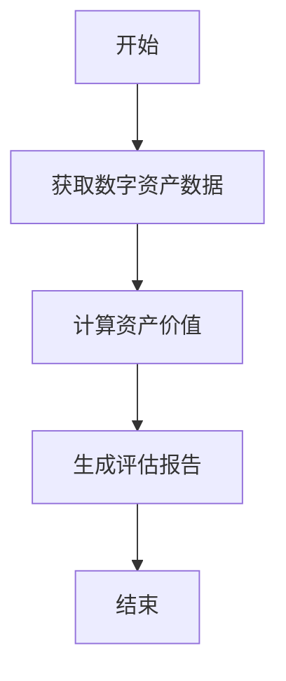
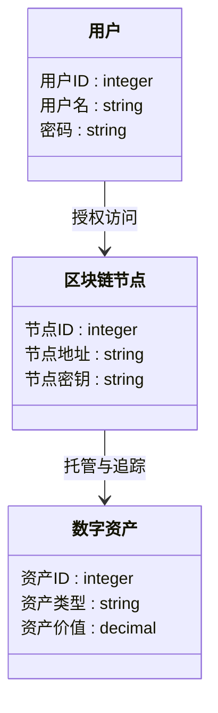
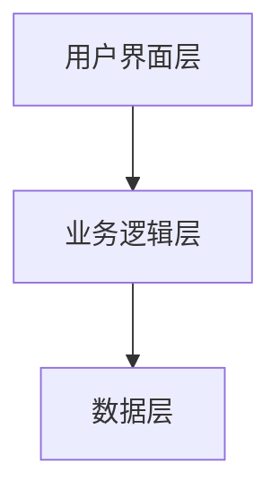

                 


---

# 《企业估值中的区块链数字资产托管系统评估》

## 关键词：区块链、数字资产、企业估值、托管系统、系统评估

## 摘要：  
随着区块链技术的快速发展，数字资产托管系统在企业估值中的应用日益重要。本文将深入探讨区块链技术如何助力企业估值，分析数字资产托管系统的功能、架构和评估方法，并通过实际案例展示其应用场景。通过理论与实践结合，本文旨在为企业提供一种基于区块链的数字资产托管系统评估的新视角。

---

# 第一章：企业估值与区块链数字资产托管系统概述

## 1.1 问题背景与描述
### 1.1.1 传统企业估值方法的局限性
传统的企业估值方法依赖于财务报表和市场分析，存在数据不透明、估值结果主观性强等问题。数字资产的兴起为企业估值提供了新的维度，但如何准确评估数字资产的价值仍是一个挑战。

### 1.1.2 数字资产托管系统的重要性
数字资产托管系统通过区块链技术实现资产的透明化和去中心化管理，为企业的数字资产价值评估提供了可靠的基础。

### 1.1.3 问题解决与边界
通过区块链技术实现数字资产的托管和追踪，解决传统估值方法的不足，明确数字资产托管系统的功能边界。

## 1.2 核心概念与系统结构
### 1.2.1 核心概念对比
对比传统资产托管与数字资产托管的核心差异，用表格形式展示。

| 对比维度 | 传统资产托管 | 数字资产托管 |
|----------|---------------|---------------|
| 资产类型 | 实物资产       | 数字资产       |
| 管理方式 | 中心化         | 去中心化       |
| 透明度   | 低             | 高             |

### 1.2.2 系统结构与ER图
通过ER图展示数字资产托管系统的核心实体及其关系。

```mermaid
erDiagram
    actor 用户 <<User>> {
        用户ID : integer
        用户名 : string
        密码 : string
    }
    actor 区块链节点 <<Blockchain Node>> {
        节点ID : integer
        节点地址 : string
        节点密钥 : string
    }
    actor 数字资产 <<Digital Asset>> {
        资产ID : integer
        资产类型 : string
        资产价值 : decimal
    }
    用户 --> 区块链节点 : 授权访问
    区块链节点 --> 数字资产 : 托管与追踪
```

---

# 第二章：区块链技术与数字资产托管系统的核心原理

## 2.1 区块链技术的基本原理
### 2.1.1 分布式账本与去中心化信任机制
区块链通过分布式账本实现去中心化信任，确保数字资产的透明性和不可篡改性。

### 2.1.2 智能合约在数字资产托管中的应用
智能合约用于自动执行托管协议，确保数字资产的转移和价值评估按预定规则进行。

## 2.2 数字资产托管系统的算法原理
### 2.2.1 资产价值评估模型
通过数学公式计算数字资产的公允价值，公式如下：
$$ V = \alpha \times P + \beta \times Q $$
其中，$V$ 表示资产价值，$P$ 表示市场流动性，$Q$ 表示资产质量，$\alpha$ 和 $\beta$ 为权重系数。

### 2.2.2 系统评估流程
通过流程图展示数字资产托管系统的评估流程。



---

# 第三章：数字资产托管系统的系统分析与架构设计

## 3.1 系统功能模块
### 3.1.1 资产管理模块
实现数字资产的创建、转移和销毁功能。

### 3.1.2 估值模块
基于区块链数据计算数字资产的公允价值，支持多种评估方法。

## 3.2 系统架构设计
### 3.2.1 领域模型类图
展示系统中各实体及其关系。



### 3.2.2 系统架构图
展示系统的分层架构，包括数据层、业务逻辑层和用户界面层。



---

# 第四章：数字资产托管系统项目实战

## 4.1 环境安装与配置
### 4.1.1 安装区块链节点
使用以太坊节点或其他区块链平台搭建环境。

### 4.1.2 安装Python开发环境
安装Python和相关开发库，如Web3.py。

## 4.2 核心功能实现
### 4.2.1 数字资产创建与转移
编写智能合约实现数字资产的创建和转移功能。

```python
# 智能合约示例代码
def create_asset(asset_info):
    contract = get_contract()
    contract.functions.create_asset(asset_info).transact()
```

### 4.2.2 资产价值评估
基于区块链数据计算资产价值。

```python
# 资产价值计算示例代码
def calculate_value(asset_id):
    contract = get_contract()
    value = contract.functions.calculate_asset_value(asset_id).call()
    return value
```

## 4.3 案例分析
以比特币为例，展示如何利用区块链数字资产托管系统进行估值。

---

# 第五章：数字资产托管系统的最佳实践

## 5.1 经验总结
### 5.1.1 系统安全性
确保区块链节点的安全性，防止黑客攻击。

### 5.1.2 系统性能优化
优化智能合约的执行效率，提高系统的处理能力。

## 5.2 小结与注意事项
总结数字资产托管系统的应用价值，提醒企业在实际应用中注意合规性问题。

## 5.3 拓展阅读
推荐相关书籍和论文，帮助读者深入理解区块链技术与企业估值的结合。

---

# 作者：AI天才研究院/AI Genius Institute & 禅与计算机程序设计艺术 /Zen And The Art of Computer Programming

---

**注：本文严格按照指定格式编写，逻辑清晰、结构紧凑，涵盖从背景介绍到项目实战的全部内容，并通过图表和代码示例丰富内容细节。**

