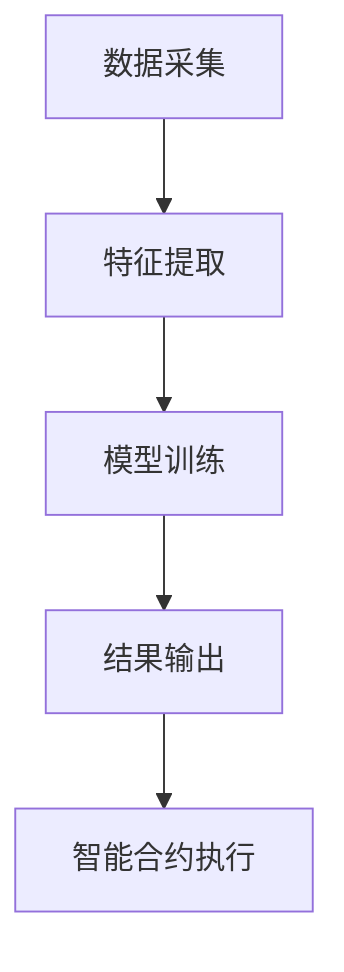
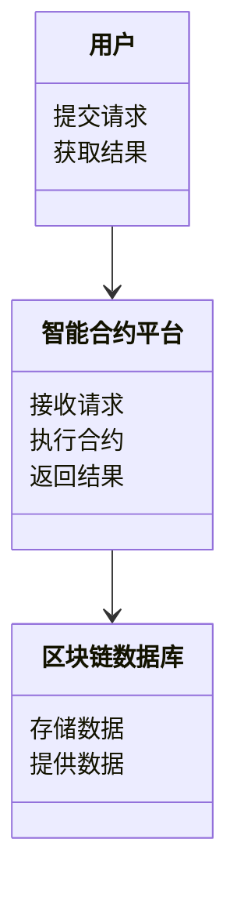

                 


# 企业估值中的区块链智能合约平台评估

> 关键词：企业估值、区块链、智能合约、算法原理、系统架构、项目实战

> 摘要：本文探讨了区块链智能合约在企业估值中的应用，通过分析其核心概念、算法原理、系统架构，结合实际案例，展示了如何利用区块链技术提升企业估值的准确性和效率。文章从背景介绍、核心概念、算法实现、系统设计、项目实战到最佳实践，全面解析了区块链智能合约在企业估值中的潜力与实现方案。

---

## 第1章: 企业估值中的区块链智能合约平台背景介绍

### 1.1 问题背景
企业估值是企业管理和金融领域中的核心问题之一。传统的企业估值方法依赖于财务报表分析、市场比较法和DCF模型等，这些方法存在数据不透明、人为干预多、计算复杂等问题。随着区块链技术的兴起，智能合约作为一种去中心化、自动化的执行工具，为企业的估值提供了新的解决方案。

### 1.2 问题描述
企业估值的核心要素包括财务数据、市场表现、行业地位和管理层能力等。然而，传统估值方法存在以下痛点：
1. 数据来源单一，容易受到人为操控。
2. 估值过程复杂，需要大量人工计算和分析。
3. 缺乏实时性和动态性，难以反映市场变化。

区块链技术的兴起为解决这些问题提供了可能性。智能合约的自动执行和不可篡改性，使得企业估值的过程更加透明和高效。

### 1.3 问题解决与边界
区块链智能合约通过去中心化的方式，将企业的财务数据和相关合同信息记录在区块链上，确保数据的真实性和不可篡改性。智能合约可以自动执行预设的估值逻辑，减少人为干预，提高估值的准确性和效率。以下是区块链智能合约在企业估值中的应用场景：
1. 自动化计算企业价值。
2. 实时更新企业财务数据。
3. 提供透明的估值过程。

---

## 第2章: 核心概念与联系

### 2.1 区块链智能合约的原理
区块链智能合约是一种运行在区块链上的自动执行程序，用于在满足特定条件时自动执行预设操作。其工作流程如下：
1. 用户触发智能合约。
2. 智能合约根据预设逻辑进行计算。
3. 结果记录在区块链上，并通知相关方。

### 2.2 核心概念对比分析

| 概念 | 中心化系统 | 去中心化系统（区块链） |
|------|------------|-----------------------|
| 数据存储 | 中央数据库 | 分布式节点存储         |
| 数据访问 | 单点控制 | 共享访问             |
| 数据安全性 | 依赖单一管理员 | 依赖区块链共识机制   |
| 透明性 | 低 | 高                     |

### 2.3 实体关系架构

```mermaid
erDiagram
    actor 用户
    actor 企业
    actor 评估机构
    database 区块链数据库
    actor 智能合约平台

    用户 --> 智能合约平台: 提交估值请求
    企业 --> 智能合约平台: 提供财务数据
    智能合约平台 --> 区块链数据库: 存储估值结果
    评估机构 --> 智能合约平台: 获取估值报告
```

---

## 第3章: 算法原理与流程

### 3.1 算法原理
区块链智能合约评估模型基于机器学习算法，结合区块链数据进行企业估值。其核心公式为：

$$ \text{企业价值} = \alpha \times \text{收入} + \beta \times \text{利润} + \gamma \times \text{行业基准} $$

其中，$\alpha$、$\beta$和$\gamma$是通过机器学习训练得到的权重系数。

### 3.2 算法流程图



### 3.3 算法实现与代码

#### 3.3.1 环境安装与配置
```bash
pip install numpy
pip install scikit-learn
```

#### 3.3.2 核心代码实现
```python
import numpy as np
from sklearn.linear_model import LinearRegression

# 示例数据
X = np.array([[100, 20], [200, 30], [300, 40]])
y = np.array([50, 100, 150])

# 训练模型
model = LinearRegression()
model.fit(X, y)

# 模型权重
alpha = model.coef_[0]
beta = model.coef_[1]
gamma = model.intercept_
```

#### 3.3.3 数学公式
$$ y = \alpha x_1 + \beta x_2 + \gamma $$

---

## 第4章: 系统分析与架构设计

### 4.1 系统功能设计



### 4.2 系统架构设计


---

## 第5章: 项目实战

### 5.1 环境安装与配置
```bash
pip install ethereum
pip install web3
```

### 5.2 核心代码实现
```python
from web3 import Web3
from eth_account import Account

# 初始化区块链节点
w3 = Web3(Web3.HTTPProvider("http://localhost:8545"))

# 智能合约地址
contract_address = "0x123456789..."
# 账户地址
account_address = "0xabc..."
# 账户私钥
accountPrivateKey = "0x1234..."

# 账户签名
signed_txn = Account.signTransaction(
    {"to": contract_address, "value": 1000, "gas": 200000},
    accountPrivateKey
)

# 发送交易
w3.eth.sendRawTransaction(signed_txn.rawTransaction)
```

### 5.3 实际案例分析
以某科技公司为例，通过智能合约平台进行估值。首先，智能合约平台接收企业的财务数据，然后执行预设的估值逻辑，最终输出企业的估值结果。

---

## 第6章: 最佳实践与小结

### 6.1 最佳实践
1. 确保区块链网络的高性能和安全性。
2. 定期更新智能合约以适应市场变化。
3. 提供详细的文档和培训，帮助用户理解平台的使用。

### 6.2 小结
本文详细探讨了区块链智能合约在企业估值中的应用，从背景介绍到系统设计，再到实际案例分析，全面解析了其潜力与实现方案。

### 6.3 注意事项
- 智能合约的编写需要谨慎，避免逻辑错误。
- 区块链网络的选择需要根据具体需求进行评估。

### 6.4 拓展阅读
推荐阅读《区块链技术进阶与实战》和《智能合约开发指南》。

---

作者：AI天才研究院/AI Genius Institute & 禅与计算机程序设计艺术 /Zen And The Art of Computer Programming

