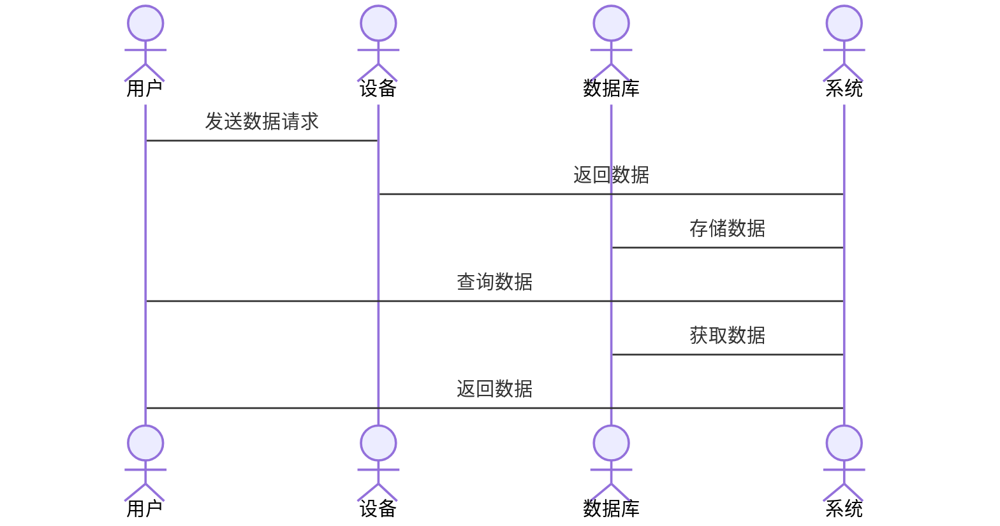

                 


# 企业估值中的可穿戴医疗设备评估

> 关键词：企业估值、可穿戴医疗设备、资产评估、数据采集、医疗技术

> 摘要：随着可穿戴医疗设备的普及，其在企业估值中的作用日益重要。本文详细探讨了可穿戴医疗设备在企业估值中的评估方法，从数据采集到模型构建，再到实际应用，全面解析其在企业价值评估中的核心作用。

---

# 第1章: 可穿戴医疗设备概述

## 1.1 可穿戴医疗设备的定义与特点

### 1.1.1 可穿戴医疗设备的基本概念

可穿戴医疗设备是一种能够佩戴在身体各部位，用于监测、记录和分析健康数据的智能设备。这类设备通常包括智能手表、健康手环、心率监测器等，能够实时采集用户的生理数据，如心率、血压、体温、血氧饱和度等。这些数据通过蓝牙或其他无线通信技术传输到手机或电脑，供用户或医生参考。

### 1.1.2 可穿戴医疗设备的核心特点

1. **实时监测**：可穿戴设备能够持续采集用户的生理数据，提供实时的健康监测。
2. **便携性**：用户可以在日常生活和运动中佩戴，无需依赖医院或专业设备。
3. **智能化**：通过内置的传感器和算法，设备能够自动分析数据并提供健康建议。
4. **多样性**：市场上有多种类型的可穿戴设备，适用于不同的健康监测需求。

### 1.1.3 可穿戴医疗设备在企业估值中的作用

在企业估值过程中，可穿戴医疗设备的数据可以用于评估员工的健康状况，进而影响企业的劳动力成本、保险费用和员工工作效率。例如，通过分析员工的健康数据，企业可以制定更有效的健康计划，降低医疗支出，提高员工满意度和生产力。

---

## 1.2 企业估值中的可穿戴医疗设备评估背景

### 1.2.1 企业估值的基本概念

企业估值是指对企业的整体价值进行评估的过程，通常用于企业并购、融资、上市等场景。传统的估值方法主要依赖财务数据和市场分析，而可穿戴医疗设备的出现为企业估值提供了新的数据维度。

### 1.2.2 可穿戴医疗设备在企业估值中的应用场景

1. **员工健康评估**：通过分析员工的健康数据，企业可以评估员工的健康状况，进而预测未来的医疗支出和劳动力成本。
2. **健康计划制定**：基于员工的健康数据，企业可以制定个性化的健康计划，降低员工的健康风险。
3. **企业风险管理**：通过分析员工的健康数据，企业可以识别潜在的健康风险，制定相应的风险管理策略。

### 1.2.3 当前市场环境下的评估挑战

随着可穿戴医疗设备的普及，数据量的增加和技术的进步，如何有效利用这些数据进行企业估值成为新的挑战。主要挑战包括数据隐私问题、数据质量控制、模型构建和优化等。

---

## 1.3 可穿戴医疗设备的市场现状与趋势

### 1.3.1 全球可穿戴医疗设备市场分析

近年来，全球可穿戴医疗设备市场快速增长，市场规模从2020年的约500亿美元增长到2023年的约800亿美元。主要驱动因素包括人口老龄化、慢性病发病率上升以及技术的进步。

### 1.3.2 主要企业与产品介绍

市场上主要的可穿戴医疗设备厂商包括苹果（Apple Watch）、谷歌（Fitbit）、三星（Galaxy Watch）等。这些设备通常集成多种传感器，能够监测心率、血压、血氧等多种生理指标。

### 1.3.3 市场发展趋势与未来预测

未来，可穿戴医疗设备将朝着更智能化、更精准化和更个性化的方向发展。同时，随着5G、人工智能等技术的进步，设备的数据处理能力和分析能力将显著提升。

---

# 第2章: 可穿戴医疗设备评估的核心概念与联系

## 2.1 核心概念原理

### 2.1.1 数据采集与处理

可穿戴医疗设备通过多种传感器采集用户的生理数据，常见的传感器包括心率传感器、血压传感器、加速度传感器等。数据采集后需要进行预处理，包括数据清洗、数据标准化等。

### 2.1.2 评估指标与权重分配

在企业估值中，需要选择合适的评估指标，如员工的健康状况、设备的使用率、设备的准确率等。每个指标需要赋予一定的权重，以反映其在整体估值中的重要性。

### 2.1.3 企业估值模型的构建

基于可穿戴设备数据的企业估值模型通常包括数据预处理、特征提取、模型训练和模型评估等步骤。常用的模型包括回归模型、决策树模型和神经网络模型等。

---

## 2.2 概念属性特征对比表格

| 概念       | 属性特征               |
|------------|------------------------|
| 数据采集   | 精准性、实时性、连续性 |
| 评估指标   | 客观性、可比性、全面性 |
| 估值模型   | 系统性、动态性、可调整性 |

---

## 2.3 ER实体关系图

```mermaid
er
  actor 企业估值主体
  actor 评估指标
  actor 数据采集设备
  actor 估值模型
  actor 企业价值
  企业估值主体 --> 数据采集设备: 采集医疗数据
  企业估值主体 --> 评估指标: 确定评估标准
  评估指标 --> 估值模型: 构建评估逻辑
  估值模型 --> 企业价值: 输出评估结果
```

---

# 第3章: 可穿戴医疗设备评估的算法原理

## 3.1 数据采集与预处理

### 3.1.1 数据采集流程

可穿戴设备通过传感器采集用户的生理数据，数据采集流程通常包括信号获取、信号放大、模数转换等步骤。

### 3.1.2 数据清洗与标准化

数据清洗是去除噪声和异常值的过程，常用的方法包括均值滤波、中位数滤波等。数据标准化则是将数据转换到统一的范围内，常用的方法包括归一化和标准化。

### 3.1.3 数据特征提取

特征提取是将原始数据转换为更有意义的特征的过程，常用的特征包括心率变异、步频、加速度等。

---

## 3.2 评估模型的构建与优化

### 3.2.1 算法选择与原理

常用的算法包括线性回归、支持向量机（SVM）和随机森林等。以线性回归为例，其数学模型为：

$$ y = \beta_0 + \beta_1x_1 + \beta_2x_2 + \dots + \beta_nx_n + \epsilon $$

其中，$y$ 是目标变量，$x_i$ 是自变量，$\beta_i$ 是回归系数，$\epsilon$ 是误差项。

### 3.2.2 算法实现代码

```python
import numpy as np
from sklearn.linear_model import LinearRegression

# 示例数据
X = np.array([[1, 2], [3, 4], [5, 6]])
y = np.array([7, 8, 9])

# 模型训练
model = LinearRegression()
model.fit(X, y)

# 预测
print(model.predict([[7, 8]]))
```

### 3.2.3 算法优化

模型优化包括参数调优、特征选择和模型集成等方法。例如，使用交叉验证优化模型参数，或者使用正则化方法（如Lasso回归）减少过拟合。

---

# 第4章: 可穿戴医疗设备评估的系统分析与架构设计

## 4.1 问题场景介绍

企业在使用可穿戴医疗设备进行估值时，需要考虑数据采集、数据处理、模型构建等多个环节。系统设计需要满足实时性、准确性和可扩展性的要求。

### 4.2 系统功能设计

系统功能包括数据采集模块、数据处理模块、模型训练模块和结果展示模块。

### 4.3 系统架构设计

系统架构采用分层架构，包括数据层、业务逻辑层和表现层。数据层负责数据的存储和管理，业务逻辑层负责数据处理和模型训练，表现层负责用户界面的展示。

### 4.4 系统接口设计

系统接口包括设备接口（与可穿戴设备通信）、数据接口（与数据库交互）和用户接口（与用户交互）。

### 4.5 系统交互序列图



---

# 第5章: 项目实战

## 5.1 环境安装

需要安装Python、NumPy、Scikit-learn等依赖库。

```bash
pip install numpy scikit-learn
```

## 5.2 系统核心实现源代码

```python
import numpy as np
from sklearn.model_selection import train_test_split
from sklearn.linear_model import LinearRegression

# 示例数据
X = np.array([[1, 2], [3, 4], [5, 6]])
y = np.array([7, 8, 9])

# 数据分割
X_train, X_test, y_train, y_test = train_test_split(X, y, test_size=0.2)

# 模型训练
model = LinearRegression()
model.fit(X_train, y_train)

# 模型评估
print(model.score(X_test, y_test))
```

## 5.3 代码应用解读与分析

上述代码实现了线性回归模型，用于预测目标变量。通过数据分割和模型评估，可以验证模型的性能。

## 5.4 实际案例分析和详细讲解剖析

以某企业为例，假设该企业有100名员工，通过可穿戴设备采集员工的健康数据，包括心率、血压等。通过模型分析，评估员工的健康状况，进而影响企业的劳动力成本和保险费用。

## 5.5 项目小结

通过项目实战，可以验证可穿戴医疗设备在企业估值中的应用价值，同时积累数据处理和模型构建的经验。

---

# 第6章: 最佳实践、小结、注意事项、拓展阅读

## 6.1 最佳实践 tips

1. 数据隐私保护是关键，需确保数据的安全性和合规性。
2. 模型优化需要结合实际业务需求，选择合适的算法和参数。
3. 系统设计需考虑可扩展性，以便未来的数据和业务需求。

## 6.2 小结

本文详细探讨了可穿戴医疗设备在企业估值中的评估方法，从数据采集到模型构建，再到实际应用，全面解析其在企业价值评估中的核心作用。

## 6.3 注意事项

1. 数据采集需确保准确性和实时性。
2. 模型构建需结合业务需求，避免过于复杂。
3. 系统设计需考虑可维护性和可扩展性。

## 6.4 拓展阅读

建议阅读相关领域的书籍和论文，如《可穿戴技术与医疗健康》、《企业估值与数据分析》等。

---

# 作者：AI天才研究院/AI Genius Institute & 禅与计算机程序设计艺术 /Zen And The Art of Computer Programming

---

**说明**：以上为完整的技术博客文章大纲和部分内容，具体内容可以根据实际需求进一步扩展和详细描述。

