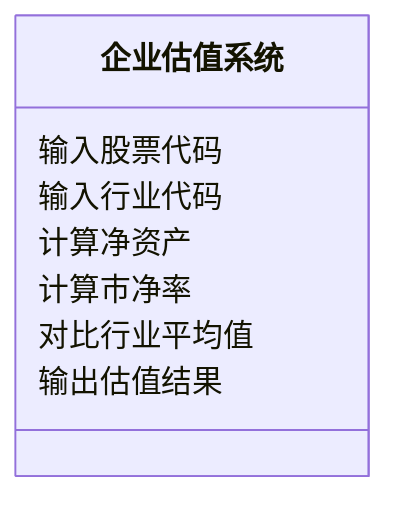
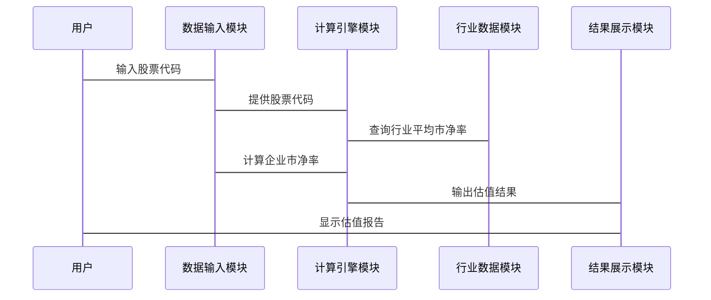

                 


# 企业估值中的市净率法详解

---

## 关键词：企业估值、市净率法、资产定价、财务分析、投资评估

---

## 摘要：  
本文深入探讨了企业估值中的市净率法，从基本概念到实际应用进行了全面分析。文章首先介绍了市净率法的定义、原理及与其他估值方法的对比，然后详细阐述了市净率法的计算公式、核心指标及实际应用场景。接着，通过系统架构设计和项目实战，展示了如何将市净率法应用于企业估值系统中，并提供了具体的代码实现和案例分析。最后，总结了市净率法的优势与局限性，并提出了最佳实践建议。

---

# 第一部分: 企业估值中的市净率法背景介绍

## 第1章: 市净率法的基本概念

### 1.1 市净率法的定义与特点

#### 1.1.1 市净率法的定义  
市净率法（Price-to-Book Ratio，简称PB法）是一种常用的企业估值方法，主要用于评估企业资产的合理价格。它是将企业当前市值与其实体资产价值进行对比，从而判断企业是否被市场低估或高估。

#### 1.1.2 市净率法的核心特点  
- **基于资产定价**：市净率法关注企业的资产价值，而非未来的盈利能力。
- **适用于资产密集型企业**：如制造业、银行业等，这些行业的资产价值占比较高。
- **考虑企业负债结构**：市净率法需要结合企业的负债情况，分析其净资产价值。

#### 1.1.3 市净率法与企业估值的关系  
市净率法通过将企业市值与净资产进行对比，帮助投资者判断企业的投资价值。如果企业的市净率低于行业平均水平，可能意味着企业被低估，值得投资。

---

### 1.2 市净率法与其他估值方法的对比

#### 1.2.1 市盈率法的优缺点  
- **优点**：能够反映企业的盈利能力，适用于成长型企业。
- **缺点**：在企业亏损时失去意义，且无法反映资产价值。

#### 1.2.2 市净率法的优缺点  
- **优点**：能够反映企业的资产价值，适用于资产密集型企业。
- **缺点**：忽视了企业的盈利能力，且受行业特性影响较大。

#### 1.2.3 两种方法的适用场景对比  
| 方法   | 适用场景                                   |
|--------|------------------------------------------|
| 市盈率法 | 成长型企业、盈利稳定的公司                 |
| 市净率法 | 资产密集型企业、银行、制造业                |

---

### 1.3 市净率法在企业估值中的应用范围

#### 1.3.1 适用于哪些类型的企业  
- 制造业：资产价值占比较高，适合用市净率法评估。
- 银行业：资产负债表清晰，适合用市净率法分析。
- 房地产行业：土地和建筑资产价值显著。

#### 1.3.2 不适用于哪些类型的企业  
- 服务型企业：资产价值较低，市净率法难以准确评估。
- 初创企业：资产价值不稳定，市净率法可能不适用。

#### 1.3.3 市净率法的局限性  
- 忽视了企业的盈利能力。
- 受行业特性影响较大，不同行业的市净率标准差异显著。

---

# 第二部分: 市净率法的核心概念与联系

## 第2章: 市净率法的原理与计算公式

### 2.1 市净率法的原理

#### 2.1.1 市净率法的基本原理  
市净率法的核心思想是将企业的市值与其净资产进行对比。如果企业的市净率低于1，则意味着企业的市值低于其净资产价值，可能被市场低估。

#### 2.1.2 市净率法的计算公式  
$$ \text{市净率} = \frac{\text{企业市值}}{\text{净资产}} $$

#### 2.1.3 市净率法的核心指标  
- **市净率（PB）**：衡量企业市值与其净资产的比值。
- **每股净资产（BVPS）**：每股对应的净资产价值。
- **行业平均市净率**：用于比较企业市净率的基准。

---

### 2.2 市净率法的计算步骤

#### 2.2.1 确定企业的净资产  
- 计算企业的总资产减去总负债，得到净资产。

#### 2.2.2 计算每股净资产  
$$ \text{每股净资产} = \frac{\text{净资产}}{\text{总股本}} $$

#### 2.2.3 计算市净率  
$$ \text{市净率} = \frac{\text{股票价格}}{\text{每股净资产}} $$

#### 2.2.4 与行业平均值对比  
将企业的市净率与行业平均值进行对比，判断其估值是否合理。

---

### 2.3 市净率法的ER实体关系图

```mermaid
er
    entity 企业 {
        key 股票代码
        attribute 股票名称
        attribute 总资产
        attribute 总负债
        attribute 净资产
        attribute 总股本
    }
    
    entity 行业 {
        key 行业代码
        attribute 行业名称
        attribute 行业平均市净率
    }
    
    relationship 企业-行业 {
        associatedWith
    }
```

---

## 第3章: 市净率法的系统分析

### 3.1 系统功能设计

#### 3.1.1 领域模型  


#### 3.1.2 系统架构设计  
```mermaid
containerDiagram
    container 企业估值系统 {
        component 数据输入模块 {
            数据接口
            用户输入
        }
        component 计算引擎模块 {
            计算净资产
            计算市净率
            对比行业平均值
        }
        component 结果展示模块 {
            可视化结果
            输出报告
        }
    }
```

#### 3.1.3 接口设计  
- 输入接口：股票代码、行业代码。
- 输出接口：市净率值、估值结果。

#### 3.1.4 交互流程  


---

## 第4章: 市净率法的项目实战

### 4.1 环境安装

```bash
# 安装Python和相关库
pip install pandas numpy matplotlib
```

### 4.2 核心代码实现

```python
import pandas as pd
import numpy as np
import matplotlib.pyplot as plt

def calculate_pb_ratio(ticker):
    # 获取企业数据
    df = pd.read_csv(f'data/{ticker}.csv')
    df['BVPS'] = df['净资产'] / df['总股本']
    df['PB'] = df['收盘价'] / df['BVPS']
    average_pb = df['PB'].mean()
    return average_pb

# 示例代码
ticker = 'AAPL'
result = calculate_pb_ratio(ticker)
print(f"{ticker}的市净率为：{result}")
```

---

### 4.3 实际案例分析

#### 4.3.1 案例背景  
以某制造企业为例，计算其市净率，并与行业平均值进行对比。

#### 4.3.2 数据计算  
- 企业市值：100亿元
- 净资产：50亿元
- 市净率：2.0

#### 4.3.3 对比分析  
- 行业平均市净率：1.8
- 结论：企业的市净率高于行业平均值，可能被高估。

---

## 第5章: 市净率法的最佳实践

### 5.1 小结  
市净率法是一种有效的资产定价工具，但需要结合行业特性使用。

### 5.2 注意事项  
- 确保数据的准确性。
- 考虑企业的负债结构。
- 结合其他估值方法进行综合判断。

### 5.3 拓展阅读  
- 市盈率法
- 市销率法
- 综合估值模型

---

## 作者：AI天才研究院 & 禅与计算机程序设计艺术

