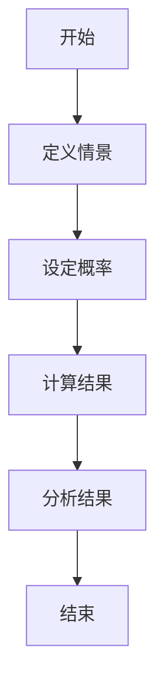

                 


# 企业估值中的情景分析技巧

**关键词**：企业估值、情景分析、蒙特卡洛模拟、决策树分析、数学模型、系统架构

**摘要**：本文深入探讨了情景分析在企业估值中的应用技巧，结合实际案例和系统设计，详细讲解了情景分析的原理、算法、数学模型及系统架构，帮助读者掌握企业估值中的情景分析方法。

---

## 第1章：企业估值与情景分析的基本概念

### 1.1 企业估值的基本概念
企业估值是通过对企业资产、负债、收益等多方面因素的评估，确定企业价值的过程。常见的估值方法包括DCF模型、市盈率法、市净率法等。这些方法通常依赖于对企业未来现金流的预测，但忽略了市场波动、政策变化等不确定性因素的影响。

### 1.2 情景分析的定义与特点
情景分析是一种通过构建不同假设场景来评估企业价值的方法。它不同于传统的单一预测方法，而是通过分析多种可能的市场情况，来评估企业在不同环境下的表现。

### 1.3 情景分析在企业估值中的重要性
情景分析能够帮助投资者更好地理解企业价值在不同环境下的波动性，识别潜在风险，并制定相应的应对策略。

---

## 第2章：情景分析的核心概念与联系

### 2.1 情景分析的原理
情景分析的核心在于通过构建多种假设情景，评估企业在不同环境下的表现。这些情景通常包括乐观、中性、悲观三种类型，每种情景下对企业收入、成本等关键指标进行调整，从而计算出对应的企业估值。

### 2.2 情景分析的类型与对比
- **乐观情景**：假设市场环境非常有利，企业收入增长迅速。
- **中性情景**：假设市场环境正常，企业收入稳定增长。
- **悲观情景**：假设市场环境恶劣，企业收入增长缓慢甚至下降。

### 2.3 情景分析的ER实体关系图


---

## 第3章：情景分析的算法原理与数学模型

### 3.1 情景分析的主要算法
- **蒙特卡洛模拟**：通过多次随机抽样，计算企业在不同情景下的估值分布。
- **决策树分析**：通过构建树状结构，分析企业在不同决策下的估值变化。

### 3.2 情景分析的数学模型
蒙特卡洛模拟的数学公式：
$$ E = \frac{1}{n}\sum_{i=1}^{n} X_i $$

### 3.3 情景分析的流程图


---

## 第4章：企业估值系统中的情景分析架构

### 4.1 系统分析与架构设计
- **系统功能设计**：包括数据输入、模型计算、结果输出等功能。
- **系统架构设计**：采用分层架构，包括数据层、业务逻辑层和用户界面层。
- **系统接口设计**：定义API接口，实现与其他系统的数据交互。

### 4.2 系统交互与流程图


---

## 第5章：项目实战：情景分析在企业估值中的应用

### 5.1 环境配置与工具安装
- 安装Python和相关库（如NumPy、Matplotlib）。

### 5.2 情景分析系统核心代码实现
```python
import numpy as np
import matplotlib.pyplot as plt

# 定义情景
situations = ['乐观', '中性', '悲观']
probabilities = [0.3, 0.5, 0.2]

# 模拟数据
revenues = [100, 80, 60]
costs = [50, 40, 30]

# 计算利润
profits = [revenue - cost for revenue, cost in zip(revenues, costs)]

# 绘制情景分析图
plt.bar(situations, profits)
plt.title('情景分析：企业利润')
plt.xlabel('情景')
plt.ylabel('利润')
plt.show()
```

### 5.3 系统运行与结果分析
运行上述代码后，将生成一个柱状图，显示企业在不同情景下的利润表现。这有助于投资者理解企业在不同环境下的盈利能力。

### 5.4 案例分析：科技型企业的估值
以一家科技企业为例，假设其在乐观、中性、悲观情景下的收入分别为200、150、100万元，成本分别为80、60、40万元。利润分别为120、90、60万元。通过情景分析，投资者可以评估企业的潜在风险和收益。

---

## 第6章：最佳实践、小结与注意事项

### 6.1 最佳实践
- 在进行情景分析时，应结合企业的实际情况，选择合适的情景类型。
- 定期更新情景分析模型，以反映市场变化。

### 6.2 小结
情景分析是一种重要的企业估值方法，能够帮助投资者更好地理解企业的潜在风险和收益。

### 6.3 注意事项
- 情景分析是一种假设性分析，结果仅供参考，不具有绝对性。
- 在实际应用中，应结合其他估值方法，全面评估企业价值。

### 6.4 拓展阅读
- 《企业估值实战：情景分析与风险管理》
- 《蒙特卡洛模拟在金融分析中的应用》

---

**作者：AI天才研究院/AI Genius Institute & 禅与计算机程序设计艺术 /Zen And The Art of Computer Programming**

