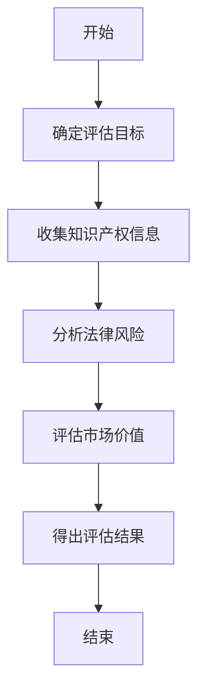
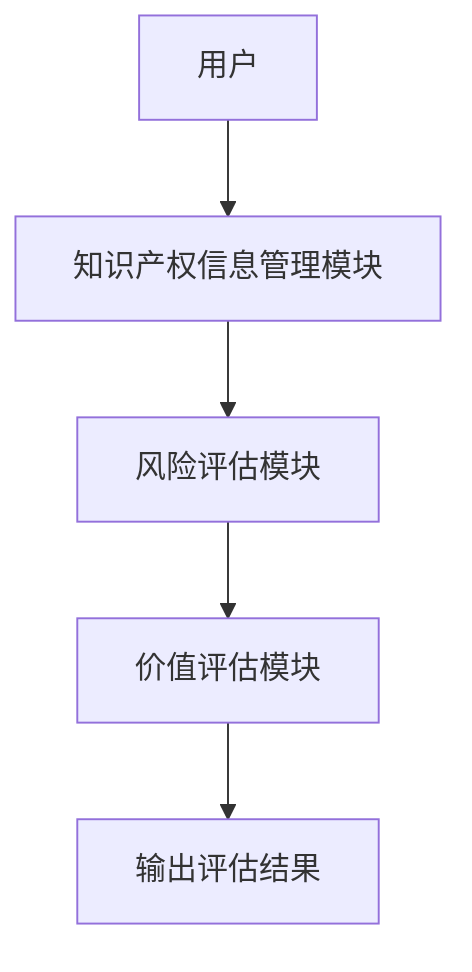

                 


# 企业估值中的知识产权保护评估

## 关键词：企业估值、知识产权保护、知识产权评估、知识产权管理、知识产权价值、知识产权法律保护

## 摘要：知识产权在企业估值中扮演着重要角色，特别是在技术创新和市场竞争日益激烈的今天。本文系统地探讨了知识产权保护评估的核心概念、算法原理、系统架构设计以及实际项目中的应用，提出了基于知识产权保护的系统化评估方法和最佳实践。

---

## 正文

### 第一部分：企业估值中的知识产权保护概述

#### 第1章：知识产权与企业估值基础

##### 1.1 知识产权的基本概念

###### 1.1.1 知识产权的定义与核心要素

知识产权是指依法保护的智力成果和标识的所有权，包括专利权、商标权、版权、商业秘密等。其核心要素包括创造性、实用性、可复制性以及法律保护的有效性。

###### 1.1.2 知识产权的分类与特点

- **专利权**：保护发明的独占权，具有时间性和地域性。
- **商标权**：保护品牌标识的独占使用权。
- **版权**：保护文学、艺术和科学作品的著作权。
- **商业秘密**：保护未公开的商业信息和技术诀窍。

知识产权的特点包括无形性、可转让性和可复制性。

###### 1.1.3 知识产权在企业中的作用

知识产权是企业的核心资产之一，能够提升企业的市场竞争力、品牌价值和创新能力。有效的知识产权管理能够为企业创造长期的经济价值。

##### 1.2 企业估值的基本概念

###### 1.2.1 企业估值的定义与方法

企业估值是通过对企业的财务状况、市场地位、技术创新能力等多方面因素的综合评估，确定企业的市场价值。常见的估值方法包括DCF模型、可比交易法和市场法等。

###### 1.2.2 知识产权在企业估值中的重要性

知识产权作为企业的无形资产，直接影响其市场价值。特别是在技术密集型行业，知识产权的价值占比甚至超过有形资产。

###### 1.2.3 知识产权保护与企业价值的关系

有效的知识产权保护能够降低企业的法律风险，提升其市场竞争力，从而增强企业的整体估值。

##### 1.3 本章小结

本章介绍了知识产权的基本概念、分类及其在企业中的作用，强调了知识产权保护对企业发展和估值的重要性。

---

### 第二部分：知识产权保护评估的核心概念与联系

#### 第2章：知识产权保护的核心概念

##### 2.1 知识产权保护的原理

###### 2.1.1 知识产权保护的法律依据

知识产权保护主要依据相关法律法规，如《专利法》、《商标法》和《版权法》等。这些法律为企业提供了保护其知识产权的法律框架。

###### 2.1.2 知识产权保护的实施步骤

1. 知识产权的申请与注册。
2. 知识产权的监控与维护。
3. 知识产权的侵权监测与应对。

##### 2.2 知识产权保护与企业价值的关系

###### 2.2.1 知识产权对企业发展的影响

知识产权是企业技术创新的核心驱动力，能够提升企业的市场竞争力和品牌影响力。

###### 2.2.2 知识产权对投资价值的影响

投资者在评估企业价值时，会重点关注其知识产权的保护状况和未来盈利能力。

##### 2.3 知识产权保护的边界与外延

###### 2.3.1 知识产权保护的范围

包括专利、商标、版权和商业秘密等。

###### 2.3.2 知识产权保护的局限性

知识产权保护具有地域性和时间性限制，且难以完全防止侵权行为的发生。

##### 2.4 本章小结

本章详细探讨了知识产权保护的原理及其与企业价值的关系，强调了知识产权保护的边界和局限性。

---

### 第三部分：知识产权保护评估的算法与数学模型

#### 第3章：知识产权保护评估的算法原理

##### 3.1 知识产权评估的定性分析

###### 3.1.1 知识产权的法律风险评估

通过分析专利的法律状态、侵权风险等因素，评估知识产权的法律风险。

###### 3.1.2 知识产权的市场价值评估

基于市场需求、竞争对手情况等因素，评估知识产权的市场价值。

##### 3.2 知识产权评估的定量分析

###### 3.2.1 知识产权的经济价值模型

经济价值模型通常包括以下步骤：
1. 确定知识产权的贡献度。
2. 评估知识产权的市场价值。
3. 计算知识产权的经济价值。

公式：
$$
\text{经济价值} = \text{市场价值} \times \text{贡献度}
$$

###### 3.2.2 知识产权的市场占有率分析

通过分析企业的市场占有率，评估知识产权对企业整体价值的影响。

##### 3.3 算法流程图



##### 3.4 本章小结

本章通过定性和定量分析，详细介绍了知识产权保护评估的算法原理和数学模型。

---

### 第四部分：知识产权保护评估的系统架构与设计

#### 第4章：知识产权保护评估系统架构

##### 4.1 系统功能设计

###### 4.1.1 知识产权信息管理模块

负责知识产权信息的录入、存储和管理。

###### 4.1.2 风险评估模块

基于知识产权的法律和市场风险，进行风险评估。

###### 4.1.3 价值评估模块

根据知识产权的经济价值模型，评估其市场价值。

##### 4.2 系统架构设计



##### 4.3 系统接口设计

系统接口主要涉及：
1. 用户与系统的交互接口。
2. 系统与外部数据库的接口。

##### 4.4 系统交互流程图


##### 4.5 本章小结

本章设计了一个完整的知识产权保护评估系统架构，详细描述了系统功能、架构设计和交互流程。

---

### 第五部分：知识产权保护评估的项目实战

#### 第5章：知识产权保护评估系统实战

##### 5.1 项目介绍

本项目旨在开发一个知识产权保护评估系统，帮助企业进行知识产权保护和评估。

##### 5.2 系统实现

###### 5.2.1 核心代码实现

```python
def assess Intellectual_Property(value):
    # 评估知识产权的价值
    return value * contribution_factor
```

##### 5.3 实际案例分析

以某高科技企业为例，分析其知识产权保护现状，并提出改进建议。

##### 5.4 项目小结

本章通过实际案例分析，展示了知识产权保护评估系统在企业中的应用。

---

### 第六部分：总结与展望

#### 第6章：总结与展望

##### 6.1 本章总结

本文系统地探讨了知识产权保护评估的核心概念、算法原理、系统架构设计以及实际项目中的应用，提出了基于知识产权保护的系统化评估方法和最佳实践。

##### 6.2 未来展望

未来，随着技术的发展，知识产权保护评估将更加智能化和自动化，为企业创造更大的价值。

---

### 作者：AI天才研究院/AI Genius Institute & 禅与计算机程序设计艺术 /Zen And The Art of Computer Programming

