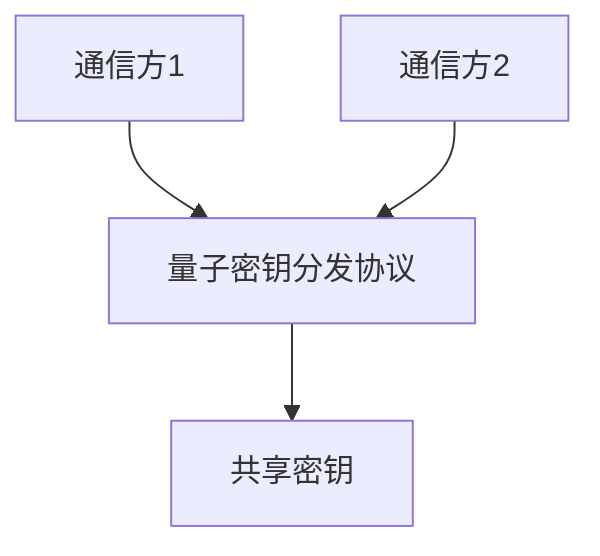

                 

# 企业估值中的量子加密通信卫星系统评估

## 关键词：量子加密通信、卫星系统、企业估值、密钥分发、安全性评估

## 摘要：  
随着企业估值对数据安全需求的日益增加，量子加密通信卫星系统作为一种高度安全的通信方式，正在成为企业保护敏感数据的重要手段。本文从量子加密通信的基本原理出发，结合卫星通信的技术特点，详细分析了量子加密通信卫星系统在企业估值中的应用价值。通过数学模型和算法原理的阐述，本文提出了基于量子密钥分发协议的安全性评估方法，并结合实际案例，探讨了量子加密通信卫星系统的实现方案和优化策略。最终，本文为企业在估值过程中如何选择和部署量子加密通信卫星系统提供了实践指导。

---

# 第1章 量子加密通信卫星系统概述

## 1.1 量子通信与卫星技术的结合  
### 1.1.1 量子通信的基本原理  
量子通信是一种基于量子力学原理的通信技术，其核心是利用量子态的特性（如量子叠加和量子纠缠）来实现信息的传输。与传统通信不同，量子通信具有天然的安全性，因为任何对量子态的测量都会破坏其状态，从而被通信双方检测到。  

### 1.1.2 卫星通信的现状与发展趋势  
卫星通信作为一种覆盖范围广、抗毁性强的通信方式，近年来在企业和政府机构中的应用日益广泛。传统卫星通信主要依赖于无线电频段，存在易被窃听和干扰的问题。而量子加密通信卫星系统通过结合量子通信技术，显著提升了通信的安全性。  

### 1.1.3 量子加密通信卫星的定义与特点  
量子加密通信卫星系统是一种结合了量子通信和卫星通信技术的系统，其特点包括：  
1. **高度安全性**：基于量子密钥分发（QKD）技术，确保通信密钥的安全性。  
2. **广域覆盖**：卫星通信的全球覆盖能力使得量子加密通信可以实现跨地域的安全通信。  
3. **抗干扰性**：量子通信的特性使其对电子干扰具有极强的抗性。  
4. **实时性**：量子加密通信可以在极短时间内完成密钥分发，确保通信的实时性。  

---

## 1.2 企业估值中的量子加密通信需求  
### 1.2.1 企业估值的基本概念与方法  
企业估值是通过对企业的财务状况、市场表现、资产质量等多方面因素的综合分析，确定其市场价值的过程。传统的企业估值方法包括财务指标分析、市场比较法和DCF模型等，但这些方法往往依赖于数据的准确性和完整性，对数据安全性的要求极高。  

### 1.2.2 量子加密通信在企业估值中的作用  
在企业估值过程中，涉及大量敏感数据的传输和处理，例如财务数据、市场数据和交易信息等。这些数据的泄露可能对企业造成重大损失，甚至威胁到企业的生存。量子加密通信通过提供不可破解的加密方式，确保了这些敏感数据在传输和存储过程中的安全性。  

### 1.2.3 卫星系统在企业估值中的应用场景  
量子加密通信卫星系统在企业估值中的应用场景包括：  
1. **跨地域数据传输**：企业在全球范围内的分支机构可以通过量子加密通信卫星系统实现数据的实时传输。  
2. **敏感数据加密**：企业的财务数据、并购计划等敏感信息可以通过量子加密通信进行加密，确保数据的安全性。  
3. **远程估值支持**：企业可以通过量子加密通信卫星系统实现远程估值数据的传输和分析，提高估值效率。  

---

## 1.3 量子加密通信卫星系统的核心要素  
### 1.3.1 量子密钥分发（QKD）技术  
量子密钥分发是量子加密通信的核心技术，其基本原理是通过量子态的传输和测量，实现通信双方共享同一密钥的过程。常见的QKD协议包括BB84协议和EPR协议。  

### 1.3.2 卫星通信链路的稳定性与安全性  
卫星通信链路的稳定性直接影响到量子加密通信的效果。为了确保通信链路的稳定性，需要采用先进的卫星轨道设计和通信技术，例如低轨卫星组网和激光通信等。  

### 1.3.3 系统的可扩展性与兼容性  
量子加密通信卫星系统的可扩展性是指其能够适应未来业务需求的能力。通过模块化设计和标准化接口，系统可以方便地扩展功能或升级硬件。  

---

## 1.4 本章小结  
本章从量子通信和卫星通信的基本原理出发，分析了量子加密通信卫星系统在企业估值中的重要性。通过介绍量子加密通信的核心技术、卫星通信链路的稳定性与安全性以及系统的可扩展性与兼容性，为后续章节的深入分析奠定了基础。

---

# 第2章 量子加密通信的核心概念与原理  

## 2.1 量子加密通信的基本原理  
### 2.1.1 量子态与信息编码  
量子态是量子通信的基本单位，可以用数学形式表示为：  
$$|\psi\rangle = \alpha|0\rangle + \beta|1\rangle$$  
其中，$\alpha$ 和 $\beta$ 是复数，且满足归一化条件 $|\alpha|^2 + |\beta|^2 = 1$。  

### 2.1.2 量子叠加与量子纠缠  
量子叠加是指量子态可以同时处于多个状态的叠加态，例如：  
$$|\psi\rangle = \frac{1}{\sqrt{2}}(|0\rangle + |1\rangle)$$  
量子纠缠则是指两个或多个量子态之间存在强关联，例如EPR对：  
$$|\phi\rangle = \frac{1}{\sqrt{2}}(|00\rangle + |11\rangle)$$  

### 2.1.3 量子密钥分发（QKD）协议  
量子密钥分发协议是量子加密通信的核心，其中最著名的协议是BB84协议。BB84协议的基本步骤如下：  
1. **密钥生成**：通信双方分别生成随机的量子态，并通过量子通信信道传输。  
2. **基底比较**：双方公布使用的基底，只有基底相同的量子态才能被用来生成密钥。  
3. **密钥提取**：通过基底比较后的剩余量子态，提取出共享的密钥。  

---

## 2.2 量子加密通信与经典加密方法的对比  
### 2.2.1 对称加密与非对称加密的原理  
对称加密使用相同的密钥进行加密和解密，例如AES算法。而非对称加密使用公钥和私钥，例如RSA算法。  

### 2.2.2 量子加密的不可破解性  
量子加密通信的核心优势在于其不可破解性。根据量子力学原理，任何对量子态的测量都会破坏其状态，从而被通信双方检测到。  

### 2.2.3 量子加密的数学模型与安全性分析  
量子密钥分发的安全性可以通过数学模型进行分析。假设通信双方分别为Alice和Bob，攻击者为Eve。在BB84协议中，Alice和Bob通过量子态传输共享一个密钥，而Eve无法在不被发现的情况下窃取密钥。  

---

## 2.3 量子加密通信系统的实体关系图  
以下是量子加密通信系统的实体关系图：  

---

## 2.4 本章小结  
本章详细介绍了量子加密通信的核心概念和基本原理，包括量子态、量子叠加、量子纠缠以及量子密钥分发协议。通过对量子加密通信与经典加密方法的对比分析，进一步凸显了量子加密通信的安全性优势。

---

接下来的章节将围绕量子加密通信卫星系统的算法原理、系统架构设计和项目实战展开，结合实际案例和技术细节，为企业估值中的量子加密通信卫星系统评估提供全面的技术支持和实践指导。

