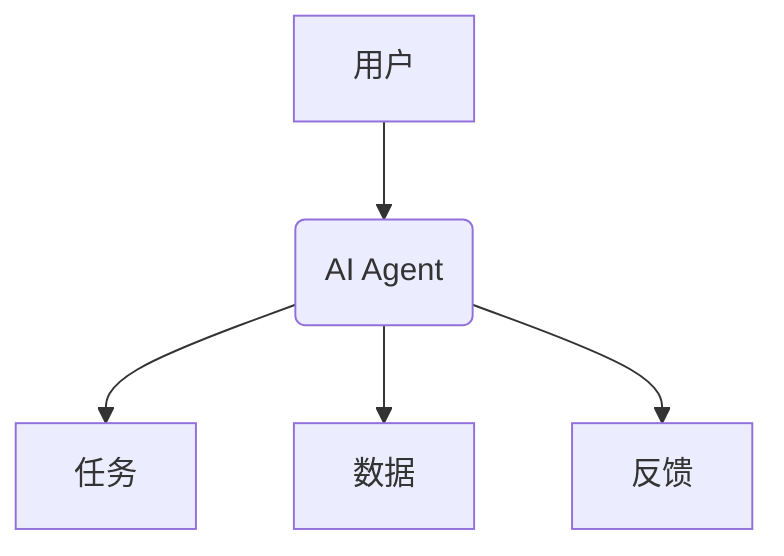
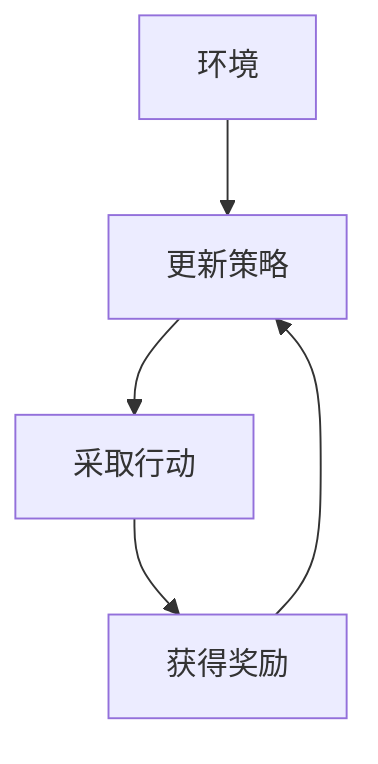
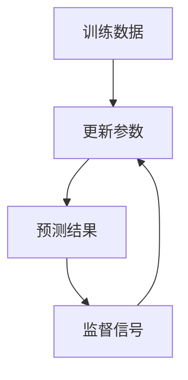
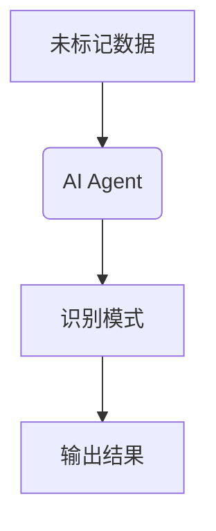
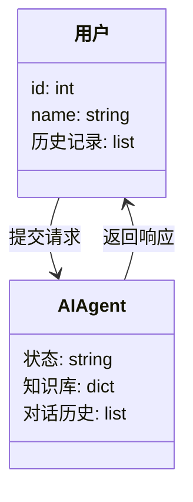
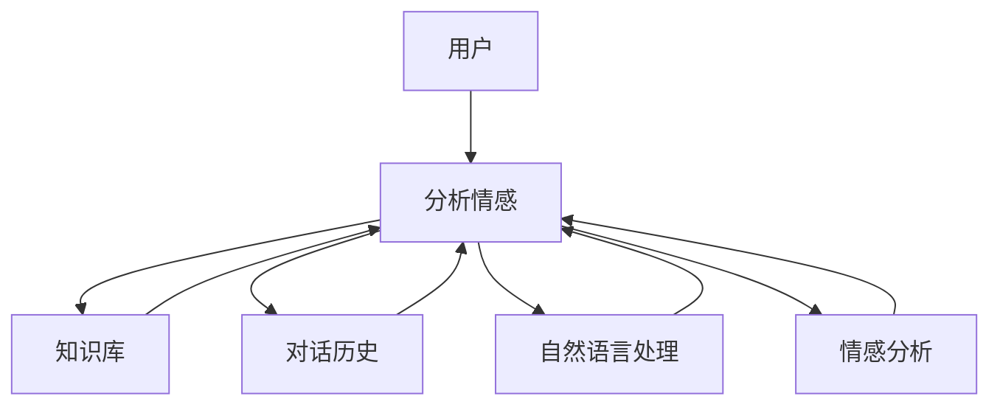
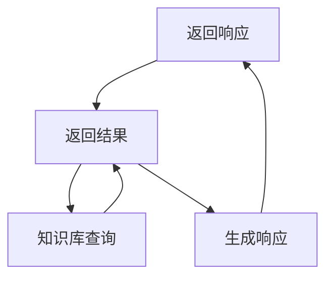

                 


# 企业如何识别AI Agent的应用需求

## 关键词：
- AI Agent
- 应用需求识别
- 系统化方法
- 项目实战
- 最佳实践

## 摘要：
本文旨在为企业提供识别AI Agent应用需求的系统化方法。从背景介绍到核心概念，再到算法原理、系统架构设计、项目实战及最佳实践，本文详细阐述了企业在识别AI Agent需求时的关键步骤和注意事项，帮助企业在实际应用中高效地识别和实现AI Agent的应用需求。

---

## 第一部分: 企业AI Agent应用需求识别背景与核心概念

### 第1章: 问题背景与描述

#### 1.1 问题背景
##### 1.1.1 AI Agent的定义与概念
AI Agent（人工智能代理）是指能够感知环境并采取行动以实现目标的智能实体。它能够自主决策，无需人工干预，通过传感器接收信息，并通过执行器与环境交互。

##### 1.1.2 企业应用AI Agent的必要性
在现代商业环境中，企业面临着日益复杂的业务挑战。AI Agent能够通过自动化决策、优化流程和提高效率，帮助企业提升竞争力。例如，在客户服务、供应链管理和风险管理等领域，AI Agent能够提供实时支持，显著提高企业的响应速度和决策能力。

##### 1.1.3 当前企业应用中的问题与挑战
尽管AI Agent的应用潜力巨大，但在实际应用中，企业常常面临以下挑战：
- **需求识别不准确**：企业难以明确哪些业务场景最适合应用AI Agent。
- **技术复杂性**：AI Agent的开发涉及多种技术，企业需要具备相关技术能力。
- **数据依赖性**：AI Agent的性能高度依赖数据质量和数量，数据获取和处理成为主要障碍。
- **安全与伦理问题**：AI Agent的使用可能引发数据隐私和伦理问题，企业需要制定相应的规范和策略。

#### 1.2 问题描述
##### 1.2.1 识别AI Agent需求的目标
识别AI Agent需求的目标在于明确哪些业务场景最适合应用AI Agent，并制定相应的解决方案，以实现业务目标。例如，识别客户流失预测场景，通过AI Agent实时分析客户行为，提前采取措施减少客户流失。

##### 1.2.2 识别过程中的关键问题
在识别AI Agent需求的过程中，企业需要解决以下关键问题：
- **需求分析**：确定哪些业务需求最适合应用AI Agent。
- **数据收集**：获取高质量的数据以支持AI Agent的开发。
- **技术选型**：选择适合业务场景的AI Agent技术框架。
- **实施策略**：制定AI Agent的实施计划和风险管理策略。

##### 1.2.3 识别需求的边界与外延
AI Agent的需求识别需要明确其边界和外延，确保需求的可行性和可实现性。边界包括：
- **数据范围**：明确数据的来源、类型和格式。
- **功能范围**：确定AI Agent的核心功能和辅助功能。
- **性能指标**：设定AI Agent的响应时间、准确率等性能指标。

外延包括：
- **扩展性**：考虑未来业务发展的扩展性需求。
- **兼容性**：确保AI Agent能够与现有系统无缝集成。
- **可维护性**：设计易于维护和升级的架构。

#### 1.3 问题解决思路
##### 1.3.1 系统化方法的提出
为了有效识别AI Agent的需求，企业可以采用系统化的方法，包括：
1. **需求分析**：通过业务流程分析和用户访谈，明确业务需求。
2. **技术评估**：评估现有技术和资源，选择适合的AI Agent技术框架。
3. **方案设计**：基于需求和技术评估，设计AI Agent的系统架构和功能模块。
4. **实施计划**：制定详细的实施计划，包括时间表、资源分配和风险管理策略。

##### 1.3.2 核心要素与组成结构
AI Agent的需求识别系统由以下核心要素组成：
- **业务目标**：明确AI Agent需要实现的业务目标。
- **数据源**：确定数据的来源和类型。
- **技术选型**：选择适合的AI算法和框架。
- **系统架构**：设计系统的整体架构和模块划分。
- **性能指标**：设定系统性能的评估标准。

##### 1.3.3 解决方案的框架与步骤
需求识别的框架与步骤如下：
1. **需求分析**：通过访谈、问卷调查等方式，收集业务部门的需求。
2. **数据收集与预处理**：收集相关数据，并进行清洗和特征提取。
3. **技术评估**：评估现有技术和资源，选择适合的AI Agent技术框架。
4. **方案设计**：基于需求和技术评估，设计AI Agent的系统架构和功能模块。
5. **实施计划**：制定详细的实施计划，包括时间表、资源分配和风险管理策略。

---

### 第2章: AI Agent的核心概念与联系

#### 2.1 核心概念原理
##### 2.1.1 AI Agent的基本原理
AI Agent的基本原理包括感知、决策和执行三个主要环节：
- **感知**：通过传感器或其他数据源获取环境信息。
- **决策**：基于感知到的信息，通过算法进行分析和决策。
- **执行**：根据决策结果，通过执行器采取行动。

##### 2.1.2 智能体与机器学习模型的对比
智能体（Agent）与机器学习模型之间存在明显的区别：
- **智能体**：具备感知和决策能力，能够与环境交互。
- **机器学习模型**：主要用于数据的特征提取和模式识别，不具备自主决策能力。

##### 2.1.3 多智能体系统的特点
多智能体系统由多个相互协作的智能体组成，具有以下特点：
- **分布式智能**：每个智能体独立决策，通过通信和协作实现整体目标。
- **自主性**：智能体能够自主感知环境并采取行动。
- **反应性**：智能体能够实时响应环境的变化。

#### 2.2 概念属性特征对比表
##### 表2.1: AI Agent与传统程序的对比
| 特性         | AI Agent                | 传统程序               |
|--------------|-------------------------|------------------------|
| 感知能力     | 高                     | 无                     |
| 决策能力     | 高                     | 无                     |
| 自主性       | 高                     | 低                     |
| 适应性       | 高                     | 低                     |

##### 表2.2: 不同类型AI Agent的特征对比
| 类型         | 单智能体               | 多智能体               |
|--------------|-----------------------|-----------------------|
| 结构         | 简单                   | 复杂                   |
| 协作性       | 低                     | 高                     |
| 响应速度     | 快                     | 较慢                   |

#### 2.3 ER实体关系图


---

### 第3章: AI Agent的算法原理

#### 3.1 算法原理概述
AI Agent的算法原理主要涉及强化学习、监督学习和无监督学习等技术。以下是几种常用算法的简要介绍：

##### 3.1.1 强化学习
强化学习是一种通过试错机制来优化决策策略的算法。智能体通过与环境交互，学习最优策略以最大化累积奖励。

**mermaid流程图：强化学习流程**


**Python代码示例：强化学习算法**
```python
import numpy as np

# 初始化环境和智能体
env = Env()
agent = Agent(env.state_space, env.action_space)

# 强化学习循环
for episode in range(max_episodes):
    state = env.reset()
    while not done:
        action = agent.act(state)
        next_state, reward, done = env.step(action)
        agent.learn(state, action, reward, next_state)
        state = next_state
```

**数学模型：Q-learning算法公式**
$$ Q(s, a) = Q(s, a) + \alpha \left( r + \gamma \max_{a'} Q(s', a') - Q(s, a) \right) $$

##### 3.1.2 监督学习
监督学习是一种通过标记数据训练模型的算法。智能体通过监督信号调整参数，以最小化预测误差。

**mermaid流程图：监督学习流程**


**Python代码示例：监督学习算法**
```python
# 数据预处理
from sklearn.model_selection import train_test_split
from sklearn.linear_model import LinearRegression

X_train, X_test, y_train, y_test = train_test_split(X, y, test_size=0.2)
model = LinearRegression()
model.fit(X_train, y_train)
y_pred = model.predict(X_test)
```

**数学模型：线性回归公式**
$$ y = \beta_0 + \beta_1 x + \epsilon $$

##### 3.1.3 无监督学习
无监督学习是一种通过发现数据中的结构来学习模型的算法。智能体通过聚类或降维等技术，识别数据中的潜在模式。

**mermaid流程图：无监督学习流程**


**Python代码示例：K-means聚类算法**
```python
from sklearn.cluster import KMeans

# 初始化模型
kmeans = KMeans(n_clusters=3)
# 训练模型
kmeans.fit(X)
# 预测聚类结果
y_pred = kmeans.predict(X)
```

---

### 第4章: 系统分析与架构设计

#### 4.1 问题场景介绍
##### 4.1.1 项目介绍
本项目旨在开发一个基于AI Agent的智能客服系统，通过自然语言处理和对话管理技术，实现自动化的客户支持服务。

##### 4.1.2 项目目标
通过AI Agent技术，实现以下目标：
- **智能对话**：能够理解客户的问题并提供准确的回答。
- **问题解决**：能够识别客户的问题并提供解决方案。
- **情感分析**：能够识别客户的情感状态并调整响应策略。

#### 4.2 系统功能设计
##### 4.2.1 领域模型


##### 4.2.2 系统架构设计


##### 4.2.3 接口设计
- **输入接口**：用户输入的文本请求。
- **输出接口**：AI Agent的响应文本。
- **知识库接口**：AI Agent与知识库的交互接口。
- **情感分析接口**：AI Agent与情感分析模块的交互接口。

#### 4.3 系统交互设计
##### 4.3.1 交互流程图


##### 4.3.2 交互逻辑
1. 用户提交请求。
2. AI Agent解析请求并进行自然语言处理。
3. AI Agent查询知识库获取相关信息。
4. AI Agent生成响应并返回给用户。
5. 用户接收响应并可能提供反馈。
6. AI Agent根据反馈调整响应策略。

---

### 第5章: 项目实战

#### 5.1 环境安装与配置
##### 5.1.1 安装Python
```bash
# 安装Python
sudo apt-get install python3 python3-pip
```

##### 5.1.2 安装依赖库
```bash
pip install numpy pandas scikit-learn transformers
```

#### 5.2 核心代码实现
##### 5.2.1 自然语言处理模块
```python
from transformers import AutoTokenizer, AutoModelForMaskedLM

tokenizer = AutoTokenizer.from_pretrained('bert-base-uncased')
model = AutoModelForMaskedLM.from_pretrained('bert-base-uncased')
```

##### 5.2.2 对话管理模块
```python
class DialogManager:
    def __init__(self):
        self.history = []
    
    def add_to_history(self, utterance):
        self.history.append(utterance)
    
    def get_context(self):
        return ' '.join(self.history)
```

##### 5.2.3 情感分析模块
```python
from sklearn.feature_extraction.text import TfidfVectorizer
from sklearn.svm import SVC

vectorizer = TfidfVectorizer()
clf = SVC()
```

#### 5.3 代码解读与分析
##### 5.3.1 自然语言处理模块
- 使用预训练的BERT模型进行文本理解和生成。
- 通过分词和编码，将输入文本转换为模型可处理的格式。

##### 5.3.2 对话管理模块
- 维护对话历史，记录用户和AI Agent之间的交互。
- 根据历史记录生成上下文，用于生成响应。

##### 5.3.3 情感分析模块
- 使用TF-IDF和SVM进行文本特征提取和分类。
- 识别用户情感状态，调整响应策略。

#### 5.4 案例分析与详细讲解
##### 5.4.1 案例分析
假设用户输入：“我的订单还没有送达。”
- AI Agent解析请求，识别用户的需求。
- 查询知识库，获取订单信息。
- 生成响应：“根据订单信息，预计将在明天送达。”

##### 5.4.2 详细讲解
- **自然语言处理**：解析用户请求，提取关键信息。
- **知识库查询**：根据提取的信息，查询相关知识。
- **情感分析**：识别用户情感，调整响应语气。

#### 5.5 项目小结
通过本项目，我们成功开发了一个基于AI Agent的智能客服系统。系统能够理解用户请求，查询相关信息，并生成准确的响应。同时，情感分析模块能够识别用户情感，提供更加个性化的服务。

---

### 第6章: 最佳实践与经验分享

#### 6.1 最佳实践
##### 6.1.1 技术选型建议
- 根据业务需求选择适合的AI Agent技术框架。
- 确保数据质量和多样性，提高模型性能。
- 采用模块化设计，便于系统的扩展和维护。

##### 6.1.2 需求分析建议
- 与业务部门紧密合作，明确需求。
- 通过原型设计和用户测试，验证需求的可行性。

##### 6.1.3 测试与部署建议
- 制定详细的测试计划，确保系统功能和性能符合要求。
- 采用持续集成和持续交付（CI/CD）策略，确保系统的稳定性和可靠性。

#### 6.2 经验分享
##### 6.2.1 项目实施中的注意事项
- **数据隐私**：确保数据的隐私和安全，遵守相关法律法规。
- **模型解释性**：提高模型的可解释性，便于调试和优化。
- **系统容错性**：设计容错机制，确保系统在异常情况下仍能正常运行。

##### 6.2.2 常见问题与解决方案
- **数据不足**：通过数据增强和迁移学习技术，提高模型的泛化能力。
- **模型过拟合**：采用正则化技术和交叉验证，防止模型过拟合。
- **性能瓶颈**：优化算法和系统架构，提高系统的处理能力。

#### 6.3 小结
通过本文的系统化方法和最佳实践，企业可以更高效地识别和实现AI Agent的应用需求。同时，企业需要关注数据隐私、模型解释性和系统容错性等问题，确保AI Agent系统的稳定性和安全性。

---

## 作者
作者：AI天才研究院/AI Genius Institute  
联系：[禅与计算机程序设计艺术](https://github.com/Zen-of-Code)

