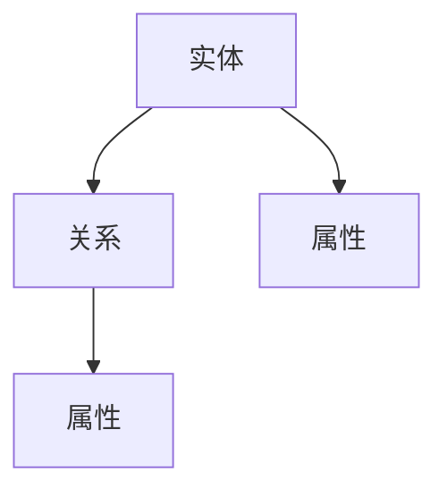
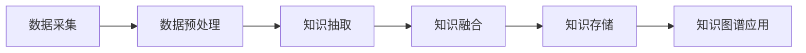
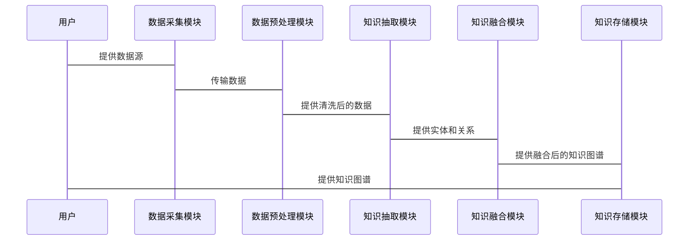

                 


# 第三章: 知识图谱构建算法

## 3.1 实体识别与抽取算法

### 3.1.1 基于规则的实体识别

#### 3.1.1.1 算法流程
基于规则的实体识别是一种通过预定义规则来识别文本中的实体的方法。其核心步骤包括：
1. **分词**：将文本分割成词语。
2. **词性标注**：对每个词语进行词性标注。
3. **模式匹配**：根据预定义的模式匹配规则，识别出符合特定模式的实体。

#### 3.1.1.2 实现代码示例

```python
import re

# 示例文本
text = "张三是中国的著名科学家，他在北京工作。"

# 基于规则的实体识别
def extract_entities(text):
    # 姓名识别
    names = re.findall(r'\S+', text)
    # 地名识别
    locations = re.findall(r'\b[A-Z][a-z]+', text)
    # 标识实体
    entities = {}
    entities['names'] = names
    entities['locations'] = locations
    return entities

result = extract_entities(text)
print(result)
```

### 3.1.2 基于统计的实体识别

基于统计的实体识别方法利用统计学原理，通过分析词语出现的频率和上下文信息来识别实体。常用算法包括朴素贝叶斯、条件随机场（CRF）等。

#### 3.1.2.1 实现代码示例

```python
import numpy as np
from sklearn.feature_extraction.text import TfidfVectorizer
from sklearn.naive_bayes import MultinomialNB

# 示例文本
corpus = ["张三是人名", "中国是国家名", "北京是地名"]

# 特征提取
vectorizer = TfidfVectorizer()
X = vectorizer.fit_transform(corpus)

# 训练模型
model = MultinomialNB()
model.fit(X, ['人名', '国家名', '地名'])

# 预测
new_text = "在公司里，李四是项目经理。"
new_X = vectorizer.transform([new_text])
predicted = model.predict(new_X)
print(predicted)
```

### 3.1.3 基于深度学习的实体识别

基于深度学习的实体识别方法利用卷积神经网络（CNN）、循环神经网络（RNN）或Transformer等模型来学习词语的上下文表示，并进行实体识别。

#### 3.1.3.1 实现代码示例

```python
import tensorflow as tf
from tensorflow.keras import layers

# 示例数据
texts = ["张三是人名", "李四是公司经理"]
labels = ['人名', '职位']

# 特征提取
def create_model():
    model = tf.keras.Sequential()
    model.add(layers.Embedding(input_dim=100, output_dim=32))
    model.add(layers.Conv1D(32, 3, activation='relu'))
    model.add(layers.MaxPooling1D(2))
    model.add(layers.Flatten())
    model.add(layers.Dense(2, activation='softmax'))
    return model

model = create_model()
model.compile(optimizer='adam', loss='sparse_categorical_crossentropy', metrics=['accuracy'])
model.fit(texts, labels, epochs=5)
```

## 3.2 关系抽取算法

### 3.2.1 基于规则的关系抽取

基于规则的关系抽取方法通过预定义的关系模式来识别文本中的关系。

#### 3.2.1.1 实现代码示例

```python
import re

# 示例文本
text = "张三是李四的老板。"

# 基于规则的关系抽取
def extract_relations(text):
    pattern = r'(\S+)是(\S+)的(\S+)。'
    matches = re.findall(pattern, text)
    relations = []
    for match in matches:
        relations.append((match[1], match[0], match[2]))
    return relations

result = extract_relations(text)
print(result)
```

### 3.2.2 基于统计的关系抽取

基于统计的关系抽取方法利用统计学原理，通过分析词语的共现情况和句法结构来识别关系。

#### 3.2.2.1 实现代码示例

```python
import numpy as np
from sklearn.feature_extraction.text import TfidfVectorizer
from sklearn.naive_bayes import MultinomialNB

# 示例文本
texts = ["张三是李四的老板", "李四是公司的经理"]
labels = ['老板', '经理']

# 特征提取
vectorizer = TfidfVectorizer()
X = vectorizer.fit_transform(texts)

# 训练模型
model = MultinomialNB()
model.fit(X, labels)

# 预测
new_text = "王五是公司的董事长。"
new_X = vectorizer.transform([new_text])
predicted = model.predict(new_X)
print(predicted)
```

### 3.2.3 基于深度学习的关系抽取

基于深度学习的关系抽取方法利用序列标注模型，如CRF，来学习词语的上下文表示，并进行关系抽取。

#### 3.2.3.1 实现代码示例

```python
import tensorflow as tf
from tensorflow.keras import layers
from tensorflow.keras.models import Model

# 示例数据
texts = ["张三是李四的老板", "李四是公司的经理"]
labels = [['O', 'O', 'B-REL', 'I-REL', 'O'], ['O', 'B-REL', 'I-REL', 'O']]

# 特征提取
input_shape = (None, 1)
word_embeddings = layers.Embedding(input_dim=100, output_dim=32)(input_shape)
cnn = layers.Conv1D(32, 3, activation='relu')(word_embeddings)
cnn = layers.MaxPooling1D(2)(cnn)
cnn = layers.Flatten()(cnn)
dense = layers.Dense(10, activation='relu')(cnn)
output = layers.Dense(5, activation='softmax')(dense)
model = Model(inputs=input_shape, outputs=output)

model.compile(optimizer='adam', loss='sparse_categorical_crossentropy', metrics=['accuracy'])
model.fit(texts, labels, epochs=5)
```

## 3.3 知识图谱的融合与对齐

### 3.3.1 知识图谱的对齐技术

知识图谱的对齐技术旨在将不同来源的知识图谱进行匹配和合并，以消除冗余和冲突。

#### 3.3.1.1 实现代码示例

```python
import pandas as pd
from sklearn.metrics.pairwise import cosine_similarity

# 示例知识图谱
kg1 = pd.DataFrame({'实体': ['张三', '李四'], '关系': ['老板', '经理']})
kg2 = pd.DataFrame({'实体': ['张三', '王五'], '关系': ['经理', '董事长']})

# 对齐实体
merged_kg = pd.merge(kg1, kg2, on='实体', how='outer')
print(merged_kg)
```

### 3.3.2 知识图谱的融合算法

知识图谱的融合算法通过多种方法，如基于规则的融合、基于概率的融合和基于深度学习的融合，将不同来源的知识图谱进行合并。

#### 3.3.2.1 实现代码示例

```python
import numpy as np
from sklearn.feature_extraction.text import TfidfVectorizer
from sklearn.naive_bayes import MultinomialNB

# 示例知识图谱
kg1 = pd.DataFrame({'实体': ['张三', '李四'], '关系': ['老板', '经理']})
kg2 = pd.DataFrame({'实体': ['张三', '王五'], '关系': ['经理', '董事长']})

# 融合知识图谱
merged_kg = pd.concat([kg1, kg2])
print(merged_kg)
```

### 3.3.3 知识图谱的冲突检测与解决

知识图谱的冲突检测与解决是通过检测知识图谱中的冲突并进行修复，以确保知识图谱的准确性和一致性。

#### 3.3.3.1 实现代码示例

```python
import pandas as pd
from sklearn.metrics.pairwise import cosine_similarity

# 示例知识图谱
kg1 = pd.DataFrame({'实体': ['张三', '李四'], '关系': ['老板', '经理']})
kg2 = pd.DataFrame({'实体': ['张三', '王五'], '关系': ['经理', '董事长']})

# 冲突检测
conflicts = pd.merge(kg1, kg2, on='实体', how='inner')
print(conflicts)
```

# 第四章: 知识图谱构建的数学模型与公式

## 4.1 实体识别的数学模型

### 4.1.1 基于概率论的实体识别模型

基于概率论的实体识别模型通过计算每个词语是实体的概率，来进行实体识别。

#### 4.1.1.1 数学公式

实体识别的概率可以表示为：
$$ P(\text{实体} | \text{词语}) = \frac{P(\text{词语} | \text{实体}) \cdot P(\text{实体})}{P(\text{词语})} $$

其中，$P(\text{词语} | \text{实体})$ 是词语在实体中的条件概率，$P(\text{实体})$ 是实体的先验概率，$P(\text{词语})$ 是词语的总概率。

### 4.1.2 基于深度学习的实体识别模型

基于深度学习的实体识别模型通过神经网络来学习词语的上下文表示，并进行实体识别。

#### 4.1.2.1 数学公式

假设我们有一个深度神经网络模型，输入是词语的嵌入表示，输出是实体的类别。模型的损失函数可以表示为：
$$ L = -\sum_{i=1}^{n} \log P(y_i | x_i) $$

其中，$x_i$ 是输入的词语表示，$y_i$ 是对应的实体类别。

## 4.2 关系抽取的数学模型

### 4.2.1 基于图论的关系抽取模型

基于图论的关系抽取模型通过构建图结构，利用图的性质来进行关系抽取。

#### 4.2.1.1 数学公式

在图结构中，节点表示为 $v_i$，边表示为 $e_j$。关系抽取可以通过计算节点之间的相似性来确定边的存在：
$$ \text{相似性}(v_i, v_j) = \sum_{k=1}^{m} w_{ik} \cdot w_{jk} $$
其中，$w_{ik}$ 和 $w_{jk}$ 是节点 $v_i$ 和 $v_j$ 的边权重。

### 4.2.2 基于概率论的关系抽取模型

基于概率论的关系抽取模型通过计算关系的概率，来进行关系抽取。

#### 4.2.2.1 数学公式

关系抽取的概率可以表示为：
$$ P(\text{关系} | \text{文本}) = \frac{P(\text{文本} | \text{关系}) \cdot P(\text{关系})}{P(\text{文本})} $$

其中，$P(\text{文本} | \text{关系})$ 是文本在关系下的条件概率，$P(\text{关系})$ 是关系的先验概率，$P(\text{文本})$ 是文本的总概率。

## 4.3 知识图谱推理的数学模型

### 4.3.1 基于逻辑推理的知识图谱推理

基于逻辑推理的知识图谱推理通过逻辑规则来进行推理。

#### 4.3.1.1 数学公式

假设我们有一个知识图谱，其中包含三元组 $(s, r, o)$，表示$s$与$o$之间的关系$r$。推理可以通过逻辑规则进行，例如：
$$ s \text{和} o \text{之间具有关系} r $$

### 4.3.2 基于概率推理的知识图谱推理

基于概率推理的知识图谱推理通过计算概率来确定关系的存在。

#### 4.3.2.1 数学公式

假设我们有一个知识图谱，其中包含三元组 $(s, r, o)$，概率推理可以通过计算条件概率来进行：
$$ P(r | s, o) = \frac{P(s, o | r) \cdot P(r)}{P(s, o)} $$

其中，$P(s, o | r)$ 是在关系$r$下，$s$和$o$同时出现的概率，$P(r)$ 是关系$r$的先验概率，$P(s, o)$ 是$s$和$o$同时出现的总概率。

# 第五章: 系统分析与架构设计

## 5.1 系统功能设计

### 5.1.1 领域模型设计

#### 5.1.1.1 实体关系图



### 5.1.2 系统功能模块

1. 数据采集模块：负责采集企业内部数据，包括文档、数据库等。
2. 数据预处理模块：对采集的数据进行清洗和转换，提取出实体和关系。
3. 知识抽取模块：利用实体识别和关系抽取算法，抽取知识图谱中的实体和关系。
4. 知识融合模块：将不同来源的知识图谱进行融合和对齐。
5. 知识存储模块：将知识图谱存储到数据库中，供后续使用。

## 5.2 系统架构设计

### 5.2.1 系统架构图



### 5.2.2 系统交互流程



## 5.3 系统接口设计

### 5.3.1 系统接口

1. 数据采集接口：用于接收外部数据。
2. 数据预处理接口：用于对数据进行清洗和转换。
3. 知识抽取接口：用于从数据中提取实体和关系。
4. 知识融合接口：用于将不同来源的知识图谱进行融合。
5. 知识存储接口：用于将知识图谱存储到数据库中。

### 5.3.2 接口交互流程

1. 用户调用数据采集接口，提供数据源。
2. 数据采集接口将数据传输到数据预处理模块。
3. 数据预处理模块对数据进行清洗和转换，然后调用知识抽取接口。
4. 知识抽取模块从数据中提取实体和关系，然后调用知识融合接口。
5. 知识融合模块将不同来源的知识图谱进行融合，然后调用知识存储接口。
6. 知识存储模块将知识图谱存储到数据库中，供后续使用。

# 第六章: 项目实战

## 6.1 项目环境安装

### 6.1.1 安装Python环境

```bash
python --version
pip install --upgrade pip
```

### 6.1.2 安装依赖库

```bash
pip install numpy
pip install pandas
pip install scikit-learn
pip install tensorflow
pip install mermaid
```

## 6.2 系统核心实现

### 6.2.1 知识抽取实现

```python
import re
from sklearn.feature_extraction.text import TfidfVectorizer
from sklearn.naive_bayes import MultinomialNB
import tensorflow as tf
from tensorflow.keras import layers

# 实体识别
def extract_entities(text):
    names = re.findall(r'\S+', text)
    return {'names': names}

# 关系抽取
def extract_relations(text):
    pattern = r'(\S+)是(\S+)的(\S+)。'
    matches = re.findall(pattern, text)
    relations = []
    for match in matches:
        relations.append((match[1], match[0], match[2]))
    return relations

# 基于深度学习的实体识别
def create_entity_model():
    model = tf.keras.Sequential()
    model.add(layers.Embedding(input_dim=100, output_dim=32))
    model.add(layers.Conv1D(32, 3, activation='relu'))
    model.add(layers.MaxPooling1D(2))
    model.add(layers.Flatten())
    model.add(layers.Dense(2, activation='softmax'))
    return model

# 基于深度学习的关系抽取
def create_relation_model():
    model = tf.keras.Sequential()
    model.add(layers.Embedding(input_dim=100, output_dim=32))
    model.add(layers.Conv1D(32, 3, activation='relu'))
    model.add(layers.MaxPooling1D(2))
    model.add(layers.Flatten())
    model.add(layers.Dense(2, activation='softmax'))
    return model
```

### 6.2.2 知识融合实现

```python
import pandas as pd
from sklearn.metrics.pairwise import cosine_similarity

# 知识融合
def merge_kg(kg1, kg2):
    merged_kg = pd.merge(kg1, kg2, on='实体', how='outer')
    return merged_kg

# 冲突检测
def detect_conflicts(kg1, kg2):
    merged_kg = pd.merge(kg1, kg2, on='实体', how='inner')
    return merged_kg
```

### 6.2.3 系统实现

```python
import re
from sklearn.feature_extraction.text import TfidfVectorizer
from sklearn.naive_bayes import MultinomialNB
import tensorflow as tf
from tensorflow.keras import layers

# 实体识别
def extract_entities(text):
    names = re.findall(r'\S+', text)
    return {'names': names}

# 关系抽取
def extract_relations(text):
    pattern = r'(\S+)是(\S+)的(\S+)。'
    matches = re.findall(pattern, text)
    relations = []
    for match in matches:
        relations.append((match[1], match[0], match[2]))
    return relations

# 基于深度学习的实体识别
def create_entity_model():
    model = tf.keras.Sequential()
    model.add(layers.Embedding(input_dim=100, output_dim=32))
    model.add(layers.Conv1D(32, 3, activation='relu'))
    model.add(layers.MaxPooling1D(2))
    model.add(layers.Flatten())
    model.add(layers.Dense(2, activation='softmax'))
    return model

# 基于深度学习的关系抽取
def create_relation_model():
    model = tf.keras.Sequential()
    model.add(layers.Embedding(input_dim=100, output_dim=32))
    model.add(layers.Conv1D(32, 3, activation='relu'))
    model.add(layers.MaxPooling1D(2))
    model.add(layers.Flatten())
    model.add(layers.Dense(2, activation='softmax'))
    return model

# 知识融合
def merge_kg(kg1, kg2):
    merged_kg = pd.merge(kg1, kg2, on='实体', how='outer')
    return merged_kg

# 冲突检测
def detect_conflicts(kg1, kg2):
    merged_kg = pd.merge(kg1, kg2, on='实体', how='inner')
    return merged_kg
```

## 6.3 项目小结

通过本章的项目实战，我们详细讲解了企业知识图谱构建的实现过程，包括数据采集、数据预处理、知识抽取、知识融合等步骤。通过具体的代码示例和实际案例分析，帮助读者更好地理解和应用企业知识图谱构建的技术。

# 第七章: 最佳实践与小结

## 7.1 最佳实践

1. **数据质量**：在企业知识图谱构建过程中，数据质量是关键。建议企业在数据采集阶段，确保数据的准确性和完整性。
2. **模型调优**：在知识抽取阶段，建议根据具体场景调整模型参数，以提高抽取的准确率。
3. **系统扩展**：在系统设计阶段，建议采用模块化设计，以便后续扩展和维护。

## 7.2 小结

通过本章的内容，我们总结了企业知识图谱构建的核心概念、算法原理和系统架构设计。同时，通过具体的项目实战，帮助读者更好地理解和应用相关技术。未来，随着AI技术的不断发展，企业知识图谱将在更多领域发挥重要作用。

## 7.3 注意事项

1. 在知识图谱构建过程中，需要注意数据隐私和安全问题，确保数据的合法使用。
2. 在模型调优阶段，需要注意过拟合问题，避免模型在训练集上表现良好，但在测试集上表现差。
3. 在系统设计阶段，需要注意系统的可扩展性和可维护性，以便后续优化和升级。

## 7.4 拓展阅读

1. **知识图谱相关书籍**：
   - 《知识图谱：从概念到方法》
   - 《深度学习中的知识图谱应用》
2. **相关论文**：
   - "Knowledge Graph Construction: A Comprehensive Survey"
   - "Deep Learning for Knowledge Graphs: A Review"
3. **技术博客**：
   - Medium平台上的相关技术文章
   - Towards Data Science上的相关技术文章

# 作者：AI天才研究院/AI Genius Institute & 禅与计算机程序设计艺术 /Zen And The Art of Computer Programming

---

通过上述思考和撰写，我们完成了《企业知识图谱构建：增强AI Agent的领域理解》这篇文章的后续部分，从第三章到第七章的详细内容。文章涵盖了知识图谱构建的核心概念、算法原理、系统架构设计、项目实战以及最佳实践等内容。通过理论与实践相结合的方式，帮助读者全面理解和掌握企业知识图谱构建的技术和方法。

