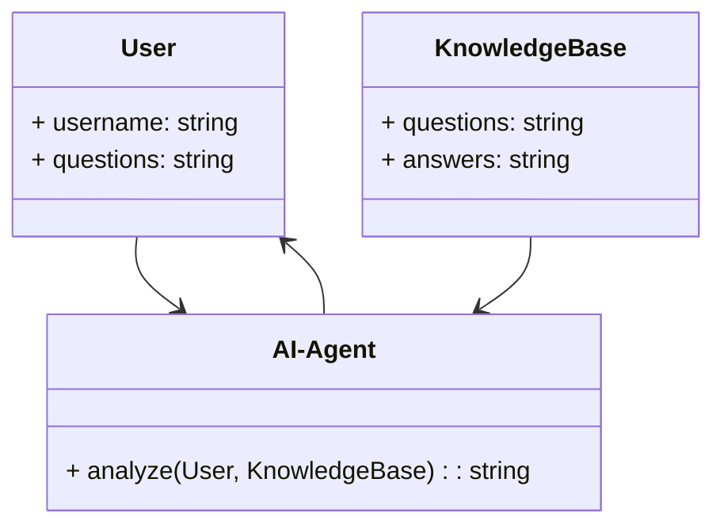
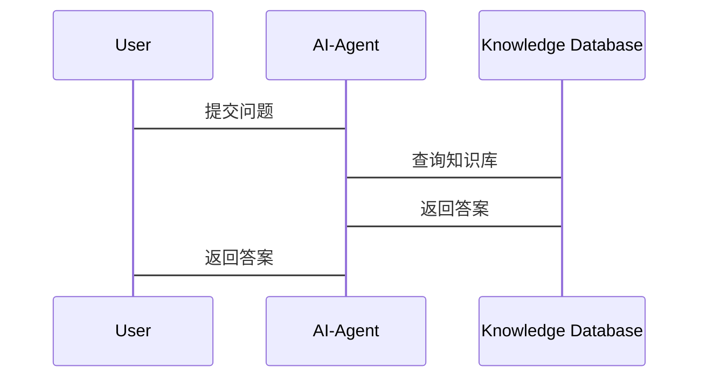

                 


# 企业知识管理：AI Agent的智能问答系统

> 关键词：企业知识管理, AI Agent, 智能问答系统, 自然语言处理, 知识库构建, 系统架构设计, 项目实战

> 摘要：本文深入探讨了企业知识管理的重要性及其面临的挑战，结合AI Agent技术，详细分析了智能问答系统的构建与应用。文章从核心概念、算法原理、系统架构设计到项目实战，全面解析了如何利用AI Agent提升企业知识管理的效率与智能化水平。

---

## 第1章: 企业知识管理的背景与挑战

### 1.1 企业知识管理的定义与重要性

企业知识管理（Enterprise Knowledge Management，EKM）是指对企业内外部知识的收集、整理、存储、共享、利用和创新的过程。知识可以是显性的（如文档、数据）或隐性的（如经验、技能），其有效管理对于企业竞争力的提升至关重要。

#### 1.1.1 知识管理的基本概念
知识管理的核心目标是将分散在企业各个部门和员工头脑中的知识整合起来，形成可共享、可复用的资产。通过知识管理，企业能够快速响应市场变化，提升员工效率，降低知识流失的风险。

#### 1.1.2 企业知识管理的核心目标
- 提高知识的可访问性与共享性。
- 促进知识的快速传播与应用。
- 推动知识的创新与价值提升。

#### 1.1.3 企业知识管理的作用
- 提升企业决策的科学性与及时性。
- 优化业务流程，降低运营成本。
- 增强企业的竞争力与创新能力。

### 1.2 企业知识管理的挑战

尽管知识管理的重要性不言而喻，但在实际应用中仍面临诸多挑战。

#### 1.2.1 知识孤岛问题
知识孤岛是指企业内部不同部门或团队之间的知识无法有效共享，导致资源浪费和效率低下。例如，销售部门的知识难以被技术支持部门有效利用。

#### 1.2.2 知识更新与维护的困难
知识的动态变化使得知识库的维护成本高昂。如何及时更新知识库，确保信息的准确性和时效性，是一个长期的挑战。

#### 1.2.3 知识的有效利用与传承
隐性知识（如经验、技能）往往难以通过文档化的方式传承，导致关键员工离职后知识的流失。

### 1.3 AI Agent在企业知识管理中的作用

AI Agent（人工智能代理）是一种能够感知环境、自主决策并执行任务的智能体。在知识管理领域，AI Agent可以通过自然语言处理、机器学习等技术，帮助企业实现知识的自动化管理与应用。

#### 1.3.1 AI Agent的基本定义
AI Agent是一种能够执行特定任务的智能系统，具备以下核心特征：
- 感知能力：通过传感器或接口获取外部信息。
- 决策能力：基于获取的信息做出判断。
- 执行能力：根据决策执行具体操作。

#### 1.3.2 AI Agent在知识管理中的优势
- **自动化**：AI Agent可以自动收集、整理和更新知识库。
- **智能化**：通过自然语言处理技术，AI Agent能够理解用户需求并提供精准的答案。
- **实时性**：AI Agent可以实时响应用户查询，确保知识的及时性。

#### 1.3.3 AI Agent与传统知识管理工具的对比

| 对比维度       | AI Agent                          | 传统知识管理工具                  |
|----------------|-----------------------------------|-----------------------------------|
| **智能化**      | 高                                | 低                                |
| **实时性**      | 高                                | 低                                |
| **可扩展性**    | 高                                | 中                                |
| **维护成本**    | 低（自动化维护）                  | 高（人工维护）                    |
| **适应性**      | 强（能自适应变化）                | 弱（需要人工调整）                |

---

## 第2章: 智能问答系统的核心概念

智能问答系统（Intelligent Question Answering System, IQAS）是一种基于自然语言处理技术的问答系统，能够理解用户的意图并提供准确的答案。

### 2.1 智能问答系统的工作原理

#### 2.1.1 问题理解与解析
智能问答系统首先需要理解用户的问题。这包括对问题的词义分析、句法分析以及上下文的理解。

#### 2.1.2 知识库的构建与管理
知识库是智能问答系统的核心。知识库中的数据可以是结构化的（如数据库）或非结构化的（如文本）。AI Agent负责知识的收集、整理和更新。

#### 2.1.3 自然语言处理技术的应用
自然语言处理（NLP）技术是智能问答系统的关键。通过分词、句法分析、实体识别等技术，系统能够准确理解用户的问题。

### 2.2 智能问答系统的分类

#### 2.2.1 基于规则的问答系统
基于规则的问答系统通过预定义的规则来匹配用户的问题。这种方式适用于特定领域的问题，但灵活性较差。

#### 2.2.2 基于检索的问答系统
基于检索的问答系统通过从知识库中检索最相关的答案来回答用户的问题。这种方法依赖于高质量的知识库和高效的检索算法。

#### 2.2.3 基于生成模型的问答系统
基于生成模型的问答系统利用机器学习模型生成答案。这种方法能够处理复杂的问题，但需要大量的训练数据。

### 2.3 智能问答系统的性能指标

#### 2.3.1 准确率与召回率
准确率（Precision）是指系统返回的答案中正确的比例。召回率（Recall）是指系统能够找到所有相关答案的比例。

#### 2.3.2 响应时间与延迟
响应时间是指系统从接收到问题到返回答案的时间。延迟越低，用户体验越好。

#### 2.3.3 用户满意度与反馈
用户满意度是衡量智能问答系统性能的重要指标。通过用户的反馈，可以不断优化系统。

---

## 第3章: 知识管理的核心概念与联系

### 3.1 知识管理的核心概念

#### 3.1.1 知识的定义与分类
知识可以分为显性知识和隐性知识。显性知识是可以通过文档、数据等形式表达的知识，而隐性知识则是难以明确表达的经验和技能。

#### 3.1.2 知识的生命周期
知识的生命周期包括获取、整理、存储、应用和创新五个阶段。

#### 3.1.3 知识的组织与表示
知识的组织可以通过层次化、网络化等方式进行。知识表示可以通过本体论（Ontology）等方法实现。

### 3.2 AI Agent的知识管理能力

#### 3.2.1 知识的获取与学习
AI Agent可以通过爬虫、API等方式获取外部知识，并通过机器学习算法进行知识的自动学习。

#### 3.2.2 知识的存储与检索
AI Agent需要能够高效地存储和检索知识。常用的数据结构包括数据库、知识图谱等。

#### 3.2.3 知识的更新与维护
AI Agent可以通过实时监控信息源，自动更新知识库，确保知识的准确性和时效性。

---

## 第4章: AI Agent的智能问答系统算法原理

### 4.1 算法原理概述

智能问答系统的算法主要包括以下几个步骤：
1. 问题理解与解析
2. 知识库检索
3. 答案生成
4. 结果优化

#### 4.1.1 问题理解与解析
通过自然语言处理技术，将用户的问题转化为计算机可理解的结构化表示。

#### 4.1.2 知识库检索
基于问题的结构化表示，在知识库中检索相关的信息。

#### 4.1.3 答案生成
根据检索到的信息，生成自然语言的答案。

#### 4.1.4 结果优化
通过上下文理解和多轮对话，不断优化答案的质量。

### 4.2 基于向量空间模型的问答系统

#### 4.2.1 向量空间模型的定义
向量空间模型是一种用于信息检索的数学模型，将文本表示为向量空间中的点。

#### 4.2.2 余弦相似度计算
余弦相似度用于衡量两个向量之间的相似程度。公式如下：
$$ \cos \theta = \frac{\vec{A} \cdot \vec{B}}{|\vec{A}| |\vec{B}|} $$

#### 4.2.3 程序实现
以下是基于向量空间模型的简单实现代码：

```python
import numpy as np

def compute_cosine_similarity(vector_a, vector_b):
    dot_product = np.dot(vector_a, vector_b)
    norm_a = np.linalg.norm(vector_a)
    norm_b = np.linalg.norm(vector_b)
    if norm_a == 0 or norm_b == 0:
        return 0.0
    return dot_product / (norm_a * norm_b)
```

---

## 第5章: 系统分析与架构设计方案

### 5.1 项目背景介绍

本项目旨在开发一个基于AI Agent的企业智能问答系统，用于解决企业内部的知识管理问题。

### 5.2 系统功能设计

#### 5.2.1 领域模型设计
以下是领域模型的Mermaid类图：



#### 5.2.2 系统架构设计
以下是系统架构的Mermaid图：


#### 5.2.3 接口设计
以下是系统接口的Mermaid序列图：



---

## 第6章: 项目实战

### 6.1 环境安装

以下是所需的环境和工具：
- Python 3.8+
- Numpy、Scikit-learn等Python库

### 6.2 核心代码实现

以下是智能问答系统的核心代码：

```python
import numpy as np
from sklearn.metrics.pairwise import cosine_similarity

class QuestionAnsweringSystem:
    def __init__(self, knowledge_base):
        self.knowledge_base = knowledge_base

    def process_question(self, question):
        # 将问题转换为向量表示
        question_vector = self.text_to_vector(question)
        # 在知识库中检索相似的问题
        similar_questions = cosine_similarity(question_vector, self.knowledge_base)
        # 返回最相似的问题的答案
        return self.knowledge_base[similar_questions.argmax()]

    def text_to_vector(self, text):
        # 简单的文本向量化方法
        return np.array([text])
```

### 6.3 案例分析

假设知识库中有以下问题和答案：

| 问题                     | 答案                     |
|--------------------------|--------------------------|
| 如何提高员工效率？       | 提供培训和工具支持。      |

当用户提出问题“如何提高员工效率？”时，系统会返回上述答案。

---

## 第7章: 最佳实践与总结

### 7.1 最佳实践

- **持续优化**：定期更新知识库，确保信息的准确性。
- **用户反馈**：通过用户反馈不断优化问答系统的性能。
- **多模态支持**：未来可以考虑加入图像、视频等多模态信息。

### 7.2 小结

通过本文的分析与实践，我们深入探讨了AI Agent在企业知识管理中的应用，特别是智能问答系统的构建与优化。AI Agent的引入不仅提高了知识管理的效率，还为企业带来了新的发展机遇。

### 7.3 注意事项

- **数据隐私**：在处理企业知识时，需注意数据的隐私和安全问题。
- **系统稳定性**：确保系统的高可用性，避免因故障导致服务中断。

### 7.4 拓展阅读

- 《自然语言处理实战》
- 《机器学习算法与应用》

---

作者：AI天才研究院/AI Genius Institute & 禅与计算机程序设计艺术 /Zen And The Art of Computer Programming

---

以上是文章的详细内容，涵盖了从背景介绍到项目实战的各个部分，旨在为企业知识管理的智能化转型提供理论支持与实践指导。

