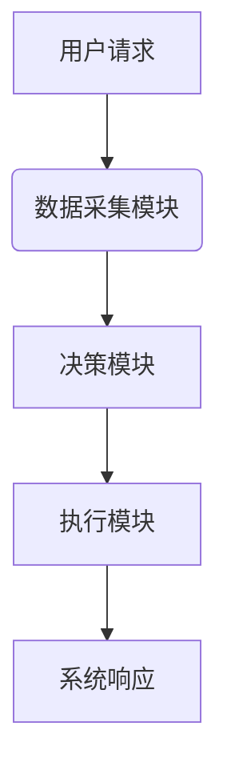
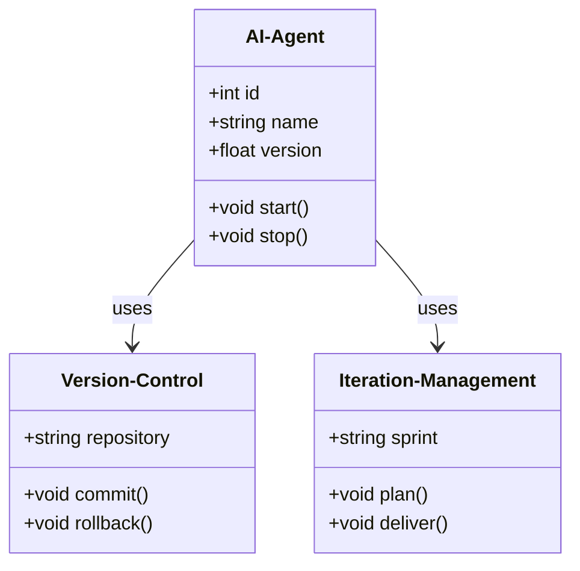
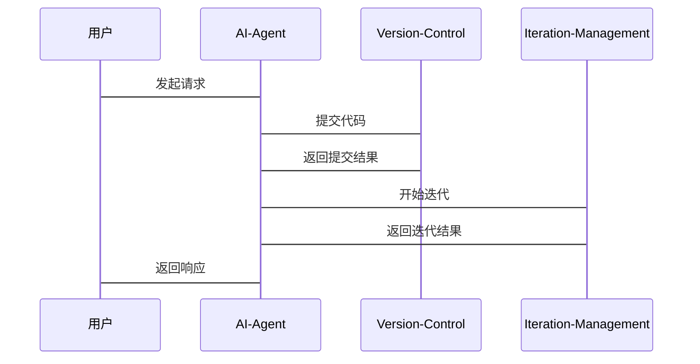

                 


# 企业级AI Agent的版本控制与迭代管理

## 关键词：企业级AI Agent、版本控制、迭代管理、系统架构、项目实战

## 摘要：  
企业级AI Agent的版本控制与迭代管理是确保AI系统高效运行、持续优化和稳定维护的关键。本文从核心概念、算法原理、系统架构、项目实战到最佳实践，全面解析企业级AI Agent的版本控制与迭代管理，为企业技术团队提供深度指导和实践参考。

---

## 第一部分: 引言

## 第1章: 企业级AI Agent的概述

### 1.1 什么是企业级AI Agent
#### 1.1.1 AI Agent的基本定义
AI Agent（人工智能代理）是一种能够感知环境、自主决策并执行任务的智能系统。它通过传感器获取信息，利用推理能力分析数据，并通过执行器与环境交互。AI Agent的核心目标是通过自动化手段提高效率、优化决策和降低人工干预。

#### 1.1.2 企业级AI Agent的特点
企业级AI Agent是在企业环境中部署的智能代理，具有以下特点：
- **高可用性**：确保在复杂的企业环境中稳定运行。
- **可扩展性**：能够处理大规模数据和任务。
- **可定制性**：支持根据企业需求进行定制化配置。
- **可维护性**：具备高效的版本控制和迭代管理能力。

#### 1.1.3 企业级AI Agent的应用场景
企业级AI Agent广泛应用于以下场景：
- **智能客服**：通过自然语言处理（NLP）技术为用户提供实时支持。
- **自动化运维**：监控系统运行状态，自动修复故障。
- **数据分析师**：协助数据科学家进行数据处理和分析。
- **智能决策支持**：为企业提供基于数据的决策支持。

### 1.2 企业级AI Agent的版本控制与迭代管理的重要性
#### 1.2.1 版本控制的基本概念
版本控制是一种管理软件代码或其他资源的变化过程的技术，通过记录每次修改，确保系统在不同版本之间能够安全地回滚和恢复。版本控制的核心目标是确保系统的稳定性和可追溯性。

#### 1.2.2 迭代管理的核心作用
迭代管理是通过周期性的小步快跑开发模式，逐步优化系统功能。它强调快速验证和反馈，确保系统能够快速适应变化的需求。迭代管理的关键在于通过持续集成和持续交付（CI/CD）实现高效开发。

#### 1.2.3 企业级AI Agent的复杂性与挑战
企业级AI Agent的复杂性主要体现在以下方面：
- **多团队协作**：需要跨团队协作，确保不同模块的版本一致性。
- **高可用性要求**：系统必须在任何时候保持可用，容不得版本回滚导致的停机。
- **数据依赖性**：AI Agent的性能依赖于训练数据和模型，版本管理需要同时处理模型和数据的变化。

### 1.3 本章小结
本章介绍了企业级AI Agent的基本概念、特点和应用场景，并强调了版本控制与迭代管理的重要性。企业级AI Agent的版本控制与迭代管理是确保其高效运行和持续优化的关键。

---

## 第二部分: 核心概念与联系

## 第2章: 企业级AI Agent的核心概念

### 2.1 企业级AI Agent的定义与特点
#### 2.1.1 定义
企业级AI Agent是一种能够在企业环境中自主感知、决策和执行的智能系统。它通过与企业系统的集成，为企业提供智能化的解决方案。

#### 2.1.2 核心特点
企业级AI Agent具有以下特点：
- **分布式部署**：能够在全球多地部署，实现全球化服务。
- **高并发处理**：支持大规模并发请求，满足企业级用户需求。
- **自我优化**：通过机器学习算法实现自我优化和性能提升。

#### 2.1.3 与传统AI Agent的区别
企业级AI Agent与传统AI Agent的主要区别在于：
- **规模**：企业级AI Agent通常处理更大规模的数据和任务。
- **复杂性**：企业级AI Agent需要应对复杂的系统架构和多团队协作。
- **稳定性**：企业级AI Agent需要更高的稳定性和可维护性。

### 2.2 版本控制与迭代管理的定义与特点
#### 2.2.1 定义
版本控制是一种管理软件代码或其他资源的变化过程的技术，通过记录每次修改，确保系统的稳定性和可追溯性。

#### 2.2.2 核心特点
版本控制的核心特点包括：
- **可追溯性**：记录每次修改的详细信息，确保版本的可追溯性。
- **可恢复性**：支持快速回滚到指定版本，降低系统故障风险。
- **协作性**：支持多团队协作，确保版本的一致性和协调性。

#### 2.2.3 与传统软件开发的区别
版本控制与传统软件开发的主要区别在于：
- **自动化程度**：版本控制通过工具实现自动化管理，而传统软件开发通常依赖手动操作。
- **迭代速度**：版本控制支持快速迭代和持续交付，而传统软件开发周期较长。

### 2.3 核心概念之间的关系
#### 2.3.1 企业级AI Agent与版本控制的关系
企业级AI Agent的版本控制是确保系统稳定性和可维护性的关键。版本控制通过记录每次修改，确保AI Agent的模型和数据的版本一致性。

#### 2.3.2 迭代管理在企业级AI Agent中的作用
迭代管理通过周期性的小步快跑开发模式，逐步优化企业级AI Agent的功能。迭代管理的核心在于通过持续集成和持续交付实现高效开发。

#### 2.3.3 核心概念的对比表格
| 概念 | 定义 | 特点 | 关系 |
|------|------|------|------|
| 企业级AI Agent | 在企业环境中部署的智能代理 | 高可用性、可扩展性、可定制性 | 依赖版本控制和迭代管理 |
| 版本控制 | 管理系统变化的技术 | 可追溯性、可恢复性、协作性 | 确保AI Agent的稳定性和一致性 |
| 迭代管理 | 周期性优化开发模式 | 快速验证、持续交付、自我优化 | 支持AI Agent的持续改进 |

---

## 第三部分: 算法原理与实现

## 第3章: 企业级AI Agent的版本控制与迭代管理的算法原理

### 3.1 版本控制的算法原理
#### 3.1.1 版本控制的流程
版本控制的流程包括以下几个步骤：
1. **提交代码**：开发者提交代码到版本控制系统。
2. **记录变更**：版本控制系统记录每次代码的变更。
3. **分支与合并**：开发者可以在不同的分支上开发功能，最后将分支合并到主分支。
4. **回滚版本**：当出现错误时，可以回滚到之前的版本。

#### 3.1.2 版本控制的实现方式
版本控制可以通过以下几种方式实现：
- **集中式版本控制**：所有开发者共享一个中央仓库，如SVN。
- **分布式版本控制**：每个开发者都有自己的仓库，如Git。

#### 3.1.3 版本控制的数学模型
版本控制的数学模型可以通过图论来表示，其中每个版本是一个节点，边表示版本之间的依赖关系。例如：
$$ G = (V, E) $$
其中，$ V $ 是版本节点的集合，$ E $ 是版本之间的依赖关系。

### 3.2 迭代管理的算法原理
#### 3.2.1 迭代管理的流程
迭代管理的流程包括以下几个步骤：
1. **需求分析**：明确当前迭代的目标。
2. **开发与测试**：开发者在当前迭代中开发功能并进行测试。
3. **集成与交付**：将当前迭代的结果集成到主分支，并进行交付。
4. **反馈与优化**：根据用户反馈进行优化。

#### 3.2.2 迭代管理的实现方式
迭代管理可以通过以下几种方式实现：
- **Scrum**：一种敏捷开发方法，通过迭代周期（Sprint）进行开发。
- **Kanban**：一种看板方法，通过持续交付进行开发。

#### 3.2.3 迭代管理的数学模型
迭代管理的数学模型可以通过状态机来表示，其中每个状态表示迭代的阶段，如：
$$ S = \{S_1, S_2, S_3\} $$
其中，$ S_1 $ 表示需求分析阶段，$ S_2 $ 表示开发阶段，$ S_3 $ 表示交付阶段。

### 3.3 算法的对比与优化
#### 3.3.1 算法对比
版本控制和迭代管理的对比如下：
| 概念 | 版本控制 | 迭代管理 |
|------|----------|----------|
| 目标 | 管理代码变更 | 管理开发过程 |
| 工具 | Git、SVN | Scrum、Kanban |
| 优点 | 确保代码一致性 | 支持快速交付 |

#### 3.3.2 算法优化
通过结合版本控制和迭代管理，可以实现以下优化：
- **快速回滚**：当迭代出现问题时，可以快速回滚到之前的版本。
- **持续交付**：通过持续集成和持续交付，确保每个迭代的代码都是可运行的。

---

## 第四部分: 系统分析与架构设计

## 第4章: 企业级AI Agent的系统分析与架构设计

### 4.1 系统分析
#### 4.1.1 问题场景介绍
企业级AI Agent在实际应用中可能会遇到以下问题：
- **数据一致性**：不同版本的AI Agent可能处理不同数据，导致数据不一致。
- **功能冲突**：不同团队的开发可能导致功能冲突。
- **性能瓶颈**：大规模数据处理可能导致性能瓶颈。

### 4.2 系统功能设计
#### 4.2.1 系统功能模块
企业级AI Agent的系统功能模块包括：
- **数据采集模块**：负责采集环境数据。
- **决策模块**：负责基于数据进行决策。
- **执行模块**：负责执行决策结果。

#### 4.2.2 系统功能流程图
以下是系统功能流程图：


### 4.3 系统架构设计
#### 4.3.1 系统架构图
以下是系统架构图：


### 4.4 系统接口设计
#### 4.4.1 系统接口
系统接口包括：
- **版本控制接口**：用于管理代码的版本。
- **迭代管理接口**：用于管理开发过程。

### 4.5 系统交互设计
#### 4.5.1 系统交互序列图
以下是系统交互序列图：


---

## 第五部分: 项目实战

## 第5章: 企业级AI Agent的项目实战

### 5.1 项目环境安装
#### 5.1.1 环境要求
- 操作系统：Linux/Windows/MacOS
- 开发工具：IntelliJ IDEA/VS Code
- 版本控制工具：Git
- 依赖管理工具：Maven/Gradle

### 5.2 系统核心实现
#### 5.2.1 核心代码实现
以下是核心代码实现：
```python
class AI-Agent:
    def __init__(self, version):
        self.version = version

    def start(self):
        print(f"AI-Agent {self.version} 开始运行")

    def stop(self):
        print(f"AI-Agent {self.version} 停止运行")

class Version-Control:
    def __init__(self, repository):
        self.repository = repository

    def commit(self):
        print(f"提交代码到 {self.repository}")

    def rollback(self):
        print(f"回滚到 {self.repository} 的上一个版本")

class Iteration-Management:
    def __init__(self, sprint):
        self.sprint = sprint

    def plan(self):
        print(f"规划第 {self.sprint} 次迭代")

    def deliver(self):
        print(f"交付第 {self.sprint} 次迭代")
```

#### 5.2.2 代码解读与分析
- `AI-Agent` 类：封装AI Agent的核心功能，包括版本号和启动/停止方法。
- `Version-Control` 类：封装版本控制功能，包括提交和回滚方法。
- `Iteration-Management` 类：封装迭代管理功能，包括规划和交付方法。

### 5.3 项目案例分析
#### 5.3.1 案例分析
以下是项目案例分析：
1. **需求分析**：明确当前迭代的目标。
2. **开发与测试**：开发者在当前迭代中开发功能并进行测试。
3. **集成与交付**：将当前迭代的结果集成到主分支，并进行交付。
4. **反馈与优化**：根据用户反馈进行优化。

### 5.4 项目总结
#### 5.4.1 项目总结
通过本项目的实战，我们掌握了企业级AI Agent的版本控制与迭代管理的关键技术，包括版本控制的实现、迭代管理的流程以及系统架构的设计。

---

## 第六部分: 最佳实践与总结

## 第6章: 企业级AI Agent的版本控制与迭代管理的最佳实践

### 6.1 最佳实践
#### 6.1.1 版本控制工具的选择
选择合适的版本控制工具，如Git、SVN等。

#### 6.1.2 迭代管理方法的优化
采用敏捷开发方法，如Scrum、Kanban等。

#### 6.1.3 系统架构的设计
设计高效的系统架构，确保系统的稳定性和可扩展性。

### 6.2 注意事项
#### 6.2.1 版本控制的注意事项
- 定期清理无用分支。
- 确保代码的可追溯性。

#### 6.2.2 迭代管理的注意事项
- 确保每个迭代的目标明确。
- 确保每个迭代的成果可交付。

### 6.3 未来发展趋势
#### 6.3.1 未来发展趋势
- **自动化测试**：通过自动化测试确保每个迭代的质量。
- **智能版本控制**：通过AI技术实现智能版本控制。
- **持续优化**：通过持续优化确保系统的高效运行。

### 6.4 结语
企业级AI Agent的版本控制与迭代管理是确保系统高效运行、持续优化和稳定维护的关键。通过本文的分析和实践，我们掌握了企业级AI Agent的版本控制与迭代管理的关键技术，为未来的工作提供了宝贵的参考。

---

## 作者：AI天才研究院/AI Genius Institute & 禅与计算机程序设计艺术 /Zen And The Art of Computer Programming

