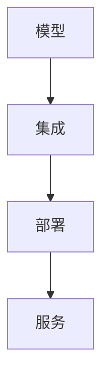
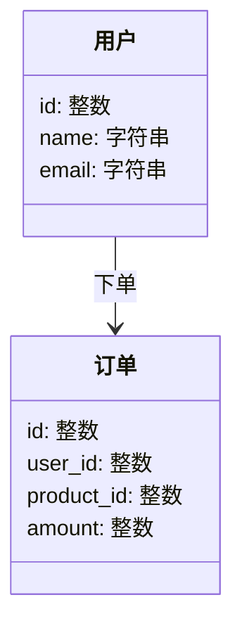
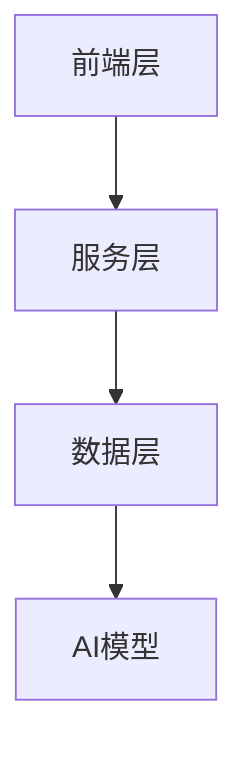
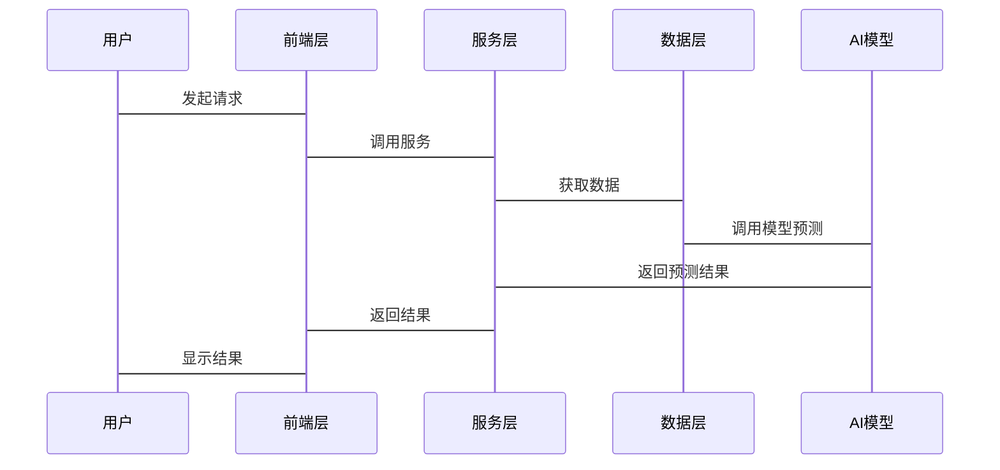

                 


# 《企业级AI模型的集成与部署策略》

> 关键词：企业级AI模型、集成与部署、算法原理、系统架构、项目实战

> 摘要：企业级AI模型的集成与部署是人工智能技术应用中的关键环节。本文详细探讨了企业级AI模型的集成与部署策略，从背景、核心概念到算法原理、系统架构，再到项目实战和最佳实践，全面解析了如何高效、稳定地将AI模型应用于企业环境中。

---

## 目录大纲

1. [企业级AI模型的集成与部署概述](#企业级ai模型的集成与部署概述)
2. [企业级AI模型的集成与部署核心概念](#企业级ai模型的集成与部署核心概念)
3. [企业级AI模型的集成算法原理](#企业级ai模型的集成算法原理)
4. [企业级AI模型的部署策略](#企业级ai模型的部署策略)
5. [企业级AI模型的系统架构设计](#企业级ai模型的系统架构设计)
6. [企业级AI模型的项目实战](#企业级ai模型的项目实战)
7. [企业级AI模型的部署与集成的最佳实践](#企业级ai模型的部署与集成的最佳实践)

---

## 1. 企业级AI模型的集成与部署概述

### 1.1 企业级AI模型的背景与意义

#### 1.1.1 人工智能技术的发展现状
人工智能（AI）技术近年来取得了飞速发展，深度学习、自然语言处理（NLP）、计算机视觉等技术在企业中的应用日益广泛。企业级AI模型的集成与部署已成为企业智能化转型的核心竞争力。

#### 1.1.2 企业级AI模型的应用场景
企业级AI模型广泛应用于以下场景：
- **客户画像与精准营销**：通过AI模型分析客户行为，实现精准营销。
- **智能客服与问答系统**：利用自然语言处理技术提供智能客服支持。
- **供应链优化与预测**：通过AI模型优化供应链管理，预测市场需求。

#### 1.1.3 集成与部署的核心价值
企业级AI模型的集成与部署能够提高系统的稳定性和扩展性，降低技术门槛，同时实现快速迭代和优化。

### 1.2 企业级AI模型的定义与特点

#### 1.2.1 企业级AI模型的定义
企业级AI模型是指在企业环境中部署的、能够满足企业级需求的AI模型，具有高可用性、可扩展性和稳定性。

#### 1.2.2 企业级AI模型的核心特点
- **高可用性**：系统能够在故障情况下快速恢复，保证服务不中断。
- **可扩展性**：能够根据业务需求动态扩展资源。
- **稳定性**：模型在长期运行中保持高性能和准确性。

### 1.3 企业级AI模型的集成与部署挑战

#### 1.3.1 技术层面的挑战
- **模型兼容性**：不同模型之间的接口和数据格式可能不一致。
- **性能优化**：集成多个模型可能带来性能瓶颈。

#### 1.3.2 业务层面的挑战
- **数据一致性**：不同业务部门的数据格式和标准可能不同。
- **业务需求变化**：业务需求的动态变化可能需要频繁调整模型。

#### 1.3.3 管理层面的挑战
- **资源分配**：如何合理分配计算资源和存储资源。
- **团队协作**：集成与部署需要多个团队协作，管理复杂。

### 1.4 本章小结
本章介绍了企业级AI模型的背景、定义、特点及其集成与部署的主要挑战，为后续章节奠定了基础。

---

## 2. 企业级AI模型的集成与部署核心概念

### 2.1 集成与部署的定义与联系

#### 2.1.1 集成的定义与作用
集成是指将多个独立的AI模型整合到一个统一的系统中，通过协同工作提高整体性能。

#### 2.1.2 部署的定义与作用
部署是指将集成后的AI模型在企业环境中正式运行，确保其稳定性和可用性。

#### 2.1.3 集成与部署的关系
集成是部署的前提，部署是集成的延续。集成确保了模型的协同工作，而部署则确保了模型在实际环境中的运行。

### 2.2 核心概念的原理分析

#### 2.2.1 模型集成的原理
模型集成通过多种算法或模型的组合，利用投票、加权等方式提高预测准确性。

#### 2.2.2 模型部署的原理
模型部署通过容器化技术（如Docker）和 orchestration 工具（如Kubernetes）实现自动化部署和扩展。

#### 2.2.3 集成与部署的协同机制
集成与部署需要通过API接口进行通信，确保数据流和模型调用的顺畅。

### 2.3 核心概念对比分析

#### 2.3.1 集成与部署的对比表格
| 对比维度 | 集成 | 部署 |
|----------|------|------|
| 目标 | 提高模型性能 | 保证模型运行 | 
| 实现方式 | 组合多个模型 | 部署到生产环境 | 
| 关键技术 | 融合算法 | 容器化、 orchestration | 

#### 2.3.2 ER实体关系图架构


### 2.4 本章小结
本章详细介绍了企业级AI模型集成与部署的核心概念，包括定义、原理和对比分析，为后续章节提供了理论基础。

---

## 3. 企业级AI模型的集成算法原理

### 3.1 集成算法的原理

#### 3.1.1 集成算法的分类
- **基于投票的集成**：如随机森林。
- **基于加权的集成**：如加权投票法。
- **基于模型的集成**：如梯度提升树。

#### 3.1.2 集成算法的数学模型
集成算法的数学模型如下：
$$ y = f(x) $$

### 3.2 集成算法的实现流程

#### 3.2.1 数据预处理
- 数据清洗：处理缺失值和异常值。
- 特征选择：选择对模型影响较大的特征。

#### 3.2.2 模型训练
- 训练多个基模型：如随机森林、神经网络等。
- 模型融合：通过投票或加权的方式融合多个基模型的结果。

#### 3.2.3 结果输出
- 最终结果：将多个模型的预测结果进行融合，输出最终结果。

### 3.3 集成算法的代码实现

```python
def ensemble(models, X):
    predictions = []
    for model in models:
        predictions.append(model.predict(X))
    return np.mean(predictions, axis=0)
```

### 3.4 本章小结
本章详细讲解了企业级AI模型的集成算法原理，包括分类、数学模型和代码实现，为实际应用提供了理论支持。

---

## 4. 企业级AI模型的部署策略

### 4.1 部署策略的分类

#### 4.1.1 离线部署
适用于数据处理和分析的场景，如批量处理任务。

#### 4.1.2 在线部署
适用于实时响应的场景，如智能客服和实时预测。

#### 4.1.3 混合部署
结合离线和在线部署的特点，适用于复杂业务场景。

### 4.2 部署策略的实现原理

#### 4.2.1 离线部署的原理
- 数据批量处理：将数据一次性加载到内存中进行处理。
- 批量预测：对整个数据集进行预测，输出结果。

#### 4.2.2 在线部署的原理
- 实时数据处理：逐条接收数据，实时进行预测和响应。
- 微服务架构：通过API接口实现服务的调用和交互。

#### 4.2.3 混合部署的原理
- 综合使用离线和在线部署的技术，根据业务需求动态调整部署方式。

### 4.3 部署策略的代码实现

```python
def deploy(model, mode):
    if mode == 'offline':
        # 离线部署逻辑
        pass
    elif mode == 'online':
        # 在线部署逻辑
        pass
    else:
        # 混合部署逻辑
        pass
```

### 4.4 本章小结
本章详细介绍了企业级AI模型的部署策略，包括分类、实现原理和代码实现，为实际应用提供了指导。

---

## 5. 企业级AI模型的系统架构设计

### 5.1 系统架构的概述

#### 5.1.1 系统架构的目标
- 高可用性：确保系统在故障情况下能够快速恢复。
- 可扩展性：能够根据业务需求动态扩展资源。

#### 5.1.2 系统架构的组成部分
- **前端层**：接收用户请求，展示结果。
- **服务层**：处理业务逻辑，调用AI模型。
- **数据层**：存储和管理数据，提供数据支持。

### 5.2 系统功能设计

#### 5.2.1 领域模型


#### 5.2.2 系统架构


#### 5.2.3 系统接口设计
- 前端接口：RESTful API，如`POST /predict`。
- 服务层接口：与数据层和AI模型进行交互。

#### 5.2.4 系统交互流程


### 5.3 本章小结
本章详细讲解了企业级AI模型的系统架构设计，包括组成部分、功能设计和交互流程，为实际应用提供了架构支持。

---

## 6. 企业级AI模型的项目实战

### 6.1 环境安装

#### 6.1.1 安装Python环境
使用Anaconda安装Python 3.8及以上版本。

#### 6.1.2 安装依赖库
安装numpy、scikit-learn、xgboost等依赖库。

### 6.2 核心实现

#### 6.2.1 数据预处理
```python
import pandas as pd
import numpy as np

data = pd.read_csv('data.csv')
data = data.dropna()
```

#### 6.2.2 模型训练
```python
from sklearn.ensemble import RandomForestClassifier

model = RandomForestClassifier(n_estimators=100, random_state=42)
model.fit(X_train, y_train)
```

#### 6.2.3 集成部署
```python
from flask import Flask
import joblib

app = Flask(__name__)
model = joblib.load('model.pkl')

@app.route('/predict', methods=['POST'])
def predict():
    data = request.json
    prediction = model.predict([data])
    return jsonify({'result': prediction.tolist()})
```

### 6.3 案例分析与详细讲解

#### 6.3.1 案例背景
假设我们有一个电商网站，需要预测用户的购买行为。

#### 6.3.2 数据分析
分析用户行为数据，提取特征如用户的点击次数、浏览时间等。

#### 6.3.3 模型优化
通过网格搜索优化模型参数，提高预测准确率。

### 6.4 本章小结
本章通过实际案例展示了企业级AI模型的集成与部署过程，包括环境安装、核心实现和案例分析。

---

## 7. 企业级AI模型的部署与集成的最佳实践

### 7.1 最佳实践 tips
- **模块化设计**：将系统划分为多个模块，便于管理和维护。
- **自动化测试**：通过自动化测试确保系统稳定性和可用性。
- **监控与日志**：实时监控系统运行状态，记录日志以便故障排查。

### 7.2 小结
企业级AI模型的集成与部署需要综合考虑技术、业务和管理等多个方面，通过模块化设计、自动化测试和监控日志等手段，确保系统的稳定性和高效性。

### 7.3 注意事项
- **数据安全**：确保数据在传输和存储过程中的安全性。
- **性能优化**：通过优化算法和架构设计，提高系统性能。
- **团队协作**：集成与部署需要多个团队协作，确保各环节顺利进行。

### 7.4 拓展阅读
- 《企业级AI系统的构建与优化》
- 《微服务架构实战》
- 《Docker与Kubernetes容器化实战》

---

## 作者

作者：AI天才研究院/AI Genius Institute & 禅与计算机程序设计艺术/Zen And The Art of Computer Programming

---

通过以上结构，我们可以系统地学习和理解企业级AI模型的集成与部署策略，为实际应用提供理论和实践指导。

