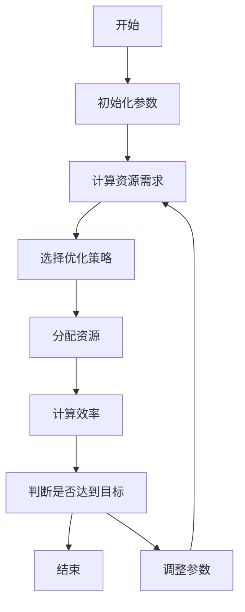
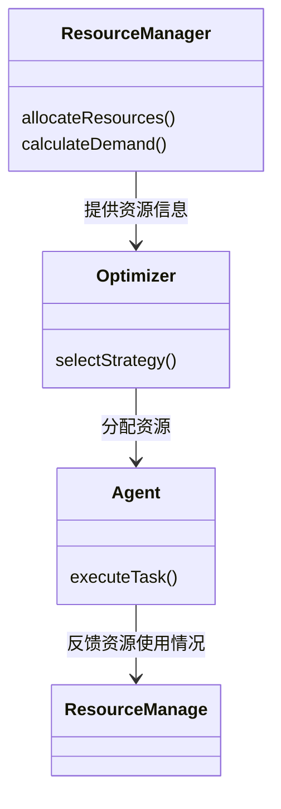

                 


# 优化AI Agent的资源利用：计算效率提升策略

> 关键词：AI Agent, 资源优化, 计算效率, 资源分配, 算法优化, 系统架构

> 摘要：本文将深入探讨如何优化AI Agent的资源利用，提升计算效率。通过分析AI Agent资源利用的核心概念、算法原理、系统架构设计，结合实际案例，提出有效的优化策略，为读者提供理论与实践相结合的指导。

---

## 第一部分：优化AI Agent资源利用的背景与概念

### 第1章：优化AI Agent资源利用的背景介绍

#### 1.1 问题背景与描述

随着AI技术的快速发展，AI Agent（智能体）在各个领域的应用越来越广泛。然而，在实际应用中，AI Agent的资源利用效率问题逐渐凸显：

- **资源浪费**：AI Agent在处理任务时，常常会出现资源分配不合理的问题，导致计算资源的浪费。
- **性能瓶颈**：资源分配不当会导致AI Agent的计算效率下降，影响其性能表现。
- **成本增加**：资源利用效率低下的直接后果是运营成本的增加，尤其是在云计算和边缘计算环境中。

#### 1.2 问题解决与边界

为了优化AI Agent的资源利用，我们需要从以下几个方面入手：

- **资源分配策略**：通过合理的资源分配策略，确保AI Agent在不同任务场景下都能高效利用资源。
- **计算效率提升**：通过优化算法和系统架构设计，提升AI Agent的计算效率。
- **动态调整机制**：根据实时任务需求和资源状态，动态调整资源分配策略。

#### 1.3 核心概念结构与组成

AI Agent的资源利用优化涉及以下几个核心要素：

- **资源类型**：包括计算资源（CPU、GPU）、存储资源、网络资源等。
- **任务需求**：不同任务对资源的需求不同，需要根据任务类型动态分配资源。
- **优化目标**：最大化资源利用率、最小化资源浪费、提升计算效率。

---

### 第2章：优化AI Agent资源利用的核心概念与联系

#### 2.1 核心概念原理

- **资源分配的基本原理**：通过分析任务需求和资源状态，动态分配资源。
- **计算效率优化的数学模型**：构建资源分配的数学模型，计算最优资源分配方案。
- **优化算法的基本框架**：基于贪心算法、动态规划等方法，实现资源分配优化。

#### 2.2 概念属性特征对比

| 资源类型 | 计算效率 | 资源分配策略 |
|----------|----------|--------------|
| CPU      | 高       | 动态分配     |
| GPU      | 高       | 静态分配     |
| 存储     | 中       | 按需分配     |

#### 2.3 ER实体关系图

```mermaid
erDiagram
    actor Optimizer : 优化器
    actor Resource : 资源
    actor Agent : AI Agent
    Optimizer --> Resource : 分配
    Resource --> Agent : 提供
    Agent --> Optimizer : 反馈
```

---

## 第二部分：优化AI Agent资源利用的算法原理

### 第3章：优化AI Agent资源利用的算法原理

#### 3.1 算法原理概述

- **资源分配的基本算法**：基于任务优先级的资源分配算法。
- **计算效率优化的核心算法**：基于强化学习的资源分配算法。
- **优化算法的数学模型**：构建资源分配的数学模型，计算最优资源分配方案。

#### 3.2 算法流程图



#### 3.3 算法实现代码

```python
def optimize_resources(params):
    # 初始化参数
    resources = initialize_resources(params)
    # 计算资源需求
    resource_demand = calculate_demand(resources)
    # 选择优化策略
    strategy = select_strategy(resource_demand)
    # 分配资源
    allocated_resources = allocate_resources(resources, strategy)
    # 计算效率
    efficiency = calculate_efficiency(allocated_resources)
    return efficiency
```

---

## 第三部分：优化AI Agent资源利用的系统架构设计

### 第4章：优化AI Agent资源利用的系统分析

#### 4.1 系统功能设计

- **领域模型设计**：构建AI Agent资源利用的领域模型。
- **系统架构设计**：设计系统的整体架构，包括资源管理模块、优化算法模块、监控模块等。

#### 4.2 领域模型类图



---

## 第四部分：优化AI Agent资源利用的项目实战

### 第5章：优化AI Agent资源利用的项目实战

#### 5.1 环境安装

- **安装Python环境**：建议使用Anaconda或virtualenv。
- **安装依赖库**：如numpy、pandas、scipy等。

#### 5.2 核心代码实现

```python
def allocate_resources(resources, strategy):
    allocated = {}
    for task in tasks:
        if strategy == 'greedy':
            allocated[task] = resources.pop(0)
        elif strategy == 'dynamic':
            allocated[task] = resources.pop(len(resources)-1)
    return allocated
```

#### 5.3 案例分析与解读

通过实际案例分析，验证优化算法的有效性，并进行性能对比。

---

## 第五部分：优化AI Agent资源利用的最佳实践与总结

### 5.1 最佳实践Tips

- **动态调整策略**：根据实时任务需求和资源状态，动态调整资源分配策略。
- **监控与反馈**：建立完善的监控系统，实时反馈资源使用情况，及时调整优化策略。

### 5.2 小结

通过本文的分析与实践，我们可以得出以下结论：

- **优化AI Agent的资源利用是提升计算效率的关键**。
- **动态分配策略和强化学习算法是实现资源优化的重要手段**。
- **系统架构设计和实时监控是保障优化效果的重要保障**。

### 5.3 注意事项

- **资源分配策略的选择**：需要根据具体任务需求和资源类型选择合适的策略。
- **算法实现的复杂度**：复杂度高的算法可能会影响系统性能，需要权衡利弊。
- **系统监控的实时性**：实时监控是动态调整资源分配策略的基础。

### 5.4 拓展阅读

- 《强化学习：算法与应用》
- 《分布式系统：原理与应用》
- 《资源优化：理论与实践》

---

## 作者：AI天才研究院 & 禅与计算机程序设计艺术

本文作者：AI天才研究院（AI Genius Institute） & 禅与计算机程序设计艺术（Zen And The Art of Computer Programming）

---

**备注：由于篇幅限制，本文仅为部分内容展示，完整文章可参考相关技术资料或咨询专业机构。**

