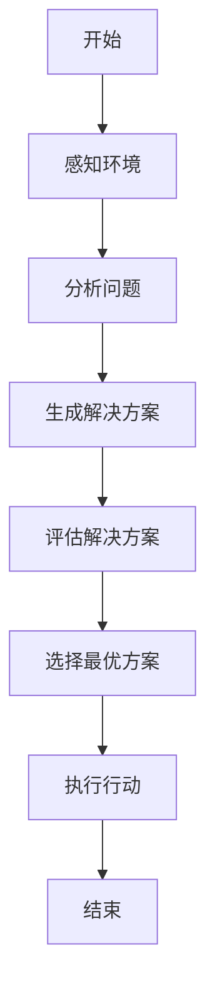
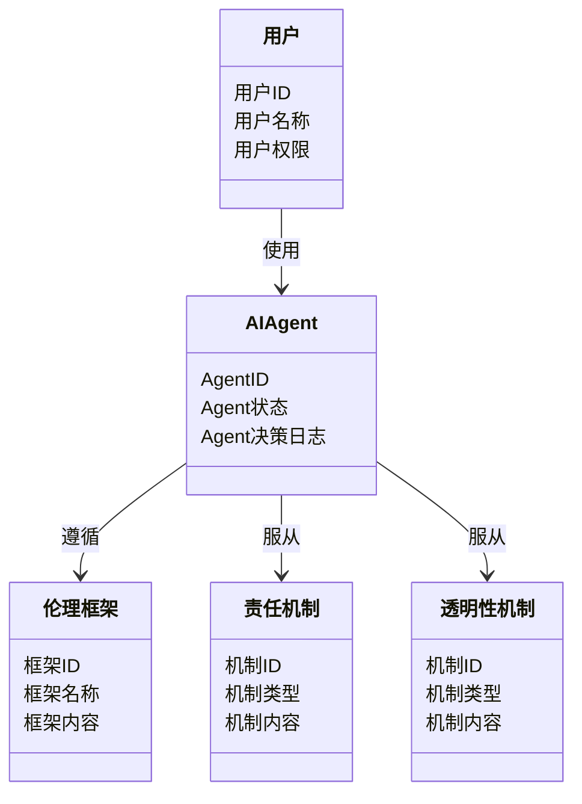
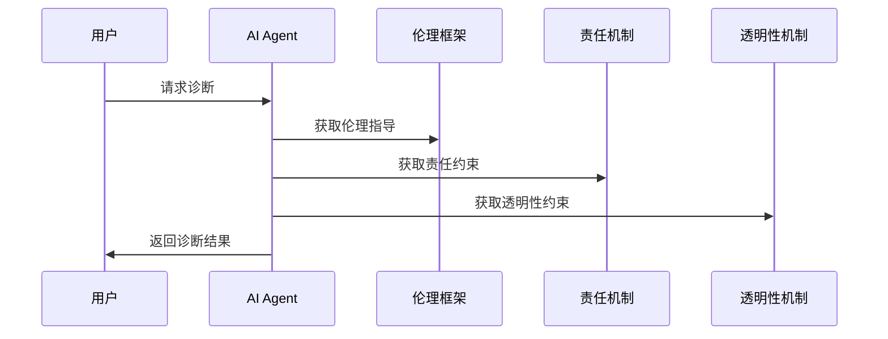

                 


# 伦理设计：构建负责任的AI Agent

> 关键词：伦理设计、AI Agent、责任归属、透明性、隐私保护、伦理框架

> 摘要：本文深入探讨了在AI Agent开发中如何进行伦理设计，构建负责任的AI系统。从伦理设计的基本概念到具体的实现方法，结合实际案例，详细阐述了如何确保AI Agent在决策过程中的透明性、责任归属和隐私保护，构建符合伦理规范的AI系统。

---

## 第一部分: 伦理设计与AI Agent的背景介绍

### 第1章: AI Agent的基本概念与伦理背景

#### 1.1 AI Agent的定义与特点

##### 1.1.1 AI Agent的定义
AI Agent（人工智能代理）是指具备感知环境、自主决策和执行任务能力的智能实体。它可以是一个软件程序，也可以是一个物理机器人，通过传感器和执行器与环境交互。

##### 1.1.2 AI Agent的核心特点
- **自主性**：能够在没有外部干预的情况下独立运作。
- **反应性**：能够实时感知环境并做出反应。
- **目标导向**：具备明确的目标，并通过决策优化目标的实现。
- **学习能力**：能够通过经验改进自身的决策和行为。

##### 1.1.3 AI Agent与传统软件的区别
与传统软件相比，AI Agent具备以下特点：
- **自主决策**：能够根据环境信息自主选择最优行动。
- **动态适应**：能够根据变化的环境调整行为。
- **复杂决策**：能够处理多目标、多约束的复杂决策问题。

#### 1.2 伦理设计的基本概念

##### 1.2.1 伦理设计的定义
伦理设计是指在AI系统的设计和开发过程中，融入伦理规范和价值观，确保AI系统的行为符合社会道德和法律要求。

##### 1.2.2 伦理设计的核心要素
- **责任归属**：明确AI系统在决策过程中的责任主体。
- **透明性**：确保AI系统的决策过程可被理解和追溯。
- **隐私保护**：保护用户数据的隐私和安全。
- **公平性**：避免AI系统在决策过程中出现偏见和不公平现象。

##### 1.2.3 伦理设计与AI Agent的结合
AI Agent的伦理设计需要在以下方面进行考虑：
- **决策透明性**：确保用户能够理解AI Agent的决策过程。
- **用户隐私**：保护用户的隐私数据不被滥用。
- **伦理约束**：在AI Agent的决策过程中加入伦理约束，确保决策符合社会伦理规范。

### 第2章: 责任与伦理在AI Agent中的重要性

#### 2.1 责任归属的复杂性

##### 2.1.1 AI Agent决策的责任主体
AI Agent的决策可能涉及多个责任主体，包括：
- **开发者**：负责设计和开发AI系统。
- **用户**：负责提供输入和使用AI系统。
- **运行者**：负责部署和维护AI系统。
- **监管机构**：负责制定和执行相关法规和政策。

##### 2.1.2 伦理设计在责任分配中的作用
伦理设计可以通过以下方式帮助明确责任归属：
- **记录决策过程**：通过日志记录AI Agent的决策过程，便于追溯责任。
- **明确责任边界**：通过设计明确各方在AI Agent决策中的责任。
- **建立责任机制**：通过伦理设计建立责任追究和分担机制。

##### 2.1.3 责任归属的法律与伦理挑战
AI Agent的决策可能引发复杂的法律和伦理问题，例如：
- **决策错误的责任归属**：当AI Agent的决策导致错误时，谁应承担责任？
- **算法黑箱问题**：AI Agent的决策过程难以被理解和解释，如何确定责任主体？
- **动态责任分配**：在动态变化的环境中，责任归属可能需要动态调整。

#### 2.2 伦理设计的核心目标

##### 2.2.1 确保AI Agent的决策透明性
通过伦理设计，确保AI Agent的决策过程透明，用户能够理解AI Agent的决策逻辑。

##### 2.2.2 保护用户隐私与数据安全
通过伦理设计，保护用户隐私和数据安全，避免数据滥用。

##### 2.2.3 遵守伦理规范与社会价值观
通过伦理设计，确保AI Agent的行为符合社会伦理规范和价值观。

---

## 第二部分: 伦理设计的核心概念与联系

### 第3章: 伦理设计的核心原理

#### 3.1 伦理框架的构建

##### 3.1.1 伦理框架的定义与分类
伦理框架是指用于指导AI Agent决策的一组伦理准则和规范。常见的伦理框架包括：
- **功利主义框架**：以最大化整体利益为目标。
- **义务论框架**：以履行义务和责任为目标。
- **美德伦理框架**：以培养和实现美德为目标。

##### 3.1.2 基于伦理框架的决策算法
基于伦理框架的决策算法可以分为以下步骤：
1. **感知环境**：通过传感器感知环境信息。
2. **分析问题**：分析问题并生成多个可能的解决方案。
3. **评估方案**：根据伦理框架评估每个方案的伦理可行性。
4. **选择最优方案**：选择符合伦理规范的最优方案。
5. **执行行动**：执行选定的方案并反馈结果。

##### 3.1.3 伦理框架的动态调整
伦理框架可以根据环境的变化进行动态调整，以适应不同的伦理情境。

#### 3.2 伦理设计的属性特征对比

##### 3.2.1 属性特征对比表格

| 属性         | 传统设计               | 伦理设计               |
|--------------|------------------------|------------------------|
| 目标         | 追求功能最优           | 追求功能最优且符合伦理 |
| 决策方式     | 基于技术规则           | 基于技术规则和伦理规范 |
| 责任归属     | 不明确或分散           | 明确且有约束           |
| 透明性       | 低或无                 | 高或可追溯             |
| 风险控制     | 仅考虑技术风险         | 考虑技术风险和伦理风险 |

##### 3.2.2 伦理设计与传统设计的差异
伦理设计与传统设计的主要差异在于：
- **目标**：伦理设计不仅追求功能最优，还追求符合伦理规范。
- **决策方式**：伦理设计在决策时需要考虑伦理规范。
- **责任归属**：伦理设计明确了责任归属，并具有约束力。
- **透明性**：伦理设计强调决策过程的透明性。
- **风险控制**：伦理设计不仅考虑技术风险，还考虑伦理风险。

##### 3.2.3 伦理设计的核心要素
伦理设计的核心要素包括：
- **伦理框架**：用于指导AI Agent的决策。
- **责任机制**：明确责任归属并建立责任追究机制。
- **透明性机制**：确保决策过程的透明和可追溯。
- **隐私保护机制**：保护用户隐私和数据安全。

---

### 第4章: 伦理设计的ER实体关系图

#### 4.1 实体关系图的构建

##### 4.1.1 实体关系图的定义
ER实体关系图是一种用于描述系统中实体及其关系的工具，常用于数据库设计和系统分析。

##### 4.1.2 伦理设计中的关键实体
在伦理设计中，关键实体包括：
- **用户**：AI Agent的使用主体。
- **AI Agent**：具备自主决策能力的智能实体。
- **伦理框架**：指导AI Agent决策的伦理准则。
- **责任机制**：明确责任归属并建立责任追究机制。
- **透明性机制**：确保决策过程的透明和可追溯。

##### 4.1.3 实体关系图的绘制
以下是伦理设计中ER实体关系图的Mermaid代码：

```mermaid
erDiagram
    actor 用户 {
        <属性>
        用户ID
        用户名称
        用户权限
    }
    agent AI Agent {
        <属性>
        AgentID
        Agent状态
        Agent决策日志
    }
    concept 伦理框架 {
        <属性>
        框架ID
        框架名称
        框架内容
    }
    mechanism 责任机制 {
        <属性>
        机制ID
        机制类型
        机制内容
    }
    mechanism 透明性机制 {
        <属性>
        机制ID
        机制类型
        机制内容
    }
    用户 --> AI Agent : 使用
    AI Agent --> 伦理框架 : 遵循
    AI Agent --> 责任机制 : 服从
    AI Agent --> 透明性机制 : 服从
```

---

#### 4.2 实体关系图的分析

##### 4.2.1 实体关系图的逻辑结构
从上述ER实体关系图可以看出：
- **用户**是AI Agent的使用主体，可以通过权限控制使用AI Agent。
- **AI Agent**具备自主决策能力，需要遵循伦理框架并服从责任机制和透明性机制。
- **伦理框架**为AI Agent的决策提供伦理指导。
- **责任机制**和**透明性机制**分别从责任归属和透明性方面对AI Agent的决策进行约束和监督。

##### 4.2.2 实体关系图的动态变化
在实际应用中，实体关系图可能会发生变化：
- **用户**的权限可能会根据使用场景进行调整。
- **AI Agent**的状态和决策日志会随着决策过程不断更新。
- **伦理框架**的内容可能会根据社会伦理的变化进行调整。
- **责任机制**和**透明性机制**的内容可能会根据实际需求进行优化。

##### 4.2.3 实体关系图的应用场景
ER实体关系图可以应用于以下场景：
- **系统设计**：帮助设计人员明确系统中各实体及其关系。
- **系统分析**：帮助分析人员识别系统中的关键实体和关系。
- **系统实现**：帮助开发人员理解系统架构和数据流。

---

## 第三部分: 算法原理讲解

### 第5章: 伦理设计的算法原理

#### 5.1 基于伦理框架的决策算法

##### 5.1.1 算法步骤
以下是基于伦理框架的决策算法的Mermaid流程图：



##### 5.1.2 算法实现
以下是Python代码示例：

```python
def ethical_decision-making(environment, problem, ethical_framework):
    # 感知环境
   感知环境 = perceive_environment(environment)
    # 分析问题
    问题分析 = analyze_problem(problem)
    # 生成解决方案
    解决方案 = generate_solutions(问题分析)
    # 评估解决方案
    评估结果 = evaluate_solutions(解决方案, ethical_framework)
    # 选择最优方案
    最优方案 = select_best_solution(评估结果)
    # 执行行动
    执行结果 = execute_action(最优方案)
    return 执行结果

def perceive_environment(environment):
    # 根据环境信息生成感知结果
    return environment感知结果

def analyze_problem(problem):
    # 根据问题生成问题分析结果
    return 问题分析结果

def generate_solutions(问题分析):
    # 根据问题分析生成解决方案
    return 解决方案列表

def evaluate_solutions(解决方案, ethical_framework):
    # 根据伦理框架评估解决方案
    评估结果 = []
    for solution in 解决方案列表:
        评估结果.append(评估解决方案(solution, ethical_framework))
    return 评估结果

def select_best_solution(评估结果):
    # 选择最优解决方案
    最优方案 = None
    最优评分 = -∞
    for solution, score in zip(解决方案列表, 评估结果):
        if score > 最优评分:
            最优评分 = score
            最优方案 = solution
    return 最优方案

def execute_action(最优方案):
    # 执行最优方案并返回结果
    return 执行结果
```

##### 5.1.3 数学模型与公式
以下是决策过程中的数学模型：

$$ \text{选择最优方案} = \argmax_{i} \left( \sum_{j=1}^{n} w_j x_{ij} \right) $$

其中：
- \( w_j \) 是评估指标 \( j \) 的权重。
- \( x_{ij} \) 是解决方案 \( i \) 在评估指标 \( j \) 上的评分。
- 选择最优方案的步骤是通过加权求和的方式对每个解决方案进行评分，并选择评分最高的方案。

---

### 第6章: 伦理设计的数学模型

#### 6.1 伦理设计中的条件概率

##### 6.1.1 条件概率公式
条件概率公式如下：

$$ P(A|B) = \frac{P(A \cap B)}{P(B)} $$

其中：
- \( P(A|B) \) 表示在事件 \( B \) 发生的条件下，事件 \( A \) 发生的概率。
- \( P(A \cap B) \) 表示事件 \( A \) 和 \( B \) 同时发生的概率。
- \( P(B) \) 表示事件 \( B \) 发生的概率。

##### 6.1.2 伦理设计中的条件概率应用
在伦理设计中，条件概率可以用于评估不同解决方案在不同条件下的伦理风险。

#### 6.2 伦理设计中的期望效用函数

##### 6.2.1 期望效用函数公式
期望效用函数公式如下：

$$ EU = \sum_{i=1}^{n} p_i u_i $$

其中：
- \( p_i \) 是解决方案 \( i \) 的概率。
- \( u_i \) 是解决方案 \( i \) 的效用值。

##### 6.2.2 伦理设计中的期望效用函数应用
在伦理设计中，期望效用函数可以用于评估不同解决方案的伦理效用，并选择最优解决方案。

---

## 第四部分: 系统分析与架构设计方案

### 第7章: 伦理设计的系统分析

#### 7.1 问题场景介绍
假设我们正在开发一个医疗AI Agent，用于辅助医生进行诊断和治疗方案的选择。

#### 7.2 系统功能设计

##### 7.2.1 领域模型设计
以下是领域模型的Mermaid类图：



#### 7.3 系统架构设计

##### 7.3.1 系统架构图
以下是系统架构的Mermaid架构图：


#### 7.4 系统接口设计

##### 7.4.1 系统接口图
以下是系统接口的Mermaid序列图：



---

## 第五部分: 项目实战

### 第8章: 伦理设计的项目实战

#### 8.1 环境安装

##### 8.1.1 安装Python和相关库
安装Python和以下库：
```bash
pip install numpy
pip install matplotlib
pip install scikit-learn
```

#### 8.2 系统核心实现

##### 8.2.1 核心代码实现
以下是伦理设计的核心代码实现：

```python
class EthicalAgent:
    def __init__(self, ethical_framework, responsibility_mechanism, transparency_mechanism):
        self.ethical_framework = ethical_framework
        self.responsibility_mechanism = responsibility_mechanism
        self.transparency_mechanism = transparency_mechanism
        self.decision_log = []

    def perceive_environment(self, environment):
        # 根据环境信息生成感知结果
        return environment感知结果

    def analyze_problem(self, problem):
        # 根据问题生成问题分析结果
        return 问题分析结果

    def generate_solutions(self, 问题分析):
        # 根据问题分析生成解决方案
        return 解决方案列表

    def evaluate_solutions(self, 解决方案, ethical_framework):
        # 根据伦理框架评估解决方案
        评估结果 = []
        for solution in 解决方案列表:
            评估结果.append(评估解决方案(solution, ethical_framework))
        return 评估结果

    def select_best_solution(self, 评估结果):
        # 选择最优解决方案
        最优方案 = None
        最优评分 = -∞
        for solution, score in zip(解决方案列表, 评估结果):
            if score > 最优评分:
                最优评分 = score
                最优方案 = solution
        return 最优方案

    def execute_action(self, 最优方案):
        # 执行最优方案并返回结果
        return 执行结果
```

##### 8.2.2 代码应用解读与分析
上述代码实现了一个伦理设计的核心部分，包括感知环境、分析问题、生成解决方案、评估解决方案、选择最优方案和执行行动。

#### 8.3 实际案例分析

##### 8.3.1 案例分析与详细讲解
假设我们正在开发一个医疗AI Agent，用于辅助医生进行诊断和治疗方案的选择。以下是具体案例分析：

1. **问题场景**：患者出现发热、咳嗽症状，可能需要进行新冠核酸检测。
2. **伦理设计**：AI Agent需要遵循伦理框架，确保诊断过程的透明性和隐私保护。
3. **决策过程**：
   - **感知环境**：AI Agent感知到患者的症状和相关环境信息。
   - **分析问题**：AI Agent分析患者症状，并生成可能的诊断方案。
   - **生成解决方案**：生成两种解决方案：进行核酸检测或进行其他检查。
   - **评估解决方案**：根据伦理框架评估两种方案的伦理风险和可行性。
   - **选择最优方案**：选择最优方案并执行行动。
   - **执行行动**：AI Agent建议进行核酸检测，并记录决策过程。

#### 8.4 项目小结

##### 8.4.1 项目总结
通过上述案例分析，我们可以看到伦理设计在AI Agent中的重要性。通过伦理设计，AI Agent可以在决策过程中遵循伦理规范，确保决策的透明性和责任归属。

##### 8.4.2 经验与教训
在实际应用中，伦理设计需要根据具体场景进行动态调整，并且需要考虑多种因素，如用户隐私、数据安全、伦理风险等。

---

## 第六部分: 最佳实践

### 第9章: 伦理设计的最佳实践

#### 9.1 最佳实践 tips

##### 9.1.1 明确责任归属
在AI Agent的设计和开发过程中，明确责任归属是非常重要的。

##### 9.1.2 确保决策透明性
确保AI Agent的决策过程透明，用户能够理解AI Agent的决策逻辑。

##### 9.1.3 保护用户隐私
在AI Agent的设计中，必须保护用户隐私和数据安全。

##### 9.1.4 建立责任机制
建立责任机制，明确责任归属并建立责任追究机制。

##### 9.1.5 定期伦理审查
定期对AI Agent的伦理设计进行审查和优化。

#### 9.2 小结

##### 9.2.1 总结与回顾
通过本文的探讨，我们可以看到伦理设计在AI Agent中的重要性。伦理设计不仅能够确保AI Agent的行为符合伦理规范，还能够提高用户的信任度和系统的可靠性。

##### 9.2.2 未来展望
随着AI技术的不断发展，伦理设计将变得更加重要。未来，我们需要更加关注AI Agent的伦理设计，确保AI技术的健康发展。

#### 9.3 注意事项

##### 9.3.1 伦理设计的复杂性
伦理设计的复杂性可能导致开发周期延长和成本增加。

##### 9.3.2 数据隐私保护
数据隐私保护是伦理设计中的一个重要挑战。

##### 9.3.3 责任机制的动态调整
责任机制需要根据实际情况进行动态调整，以适应不同的伦理情境。

#### 9.4 拓展阅读

##### 9.4.1 推荐书籍
1.《伦理与人工智能》
2.《人工智能的伦理挑战》

##### 9.4.2 推荐文章
1.《构建负责任的AI系统》
2.《AI Agent的伦理设计与实现》

##### 9.4.3 推荐在线课程
1.《人工智能伦理与社会影响》
2.《AI Agent设计与实现》

---

## 结语

通过本文的探讨，我们可以看到伦理设计在AI Agent中的重要性。伦理设计不仅能够确保AI Agent的行为符合伦理规范，还能够提高用户的信任度和系统的可靠性。未来，我们需要更加关注AI Agent的伦理设计，确保AI技术的健康发展。

---

## 作者

作者：AI天才研究院/AI Genius Institute & 禅与计算机程序设计艺术/Zen And The Art of Computer Programming

---

**注**：由于篇幅限制，上述内容为文章的部分章节和内容概要。完整文章将包含更多详细内容和具体实现细节。

