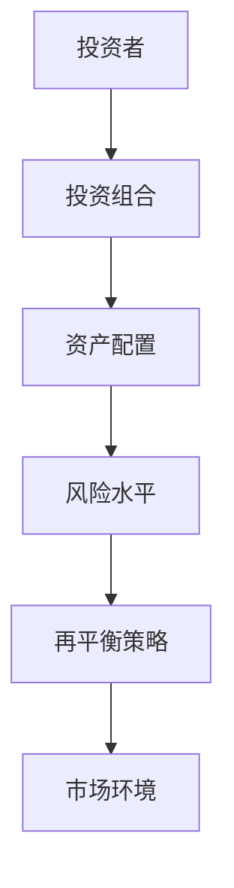

                 


# 伯格的投资组合再平衡：保持风险水平

> 关键词：投资组合，再平衡，风险管理，伯格策略，动态调整

> 摘要：本文深入探讨了伯格投资组合再平衡策略的核心思想，分析了其在保持风险水平方面的数学模型和实现方法，结合实际案例展示了如何通过动态调整优化投资组合，保持风险与收益的平衡。文章从背景介绍、核心概念、算法原理、系统架构到项目实战，全面解析了投资组合再平衡的实现过程，并提供了丰富的代码示例和详细的系统设计。

---

## 第一部分: 投资组合再平衡的背景与基础

### 第1章: 投资组合再平衡概述

#### 1.1 投资组合再平衡的定义与意义

投资组合再平衡是投资者为了维持投资组合中各资产的权重与初始设定一致，或者根据市场变化和个人风险偏好进行调整的过程。这种调整有助于降低风险，优化收益，使投资组合在不同市场环境下保持稳定。

**为什么需要再平衡？**  
- 市场波动导致资产权重变化，偏离目标配置。  
- 风险偏好变化，需动态调整资产比例。  
- 经济周期变化，需优化资产配置。

#### 1.2 投资组合再平衡的背景与需求

**背景分析**  
- 投资者的风险承受能力随市场变化而变化。  
- 不同经济周期下，资产表现差异显著，需动态调整。  
- 再平衡策略是投资组合管理的重要组成部分。

**伯格的核心思想**  
- 投资组合的最优性依赖于动态调整。  
- 再平衡是维持风险水平的重要手段。  
- 基于市场环境和个人风险偏好的动态调整。

#### 1.3 伯格的投资组合再平衡方法

**再平衡的周期性**  
- 定期再平衡：如季度、半年或年度调整。  
- 动态再平衡：根据市场变化随时调整。  
- 风险水平导向的再平衡：根据当前风险水平决定调整幅度。

**风险水平的动态调整**  
- 基于波动率、VaR等风险指标。  
- 结合市场环境变化，动态调整资产权重。  
- 通过再平衡优化风险收益比。

---

### 第2章: 投资组合再平衡的数学基础

#### 2.1 投资组合优化的数学模型

**均值-方差优化模型**  
- 最优化目标：$ \min \sigma^2 $  
- 约束条件：$\sum w_i = 1$, $w_i \geq 0$  
- 数学表达式：  
$$ \min_w \sum_{i,j} w_i w_j \sigma_{ij} $$  

**资本资产定价模型（CAPM）**  
- 预测资产收益：$E[r_i] = r_f + \beta_i (E[r_m] - r_f)$  
- $\beta_i$ 表示资产的系统性风险。

**风险与收益的平衡方程**  
- 投资组合的期望收益与风险成正比。  
- 再平衡调整旨在找到最优风险收益比。

#### 2.2 投资组合再平衡的算法原理

**权重调整算法**  
- 计算当前资产权重：$w_i = \frac{A_i}{\sum A_j}$  
- 计算偏离目标权重：$\Delta w_i = w_i - w_i^{target}$  
- 调整资产数量：$A_i^{new} = A_i \times \frac{w_i^{target}}{w_i}$  

**基于风险水平的再平衡策略**  
- 计算当前风险水平：如波动率、VaR。  
- 根据风险水平调整目标权重：  
$$ w_i^{new} = w_i^{target} \times \frac{1}{1 + \alpha \times \text{风险水平}} $$  
- 其中，$\alpha$ 是调整系数。  

**动态再平衡的数学推导**  
- 假设市场环境变化导致资产收益变化。  
- 优化目标：最大化收益，最小化风险。  
- 使用拉格朗日乘数法求解优化问题。

---

### 第3章: 投资组合再平衡的核心概念与联系

#### 3.1 核心概念原理

**投资组合的构成要素**  
- 资产类别：股票、债券、现金等。  
- 权重分配：各资产在组合中的比例。  
- 风险水平：波动率、VaR等风险指标。  

**再平衡对风险水平的影响**  
- 调整资产权重以降低风险。  
- 动态再平衡根据市场变化调整权重。  
- 通过再平衡优化风险收益比。

#### 3.2 核心概念属性对比表

| 概念       | 属性1         | 属性2         | 属性3         |
|------------|---------------|---------------|---------------|
| 投资组合   | 资产类别       | 权重分配       | 风险水平       |
| 再平衡策略 | 调整频率       | 调整幅度       | 调整依据       |

#### 3.3 实体关系图（Mermaid）



---

## 第四章: 投资组合再平衡的系统分析与架构设计

### 4.1 问题场景介绍

**问题描述**  
- 投资组合权重偏离目标配置。  
- 市场波动导致风险水平变化。  
- 投资者风险偏好变化。  

**边界与外延**  
- 再平衡的周期性：定期或动态。  
- 再平衡的触发条件：权重偏离、风险水平变化。  
- 再平衡的实现方式：调整资产数量或权重。  

**核心要素组成**  
- 投资组合：资产配置、权重分配、风险水平。  
- 再平衡策略：调整规则、触发条件、调整幅度。  
- 市场环境：市场波动、经济周期。  

---

### 第5章: 投资组合再平衡的系统分析

#### 5.1 项目介绍

**项目目标**  
- 开发一个基于伯格策略的投资组合再平衡系统。  
- 实现动态再平衡，保持风险水平。  

**系统功能设计**

**领域模型（Mermaid类图）**


**系统架构设计（Mermaid架构图）**


---

### 第6章: 项目实战

#### 6.1 环境安装

**Python环境配置**  
- 安装必要的库：numpy, pandas, matplotlib.  
- 使用Anaconda或virtualenv管理环境。  

#### 6.2 核心实现源代码

```python
import numpy as np
import pandas as pd
import matplotlib.pyplot as plt

def calculate_weights(portfolio, target_weights):
    current_weights = portfolio / portfolio.sum()
    deviations = target_weights - current_weights
    adjustments = {}
    for asset in portfolio.columns:
        if deviations[asset] != 0:
            adjustments[asset] = portfolio[asset] * (1 + deviations[asset])
    return adjustments

def rebalance_portfolio(portfolio, target_weights, tolerance=0.01):
    current_weights = portfolio / portfolio.sum()
    rebalanced = portfolio.copy()
    for asset in portfolio.columns:
        if abs(current_weights[asset] - target_weights[asset]) > tolerance:
            rebalanced[asset] = portfolio[asset] * (target_weights[asset] / current_weights[asset])
    return rebalanced

# 示例数据
portfolio = pd.DataFrame({
    '股票': [100, 200, 300],
    '债券': [50, 150, 250],
    '现金': [20, 60, 100]
})

target_weights = {'股票': 0.6, '债券': 0.3, '现金': 0.1}

# 计算调整
adjustments = calculate_weights(portfolio, target_weights)
print("调整建议：", adjustments)

# 再平衡
rebalanced = rebalance_portfolio(portfolio, target_weights)
print("再平衡后组合：", rebalanced)
```

---

### 第7章: 总结与最佳实践

#### 7.1 小结

投资组合再平衡是维持风险水平的重要手段。本文详细分析了伯格策略的核心思想，结合数学模型和系统架构设计，展示了如何通过动态调整优化投资组合。

#### 7.2 注意事项

- 定期审查和调整再平衡策略。  
- 注意交易成本和税收影响。  
- 考虑市场环境变化和投资者风险偏好。  

#### 7.3 拓展阅读

- 《投资学》（书籍）  
- Modern Portfolio Theory（学术论文）  
- 风险管理相关技术博客文章  

---

**作者：AI天才研究院/AI Genius Institute & 禅与计算机程序设计艺术 /Zen And The Art of Computer Programming**

