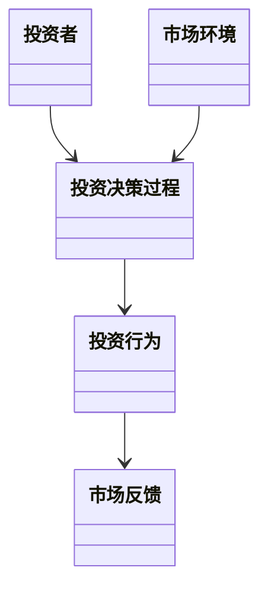
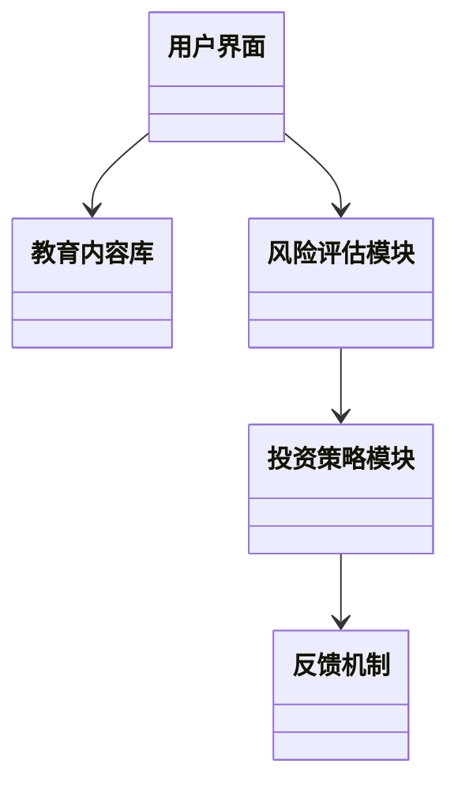

                 


# 伯格的投资者教育理念：应对金融素养差距的挑战

## 关键词：投资者教育，金融素养，长期投资，风险管理，伯格理念

## 摘要：  
本文深入探讨了伯格的投资者教育理念，分析了其在应对当前金融素养差距中的重要作用。通过系统性地介绍伯格理念的核心概念、模型与算法，结合实际案例，本文旨在为投资者教育领域提供理论与实践相结合的解决方案，帮助读者更好地理解并应用伯格理念来应对金融素养挑战。

---

## 第一部分: 伯格的投资者教育理念概述

### 第1章: 投资者教育的核心背景与问题背景

#### 1.1 金融素养的现状与挑战

##### 1.1.1 什么是金融素养
金融素养是指个人在金融知识、技能和行为习惯方面的综合能力，包括理解金融产品、管理个人财务和做出理性投资决策的能力。  

##### 1.1.2 当前金融素养的差距
- **知识差距**：许多投资者缺乏对基本金融概念的理解，例如复利、风险分散和资产配置。  
- **行为差距**：投资者往往受情绪驱动，容易陷入追涨杀跌的非理性行为。  
- **技能差距**：缺乏分析和评估金融产品的能力，容易受到销售误导。  

##### 1.1.3 金融素养差距的根源分析
- **教育不足**：学校和家庭通常不重视金融知识的教育。  
- **信息不对称**：金融机构往往利用信息优势误导投资者。  
- **认知偏差**：投资者容易受到心理偏差（如过度自信、从众心理）的影响。  

#### 1.2 投资者教育的重要性

##### 1.2.1 投资者教育的核心目标
- 提高投资者的金融知识水平。  
- 培养理性投资行为和长期投资理念。  
- 帮助投资者识别和管理风险。  

##### 1.2.2 投资者教育与金融市场的关系
- 投资者教育是维护金融市场健康运行的基础。  
- 教育不足会导致市场参与者的非理性行为，引发市场波动。  
- 通过教育提高投资者素质，可以促进市场的长期稳定发展。  

##### 1.2.3 伯格投资者教育理念的提出背景
- 伯格的理念源于对投资者行为的深入研究和对金融市场的深刻理解。  
- 他强调通过教育帮助投资者避免常见误区，实现长期稳健的投资收益。  

---

### 第2章: 伯格投资者教育理念的核心概念

#### 2.1 伯格投资者教育理念的定义

##### 2.1.1 伯格理念的核心要素
| 核心要素         | 描述内容                                   |
|------------------|------------------------------------------|
| 以投资者为中心    | 强调投资者的需求和目标，而非推销产品。   |
| 长期视角         | 鼓励投资者关注长期回报，避免短期波动影响决策。 |
| 价值导向         | 强调基本面分析和长期价值，而非短期价格波动。 |
| 风险管理         | 帮助投资者识别和管理投资风险，制定合理风险承受策略。 |
| 行为心理学结合    | 通过行为心理学分析投资者的决策偏差，制定应对策略。 |

##### 2.1.2 伯格理念与传统投资者教育的对比
| 对比维度         | 伯格理念                                   | 传统投资者教育                            |
|------------------|------------------------------------------|------------------------------------------|
| 核心目标         | 帮助投资者实现长期稳健回报                | 提供金融知识和工具                         |
| 方法论           | 结合行为心理学和长期价值投资              | 侧重金融知识的普及                        |
| 重点             | 投资者的心理行为和决策过程                | 金融产品的基本知识                        |

#### 2.2 伯格理念的关键特征

##### 2.2.1 以投资者为中心
- 强调投资者的个性化需求和风险承受能力。  
- 避免一刀切的教育方式，注重差异化。  

##### 2.2.2 长期视角与价值导向
- 长期视角：强调投资的长期性，避免短期波动干扰。  
- 价值导向：关注企业的基本面和长期价值，而非短期价格波动。  

##### 2.2.3 风险管理与心理行为结合
- 风险管理：通过分散投资和合理资产配置降低风险。  
- 心理行为：分析投资者的认知偏差（如过度自信、从众心理）并制定应对策略。  

#### 2.3 伯格理念的理论基础

##### 2.3.1 现代投资组合理论
- 由哈里·马科维茨提出，强调通过分散投资降低风险。  
- 伯格理念在此基础上，进一步强调长期持有优质资产。  

##### 2.3.2 行为金融学
- 研究投资者的心理偏差及其对决策的影响。  
- 伯格理念通过行为心理学分析投资者行为，制定教育策略。  

##### 2.3.3 有效市场假说
- 有效市场假称市场价格反映所有可用信息，无法通过短期交易获利。  
- 伯格理念强调长期投资优质资产，获取市场的平均回报。  

---

### 第3章: 伯格理念的核心模型与架构

#### 3.1 伯格理念的系统架构

##### 3.1.1 系统输入：投资者需求与市场环境
- 投资者需求：包括风险承受能力、投资目标和时间 horizon。  
- 市场环境：包括市场波动、经济周期和政策变化。  

##### 3.1.2 核心模块：投资决策过程
- 通过基本面分析和长期视角制定投资策略。  
- 强调风险管理，避免非理性决策。  

##### 3.1.3 输出结果：投资行为与市场反馈
- 投资行为：投资者根据教育理念做出的决策。  
- 市场反馈：市场对投资者行为的反应，影响投资结果。  

#### 3.2 伯格理念的领域模型


#### 3.3 伯格理念的ER实体关系图
```mermaid
erd
    entity 投资者
    entity 市场环境
    entity 投资决策过程
    entity 投资行为
    entity 市场反馈
    投资者 --> 投资决策过程
    市场环境 --> 投资决策过程
    投资决策过程 --> 投资行为
    投资行为 --> 市场反馈
```

---

### 第4章: 伯格理念的算法原理与数学模型

#### 4.1 伯格理念的算法流程
```mermaid
graph TD
    A[开始] --> B[投资者需求分析]
    B --> C[市场环境评估]
    C --> D[制定投资策略]
    D --> E[执行投资行为]
    E --> F[评估市场反馈]
    F -->
```

#### 4.2 伯格理念的数学模型

##### 4.2.1 风险管理模型
$$ \text{风险调整后收益} = \text{预期收益} - \text{风险溢价} $$

##### 4.2.2 长期投资回报模型
$$ \text{长期回报} = \sum_{i=1}^{n} r_i $$

##### 4.2.3 资产配置模型
$$ \text{最优资产配置} = \argmin \sigma^2 \text{在约束条件下} $$

---

### 第5章: 伯格理念的系统分析与架构设计

#### 5.1 问题场景介绍
- **目标用户**：普通投资者、教育机构、金融机构。  
- **核心需求**：提供个性化的投资者教育方案，帮助用户实现长期稳健投资。  

#### 5.2 系统功能设计


#### 5.3 系统架构设计


---

### 第6章: 伯格理念的项目实战

#### 6.1 环境安装
- **工具**：Python、Jupyter Notebook、Mermaid。  
- **依赖库**：pandas、numpy、matplotlib。  

#### 6.2 核心实现源代码
```python
import pandas as pd
import numpy as np
import matplotlib.pyplot as plt

# 示例代码：计算投资组合的期望收益和风险
def calculate_portfolio_return(weights, returns):
    return np.dot(weights.T, returns)

def calculate_portfolio_variance(weights, returns, covariance_matrix):
    return np.dot(weights.T, np.dot(covariance_matrix, weights))
```

---

### 第7章: 最佳实践与小结

#### 7.1 最佳实践 Tips
- **长期视角**：避免短期波动干扰，坚持长期投资。  
- **风险管理**：合理分散投资，控制风险敞口。  
- **行为心理学**：了解自身认知偏差，避免非理性决策。  

#### 7.2 注意事项
- 投资者教育需要长期坚持，不能急于求成。  
- 伯格理念适用于不同类型的投资者，但需要根据个人需求调整。  

#### 7.3 拓展阅读
- 哈里·马科维茨的《投资学原理》。  
- 行为金融学经典著作《怪诞行为学》。

---

## 结论

伯格的投资者教育理念通过结合金融理论、行为心理学和长期投资策略，为应对金融素养差距提供了系统的解决方案。本文通过理论分析、模型构建和实际案例，详细阐述了伯格理念的核心思想和实践方法，为投资者教育领域提供了宝贵的参考。未来，随着技术的进步和金融市场的变化，伯格理念将继续发挥其重要价值，帮助更多投资者实现稳健的财务目标。  

---

**作者：AI天才研究院/AI Genius Institute & 禅与计算机程序设计艺术 /Zen And The Art of Computer Programming**

