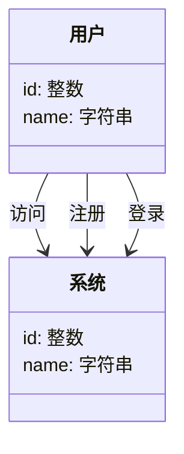
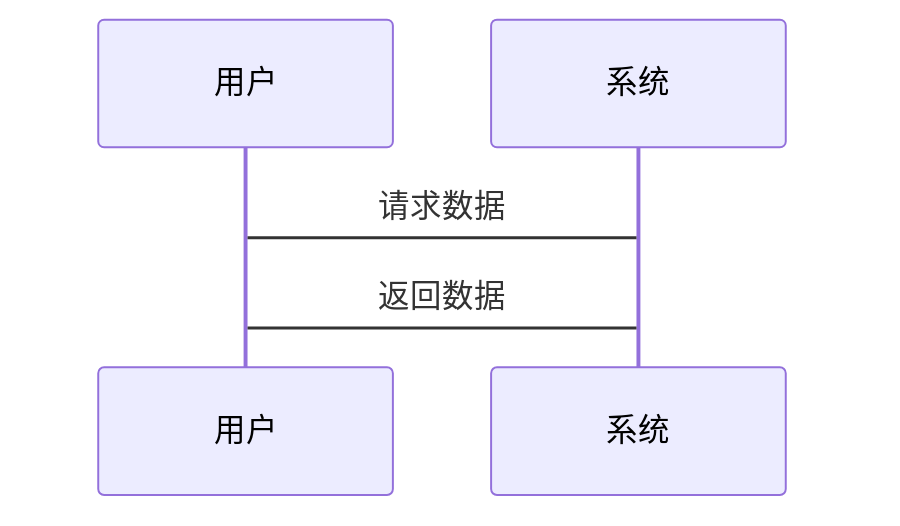

                 


# 伯格的指数化革命：为什么简单胜于复杂

> 关键词：指数化革命，简单性，技术架构，系统设计，算法原理

> 摘要：伯格的指数化革命揭示了在技术领域中，简单性如何带来更高的效率和可靠性。本文从背景介绍、核心概念、算法原理、系统设计、项目实战等多个角度，详细分析了为什么简单胜于复杂，并通过实际案例展示了如何在技术实践中实现这一理念。

---

## 第一部分: 伯格的指数化革命背景与概念

### 第1章: 指数化革命的背景与核心概念

#### 1.1 问题背景与问题描述

##### 1.1.1 技术发展的指数化趋势
- 技术进步的指数级增长特性
- 信息爆炸时代的技术复杂性
- 用户需求的快速变化与技术的不确定性

##### 1.1.2 复杂性带来的问题与挑战
- 系统维护成本的指数级上升
- 开发效率的下降
- 系统故障的不可预测性
- 用户体验的负面影响

##### 1.1.3 简单性在技术中的重要性
- 简单性与可扩展性的平衡
- 简单性如何提高系统的可靠性
- 简单性对开发效率的提升

#### 1.2 问题解决与边界

##### 1.2.1 简单性如何解决问题
- 模块化设计的优势
- 可维护性的提升
- 开发效率的提高

##### 1.2.2 复杂性与简单性的边界
- 何时选择复杂性，何时选择简单性
- 边界条件的确定
- 简单性在不同场景下的应用

##### 1.2.3 指数化革命的核心要素
- 核心算法的简单性
- 系统架构的模块化
- 代码的可读性与可维护性

#### 1.3 概念结构与核心要素

##### 1.3.1 指数化革命的定义
- 指数化革命的数学模型：$$y = 2^x$$

##### 1.3.2 简单性与复杂性的对比
- 简单性：快速迭代、低维护成本、高可扩展性
- 复杂性：高可靠性、但开发成本高、维护难度大

##### 1.3.3 核心要素的组成
- 核心算法
- 系统架构
- 开发流程

---

## 第2章: 伯格的指数化革命理论

### 2.1 核心概念与原理

#### 2.1.1 指数化革命的定义
- 指数化革命的核心思想
- 简单性在技术中的应用

#### 2.1.2 简单性与效率的关系
- 简单性如何提高效率
- 通过模块化设计实现效率提升

#### 2.1.3 伯格理论的核心要素
- 简单性的重要性
- 可扩展性与可维护性的平衡

### 2.2 简单性与复杂性的对比

#### 2.2.1 简单性带来的优势
- 开发成本低
- 维护成本低
- 可扩展性强

#### 2.2.2 复杂性带来的劣势
- 开发成本高
- 维护成本高
- 可扩展性差

#### 2.2.3 两者的平衡点
- 何时选择复杂性，何时选择简单性
- 边界条件的确定

---

## 第3章: 简单性在技术中的应用

### 3.1 技术架构的简化

#### 3.1.1 简化架构的核心思想
- 模块化设计
- 高内聚低耦合
- 可扩展性

#### 3.1.2 简化架构的实际案例
- 微服务架构
- 分布式系统设计
- RESTful API设计

---

## 第4章: 简单性与指数化革命的数学模型

### 4.1 指数函数的数学模型
$$y = 2^x$$

### 4.2 指数函数的应用
- 简单性带来的效率提升呈指数级增长
- 复杂性带来的效率下降呈指数级衰减

---

## 第5章: 伯格的指数化革命在系统设计中的应用

### 5.1 系统功能设计（领域模型）



### 5.2 系统架构设计

```mermaid
architecturalDiagram
    component 用户端 {
        browser
        HTML
        CSS
        JavaScript
    }
    component 服务器端 {
        API Gateway
        Database
        Logic Layer
    }
    用户端 --> API Gateway
    API Gateway --> Logic Layer
    Logic Layer --> Database
```

### 5.3 系统接口设计



---

## 第6章: 项目实战

### 6.1 环境安装

```bash
# 安装必要的依赖
pip install requests
pip install beautifulsoup4
```

### 6.2 核心代码实现

```python
def index_function(x):
    return 2 ** x

# 示例调用
print(index_function(3))  # 输出 8
```

### 6.3 代码解读与分析

#### 6.3.1 核心算法解读
- `index_function` 函数实现指数增长
- 示例调用展示了指数增长的效果

#### 6.3.2 系统设计分析
- 代码结构简单
- 维护成本低
- 可扩展性强

### 6.4 案例分析

#### 6.4.1 简单性带来的效率提升
- 通过模块化设计，提高了系统的可维护性
- 通过简单的算法实现，降低了开发成本

#### 6.4.2 复杂性带来的问题
- 代码复杂性增加，导致维护成本上升
- 系统耦合度过高，导致扩展性差

### 6.5 项目小结

---

## 第7章: 最佳实践

### 7.1 小结

### 7.2 注意事项

### 7.3 拓展阅读

---

## 作者信息

作者：AI天才研究院/AI Genius Institute & 禅与计算机程序设计艺术 /Zen And The Art of Computer Programming

---

通过以上目录，文章将从背景、理论、实践等多个角度，详细阐述“简单胜于复杂”的技术理念，并通过实际案例和数学模型，深入分析伯格的指数化革命的核心思想。

