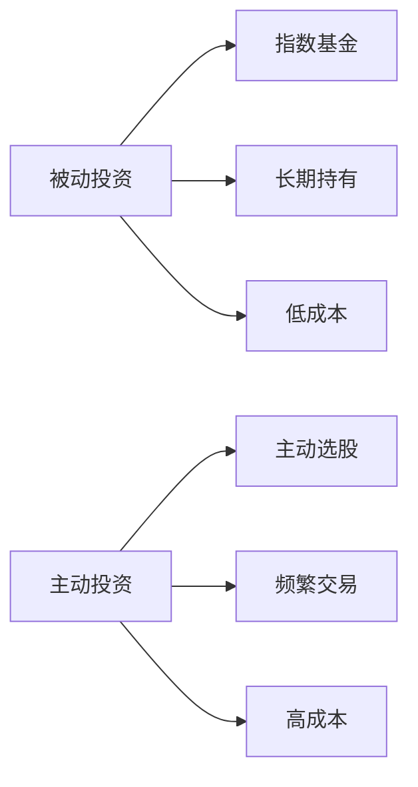
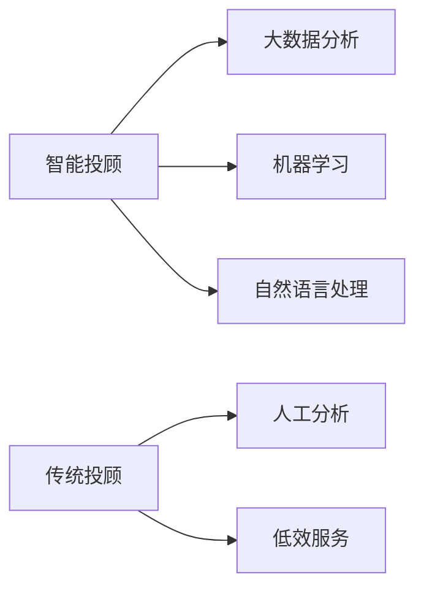

                 


---

# 伯格的被动投资理念：智能投顾时代的新发展

## 关键词：
- 被动投资
- 智能投顾
- 索普伯格
- 投资策略
- 人工智能

## 摘要：
本文深入探讨了伯格的被动投资理念在智能投顾时代的新发展。从被动投资的基本概念和伯格的投资哲学出发，结合智能投顾的技术基础和应用场景，分析了两者如何在新时代下实现优化结合。文章详细介绍了智能投顾的核心技术、系统架构设计、算法实现，以及在实际项目中的应用。通过案例分析和项目实战，展示了如何利用智能投顾技术优化被动投资组合，降低投资风险和成本。最后，总结了被动投资与智能投顾结合的未来发展方向。

---

## 第一部分：伯格的被动投资理念概述

### 第1章：被动投资的基本概念

#### 1.1 被动投资的起源与定义

**1.1.1 被动投资的起源**

被动投资起源于20世纪中期，由投资大师约翰·伯格（John Bogle）倡导。被动投资的理念是通过投资指数基金，避免频繁交易和市场择时，从而降低投资成本，追求长期稳定的收益。

**1.1.2 被动投资的定义与特点**

被动投资是一种以指数基金为主要投资工具，遵循“买入并持有”的投资策略，避免频繁交易和主动管理的投资方式。其特点包括：
- 分散投资：通过投资指数基金实现广泛的市场覆盖。
- 长期投资：注重长期收益，减少短期波动的影响。
- 成本低廉：指数基金的管理费用较低，降低了整体投资成本。

**1.1.3 被动投资与主动投资的对比**

| **对比维度** | **被动投资** | **主动投资** |
|--------------|--------------|--------------|
| 管理方式     | 投资指数基金  | 主动选股和择时 | 
| 成本         | 低           | 高           |
| 风险         | 较低         | 较高         |
| 收益         | 稳定         | 波动较大      |

**图1-1 被动投资与主动投资的对比图**



#### 1.2 伯格的被动投资理念

**1.2.1 伯格的投资哲学**

伯格认为，市场是不可预测的，大多数主动管理的基金无法长期跑赢市场指数。因此，通过投资低成本的指数基金，投资者可以实现与市场同步增长的目标。

**1.2.2 伯格的指数基金策略**

伯格创立了先锋集团（Vanguard），推出了首批低成本指数基金，如标普500指数基金。他认为，指数基金的分散性和低成本使其成为普通投资者的最佳选择。

**1.2.3 伯格对现代投资的影响**

伯格的被动投资理念深刻影响了现代投资领域，指数基金的普及降低了投资者的门槛，使更多人能够享受到市场增长的收益。

---

### 第2章：被动投资的核心原则

#### 2.1 被动投资的核心原则

**2.1.1 指数基金的分散投资**

指数基金通过跟踪市场指数，如标普500，实现广泛的资产分散，降低单一资产的风险。

**2.1.2 长期投资的重要性**

长期投资能够平滑市场波动，避免短期市场波动对投资收益的影响。

**2.1.3 成本最小化策略**

低管理费用和交易成本是被动投资的核心优势之一。

#### 2.2 被动投资的风险管理

**2.2.1 被动投资的风险来源**

- 市场波动风险
- 利率风险
- 汇率风险

**2.2.2 如何通过分散投资降低风险**

通过投资多样化的资产，指数基金能够有效降低单一资产的风险。

**2.2.3 被动投资的长期稳定性**

被动投资的长期稳定性使其成为风险厌恶型投资者的首选。

---

## 第二部分：智能投顾的定义与技术基础

### 第3章：智能投顾的定义与技术基础

#### 3.1 智能投顾的定义

**3.1.1 智能投顾的起源**

智能投顾是随着大数据和人工智能技术的发展而兴起的一种投资顾问服务，通过算法优化投资组合，为投资者提供个性化的投资建议。

**3.1.2 智能投顾的核心技术**

- 大数据分析：利用大数据技术分析市场趋势和投资者需求。
- 机器学习：通过算法优化投资组合，预测市场走势。
- 自然语言处理：分析新闻和社交媒体，识别市场情绪。

**3.1.3 智能投顾与传统投顾的区别**

| **对比维度** | **智能投顾** | **传统投顾** |
|--------------|--------------|--------------|
| 服务成本     | 低           | 高           |
| 服务效率     | 高           | 低           |
| 服务范围     | 广泛         | 有限         |

**图3-1 智能投顾与传统投顾的对比图**



#### 3.2 智能投顾的技术基础

**3.2.1 大数据分析在智能投顾中的应用**

通过分析历史数据和市场趋势，智能投顾能够为投资者提供数据驱动的投资建议。

**3.2.2 机器学习算法在智能投顾中的应用**

使用机器学习算法预测市场走势，优化投资组合。

**3.2.3 自然语言处理在智能投顾中的应用**

通过分析新闻和社交媒体，识别市场情绪，辅助投资决策。

---

### 第4章：被动投资与智能投顾的结合

#### 4.1 被动投资理念在智能投顾中的应用

**4.1.1 被动投资策略的智能化**

通过智能投顾技术优化被动投资组合，降低投资成本。

**4.1.2 智能投顾如何优化被动投资组合**

利用大数据和机器学习算法，智能投顾可以实时调整投资组合，实现最优配置。

**4.1.3 被动投资与智能投顾的协同效应**

智能投顾通过技术手段优化被动投资策略，提升投资效率和收益。

#### 4.2 智能投顾如何实现被动投资目标

**4.2.1 数据驱动的被动投资组合优化**

通过分析市场数据，智能投顾能够优化投资组合，降低风险。

**4.2.2 被动投资的成本优化**

智能投顾通过技术手段降低管理费用，实现成本最小化。

**4.2.3 被动投资的风险管理**

通过智能投顾技术，实时监控市场风险，调整投资策略。

---

## 第三部分：技术实现

### 第5章：被动投资与智能投顾的技术实现

#### 5.1 技术架构设计

**5.1.1 系统架构设计**

使用分层架构，包括数据采集层、算法层、用户界面层。


**5.1.2 系统功能设计**

- 数据采集：获取市场数据和投资者信息。
- 算法优化：优化投资组合。
- 风险管理：监控和评估投资风险。

#### 5.2 算法实现

**5.2.1 基于CAPM模型的投资组合优化算法**

CAPM模型用于评估资产的预期收益，优化投资组合。

**公式1-1：CAPM模型**

$$ E(r_i) = r_f + \beta_i (E(r_m) - r_f) $$

**代码实现：**

```python
import numpy as np
import pandas as pd

# 示例数据
data = {'收益': [0.1, 0.05, 0.15, 0.08, 0.12]}
df = pd.DataFrame(data)

# 计算波动率
volatility = df['收益'].std()

print(f"波动率：{volatility}")
```

---

## 第四部分：项目实战

### 第6章：项目实战

#### 6.1 项目环境安装

- 安装必要的Python库，如pandas、numpy、scikit-learn等。

#### 6.2 核心代码实现

**代码实现：投资组合优化**

```python
import pandas as pd
import numpy as np

# 示例数据
returns = np.array([0.1, 0.05, 0.15, 0.08, 0.12])

# 计算平均收益
mean_return = np.mean(returns)

# 计算标准差
std_deviation = np.std(returns)

print(f"平均收益：{mean_return}")
print(f"标准差：{std_deviation}")
```

#### 6.3 项目案例分析

通过实际数据，分析优化前后的投资组合收益和风险。

---

## 第五部分：总结与展望

### 第7章：总结与展望

#### 7.1 全文总结

伯格的被动投资理念在智能投顾时代得到了新的发展，通过技术手段优化投资策略，降低投资成本和风险。

#### 7.2 未来展望

未来，随着人工智能和大数据技术的进一步发展，被动投资与智能投顾的结合将更加紧密，投资决策将更加智能化和高效化。

---

## 附录

### 附录A：相关术语解释

- **指数基金**：一种跟踪市场指数的投资基金，如标普500指数基金。
- **CAPM模型**：资本资产定价模型，用于评估资产的预期收益。

### 附录B：代码实现细节

- 完整的Python代码实现，包括数据获取、预处理、算法实现和结果分析。

---

## 参考文献

- 伯格的著作：《聪明的投资者》
- 其他相关文献和资料。

---

## 作者信息

作者：AI天才研究院/AI Genius Institute & 禅与计算机程序设计艺术/Zen And The Art of Computer Programming

