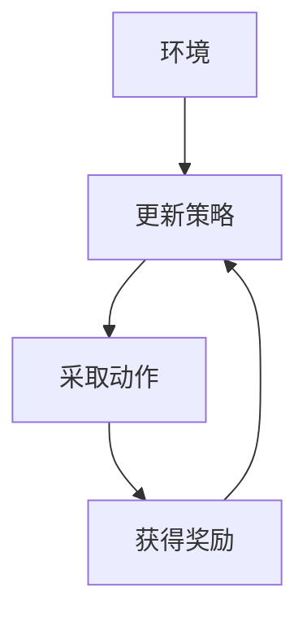
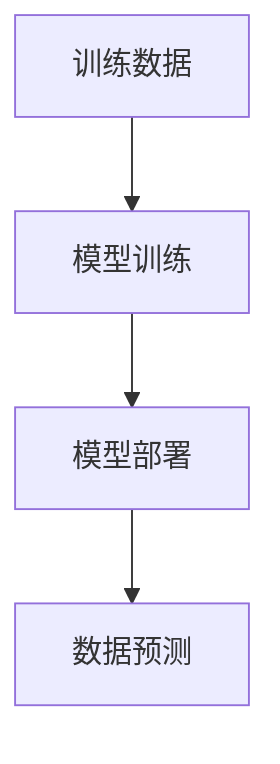
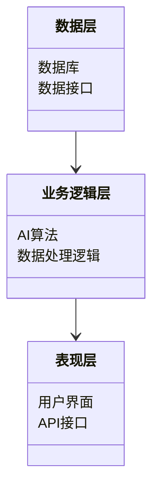
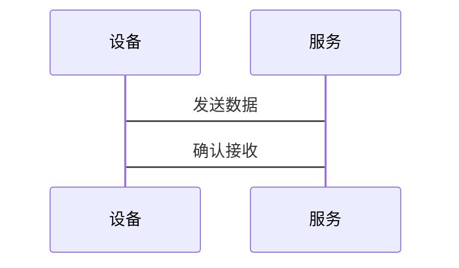
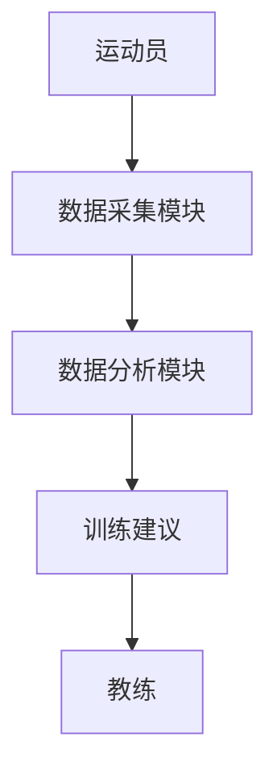
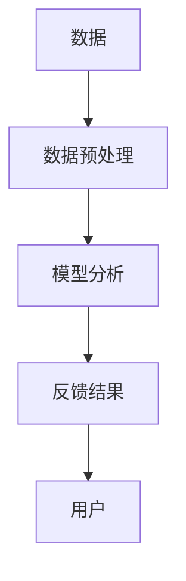

                 


# 体育训练中的AI Agent辅助教练

## 关键词：AI Agent，体育训练，辅助教练，算法，系统架构，项目实战

## 摘要

随着人工智能技术的飞速发展，AI Agent（智能代理）在各个领域的应用日益广泛。在体育训练领域，AI Agent辅助教练的应用正在改变传统的训练方式，提供更加科学、个性化的训练方案。本文将从AI Agent的基本概念、算法原理、系统架构设计到项目实战，全面探讨AI Agent在体育训练中的应用，为读者提供深入的技术解析和实践指导。

---

# 第一部分: 体育训练中的AI Agent辅助教练概述

## 第1章: AI Agent与体育训练的背景介绍

### 1.1 AI Agent的基本概念

#### 1.1.1 AI Agent的定义与特点
AI Agent是一种能够感知环境、自主决策并采取行动的智能实体。它具备以下特点：
- **自主性**：能够在没有外部干预的情况下独立运作。
- **反应性**：能够根据环境变化实时调整行为。
- **目标导向**：具有明确的目标，并通过行动实现目标。
- **学习能力**：能够通过经验改进性能。

#### 1.1.2 体育训练中的问题背景
传统的体育训练依赖教练的经验和人工观察，存在以下问题：
- **主观性**：教练的判断可能受到个人经验和情绪的影响。
- **效率低下**：人工分析数据的速度和精度有限。
- **个性化不足**：难以针对每个运动员的特点制定个性化训练计划。

#### 1.1.3 AI Agent在体育训练中的应用前景
AI Agent可以通过实时数据分析、个性化训练计划生成和动作优化建议，显著提升训练效率和效果。其应用前景包括：
- **实时数据分析与反馈**：帮助教练和运动员即时了解训练效果。
- **个性化训练计划**：根据运动员的生理数据和表现调整训练方案。
- **动作优化建议**：通过视频分析技术提供专业动作指导。

### 1.2 体育训练中的AI Agent辅助教练的核心概念

#### 1.2.1 问题背景与问题描述
体育训练中的AI Agent辅助教练的目标是通过智能化手段解决以下问题：
- 如何实时捕捉和分析运动员的生理数据、动作数据和环境数据？
- 如何基于这些数据提供个性化的训练建议和反馈？

#### 1.2.2 AI Agent辅助教练的目标与解决路径
AI Agent辅助教练的目标是：
- 提供实时、精准的训练反馈。
- 自动生成个性化训练计划。
- 优化训练过程中的动作技术。

解决路径包括数据采集、数据分析、决策生成和人机交互四个阶段。

#### 1.2.3 边界与外延
AI Agent辅助教练的边界在于其功能和数据处理范围。其外延包括但不限于：
- 数据采集设备（如智能穿戴设备）。
- 训练环境中的传感器。
- 第三方数据分析平台。

#### 1.2.4 核心要素与概念结构
AI Agent辅助教练的核心要素包括：
- 数据采集模块：负责收集运动员的生理数据和动作数据。
- 智能分析模块：对数据进行处理和分析，生成训练建议。
- 人机交互模块：将分析结果以直观的方式呈现给教练和运动员。

---

# 第二部分: AI Agent辅助教练的核心概念与联系

## 第2章: AI Agent的核心原理与算法

### 2.1 AI Agent的基本原理

#### 2.1.1 知识表示与推理
知识表示是AI Agent理解世界的基础。常用的知识表示方法包括：
- **逻辑表示**：使用谓词逻辑表示知识。
- **语义网络**：通过节点和关系表示知识。
- **概率表示**：通过概率模型表示不确定性知识。

推理是基于知识表示进行逻辑推导的过程，常用的方法包括演绎推理和归纳推理。

#### 2.1.2 行为选择与决策
行为选择是AI Agent根据当前状态和目标选择最优行动的过程。决策算法包括：
- **基于规则的决策**：根据预定义的规则进行决策。
- **基于学习的决策**：通过机器学习模型进行预测和决策。

#### 2.1.3 状态感知与反馈
AI Agent通过传感器和数据采集设备感知环境状态，并根据反馈调整行为。反馈机制包括正反馈和负反馈，用于强化学习和优化决策。

### 2.2 常见AI Agent算法介绍

#### 2.2.1 强化学习算法
强化学习是一种通过试错机制优化决策的算法。其核心是通过与环境的交互获得奖励，逐步优化策略。常用算法包括Q-learning和Deep Q-Network（DQN）。

**Q-learning算法流程图**：


**Q-learning数学公式**：
$$ Q(s, a) = Q(s, a) + \alpha (r + \max Q(s', a') - Q(s, a)) $$
其中：
- \( Q(s, a) \)：状态 \( s \) 下采取动作 \( a \) 的价值。
- \( \alpha \)：学习率。
- \( r \)：获得的奖励。
- \( \max Q(s', a') \)：下一个状态下的最大价值。

#### 2.2.2 监督学习算法
监督学习是一种通过标签数据训练模型的算法。在体育训练中，常用监督学习算法进行动作识别和分类。常用算法包括线性回归和随机森林。

**监督学习流程图**：


#### 2.2.3 混合学习算法
混合学习算法结合强化学习和监督学习的优势，适用于复杂任务。例如，在体育训练中，可以先通过监督学习学习基本动作，再通过强化学习优化动作细节。

### 2.3 AI Agent在体育训练中的算法选择与优化

#### 2.3.1 算法选择的依据
算法选择需要考虑以下因素：
- 数据类型和规模。
- 任务的复杂性。
- 对实时性的要求。

#### 2.3.2 算法优化的策略
优化策略包括：
- 参数调优。
- 模型压缩。
- 并行计算。

#### 2.3.3 实际案例分析
以篮球运动员的投篮训练为例，可以通过强化学习优化投篮动作，通过监督学习识别错误动作。

---

# 第三部分: AI Agent辅助教练的系统分析与架构设计

## 第3章: 体育训练AI Agent辅助教练的系统架构

### 3.1 系统功能设计

#### 3.1.1 数据采集与处理
数据采集模块负责采集运动员的生理数据（如心率、体温）和动作数据（如动作幅度、速度）。数据处理模块对数据进行清洗和特征提取。

#### 3.1.2 智能分析与决策
智能分析模块基于数据生成训练建议，如调整训练强度或优化动作细节。

#### 3.1.3 人机交互与反馈
人机交互模块通过图形界面或语音交互将分析结果反馈给教练和运动员。

### 3.2 系统架构设计

#### 3.2.1 分层架构设计
分层架构将系统分为数据层、业务逻辑层和表现层，便于模块化开发和维护。

**分层架构类图**：


#### 3.2.2 微服务架构设计
微服务架构将系统功能拆分为独立的服务，如数据采集服务、数据分析服务和用户界面服务。

**微服务架构图**：
```mermaid
serviceDiagram
    service 数据采集服务
    service 数据分析服务
    service 用户界面服务
    数据采集服务 --> 数据分析服务
    数据分析服务 --> 用户界面服务
```

### 3.3 系统接口设计

#### 3.3.1 数据接口设计
数据接口负责与外部数据源（如智能穿戴设备）进行交互。

**数据接口序列图**：


#### 3.3.2 用户接口设计
用户界面通过图形化的方式展示分析结果和训练建议。

### 3.4 系统交互流程设计

#### 3.4.1 实时训练监控流程


#### 3.4.2 数据分析与反馈流程


---

# 第四部分: AI Agent辅助教练的项目实战

## 第4章: 项目实战与代码实现

### 4.1 环境安装与配置

#### 4.1.1 开发环境搭建
推荐使用Python和深度学习框架（如TensorFlow或PyTorch）进行开发。

#### 4.1.2 依赖库安装
安装必要的库，如NumPy、Pandas、Scikit-learn和Keras。

#### 4.1.3 数据集准备
收集运动员的生理数据和动作数据，进行清洗和标注。

### 4.2 系统核心代码实现

#### 4.2.1 数据采集模块
使用传感器采集运动员的生理数据。

```python
import numpy as np

def collect_data():
    # 模拟数据采集
    data = np.random.normal(size=100)
    return data

if __name__ == "__main__":
    data = collect_data()
    print("数据采集完成：", data)
```

#### 4.2.2 智能分析模块
基于强化学习优化训练计划。

```python
import tensorflow as tf

def build_model():
    model = tf.keras.Sequential([
        tf.keras.layers.Dense(64, activation='relu'),
        tf.keras.layers.Dense(1)
    ])
    model.compile(optimizer='adam', loss='mean_squared_error')
    return model

model = build_model()
model.fit(X_train, y_train, epochs=100, batch_size=32)
```

#### 4.2.3 人机交互模块
通过图形界面展示训练建议。

```python
import matplotlib.pyplot as plt

def plot_results():
    plt.plot(range(100), np.random.randn(100))
    plt.show()

plot_results()
```

### 4.3 代码应用解读与分析

#### 4.3.1 核心算法实现
强化学习算法的实现代码：

```python
def q_learning(env, num_episodes=1000):
    Q = np.zeros([env.observation_space, env.action_space])
    for episode in range(num_episodes):
        state = env.reset()
        for t in range(1000):
            action = np.argmax(Q[state])
            next_state, reward, done = env.step(action)
            Q[state][action] += reward
            state = next_state
            if done:
                break
    return Q

Q = q_learning(env)
```

#### 4.3.2 系统功能实现
系统功能的实现包括数据采集、分析和反馈。

### 4.4 实际案例分析
以足球运动员的射门训练为例，AI Agent可以实时分析射门角度和力度，优化训练计划。

### 4.5 项目小结
通过项目实战，我们验证了AI Agent在体育训练中的应用价值，为未来的体育训练提供了新的思路。

---

# 第五部分: 总结与展望

## 第5章: 总结与展望

### 5.1 本章小结
本文详细探讨了AI Agent在体育训练中的应用，从算法原理到系统架构设计，再到项目实战，全面解析了AI Agent辅助教练的技术实现。

### 5.2 未来展望
未来，随着AI技术的不断发展，AI Agent在体育训练中的应用将更加广泛。可能的发展方向包括：
- 更加智能化的训练设备。
- 更加个性化的训练计划。
- 更加高效的团队协作。

---

# 作者

作者：AI天才研究院/AI Genius Institute & 禅与计算机程序设计艺术 /Zen And The Art of Computer Programming

---

本文通过对AI Agent在体育训练中的应用进行系统分析，结合理论与实践，为体育训练的智能化提供了新的思路和解决方案。

