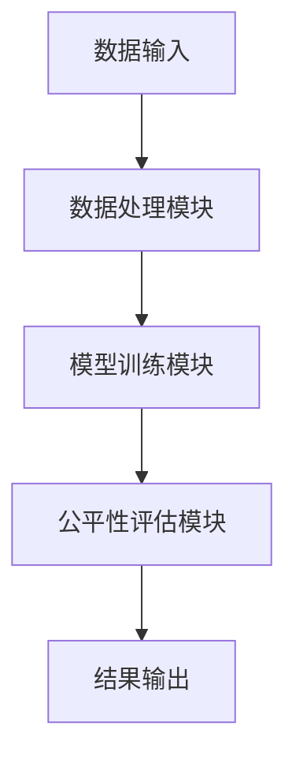

                 


# 偏见检测与缓解：提高AI Agent的公平性

> 关键词：偏见检测、AI Agent、公平性、机器学习、算法优化

> 摘要：在人工智能快速发展的今天，AI Agent在各个领域的应用日益广泛，但其潜在的偏见问题也逐渐暴露出来。本文将深入探讨偏见检测与缓解的核心概念、算法原理、系统设计以及项目实战，旨在提高AI Agent的公平性。文章内容涵盖偏见的定义与影响、偏见检测与缓解的方法、数学模型、系统架构设计以及实际案例分析，帮助读者全面理解并解决AI Agent中的偏见问题。

---

## 第1章：偏见的定义与影响

### 1.1 偏见的定义与来源

偏见是指在数据或模型中存在不公平或不公正的倾向，通常源于数据本身或算法设计中的历史或社会不平等。数据偏见是偏见的主要来源，通常分为以下几种类型：

1. **样本选择偏见**：数据收集过程中未能充分代表目标群体。
2. **标签偏见**：标注数据时的主观性或不准确导致的偏差。
3. **确认偏见**：算法在训练过程中不断强化已有偏见，导致模型预测结果进一步偏离公平性。

### 1.2 AI Agent中的偏见问题

AI Agent作为智能系统，依赖数据和算法进行决策。如果数据或算法存在偏见，AI Agent的决策也会受到影响。例如，在招聘系统中，如果训练数据中女性的代表性不足，模型可能会对女性候选人的评价产生偏见。

### 1.3 偏见检测与缓解的重要性

偏见检测与缓解不仅是技术问题，更是伦理和法律问题。通过检测和缓解偏见，可以提高AI系统的公平性，避免对特定群体的歧视，确保AI Agent的决策公正合理。

---

## 第2章：偏见检测的核心概念

### 2.1 偏见检测的基本原理

偏见检测的方法多种多样，主要包括统计学方法、机器学习方法和基于语言学的方法。统计学方法通过分析数据分布差异来检测偏见，机器学习方法则通过训练模型来识别偏见。

#### 统计学方法

- **卡方检验**：用于检测两个分类变量之间的独立性，常用于检测数据分布的差异。
- **t检验**：用于比较两个组的均值差异，适用于连续变量的偏见检测。

#### 机器学习方法

- **基于模型的偏见检测**：通过训练模型来识别数据中的偏见，例如使用对抗网络检测图像中的性别偏见。
- **基于特征的偏见检测**：通过分析特征的重要性来识别偏见。

### 2.2 偏见检测的关键技术

偏见检测的关键技术包括数据预处理、模型训练和模型评估。数据预处理阶段可以通过重新采样或数据增强来减少偏见，模型训练阶段可以通过对抗训练来检测偏见，模型评估阶段则可以通过公平性指标来量化偏见。

---

## 第3章：偏见缓解的核心方法

### 3.1 数据层面的偏见缓解

数据层面的偏见缓解主要通过数据清洗、重新采样和数据增强来实现。

- **数据清洗**：删除或标注有偏见的数据。
- **重新采样**：通过过采样或欠采样来平衡数据分布。
- **数据增强**：通过生成新数据来减少偏见。

### 3.2 模型层面的偏见缓解

模型层面的偏见缓解主要通过对抗训练、约束优化和模型解释性增强来实现。

- **对抗训练**：通过引入对抗网络来学习无偏见的表示。
- **约束优化**：在模型训练过程中加入公平性约束。

### 3.3 结果层面的偏见缓解

结果层面的偏见缓解主要通过后处理技术、反事实推理和公平性评估来实现。

- **后处理技术**：在模型预测后调整结果以减少偏见。
- **反事实推理**：通过假设推理来纠正偏见。

---

## 第4章：偏见检测的统计方法

### 4.1 统计学方法概述

统计学方法是偏见检测的重要工具，主要包括统计测试和分布假设。

#### 统计测试

- **卡方检验**：用于检测两个分类变量之间的独立性。
- **t检验**：用于比较两个组的均值差异。

#### 分布假设

- 假设检验：通过比较数据分布的差异来检测偏见。

---

## 第5章：偏见缓解的机器学习方法

### 5.1 对抗训练

对抗训练是一种有效的偏见缓解方法，通过引入对抗网络来学习无偏见的表示。例如，可以在分类任务中引入一个对抗网络，使得模型在分类的同时学习到无偏见的特征。

#### 对抗训练流程

1. **定义目标任务**：例如分类任务。
2. **定义对抗任务**：例如学习无偏见的表示。
3. **交替训练**：分别优化目标任务和对抗任务。

### 5.2 约束优化

约束优化是一种通过在模型训练中加入公平性约束来缓解偏见的方法。例如，在训练分类模型时，可以通过加入约束条件来限制不同群体之间的预测差异。

#### 约束优化公式

$$ \text{目标函数} + \lambda \cdot \text{约束条件} $$

其中，$\lambda$ 是正则化系数，用于平衡目标函数和约束条件的影响。

---

## 第6章：系统分析与架构设计

### 6.1 系统功能设计

AI Agent的偏见检测与缓解系统需要具备以下功能：

- 数据预处理：清洗和平衡数据。
- 偏见检测：通过统计测试或机器学习方法检测偏见。
- 偏见缓解：通过对抗训练或约束优化减少偏见。
- 公平性评估：量化缓解后的公平性。

### 6.2 系统架构设计

系统架构设计需要考虑模块化和可扩展性。例如，可以设计一个包含数据处理模块、模型训练模块和公平性评估模块的系统。

#### 系统架构图



---

## 第7章：项目实战

### 7.1 环境安装

需要安装以下工具：

- Python
- Scikit-learn
- TensorFlow
- Pandas

### 7.2 代码实现

以下是一个简单的偏见检测与缓解的代码示例：

```python
import pandas as pd
from sklearn.metrics import accuracy_score
from sklearn.linear_model import LogisticRegression

# 加载数据
data = pd.read_csv('data.csv')

# 分割特征和标签
X = data.drop('label', axis=1)
y = data['label']

# 训练模型
model = LogisticRegression()
model.fit(X, y)

# 检测偏见
accuracy = accuracy_score(y, model.predict(X))
print(f'模型准确率：{accuracy}')

# 缓解偏见
# 假设我们使用对抗训练来缓解偏见
# 这里只是一个示例，实际实现需要更复杂的代码
```

### 7.3 案例分析

以招聘系统为例，假设我们检测到性别偏见，可以通过重新采样或对抗训练来缓解偏见，从而提高招聘的公平性。

---

## 第8章：最佳实践与小结

### 8.1 最佳实践

- 在数据预处理阶段尽量减少偏见。
- 在模型训练阶段使用对抗训练等方法缓解偏见。
- 在模型部署阶段持续监控和评估公平性。

### 8.2 小结

偏见检测与缓解是提高AI Agent公平性的关键步骤。通过统计学方法和机器学习方法，我们可以有效地检测和缓解偏见，从而确保AI系统的决策公正合理。

---

## 作者

作者：AI天才研究院/AI Genius Institute & 禅与计算机程序设计艺术 /Zen And The Art of Computer Programming

