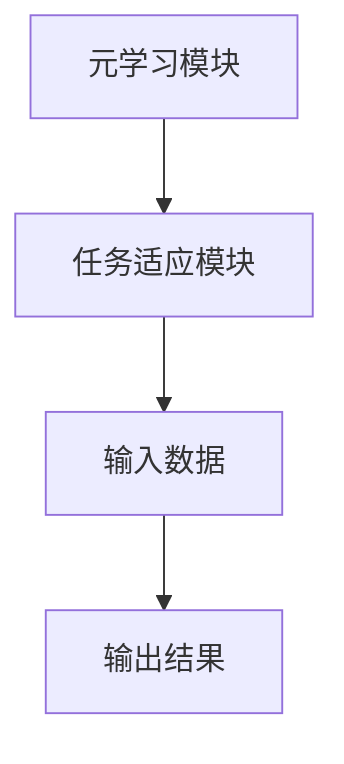

                 


# 元学习在AI Agent快速适应新任务中的实践

> 关键词：元学习，AI Agent，快速适应，任务适应性，算法实现，系统架构

> 摘要：  
元学习是一种新兴的人工智能技术，能够使AI Agent快速适应新任务。本文详细探讨了元学习的基本概念、算法原理、系统架构以及在AI Agent中的应用实践。通过分析MAML和ReM等元学习算法，结合实际案例，展示了如何通过元学习提升AI Agent的任务适应性。文章还总结了元学习在实际应用中的优势与挑战，并提出了优化建议。

---

## 第一部分：元学习与AI Agent的背景介绍

### 第1章：元学习的基本概念与问题背景

#### 1.1 元学习的核心概念

- **1.1.1 元学习的定义与特点**
  元学习是一种机器学习范式，专注于学习如何快速适应新任务。与传统机器学习不同，元学习不仅关注任务本身的解决，还关注如何快速适应新任务的能力。其特点包括：
  - **快速适应性**：能够在少量数据或经验下适应新任务。
  - **通用性**：适用于多种任务和领域。
  - **自适应性**：通过元学习算法优化模型参数，以适应新任务的需求。

- **1.1.2 元学习的数学模型与基本假设**
  元学习的核心是通过优化模型的参数，使得模型能够在多个任务之间快速切换。数学模型通常涉及：
  - **损失函数**：定义任务适应的优化目标。
  - **优化器**：用于更新模型参数以最小化损失函数。
  - **元学习的目标函数**：通常包括多个任务的损失函数，以优化模型的泛化能力。

- **1.1.3 元学习与传统机器学习的区别**
  传统机器学习专注于单一任务的优化，而元学习则关注如何在多个任务之间快速切换。传统机器学习需要大量数据和训练时间，而元学习通过元训练（meta-training）过程，使得模型能够在新任务上快速收敛。

#### 1.2 AI Agent的定义与任务适应性

- **1.2.1 AI Agent的基本概念**
  AI Agent是一种智能体，能够感知环境并采取行动以实现特定目标。AI Agent可以是软件程序、机器人或其他智能系统，具备自主决策和问题解决能力。

- **1.2.2 AI Agent的任务适应性需求**
  AI Agent需要在动态环境中快速适应新任务，例如：
  - **环境变化**：AI Agent需要调整策略以适应新的环境条件。
  - **任务变化**：AI Agent需要快速学习新任务，以应对多样化的应用场景。
  - **数据稀疏性**：在新任务中，数据可能有限，AI Agent需要高效利用有限的数据进行学习。

- **1.2.3 元学习在AI Agent中的作用**
  元学习能够赋予AI Agent快速适应新任务的能力，通过元训练过程，AI Agent可以在新任务上快速调整参数，以适应任务需求。

#### 1.3 元学习与AI Agent的结合

- **1.3.1 元学习如何提升AI Agent的适应性**
  元学习通过优化模型的参数，使得AI Agent能够在新任务上快速收敛。例如，通过MAML算法，AI Agent可以在新任务上快速调整参数，以适应任务需求。

- **1.3.2 元学习在AI Agent中的应用场景**
  元学习在AI Agent中的应用场景包括：
  - **多任务学习**：AI Agent需要同时处理多个任务。
  - **动态环境适应**：AI Agent需要在动态环境中快速调整策略。
  - **数据稀疏任务**：在数据有限的情况下，AI Agent需要快速学习新任务。

- **1.3.3 元学习的挑战与未来方向**
  元学习在AI Agent中的应用还面临一些挑战，例如：
  - **计算资源消耗**：元学习需要大量的计算资源进行训练。
  - **模型复杂性**：元学习模型通常较为复杂，难以实时部署。
  - **任务多样性**：元学习的效果依赖于任务的多样性，如果任务过于相似，元学习的优势可能不明显。

---

## 第二部分：元学习的核心概念与原理

### 第2章：元学习的核心原理与算法

#### 2.1 元学习的算法框架

- **2.1.1 元学习的通用算法框架**
  元学习的通用算法框架包括：
  1. **元训练阶段**：通过多个任务的训练数据，优化模型的参数。
  2. **任务适应阶段**：在新任务上，快速调整模型参数以适应任务需求。
  3. **优化目标**：最小化任务适应阶段的损失函数。

- **2.1.2 基于梯度的元学习方法（如MAML）**
  MAML（Meta-Algorithm for Meta-Learning）是一种基于梯度的元学习算法，其核心思想是通过优化模型的参数，使得模型能够在新任务上快速收敛。MAML的优化目标是：
  $$ \theta^{new} = \theta - \eta \nabla_{\theta} L_{meta} $$
  其中，$\theta$是模型参数，$\eta$是学习率，$L_{meta}$是元损失函数。

- **2.1.3 基于优化器的元学习方法（如ReM）**
  ReM（Reparameterization Meta-Learning）是一种基于优化器的元学习算法，其核心思想是通过优化器的参数，使得模型能够在新任务上快速适应。ReM的优化目标是：
  $$ \theta^{new} = \theta - \eta \nabla_{\theta} L_{meta} $$

#### 2.2 元学习的核心概念对比

- **2.2.1 元学习与迁移学习的对比**
  元学习与迁移学习的区别在于，元学习关注如何快速适应新任务，而迁移学习关注如何利用已有任务的知识来提高新任务的性能。

- **2.2.2 元学习与自适应学习的对比**
  元学习与自适应学习的区别在于，元学习关注通过元训练过程优化模型参数，而自适应学习关注通过在线调整模型参数来适应新数据。

- **2.2.3 元学习与强化学习的对比**
  元学习与强化学习的区别在于，元学习关注如何快速适应新任务，而强化学习关注通过与环境交互来优化策略。

#### 2.3 元学习的数学模型与公式

- **2.3.1 MAML算法的数学推导**
  MAML算法的损失函数为：
  $$ L = \sum_{i=1}^{N} L_{task_i}(f_{\theta}(x_i), y_i) $$
  其中，$N$是任务的数量，$L_{task_i}$是第$i$个任务的损失函数，$f_{\theta}(x_i)$是模型在第$i$个任务上的输出。

- **2.3.2 ReM算法的数学推导**
  ReM算法的优化目标是：
  $$ \theta^{new} = \theta - \eta \nabla_{\theta} L_{meta} $$
  其中，$\eta$是学习率，$L_{meta}$是元损失函数。

- **2.3.3 元学习的损失函数与优化目标**
  元学习的损失函数通常包括多个任务的损失函数，以优化模型的泛化能力。优化目标是通过优化模型参数，使得模型能够在新任务上快速收敛。

---

## 第三部分：元学习在AI Agent中的系统分析与架构设计

### 第3章：AI Agent的系统架构与功能设计

#### 3.1 AI Agent的系统架构

- **3.1.1 基于元学习的AI Agent架构**
  基于元学习的AI Agent架构包括：
  - **元学习模块**：负责模型的元训练，优化模型参数。
  - **任务适应模块**：负责在新任务上快速调整模型参数，以适应任务需求。
  - **输入输出接口**：负责与环境交互，接收输入数据并输出结果。

- **3.1.2 元学习模块与任务适应模块的结合**
  元学习模块通过元训练过程优化模型参数，任务适应模块通过快速调整模型参数，使得AI Agent能够在新任务上快速适应。

- **3.1.3 系统的输入输出接口设计**
  输入数据包括多个任务的训练数据，输出结果包括在新任务上的预测结果。

#### 3.2 系统功能设计

- **3.2.1 元学习模块的功能设计**
  元学习模块的功能包括：
  - **元训练**：通过多个任务的训练数据，优化模型参数。
  - **参数更新**：通过优化器更新模型参数，使得模型能够在新任务上快速收敛。

- **3.2.2 任务适应模块的功能设计**
  任务适应模块的功能包括：
  - **参数调整**：在新任务上，快速调整模型参数，以适应任务需求。
  - **任务推理**：通过模型推理，输出新任务的预测结果。

- **3.2.3 系统的训练与推理流程**
  系统的训练与推理流程包括：
  1. **元训练阶段**：通过多个任务的训练数据，优化模型参数。
  2. **任务适应阶段**：在新任务上，快速调整模型参数，以适应任务需求。
  3. **推理阶段**：通过模型推理，输出新任务的预测结果。

#### 3.3 系统架构图（Mermaid）



---

## 第四部分：元学习算法的数学模型与代码实现

### 第4章：元学习算法的数学模型与公式

#### 4.1 MAML算法的数学推导

- **MAML算法的损失函数**
  $$ L = \sum_{i=1}^{N} L_{task_i}(f_{\theta}(x_i), y_i) $$
  其中，$N$是任务的数量，$L_{task_i}$是第$i$个任务的损失函数，$f_{\theta}(x_i)$是模型在第$i$个任务上的输出。

- **MAML算法的优化目标**
  $$ \theta^{new} = \theta - \eta \nabla_{\theta} L_{meta} $$
  其中，$\eta$是学习率，$L_{meta}$是元损失函数。

#### 4.2 ReM算法的数学推导

- **ReM算法的优化目标**
  $$ \theta^{new} = \theta - \eta \nabla_{\theta} L_{meta} $$

---

## 第五部分：元学习在AI Agent中的系统分析与架构设计

### 第5章：系统分析与架构设计方案

#### 5.1 系统分析

- **5.1.1 问题场景介绍**
  在动态环境中，AI Agent需要快速适应新任务。元学习通过优化模型参数，使得AI Agent能够在新任务上快速收敛。

- **5.1.2 项目介绍**
  本项目旨在通过元学习技术，提升AI Agent的任务适应能力，使其能够在新任务上快速适应。

- **5.1.3 系统功能设计（领域模型）**
  系统功能设计包括：
  - **元学习模块**：负责模型的元训练。
  - **任务适应模块**：负责在新任务上快速调整模型参数。

- **5.1.4 系统架构设计（Mermaid架构图）**
  ```mermaid
  graph TD
      A[元学习模块] --> B[任务适应模块]
      B --> C[输入数据]
      C --> D[输出结果]
  ```

- **5.1.5 系统接口设计**
  系统接口设计包括：
  - **输入接口**：接收多个任务的训练数据。
  - **输出接口**：输出在新任务上的预测结果。

- **5.1.6 系统交互设计（Mermaid序列图）**
  ```mermaid
  sequenceDiagram
      Alice ->>+ Bob: 元训练请求
      Bob ->>- Alice: 元训练完成
      Alice ->>+ Bob: 任务适应请求
      Bob ->>- Alice: 任务适应完成
  ```

---

## 第六部分：元学习在AI Agent中的项目实战

### 第6章：项目实战

#### 6.1 环境安装

- **6.1.1 系统环境**
  - 操作系统：Linux/Windows/MacOS
  - Python版本：3.6+
  - 依赖库：TensorFlow/PyTorch，numpy，scikit-learn，mermaid，matplotlib

- **6.1.2 安装步骤**
  ```bash
  pip install tensorflow==2.5.0
  pip install numpy==1.21.2
  pip install scikit-learn==1.0.1
  pip install mermaid
  pip install matplotlib
  ```

#### 6.2 系统核心实现源代码

- **6.2.1 MAML算法的实现代码**
  ```python
  import tensorflow as tf
  import numpy as np

  def meta_loss(y_true, y_pred):
      return tf.reduce_mean(tf.square(y_true - y_pred))

  def maml_model(input_shape, output_shape):
      model = tf.keras.Sequential([
          tf.keras.layers.Dense(64, activation='relu', input_shape=input_shape),
          tf.keras.layers.Dense(output_shape)
      ])
      return model

  def maml_train(model, optimizer, train_data, val_data, meta_learning_rate=0.001):
      for epoch in range(num_epochs):
          with tf.GradientTape() as tape:
              meta_loss = 0
              for task in train_data:
                  task_input, task_output = task
                  with tf.GradientTape() as inner_tape:
                      task_pred = model(task_input)
                      task_loss = tf.reduce_mean(tf.square(task_pred - task_output))
                  inner_gradients = inner_tape.gradient(task_loss, model.trainable_weights)
                  meta_gradients = tape.gradient(task_loss, model.trainable_weights)
                  optimizer.apply_gradients(zip(meta_gradients, model.trainable_weights))
          optimizer.apply_gradients(zip(meta_gradients, model.trainable_weights))
  ```

- **6.2.2 ReM算法的实现代码**
  ```python
  import tensorflow as tf
  import numpy as np

  def rem_model(input_shape, output_shape):
      model = tf.keras.Sequential([
          tf.keras.layers.Dense(64, activation='relu', input_shape=input_shape),
          tf.keras.layers.Dense(output_shape)
      ])
      return model

  def rem_train(model, optimizer, train_data, val_data, meta_learning_rate=0.001):
      for epoch in range(num_epochs):
          meta_gradients = []
          for task in train_data:
              task_input, task_output = task
              with tf.GradientTape() as tape:
                  task_pred = model(task_input)
                  task_loss = tf.reduce_mean(tf.square(task_pred - task_output))
                  gradients = tape.gradient(task_loss, model.trainable_weights)
                  meta_gradients.append(gradients)
          optimizer.apply_gradients(zip(meta_gradients, model.trainable_weights))
  ```

#### 6.3 代码应用解读与分析

- **6.3.1 MAML算法的实现解读**
  MAML算法通过在元训练阶段优化模型参数，使得模型能够在新任务上快速适应。代码中，`maml_train`函数通过梯度 tapes 计算元损失和任务损失，优化模型参数。

- **6.3.2 ReM算法的实现解读**
  ReM算法通过优化器的参数，使得模型能够在新任务上快速适应。代码中，`rem_train`函数通过计算多个任务的梯度，优化模型参数。

#### 6.4 实际案例分析与详细讲解

- **6.4.1 案例背景**
  假设我们有一个AI Agent，需要在多个分类任务上快速适应。每个任务有其特定的特征和标签。

- **6.4.2 案例分析**
  通过MAML算法，AI Agent可以在新任务上快速调整模型参数，以适应任务需求。例如，在新任务上，AI Agent只需要少量的训练数据，就可以快速调整模型参数，提高分类准确率。

#### 6.5 项目小结

- **6.5.1 项目总结**
  通过元学习技术，AI Agent可以在新任务上快速适应，提升任务处理效率。

- **6.5.2 经验总结**
  元学习算法的选择和参数设置对任务适应能力有重要影响，需要根据具体任务需求进行调整。

---

## 第七部分：元学习在AI Agent中的最佳实践

### 第7章：最佳实践

#### 7.1 最佳实践 tips

- **选择合适的元学习算法**
  根据具体任务需求选择合适的元学习算法，例如MAML适用于多任务学习，ReM适用于动态环境适应。

- **优化模型参数**
  通过超参数调优，优化元学习算法的性能，例如学习率、批量大小等。

- **数据预处理**
  对数据进行预处理，例如归一化、标准化等，提升模型的训练效果。

- **模型评估**
  通过验证集评估模型的性能，选择合适的评估指标，例如准确率、F1分数等。

#### 7.2 小结

- **总结**
  元学习是一种有效的技术，能够使AI Agent快速适应新任务。通过合理选择算法和优化模型参数，可以进一步提升任务适应能力。

#### 7.3 注意事项

- **计算资源消耗**
  元学习算法需要大量的计算资源进行训练，需要考虑硬件配置和计算效率。

- **模型复杂性**
  元学习模型通常较为复杂，需要考虑模型的简洁性和可解释性。

- **任务多样性**
  元学习的效果依赖于任务的多样性，如果任务过于相似，元学习的优势可能不明显。

#### 7.4 拓展阅读

- **推荐书籍**
  - 《Deep Learning》
  - 《Meta-Learning: A Survey and Future Directions》

- **推荐论文**
  - "Meta-Learning through the lens of Adversarial Training"
  - "A Survey on Meta-Learning for Deep Neural Networks"

---

## 第八部分：结论

### 8.1 结论

元学习是一种新兴的技术，能够使AI Agent快速适应新任务。通过合理选择元学习算法和优化模型参数，可以进一步提升任务适应能力。未来，随着元学习技术的不断发展，AI Agent将在更多领域展现出强大的应用潜力。

---

## 作者：AI天才研究院/AI Genius Institute & 禅与计算机程序设计艺术 /Zen And The Art of Computer Programming

---

