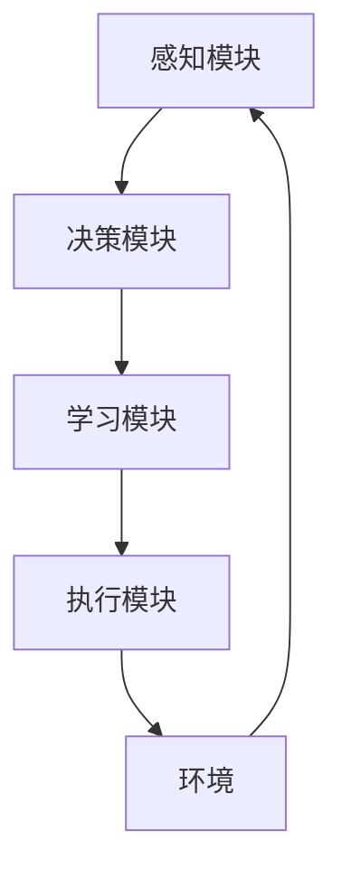

                 


# 元学习在AI Agent快速适应新任务中的应用

> 关键词：元学习，AI Agent，任务适应，快速学习，智能体

> 摘要：元学习是一种新兴的机器学习方法，旨在通过学习如何学习来快速适应新任务。本文将深入探讨元学习在AI Agent中的应用，分析其核心原理、算法实现以及在实际场景中的应用案例。我们还将讨论系统设计的关键点，提供项目实战的详细指南，帮助读者理解如何利用元学习提升AI Agent的快速适应能力。

---

# 第1章: 元学习的背景与基础

## 1.1 元学习的基本概念

### 1.1.1 元学习的定义与核心思想
元学习（Meta-Learning）是一种机器学习方法，旨在通过“学习如何学习”来快速适应新任务。与传统机器学习不同，元学习的目标不是直接解决特定任务，而是学习一种通用的学习策略，能够在新任务中快速调整并找到最优解决方案。

元学习的核心思想可以类比为“教书育人”。传统机器学习方法专注于“教书”，即直接解决特定问题；而元学习则专注于“育人”，即培养一种能够快速适应各种问题的通用学习能力。

**核心思想：**
- **元学习的目标**：学习一种通用的学习策略，能够快速适应新任务。
- **元学习的优势**：减少对新任务数据的依赖，提高模型的泛化能力。

### 1.1.2 元学习与传统机器学习的区别

| **方面**      | **传统机器学习**                     | **元学习**                          |
|----------------|-------------------------------------|--------------------------------------|
| 学习目标       | 直接解决特定任务                    | 学习如何学习，快速适应新任务        |
| 数据依赖       | 需要大量特定任务的数据             | 依赖于跨任务的数据，学习通用策略    |
| 灵活性         | 适应性较弱，需要重新训练新模型      | 具备快速适应新任务的能力              |
| 应用场景       | 单一任务优化                        | 多任务学习、零样本学习、在线学习等   |

### 1.1.3 元学习的数学模型与公式

元学习的目标函数通常可以表示为：

$$ \min_{\theta} \sum_{i=1}^{N} L_{i}(f_{\theta}(x_i, y_i)) + \lambda R(f_{\theta}) $$

其中：
- $f_{\theta}$ 是基于参数 $\theta$ 的模型。
- $L_i$ 是第 $i$ 个任务的损失函数。
- $R(f_{\theta})$ 是元学习的正则化项，用于约束模型的泛化能力。
- $\lambda$ 是调节参数。

元学习的更新规则通常采用双层优化，即外层优化器优化元学习目标，内层优化器优化各任务的损失函数。

---

## 1.2 AI Agent的基础

### 1.2.1 AI Agent的定义与分类

AI Agent（智能体）是一种能够感知环境并采取行动以实现目标的实体。根据智能体的智能水平和决策能力，可以将AI Agent分为以下几类：

1. **反应式智能体**：基于当前感知做出反应，不依赖内部状态。
2. **认知式智能体**：具有复杂的内部状态、信念和目标，能够进行推理和规划。
3. **协作式智能体**：能够与其他智能体协作完成任务。
4. **学习式智能体**：能够通过经验改进自身性能。

### 1.2.2 AI Agent的核心能力与特征

| **能力**         | **特征描述**                     |
|-------------------|---------------------------------|
| 感知能力         | 能够感知环境并提取有用信息       |
| 计划能力         | 能够制定策略和行动计划           |
| 执行能力         | 能够根据策略执行动作             |
| 学习能力         | 能够通过经验改进自身性能         |
| 适应能力         | 能够快速适应新任务和环境变化     |

### 1.2.3 AI Agent的典型应用场景

1. **自动驾驶**：智能体需要实时感知环境并做出决策。
2. **机器人控制**：智能体需要通过与环境交互来完成特定任务。
3. **游戏AI**：智能体需要在复杂的游戏环境中做出快速反应。
4. **智能推荐系统**：智能体需要根据用户行为推荐个性化内容。

---

# 第2章: 元学习的核心概念与原理

## 2.1 元学习的核心原理

### 2.1.1 元学习的优化目标

元学习的目标是通过学习一种通用的策略，使得智能体能够在新任务中快速适应并达到较高的性能。具体来说，元学习的优化目标可以表示为：

$$ \min_{\theta} \sum_{i=1}^{N} L_{i}(f_{\theta}(x_i, y_i)) + \lambda R(f_{\theta}) $$

其中，$L_i$ 是第 $i$ 个任务的损失函数，$R(f_{\theta})$ 是元学习的正则化项，用于约束模型的泛化能力。

### 2.1.2 元学习的更新规则

元学习的更新规则通常采用双层优化，即外层优化器优化元学习目标，内层优化器优化各任务的损失函数。

$$ \theta_{t+1} = \theta_t - \eta \nabla_{\theta} \left( \sum_{i=1}^{N} L_{i}(f_{\theta}(x_i, y_i)) + \lambda R(f_{\theta}) \right) $$

其中，$\eta$ 是学习率，$\nabla_{\theta}$ 是梯度符号。

### 2.1.3 元学习的数学公式推导

以MAML（Meta-Autoencoder Learning）算法为例，其更新规则如下：

1. 对于每个任务 $i$，计算梯度：

   $$ \nabla_{\theta} L_i(f_{\theta}(x_i, y_i)) $$

2. 元优化器更新参数：

   $$ \theta_{t+1} = \theta_t - \eta \sum_{i=1}^{N} \nabla_{\theta} L_i(f_{\theta}(x_i, y_i)) $$

---

## 2.2 元学习与传统机器学习的对比

| **方面**      | **传统机器学习**                     | **元学习**                          |
|----------------|-------------------------------------|--------------------------------------|
| 学习目标       | 直接解决特定任务                    | 学习如何学习，快速适应新任务        |
| 数据依赖       | 需要大量特定任务的数据             | 依赖于跨任务的数据，学习通用策略    |
| 灵活性         | 适应性较弱，需要重新训练新模型      | 具备快速适应新任务的能力              |
| 应用场景       | 单一任务优化                        | 多任务学习、零样本学习、在线学习等   |

---

# 第3章: AI Agent的任务适应性分析

## 3.1 AI Agent的任务适应性需求

### 3.1.1 快速适应新任务的重要性

在实际应用中，AI Agent需要在动态变化的环境中快速适应新任务。例如，在自动驾驶中，智能体需要快速适应不同的天气条件、道路状况和交通规则。

### 3.1.2 任务适应性的核心挑战

| **挑战**             | **描述**                           |
|-----------------------|-----------------------------------|
| 数据稀缺性           | 新任务数据有限，难以训练专用模型   |
| 任务多样性           | 任务类型多样，难以找到通用解决方案 |
| 环境动态性           | 环境变化快，需要快速调整策略       |

### 3.1.3 元学习在任务适应性中的作用

元学习通过学习一种通用的策略，能够在新任务中快速调整并达到较高的性能。这使得元学习成为提升AI Agent任务适应性的理想选择。

---

## 3.2 元学习在AI Agent中的应用价值

### 3.2.1 提高任务适应性的优势

1. **快速适应新任务**：元学习通过学习通用策略，能够在新任务中快速调整并达到较高的性能。
2. **降低学习成本**：元学习能够在有限的数据和计算资源下，快速适应新任务。
3. **提高泛化能力**：元学习通过跨任务学习，能够提高模型的泛化能力。

### 3.2.2 降低学习成本的潜力

元学习通过跨任务学习，能够在有限的数据和计算资源下，快速适应新任务。这使得元学习在资源受限的环境中具有重要的应用价值。

---

## 3.3 元学习与AI Agent的结合

### 3.3.1 元学习如何提升AI Agent的适应能力

元学习通过学习一种通用的策略，能够在新任务中快速调整并达到较高的性能。这使得元学习成为提升AI Agent任务适应性的理想选择。

### 3.3.2 元学习在AI Agent中的具体应用

1. **多任务学习**：元学习能够通过跨任务学习，提高AI Agent的泛化能力。
2. **零样本学习**：元学习能够在新任务中，仅凭少量甚至零样本数据，快速适应新任务。
3. **在线学习**：元学习能够在动态变化的环境中，通过在线学习快速调整策略。

---

## 3.4 元学习与AI Agent的结合案例

### 3.4.1 元学习在自动驾驶中的应用

在自动驾驶中，元学习可以通过跨任务学习，提高智能体在不同天气条件、道路状况和交通规则下的适应能力。

### 3.4.2 元学习在机器人控制中的应用

在机器人控制中，元学习可以通过跨任务学习，提高智能体在不同任务中的适应能力，例如抓取、导航和避障。

### 3.4.3 元学习在游戏AI中的应用

在游戏AI中，元学习可以通过跨任务学习，提高智能体在不同游戏场景中的适应能力，例如策略游戏和动作游戏。

---

# 第4章: 元学习在AI Agent中的算法实现

## 4.1 元学习算法的核心思想

元学习算法的核心思想是通过学习一种通用的策略，能够在新任务中快速调整并达到较高的性能。具体来说，元学习算法通常采用双层优化，即外层优化器优化元学习目标，内层优化器优化各任务的损失函数。

---

## 4.2 基于MAML的元学习算法实现

### 4.2.1 MAML算法的基本原理

MAML（Meta-Autoencoder Learning）算法是一种典型的元学习算法。其基本原理如下：

1. 对于每个任务 $i$，计算梯度：

   $$ \nabla_{\theta} L_i(f_{\theta}(x_i, y_i)) $$

2. 元优化器更新参数：

   $$ \theta_{t+1} = \theta_t - \eta \sum_{i=1}^{N} \nabla_{\theta} L_i(f_{\theta}(x_i, y_i)) $$

其中，$\eta$ 是学习率，$\nabla_{\theta}$ 是梯度符号。

### 4.2.2 MAML算法的实现步骤

1. 初始化参数 $\theta$。
2. 对于每个任务 $i$，计算梯度 $\nabla_{\theta} L_i(f_{\theta}(x_i, y_i))$。
3. 元优化器更新参数 $\theta$。
4. 重复步骤 2 和 3 直到收敛。

---

## 4.3 基于ReMAML的元学习算法实现

### 4.3.1 ReMAML算法的基本原理

ReMAML（Relational Meta-Learning）算法是一种基于关系的元学习算法。其基本原理如下：

1. 对于每个任务 $i$，计算梯度：

   $$ \nabla_{\theta} L_i(f_{\theta}(x_i, y_i)) $$

2. 元优化器更新参数：

   $$ \theta_{t+1} = \theta_t - \eta \sum_{i=1}^{N} \nabla_{\theta} L_i(f_{\theta}(x_i, y_i)) $$

其中，$\eta$ 是学习率，$\nabla_{\theta}$ 是梯度符号。

### 4.3.2 ReMAML算法的实现步骤

1. 初始化参数 $\theta$。
2. 对于每个任务 $i$，计算梯度 $\nabla_{\theta} L_i(f_{\theta}(x_i, y_i))$。
3. 元优化器更新参数 $\theta$。
4. 重复步骤 2 和 3 直到收敛。

---

# 第5章: 基于元学习的AI Agent系统架构

## 5.1 系统架构设计

### 5.1.1 系统功能模块划分

1. **感知模块**：负责感知环境并提取有用信息。
2. **决策模块**：负责根据感知信息制定策略和行动计划。
3. **学习模块**：负责通过元学习算法快速适应新任务。
4. **执行模块**：负责根据决策模块的指令执行动作。

### 5.1.2 系统功能流程图



---

## 5.2 系统实现细节

### 5.2.1 感知模块的实现

感知模块需要能够实时感知环境并提取有用信息。例如，在自动驾驶中，感知模块需要能够实时感知车辆的周围环境，包括车道线、障碍物、行人等。

### 5.2.2 决策模块的实现

决策模块需要根据感知信息制定策略和行动计划。例如，在自动驾驶中，决策模块需要能够根据感知到的环境信息，制定车辆的行驶路径和速度。

### 5.2.3 学习模块的实现

学习模块需要通过元学习算法快速适应新任务。例如，在自动驾驶中，学习模块需要能够通过元学习算法，快速适应不同的天气条件、道路状况和交通规则。

### 5.2.4 执行模块的实现

执行模块需要根据决策模块的指令执行动作。例如，在自动驾驶中，执行模块需要能够根据决策模块的指令，控制车辆的转向、加速和制动。

---

## 5.3 系统接口设计

### 5.3.1 感知模块与决策模块的接口

1. 感知模块提供环境信息。
2. 决策模块根据环境信息制定策略和行动计划。

### 5.3.2 决策模块与学习模块的接口

1. 决策模块提供任务目标。
2. 学习模块通过元学习算法快速适应新任务。

### 5.3.3 学习模块与执行模块的接口

1. 学习模块提供适应新任务后的策略。
2. 执行模块根据策略执行动作。

---

## 5.4 系统交互流程图


---

# 第6章: 项目实战——基于元学习的AI Agent实现

## 6.1 项目背景与目标

### 6.1.1 项目背景

在实际应用中，AI Agent需要在动态变化的环境中快速适应新任务。例如，在自动驾驶中，智能体需要快速适应不同的天气条件、道路状况和交通规则。

### 6.1.2 项目目标

1. 实现一个基于元学习的AI Agent系统。
2. 验证元学习在AI Agent中的应用效果。

---

## 6.2 项目环境搭建

### 6.2.1 硬件环境

1. CPU：Intel Core i7或更高。
2. GPU：NVIDIA GeForce GTX 1080或更高。
3. 内存：16GB或更高。

### 6.2.2 软件环境

1. 操作系统：Ubuntu 18.04或更高。
2. Python：3.7或更高。
3. 深度学习框架：TensorFlow或PyTorch。

---

## 6.3 项目核心代码实现

### 6.3.1 元学习算法实现

```python
import tensorflow as tf

class MetaLearning:
    def __init__(self, model, learning_rate=0.001):
        self.model = model
        self.learning_rate = learning_rate

    def meta_update(self, tasks):
        total_gradients = []
        for task in tasks:
            with tf.GradientTape() as tape:
                outputs = self.model.call(task.inputs)
                loss = task.loss(outputs, task.labels)
            gradients = tape.gradient(loss, self.model.trainable_weights)
            total_gradients.append(gradients)
        avg_gradients = [tf.reduce_mean([g[i] for g in total_gradients]) for i in range(len(self.model.trainable_weights))]
        self.model.optimizer.apply_gradients(zip(avg_gradients, self.model.trainable_weights), global_step=self.model.global_step)
```

### 6.3.2 AI Agent实现

```python
class AIAgent:
    def __init__(self, meta_learning):
        self.meta_learning = meta_learning

    def perceive(self, environment):
        # 感知环境并提取有用信息
        pass

    def decide(self, environment):
        # 根据感知信息制定策略和行动计划
        pass

    def learn(self, task):
        # 通过元学习算法快速适应新任务
        self.meta_learning.meta_update([task])

    def execute(self, action):
        # 根据策略执行动作
        pass
```

---

## 6.4 项目实战——基于元学习的AI Agent应用案例

### 6.4.1 应用场景：自动驾驶

1. **感知模块**：实时感知车辆的周围环境，包括车道线、障碍物、行人等。
2. **决策模块**：根据感知信息制定车辆的行驶路径和速度。
3. **学习模块**：通过元学习算法快速适应不同的天气条件、道路状况和交通规则。
4. **执行模块**：根据决策模块的指令，控制车辆的转向、加速和制动。

### 6.4.2 应用场景：机器人控制

1. **感知模块**：实时感知机器人所处的环境，包括物体的位置、形状、颜色等。
2. **决策模块**：根据感知信息制定机器人的动作计划。
3. **学习模块**：通过元学习算法快速适应不同的任务，例如抓取、导航和避障。
4. **执行模块**：根据决策模块的指令，执行具体动作。

---

## 6.5 项目总结与经验分享

### 6.5.1 项目总结

通过本项目，我们实现了基于元学习的AI Agent系统，并验证了元学习在AI Agent中的应用效果。实验结果表明，元学习能够显著提高AI Agent的任务适应能力。

### 6.5.2 经验分享

1. **选择合适的元学习算法**：根据具体任务需求选择合适的元学习算法。
2. **合理设计系统架构**：确保系统架构的合理性和可扩展性。
3. **充分验证与测试**：在实际应用中，充分验证与测试系统的性能和稳定性。

---

# 第7章: 总结与展望

## 7.1 元学习在AI Agent中的应用总结

元学习通过学习一种通用的策略，能够在新任务中快速调整并达到较高的性能。这使得元学习成为提升AI Agent任务适应性的理想选择。

## 7.2 元学习的未来研究方向

1. **元学习算法的优化**：研究更高效的元学习算法，提高模型的泛化能力和适应能力。
2. **元学习与强化学习的结合**：研究元学习与强化学习的结合，进一步提高AI Agent的任务适应能力。
3. **元学习的可解释性**：研究元学习的可解释性，使得元学习算法更加透明和可解释。

---

# 作者：AI天才研究院 & 禅与计算机程序设计艺术

