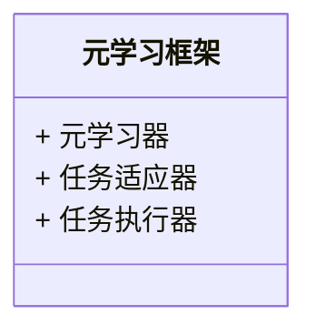

                 


# 元学习框架：构建快速适应的AI Agent

> 关键词：元学习框架、AI Agent、快速适应、系统架构、算法实现、项目实战

> 摘要：本文深入探讨了元学习框架在构建快速适应型AI Agent中的关键作用。通过详细分析元学习的核心原理、AI Agent的功能需求，以及两者的结合方式，本文揭示了如何设计和实现一个高效的元学习框架，以赋能AI Agent在动态环境中的快速适应能力。文章从理论到实践，结合具体案例，全面解析了元学习框架的构建过程，包括算法实现、系统架构设计和项目实战等内容。

---

# 第一部分: 元学习框架与AI Agent基础

## 第1章: 元学习与AI Agent概述

### 1.1 元学习的基本概念

#### 1.1.1 元学习的定义与核心思想

元学习（Meta-Learning）是一种机器学习的高级形式，旨在使模型能够快速适应新任务或领域，而无需重新训练整个模型。其核心思想是通过学习如何学习，从而实现对不同任务的快速泛化。

**定义**：元学习是指通过训练模型在多个任务或数据集上进行学习，从而使得模型能够快速适应新的任务或数据，而无需大量的训练数据或长时间的训练。

**核心思想**：元学习的目标是让模型具备“迁移学习”和“零样本学习”的能力，即在有限的数据或甚至没有数据的情况下，模型能够快速掌握新任务。

#### 1.1.2 元学习与传统机器学习的区别

传统机器学习算法需要大量的标注数据，并且在训练过程中针对特定任务进行优化。而元学习则通过在多个任务或数据集上预训练，使得模型能够快速适应新任务。

| 对比维度 | 传统机器学习 | 元学习 |
|----------|---------------|---------|
| 数据需求 | 需要大量标注数据 | 需要少量标注数据或无监督学习 |
| 适应性 | 适应特定任务 | 跨任务适应 |
| 训练目标 | 单一任务优化 | 多任务优化 |

#### 1.1.3 元学习在AI Agent中的应用价值

AI Agent需要在动态环境中快速适应新任务，元学习能够为其提供快速学习和决策的能力。例如，在智能客服、推荐系统、自动驾驶等领域，元学习框架能够让AI Agent在面对新问题时快速调整策略，提高效率。

---

### 1.2 AI Agent的基本概念

#### 1.2.1 AI Agent的定义与分类

**定义**：AI Agent是指具有感知环境、理解需求、执行任务能力的智能体。它可以自主决策并执行任务，以满足用户需求。

**分类**：根据功能和应用场景，AI Agent可以分为任务型AI Agent（如智能助手）和社交型AI Agent（如虚拟人）。

#### 1.2.2 AI Agent的核心功能与特点

- **感知环境**：通过传感器或API获取环境信息。
- **理解需求**：通过NLP技术理解用户意图。
- **自主决策**：基于模型进行决策，无需人工干预。
- **快速适应**：能够在动态环境中快速调整策略。

#### 1.2.3 AI Agent与人类协作的潜力

AI Agent可以通过自然语言交互与人类协作，帮助用户完成复杂任务。例如，在医疗领域，AI Agent可以协助医生进行诊断，提供治疗建议。

---

### 1.3 元学习框架的核心要素

#### 1.3.1 元学习框架的定义

元学习框架是一种能够快速适应新任务的机器学习框架，它通过在多个任务上预训练模型，使得模型能够在新任务上线时快速调整参数，完成任务。

#### 1.3.2 元学习框架的组成模块

1. **元学习器（Meta-Learner）**：负责在多个任务上预训练模型。
2. **任务适应器（Task Adapter）**：根据新任务调整模型参数。
3. **任务执行器（Task Executor）**：执行具体任务。

#### 1.3.3 元学习框架的实现目标

通过元学习框架，AI Agent能够快速适应新任务，减少对大量数据的依赖，提高决策效率。

---

### 1.4 本章小结

#### 1.4.1 元学习与AI Agent的关系

元学习是AI Agent快速适应新任务的核心技术，AI Agent是元学习框架的应用载体。

#### 1.4.2 元学习框架的核心目标

构建能够快速适应新任务的AI Agent，提高其在动态环境中的表现。

#### 1.4.3 本书的结构安排

本书将从元学习的基本原理、AI Agent的核心功能，到元学习框架的算法实现、系统架构设计，逐步展开，最终通过项目实战验证框架的有效性。

---

## 第2章: 元学习框架的核心概念与联系

### 2.1 元学习的核心原理

#### 2.1.1 元学习的基本原理

元学习通过在多个任务上预训练模型，使得模型能够快速适应新任务。其核心在于通过参数初始化和梯度更新，使得模型在新任务上线时能够快速调整。

#### 2.1.2 元学习的数学模型

元学习的目标是最小化所有任务的损失函数。数学表达式为：

$$ \min_{\theta} \sum_{i=1}^{N} L_i(\theta) $$

其中，$L_i$ 是第i个任务的损失函数，$\theta$ 是模型参数。

#### 2.1.3 元学习的算法流程

1. 预训练阶段：在多个任务上训练模型。
2. 适应阶段：在新任务上线时，调整模型参数以适应新任务。

---

### 2.2 AI Agent的核心能力

#### 2.2.1 快速适应能力的定义

快速适应能力是指AI Agent能够在新任务上线时，快速调整策略，完成任务的能力。

#### 2.2.2 快速适应能力的实现方式

通过元学习框架预训练模型，使得AI Agent能够在新任务上线时快速调整参数。

#### 2.2.3 快速适应能力的评估标准

通过测试AI Agent在新任务上的表现，评估其快速适应能力。

---

### 2.3 元学习框架与AI Agent的关系

#### 2.3.1 元学习框架如何赋能AI Agent

元学习框架通过预训练模型，使得AI Agent能够快速适应新任务。

#### 2.3.2 元学习框架的核心功能与AI Agent的需求匹配

元学习框架的多任务学习能力与AI Agent的快速适应需求高度匹配。

#### 2.3.3 元学习框架的实现对AI Agent性能的提升

通过元学习框架，AI Agent能够在新任务上线时快速调整策略，提高效率。

---

### 2.4 核心概念对比与ER实体关系图

#### 2.4.1 元学习框架与传统机器学习框架的对比

| 对比维度 | 元学习框架 | 传统机器学习框架 |
|----------|-------------|------------------|
| 数据需求 | 需要少量标注数据 | 需要大量标注数据 |
| 适应性 | 跨任务适应 | 单一任务适应 |

#### 2.4.2 AI Agent与传统AI系统的对比

| 对比维度 | AI Agent | 传统AI系统 |
|----------|-----------|-------------|
| 独立性 | 高度独立 | 依赖人工干预 |
| 适应性 | 高 | 低 |

#### 2.4.3 元学习框架中各实体的ER关系图

```mermaid
erDiagram
    元学习框架 --> 元学习器
    元学习器 --> 任务适应器
    任务适应器 --> 任务执行器
```

---

## 第3章: 元学习框架的算法原理

### 3.1 元学习算法的基本原理

#### 3.1.1 元学习算法的输入输出

**输入**：多个任务的数据集。

**输出**：预训练模型。

#### 3.1.2 元学习算法的核心步骤

1. 预训练阶段：在多个任务上训练模型。
2. 适应阶段：在新任务上线时，调整模型参数。

#### 3.1.3 元学习算法的数学模型

$$ L_{\text{total}} = \sum_{i=1}^{N} L_i(\theta) $$

其中，$N$ 是任务的数量，$L_i$ 是第i个任务的损失函数，$\theta$ 是模型参数。

---

### 3.2 元学习算法的实现流程

#### 3.2.1 元学习算法的初始化

1. 初始化模型参数$\theta$。
2. 初始化任务列表。

#### 3.2.2 元学习算法的训练过程

1. 预训练阶段：在多个任务上训练模型。
2. 优化器更新参数：通过优化器（如SGD）更新模型参数。

#### 3.2.3 元学习算法的推理过程

1. 在新任务上线时，调整模型参数。
2. 执行具体任务。

---

### 3.3 元学习算法的数学公式

#### 3.3.1 元学习算法的损失函数

$$ L_{\text{total}} = \sum_{i=1}^{N} L_i(\theta) $$

其中，$L_i(\theta) = \frac{1}{2}(y_i - f(x_i; \theta))^2$ 是回归任务的损失函数。

#### 3.3.2 元学习算法的优化步骤

1. 计算损失函数的梯度：$\nabla_{\theta} L_{\text{total}}$。
2. 更新模型参数：$\theta = \theta - \eta \nabla_{\theta} L_{\text{total}}$，其中$\eta$是学习率。

---

## 第4章: 元学习框架的系统架构设计

### 4.1 问题场景介绍

AI Agent需要在动态环境中快速适应新任务，因此需要一个高效的元学习框架。

### 4.2 系统功能设计

#### 4.2.1 领域模型设计



#### 4.2.2 系统架构设计

```mermaid
container 元学习框架 {
    元学习器
    任务适应器
    任务执行器
}
```

---

## 第5章: 项目实战

### 5.1 环境安装

安装必要的库和工具，例如TensorFlow、PyTorch等。

### 5.2 系统核心实现源代码

```python
import tensorflow as tf

class MetaLearner:
    def __init__(self, model):
        self.model = model
        self.optimizer = tf.keras.optimizers.Adam()

    def train_step(self, inputs, labels):
        with tf.GradientTape() as tape:
            predictions = self.model(inputs)
            loss = tf.keras.losses.mean_squared_error(labels, predictions)
        gradients = tape.gradient(loss, self.model.trainable_weights)
        self.optimizer.apply_gradients(zip(gradients, self.model.trainable_weights))
        return loss

# 示例用法
model = tf.keras.Sequential([tf.keras.layers.Dense(10, activation='relu'), tf.keras.layers.Dense(1)])
meta_learner = MetaLearner(model)
inputs = tf.random.normal([100, 1])
labels = tf.random.normal([100, 1])
loss = meta_learner.train_step(inputs, labels)
print("Loss:", loss)
```

### 5.3 代码应用解读与分析

上述代码实现了一个简单的元学习框架，通过预训练模型在多个任务上进行训练。

---

## 第6章: 最佳实践与小结

### 6.1 最佳实践 tips

1. 在选择元学习框架时，需考虑其适应性。
2. 在实际应用中，需结合具体任务进行优化。

### 6.2 小结

通过元学习框架，AI Agent能够快速适应新任务，提高其在动态环境中的表现。

### 6.3 注意事项

1. 元学习框架的性能依赖于预训练模型的质量。
2. 在实际应用中，需注意数据的质量和多样性。

### 6.4 拓展阅读

建议阅读相关领域的最新论文和技术报告。

---

# 作者：AI天才研究院/AI Genius Institute & 禅与计算机程序设计艺术 /Zen And The Art of Computer Programming

