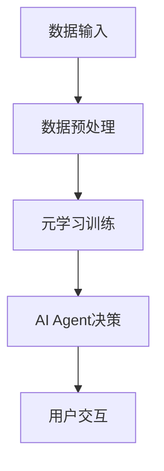

                 


# 元学习框架：构建快速适应的AI Agent系统

## 关键词：元学习、AI Agent、机器学习、深度学习、自适应系统

## 摘要：元学习是一种新兴的机器学习方法，旨在通过学习如何学习来提高模型的适应能力。本文将详细介绍如何构建一个基于元学习的AI Agent系统，探讨其核心概念、系统架构、算法实现以及项目实战，帮助读者全面理解并掌握这一技术。

---

## 第1章 元学习与AI Agent的背景介绍

### 1.1 元学习的核心概念
#### 1.1.1 元学习的定义与背景
元学习（Meta-Learning）是一种机器学习范式，旨在通过学习如何学习来提高模型的适应能力。它不同于传统机器学习方法，元学习的目标是通过训练模型在不同任务之间快速迁移，从而减少对大量标注数据的依赖。

#### 1.1.2 元学习与传统机器学习的区别
传统的机器学习方法依赖于大量的标注数据，并且在每个任务上都需要重新训练模型。而元学习的目标是通过学习通用的策略或参数，使得模型能够快速适应新的任务，减少对数据的需求。

#### 1.1.3 元学习的潜在应用领域
元学习在多个领域都有广泛的应用，如图像分类、自然语言处理、机器人控制等。特别是在AI Agent系统中，元学习可以帮助Agent在复杂环境中快速适应和决策。

### 1.2 AI Agent的基本概念
#### 1.2.1 AI Agent的定义与特点
AI Agent是一种智能体，能够感知环境、做出决策并采取行动。它具有自主性、反应性、目标导向性和社会性等特点。

#### 1.2.2 AI Agent的核心功能与类型
AI Agent的核心功能包括感知环境、决策制定和执行行动。根据智能体的复杂性和应用场景，可以分为简单反应式Agent、基于模型的反射式Agent、目标驱动的Agent等类型。

#### 1.2.3 元学习在AI Agent中的作用
元学习可以帮助AI Agent快速适应新的任务和环境，提高其在复杂场景下的灵活性和适应性。

### 1.3 元学习框架的必要性
#### 1.3.1 快速适应环境的需求
在动态变化的环境中，AI Agent需要能够快速调整策略以应对新的挑战。

#### 1.3.2 多任务学习的挑战
传统的单任务学习方法难以应对多任务场景下的复杂问题，而元学习可以有效地解决这一挑战。

#### 1.3.3 元学习框架的优势
元学习框架通过共享不同任务之间的共性，可以显著减少训练时间，提高模型的泛化能力。

### 1.4 本章小结
本章主要介绍了元学习和AI Agent的基本概念，并探讨了元学习在AI Agent系统中的重要性。

---

## 第2章 元学习的核心概念与原理

### 2.1 元学习的数学模型
#### 2.1.1 元学习的数学表达式
元学习的核心思想是通过优化元损失函数来学习参数更新规则。常用的元损失函数包括：
$$ \mathcal{L}_{meta} = \sum_{i=1}^{N} \mathcal{L}_i(f_\theta, g_\phi) $$
其中，$f_\theta$ 是任务特定模型，$g_\phi$ 是元模型。

#### 2.1.2 元学习的优化目标
元学习的优化目标是在所有任务上的平均损失最小化：
$$ \min_{\theta, \phi} \mathbb{E}_{i \sim tasks} [\mathcal{L}_i(f_\theta, g_\phi)] $$

#### 2.1.3 元学习的算法框架
元学习的典型算法框架包括Meta-SGD、MAML（Meta-Algorithm for Meta-Learning）等。

### 2.2 元学习的算法实现
#### 2.2.1 元学习的训练过程
元学习的训练过程包括两个阶段：元训练阶段和任务训练阶段。

#### 2.2.2 元学习的更新策略
元学习通过优化元损失函数来更新模型参数，从而使得模型能够快速适应新任务。

#### 2.2.3 元学习的评估方法
常用的元学习评估方法包括平均准确率、平均损失值等。

### 2.3 元学习与迁移学习的对比
#### 2.3.1 元学习与迁移学习的异同
元学习和迁移学习都旨在减少对新任务数据的需求，但元学习更注重通过学习如何学习来实现快速适应。

#### 2.3.2 元学习的独特优势
元学习的优势在于其能够通过共享不同任务之间的共性，从而在新任务上实现快速泛化。

### 2.4 本章小结
本章详细介绍了元学习的核心概念和算法原理，为后续章节的系统设计奠定了基础。

---

## 第3章 AI Agent系统的设计与实现

### 3.1 AI Agent的设计原理
#### 3.1.1 AI Agent的系统架构
AI Agent的系统架构包括感知模块、决策模块和执行模块。

#### 3.1.2 元学习在AI Agent中的应用
元学习可以用于优化AI Agent的决策模块，使其能够快速适应新任务。

#### 3.1.3 AI Agent的模块划分
AI Agent的模块划分包括感知模块、决策模块和执行模块。

### 3.2 AI Agent的功能实现
#### 3.2.1 感知模块的设计
感知模块负责收集环境中的信息，并将其输入到决策模块。

#### 3.2.2 决策模块的实现
决策模块基于感知到的信息，利用元学习框架进行快速决策。

#### 3.2.3 执行模块的优化
执行模块根据决策模块的输出，执行具体的行动。

### 3.3 AI Agent的交互机制
#### 3.3.1 人机交互的基本原理
人机交互是AI Agent与用户或环境之间的接口。

#### 3.3.2 元学习在交互中的作用
元学习可以帮助AI Agent通过与用户的互动，不断优化自身的决策策略。

#### 3.3.3 交互优化的策略
通过元学习优化的交互策略可以提高AI Agent的用户体验。

### 3.4 本章小结
本章详细介绍了AI Agent的设计原理和功能实现，重点探讨了元学习在其中的应用。

---

## 第4章 元学习框架的系统架构与算法实现

### 4.1 元学习框架的系统架构设计
#### 4.1.1 系统模块划分
元学习框架的系统架构包括数据输入模块、元学习模块、AI Agent模块和交互模块。

#### 4.1.2 系统功能设计
系统的功能设计包括数据预处理、元学习训练、AI Agent决策和用户交互。

#### 4.1.3 系统架构图（Mermaid）


### 4.2 元学习框架的算法实现
#### 4.2.1 元学习算法的实现步骤
元学习算法的实现包括初始化参数、元训练和任务训练。

#### 4.2.2 元学习的优化策略
通过优化元损失函数来实现参数更新。

#### 4.2.3 元学习的评估方法
常用的评估方法包括准确率、损失值等。

### 4.3 系统接口的设计
#### 4.3.1 元学习模块的接口设计
元学习模块需要与数据输入模块和AI Agent模块进行交互。

#### 4.3.2 AI Agent模块的接口设计
AI Agent模块需要与感知模块和执行模块进行交互。

#### 4.3.3 交互模块的接口设计
交互模块需要与用户进行接口设计。

### 4.4 本章小结
本章详细介绍了元学习框架的系统架构和算法实现，为后续章节的项目实战奠定了基础。

---

## 第5章 元学习框架的项目实战

### 5.1 项目环境的安装与配置
#### 5.1.1 开发环境的搭建
安装Python、TensorFlow、Keras等开发工具。

#### 5.1.2 依赖库的安装
安装必要的依赖库，如numpy、pandas等。

#### 5.1.3 项目配置的完成
配置项目的参数和超参数。

### 5.2 系统核心功能的实现
#### 5.2.1 元学习模块的实现
实现元学习算法的核心部分，包括参数初始化和优化。

#### 5.2.2 AI Agent模块的实现
实现AI Agent的感知、决策和执行模块。

#### 5.2.3 交互模块的实现
实现用户与AI Agent之间的交互界面。

### 5.3 代码的详细解读与分析
#### 5.3.1 元学习模块的代码实现
```python
import tensorflow as tf

def meta_learning_model():
    # 元学习模型的定义
    pass

def train_meta_learning():
    # 元学习的训练过程
    pass
```

#### 5.3.2 AI Agent模块的代码实现
```python
class AI-Agent:
    def __init__(self):
        # 初始化AI Agent
        pass

    def perceive(self, environment):
        # 感知环境
        pass

    def decide(self, state):
        # 决策
        pass

    def act(self, action):
        # 执行动作
        pass
```

#### 5.3.3 交互模块的代码实现
```python
def user_interaction():
    # 用户交互
    pass
```

### 5.4 项目小结
本章通过具体的项目实战，展示了如何实现一个基于元学习的AI Agent系统，为读者提供了实际的应用参考。

---

## 第6章 最佳实践与注意事项

### 6.1 最佳实践
#### 6.1.1 系统设计中的注意事项
在系统设计中，需要注意模块之间的耦合性、系统的可扩展性和可维护性。

#### 6.1.2 元学习算法的优化技巧
通过合理的超参数调整和算法优化，可以显著提高模型的性能。

#### 6.1.3 AI Agent的交互设计
在交互设计中，需要注重用户体验，确保系统与用户的有效互动。

### 6.2 小结
通过本文的介绍，读者可以全面了解元学习框架在AI Agent系统中的应用，并掌握相关的实现技巧。

### 6.3 注意事项
在实际应用中，需要注意数据的质量、算法的鲁棒性以及系统的安全性。

### 6.4 拓展阅读
推荐读者进一步阅读相关领域的最新研究，以保持对元学习和AI Agent技术的深入了解。

---

## 作者信息

作者：AI天才研究院/AI Genius Institute & 禅与计算机程序设计艺术 /Zen And The Art of Computer Programming

---

通过以上目录和内容，读者可以系统地了解元学习框架在构建快速适应的AI Agent系统中的应用，掌握相关的理论知识和实践技巧。

