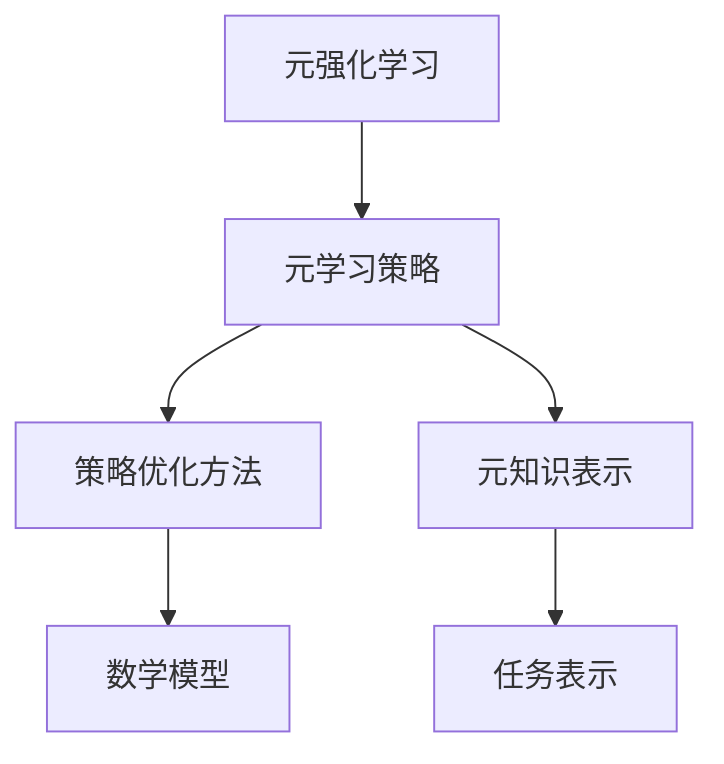
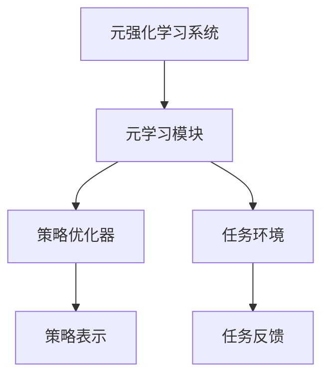

                 


# 元强化学习：AI Agent的策略泛化

> 关键词：元强化学习，策略泛化，AI Agent，多任务学习，强化学习

> 摘要：元强化学习是一种新兴的强化学习范式，旨在通过学习通用策略来应对多种任务，从而实现策略的泛化。本文从元强化学习的核心概念出发，逐步分析其算法原理、系统架构、项目实现以及高级主题，全面探讨AI Agent的策略泛化能力。

---

## 第1章: 元强化学习的背景与核心概念

### 1.1 元强化学习的定义与背景

在传统强化学习（Reinforcement Learning，RL）中，智能体通过与环境交互，学习在特定任务中的最优策略。然而，当面对多个不同任务时，逐一训练每个任务的策略不仅效率低下，而且难以实现跨任务的通用性。元强化学习（Meta-Reinforcement Learning）正是为了解决这一问题而提出的。

元强化学习的目标是通过学习一种通用策略，使得智能体能够快速适应新任务，而无需从头开始学习。这种能力被称为“策略泛化”，是元强化学习的核心特征。

### 1.2 元强化学习的核心问题

元强化学习的核心问题可以归结为以下几点：

1. **策略泛化**：如何设计算法，使得智能体能够快速适应多个不同任务。
2. **元知识表示**：如何将跨任务的知识以一种通用的方式表示。
3. **算法效率**：如何在有限的交互次数内完成多个任务的策略优化。

### 1.3 元强化学习的核心要素

元强化学习的核心要素包括：

1. **元学习策略**：一种能够快速适应新任务的策略表示方法。
2. **策略优化方法**：用于优化策略的算法，如梯度下降等。
3. **元知识表示**：跨任务知识的表示方式，如任务嵌入等。

---

## 第2章: 元强化学习的核心概念与联系

### 2.1 元强化学习的核心原理

元强化学习的数学模型通常涉及两个层次的优化：

1. **元优化**：在元层，智能体学习如何优化策略。
2. **任务优化**：在任务层，智能体根据当前策略与环境交互，获得反馈以优化策略。

数学上，元优化的目标函数可以表示为：

$$
\theta = \arg\min_{\theta} \sum_{i=1}^{N} L_i(\theta)
$$

其中，$L_i$ 是任务 $i$ 的损失函数，$\theta$ 是元优化的参数。

### 2.2 元强化学习的核心概念属性对比

以下是一个对比表格，展示了传统强化学习与元强化学习的核心概念差异：

| 属性         | 传统强化学习         | 元强化学习         |
|--------------|--------------------|--------------------|
| 学习目标     | 单一任务优化       | 多任务策略泛化     |
| 知识表示     | 任务特定策略       | 元级策略表示       |
| 算法复杂度   | 低                 | 高                 |

### 2.3 元强化学习的ER实体关系图

以下是一个展示元强化学习核心概念的mermaid图：



---

## 第3章: 元强化学习的算法原理

### 3.1 元强化学习的典型算法

#### 3.1.1 MAML（Meta-Acquired Learning）

MAML是一种经典的元强化学习算法，其核心思想是通过在元层优化策略，使得智能体能够快速适应新任务。

算法步骤如下：

1. **初始化**：随机初始化策略参数 $\theta$。
2. **元层优化**：对每个任务，计算梯度并更新参数：
   $$
   \theta = \theta - \eta \nabla_{\theta} L_i(\theta)
   $$
3. **任务层优化**：根据更新后的参数，优化策略以适应当前任务。

#### 3.1.2 ReMAML（Relational Meta-Learning）

ReMAML是一种基于关系的元学习算法，通过引入关系网络来捕捉任务间的相似性。

算法步骤如下：

1. **输入**：多个任务的环境。
2. **关系建模**：通过关系网络提取任务间的关联性。
3. **策略优化**：结合关系信息，优化策略以适应多个任务。

#### 3.1.3 Meta-Q网络

Meta-Q网络是一种基于Q-learning的元强化学习算法，通过维护一个共享的Q值网络来实现策略的泛化。

算法步骤如下：

1. **初始化**：共享Q值网络初始化。
2. **元层优化**：通过多个任务的梯度更新Q值网络。
3. **任务层优化**：根据Q值网络，选择动作并更新Q值。

---

## 第4章: 元强化学习的系统分析与架构设计

### 4.1 系统架构设计

以下是一个元强化学习系统的mermaid架构图：



### 4.2 系统功能设计

1. **任务环境**：定义多个不同任务的环境。
2. **策略优化器**：负责优化策略以适应任务。
3. **元学习模块**：通过元优化，学习通用策略。

---

## 第5章: 项目实战

### 5.1 项目背景

本项目旨在设计一个多领域策略迁移的AI Agent，能够快速适应多个不同的任务。

### 5.2 环境安装

安装所需的库：

```bash
pip install gym
pip install tensorflow
```

### 5.3 核心代码实现

以下是一个Meta-Q网络的Python实现示例：

```python
import numpy as np
import tensorflow as tf

class MetaQNetwork:
    def __init__(self, state_space, action_space):
        self.state_space = state_space
        self.action_space = action_space
        self.model = self.build_model()

    def build_model(self):
        model = tf.keras.Sequential()
        model.add(tf.keras.layers.Dense(64, activation='relu', input_dim=self.state_space))
        model.add(tf.keras.layers.Dense(self.action_space, activation='linear'))
        model.compile(optimizer=tf.keras.optimizers.Adam(), loss='mse')
        return model

    def predict(self, state):
        return self.model.predict(np.array([state]))[0]

    def update(self, state, action, target):
        self.model.fit(np.array([state]), np.array([target]), epochs=1, verbose=0)
```

### 5.4 实际案例分析

通过训练Meta-Q网络，智能体能够快速适应多个任务。例如，在训练阶段学习两个任务后，智能体可以在测试阶段快速适应新的任务。

---

## 第6章: 元强化学习的高级主题与未来展望

### 6.1 元强化学习的前沿应用

1. **与生成式AI结合**：利用生成式模型生成多样化的任务环境。
2. **多智能体协作**：研究多智能体间的策略泛化。

### 6.2 未来展望

1. **更高效的算法**：开发更高效的元强化学习算法。
2. **跨模态学习**：探索跨模态的元强化学习。

---

## 附录

### 附录A: 元强化学习相关数学公式

以下是一些关键公式：

1. 元优化目标：
   $$
   \theta = \arg\min_{\theta} \sum_{i=1}^{N} L_i(\theta)
   $$

2. 任务优化目标：
   $$
   \phi = \arg\min_{\phi} \sum_{j=1}^{M} L_j(\phi)
   $$

### 附录B: 元强化学习算法代码示例

以下是Meta-Q网络的完整代码实现：

```python
import numpy as np
import tensorflow as tf

class MetaQNetwork:
    def __init__(self, state_space, action_space):
        self.state_space = state_space
        self.action_space = action_space
        self.model = self.build_model()

    def build_model(self):
        model = tf.keras.Sequential()
        model.add(tf.keras.layers.Dense(64, activation='relu', input_dim=self.state_space))
        model.add(tf.keras.layers.Dense(self.action_space, activation='linear'))
        model.compile(optimizer=tf.keras.optimizers.Adam(), loss='mse')
        return model

    def predict(self, state):
        return self.model.predict(np.array([state]))[0]

    def update(self, state, action, target):
        self.model.fit(np.array([state]), np.array([target]), epochs=1, verbose=0)
```

---

## 参考文献

1. Meta-Acquired Learning (MAML)论文
2. Relational Meta-Learning (ReMAML)论文
3. Meta-Q网络相关研究论文

---

## 作者

作者：AI天才研究院/AI Genius Institute & 禅与计算机程序设计艺术 /Zen And The Art of Computer Programming

---

以上是《元强化学习：AI Agent的策略泛化》的技术博客文章的完整目录大纲。

