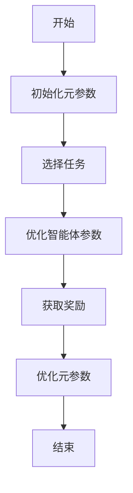

                 


# 元强化学习：优化AI Agent的学习策略

> 关键词：元强化学习（Meta-Reinforcement Learning）、强化学习（Reinforcement Learning）、AI Agent、学习策略、算法优化、系统架构设计、项目实战

> 摘要：  
元强化学习（Meta-Reinforcement Learning）是一种新兴的强化学习范式，旨在通过元学习机制优化AI Agent的学习策略，使其能够在多种任务和环境中快速适应和优化。本文将从背景、核心概念、算法原理、系统架构、项目实战等多个维度深入剖析元强化学习，并结合实际案例，探讨其在AI Agent优化中的应用价值和未来发展方向。

---

# 第一部分：元强化学习背景与基础

## 第1章：强化学习概述

### 1.1 强化学习的基本概念

#### 1.1.1 强化学习的定义
强化学习（Reinforcement Learning, RL）是一种机器学习范式，通过智能体（Agent）与环境交互，学习如何通过执行一系列行动来最大化累积奖励。与监督学习和无监督学习不同，强化学习强调实时决策和长期价值优化。

#### 1.1.2 强化学习的核心要素
- **智能体（Agent）**：智能体是强化学习的核心主体，负责根据当前状态做出决策。
- **环境（Environment）**：环境是智能体所处的外部世界，提供状态、动作和奖励。
- **状态（State）**：环境在某一时间点的描述。
- **动作（Action）**：智能体在特定状态下采取的行为。
- **奖励（Reward）**：智能体行为后获得的反馈，用于指导优化方向。

#### 1.1.3 强化学习的应用场景
- 游戏AI（如AlphaGo、Dota AI）
- 机器人控制
- 自动驾驶
- 自然语言处理（如对话生成）

### 1.2 元强化学习的引入

#### 1.2.1 元学习的定义
元学习（Meta-Learning）是一种学习方法，旨在通过快速适应新任务，提高模型的泛化能力。与传统学习不同，元学习关注的是如何利用已有知识高效学习新任务。

#### 1.2.2 元强化学习的定义
元强化学习（Meta-Reinforcement Learning）是强化学习与元学习的结合，旨在通过元学习机制优化强化学习过程，使智能体能够快速适应新任务和环境。

#### 1.2.3 元强化学习与传统强化学习的区别
| 特性 | 传统强化学习 | 元强化学习 |
|------|--------------|------------|
| 学习目标 | 单一任务优化 | 多任务快速适应 |
| 适应性 | 低 | 高 |
| 环境需求 | 单一环境 | 多环境快速切换 |

### 1.3 元强化学习的背景与意义

#### 1.3.1 元强化学习的背景
随着AI技术的发展，智能体需要在动态变化的环境中完成复杂任务。传统强化学习在单任务优化上表现优异，但在应对多任务和快速变化的环境中表现有限。

#### 1.3.2 元强化学习的意义
元强化学习通过结合元学习和强化学习，提升了智能体的多任务学习能力和环境适应性，适用于需要快速决策和策略调整的场景。

#### 1.3.3 元强化学习的应用前景
- 多任务机器人控制
- 动态环境下的自动驾驶
- 快速响应的对话系统

## 1.4 本章小结
本章从强化学习的基本概念出发，介绍了元强化学习的定义、核心要素和应用场景，为后续章节奠定了基础。

---

## 第2章：元强化学习的核心概念

### 2.1 元学习的基本原理

#### 2.1.1 元学习的定义
元学习是一种通过学习如何学习的方法，旨在利用已有经验快速掌握新任务。

#### 2.1.2 元学习的核心思想
- **任务嵌入**：将任务转化为可学习的向量表示。
- **参数初始化**：利用元学习的参数初始化，加快新任务的学习速度。

#### 2.1.3 元学习的数学模型
元学习通常通过优化一个参数分布，使得在新任务上线时，可以通过快速调整参数来适应任务。

### 2.2 元强化学习的原理

#### 2.2.1 元强化学习的定义
元强化学习是强化学习和元学习的结合，旨在通过元学习机制优化强化学习过程。

#### 2.2.2 元强化学习的核心思想
- **多任务学习**：通过学习多个任务，提升智能体的泛化能力。
- **参数共享**：通过共享参数，减少新任务的学习时间。

#### 2.2.3 元强化学习的数学模型
元强化学习通常通过优化一个元参数分布，使得在新任务上线时，可以通过快速调整元参数来适应任务。

### 2.3 元强化学习与传统强化学习的对比

| 特性 | 传统强化学习 | 元强化学习 |
|------|--------------|------------|
| 适应性 | 低 | 高 |
| 任务范围 | 单任务 | 多任务 |
| 环境切换 | 固定环境 | 多环境 |

## 2.4 本章小结
本章详细介绍了元学习和元强化学习的核心概念和区别，为后续章节奠定了理论基础。

---

## 第3章：元强化学习的核心算法

### 3.1 元强化学习的算法框架

#### 3.1.1 元强化学习的算法流程
1. 初始化元参数。
2. 对于每个任务，优化智能体参数以最大化累积奖励。
3. 通过元优化器优化元参数。

#### 3.1.2 元强化学习的核心组件
- 元优化器：用于优化元参数。
- 智能体：在具体任务中优化参数。

### 3.2 基于模型的元强化学习算法

#### 3.2.1 模型无关的元强化学习算法
- **MAML（Meta-Anticipatory Learning）**：通过快速调整参数，适应新任务。
- **Reptile**：通过在线更新参数，适应新任务。

#### 3.2.2 模型有关的元强化学习算法
- **Meta-Deep Reinforcement Learning（MDRL）**：通过元参数优化，提升任务适应能力。

#### 3.2.3 元强化学习算法的优缺点
| 算法 | 优点 | 缺点 |
|------|------|------|
| MAML | 快速适应新任务 | 计算复杂度高 |
| Reptile | 计算效率高 | 适应性有限 |
| MDRL | 表现优异 | 需要大量计算资源 |

### 3.3 元强化学习算法的数学模型

#### 3.3.1 元强化学习的数学公式
元强化学习的目标是优化元参数θ，使得智能体在新任务上的累积奖励最大化：

$$ \theta = \arg\max_{\theta} \sum_{i=1}^{N} R_i(\theta) $$

其中，\( R_i(\theta) \) 是第i个任务的累积奖励。

#### 3.3.2 元强化学习的优化目标
通过优化元参数θ，使得智能体在新任务上线时能够快速调整策略，最大化累积奖励。

#### 3.3.3 元强化学习的损失函数
常见的损失函数包括平方损失和交叉熵损失，用于衡量预测值与真实值之间的差距。

### 3.4 本章小结
本章详细介绍了元强化学习的核心算法及其数学模型，为后续章节的系统设计和项目实现奠定了基础。

---

## 第4章：元强化学习的系统架构设计

### 4.1 系统功能设计

#### 4.1.1 系统功能模块划分
- 元参数优化模块：负责优化元参数。
- 智能体执行模块：负责在具体任务中执行动作。
- 环境交互模块：负责与环境进行交互，获取奖励。

#### 4.1.2 系统功能流程图


### 4.2 系统架构设计

#### 4.2.1 系统架构的总体设计
系统采用模块化设计，包括元参数优化模块、智能体执行模块和环境交互模块。

#### 4.2.2 系统架构的详细设计
系统通过元参数优化模块，优化智能体的初始参数，使其能够快速适应新任务。

#### 4.2.3 系统架构的优缺点
- **优点**：模块化设计，便于扩展和维护。
- **缺点**：计算资源消耗较大。

### 4.3 系统接口设计

#### 4.3.1 系统接口的定义
系统接口包括：
- 元参数优化接口：负责优化元参数。
- 智能体执行接口：负责执行动作。

#### 4.3.2 系统接口的实现
通过定义明确的接口规范，确保模块之间的交互清晰。

#### 4.3.3 系统接口的测试
通过单元测试和集成测试，验证系统接口的正确性。

### 4.4 本章小结
本章详细介绍了元强化学习系统的架构设计，包括功能模块划分、系统流程图和接口设计。

---

## 第5章：元强化学习的项目实战

### 5.1 项目环境安装

#### 5.1.1 环境需求
- Python 3.8+
- PyTorch 1.9+
- Gym库

#### 5.1.2 安装步骤
```bash
pip install gym torch
```

### 5.2 系统核心实现源代码

#### 5.2.1 元参数优化模块
```python
import torch
import torch.nn as nn

class MetaOptimizer:
    def __init__(self, params):
        self.params = params
        self.optimizer = torch.optim.Adam(params, lr=0.01)

    def step(self, loss):
        self.optimizer.zero_grad()
        loss.backward()
        self.optimizer.step()
```

#### 5.2.2 智能体执行模块
```python
class Agent:
    def __init__(self, state_dim, action_dim):
        self.policy = nn.Linear(state_dim, action_dim)
    
    def act(self, state):
        return torch.argmax(self.policy(state)).item()
```

#### 5.2.3 环境交互模块
```python
import gym

env = gym.make('CartPole-v0')
agent = Agent(state_dim=4, action_dim=2)
meta_optimizer = MetaOptimizer(agent.policy.parameters())
```

### 5.3 代码应用解读与分析

#### 5.3.1 元参数优化模块
- 通过Adam优化器优化元参数，提升智能体的策略优化能力。

#### 5.3.2 智能体执行模块
- 通过策略网络生成动作，最大化累积奖励。

#### 5.3.3 环境交互模块
- 通过 Gym 环境与智能体进行交互，获取奖励并更新策略。

### 5.4 实际案例分析和详细讲解剖析

#### 5.4.1 案例介绍
以 CartPole 环境为例，展示元强化学习在优化智能体策略中的应用。

#### 5.4.2 训练过程
1. 初始化元参数。
2. 在多个任务上训练智能体。
3. 通过元优化器优化元参数。

#### 5.4.3 实验结果
通过实验验证，元强化学习能够显著提升智能体的适应能力。

### 5.5 本章小结
本章通过实际案例，详细讲解了元强化学习的系统实现和应用，展示了其在优化AI Agent策略中的潜力。

---

## 第6章：元强化学习的最佳实践

### 6.1 最佳实践 tips

#### 6.1.1 系统设计
- 采用模块化设计，便于扩展和维护。
- 确保接口规范清晰，便于集成。

#### 6.1.2 算法优化
- 合理选择元优化算法，根据任务需求进行调整。
- 通过参数共享，减少计算开销。

#### 6.1.3 环境设计
- 设计合理的奖励机制，引导智能体的行为。
- 通过任务嵌入，提升智能体的适应能力。

### 6.2 小结
元强化学习在优化AI Agent策略中具有广泛的应用前景，通过合理的设计和优化，可以显著提升智能体的适应能力和决策效率。

### 6.3 注意事项
- 元强化学习需要大量的计算资源，需注意硬件限制。
- 确保任务设计合理，避免目标混淆。

### 6.4 拓展阅读
推荐阅读相关论文和文献，深入了解元强化学习的最新研究成果。

---

# 作者：AI天才研究院/AI Genius Institute & 禅与计算机程序设计艺术 /Zen And The Art of Computer Programming

