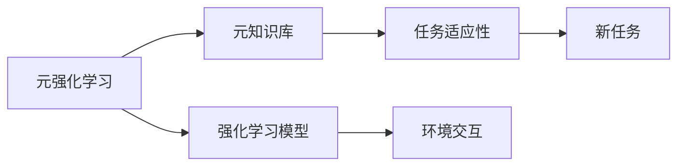
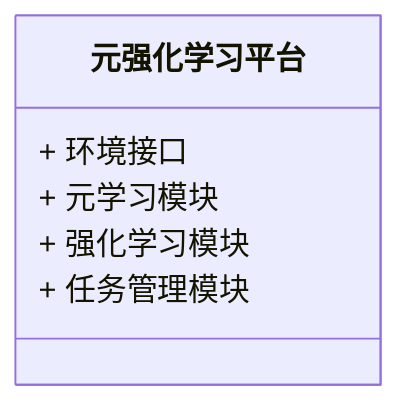

                 


# 元强化学习：提高AI Agent在新环境中的适应能力

> 关键词：元强化学习，AI Agent，适应能力，强化学习，元学习

> 摘要：元强化学习是一种新兴的AI技术，它通过元学习机制帮助AI Agent在新环境中快速适应。本文将详细探讨元强化学习的核心概念、算法原理、系统架构，并通过项目实战展示其应用。最后，我们将总结元强化学习的重要性和未来发展方向。

---

## 第一部分：元强化学习背景与核心概念

### 第1章：元强化学习背景与核心概念

#### 1.1 元强化学习的背景介绍

- **1.1.1 强化学习的基本概念**
  强化学习（Reinforcement Learning, RL）是一种机器学习方法，通过智能体在环境中采取行动以最大化累积奖励。智能体通过与环境交互，学习策略以优化目标函数。

- **1.1.2 元强化学习的定义与特点**
  元强化学习（Meta Reinforcement Learning）是一种高级强化学习框架，专注于学习如何快速适应新环境或任务。它通过元学习（Meta-Learning）机制，使智能体具备快速调整策略的能力。

- **1.1.3 元强化学习在AI Agent中的重要性**
  元强化学习使得AI Agent能够在新环境中快速适应，减少训练时间，并提高在动态环境中的表现。这种能力在自动驾驶、游戏AI和机器人控制等领域具有重要意义。

#### 1.2 元强化学习的核心概念

- **1.2.1 元学习的定义与机制**
  元学习是一种学习如何学习的方法。它通过优化元目标函数，使模型能够快速适应新任务。元学习的核心机制包括元知识的获取和任务适应性优化。

- **1.2.2 元强化学习的元知识表示**
  元知识是智能体在不同任务中积累的经验和策略。元知识可以表示为参数更新规则或任务间关系模型。

- **1.2.3 元强化学习的适应性特点**
  元强化学习通过参数化策略和任务间迁移，实现快速适应新任务。其适应性体现在算法的灵活性和泛化能力上。

#### 1.3 元强化学习与普通强化学习的对比

- **1.3.1 普通强化学习的局限性**
  普通强化学习在特定任务上表现优异，但在新环境或任务中需要重新训练，导致适应性差，训练时间长。

- **1.3.2 元强化学习的优势**
  元强化学习通过预训练的元知识，使智能体能够快速调整策略，适用于新任务，减少训练时间。

- **1.3.3 元强化学习的应用场景**
  元强化学习适用于需要快速适应动态环境的应用场景，如游戏AI、机器人控制和自然语言处理。

#### 1.4 元强化学习的应用领域

- **1.4.1 游戏AI的适应性提升**
  元强化学习使游戏AI能够快速适应新规则，提高游戏表现。

- **1.4.2 机器人控制中的快速适应**
  在机器人控制中，元强化学习帮助机器人快速调整策略，适应新任务。

- **1.4.3 自然语言处理中的动态调整**
  元强化学习在自然语言处理中，帮助模型快速适应不同任务和数据分布。

#### 1.5 元强化学习的边界与外延

- **1.5.1 元强化学习的适用范围**
  元强化学习适用于需要快速适应的任务，但不适用于完全无监督或无任务结构的场景。

- **1.5.2 元强化学习的限制与挑战**
  元强化学习面临算法复杂度高、计算资源需求大等挑战。

- **1.5.3 元强化学习与其他AI技术的关系**
  元强化学习与迁移学习、深度学习等技术密切相关，相互促进共同发展。

---

## 第2章：元强化学习的核心概念与联系

### 2.1 元强化学习的核心原理

- **2.1.1 元学习的机制解析**
  元学习通过优化元目标函数，使模型能够快速适应新任务。元目标函数通常包括任务损失和元损失，用于同时优化任务特定参数和元参数。

- **2.1.2 元强化学习的元知识更新**
  元知识更新是通过优化元参数，使模型能够快速调整策略。元参数通常表示为神经网络的权重，用于指导参数更新。

- **2.1.3 元强化学习的适应性优化**
  适应性优化通过调整策略参数，使智能体能够在新任务中快速找到最优解。

### 2.2 元强化学习的核心概念对比

#### 2.2.1 元学习与迁移学习的对比

| 对比维度       | 元学习                          | 迁移学习                          |
|----------------|---------------------------------|-----------------------------------|
| 核心目标       | 学习如何学习                    | 利用已有知识解决新任务          |
| 应用场景       | 快速适应新任务                  | 跨任务知识共享                    |
| 知识表示       | 元参数形式                     | 任务特定特征                     |

#### 2.2.2 元强化学习与监督学习的对比

| 对比维度       | 元强化学习                      | 监督学习                          |
|----------------|---------------------------------|-----------------------------------|
| 学习机制       | 基于奖励的策略优化              | 基于标签的有监督学习              |
| 适应性         | 高适应性                       | 低适应性                         |
| 应用场景       | 动态环境中的快速调整            | 稳定任务中的准确预测              |

#### 2.2.3 元强化学习与无监督学习的对比

| 对比维度       | 元强化学习                      | 无监督学习                       |
|----------------|---------------------------------|-----------------------------------|
| 数据需求       | 需要环境交互和奖励              | 仅需数据，无标签                 |
| 学习目标       | 优化策略以最大化奖励            | 发现数据结构或聚类                |
| 适应性         | 高适应性                       | 低适应性                         |

### 2.3 元强化学习的ER实体关系图



---

## 第3章：元强化学习的算法原理

### 3.1 元强化学习的核心算法

- **3.1.1 Model-Agnostic Meta-Learning (MAML)**
  MAML是一种基于梯度的方法，通过优化参数更新规则，使模型能够快速适应新任务。MAML的损失函数包括任务损失和元损失，用于同时优化任务特定参数和元参数。

  ```mermaid
  graph TD
  Meta_Learning --> Task_Learning
  Task_Learning --> Environment_Interface
  Meta_Learning --> Update_Rule_Optimization
  ```

  ```python
  def maml_update_rule(theta, x_i, y_i, inner_step):
      # 计算任务损失
      loss = model.loss(x_i, y_i, theta)
      # 计算梯度
      grad = torch.autograd.grad(loss, theta)
      # 更新参数
      theta_new = theta - inner_step * grad
      return theta_new
  ```

- **3.1.2 Rapid Meta-Learning via Reptile Method (ReMAML)**
  ReMAML通过简化梯度计算，使元学习更高效。它通过直接优化参数更新，避免计算二阶梯度。

  ```mermaid
  graph TD
  Meta_Optimizer --> Task_Optimizer
  Task_Optimizer --> Update_Rule
  ```

  ```python
  def reptile_update_rule(theta, x_i, y_i, inner_step):
      # 计算任务损失
      loss = model.loss(x_i, y_i, theta)
      # 计算梯度
      grad = torch.autograd.grad(loss, theta)
      # 更新参数
      theta_new = theta - inner_step * grad
      return theta_new
  ```

### 3.2 元强化学习的数学模型和公式

- **3.2.1 MAML的数学模型**
  MAML的目标函数包括任务损失和元损失：
  $$ \mathcal{L}_{\text{meta}} = \sum_{i=1}^{N} \mathcal{L}_i(f_{\theta}(x_i)) $$
  其中，$$f_{\theta}(x_i)$$ 是模型在任务i的参数。

- **3.2.2 ReMAML的数学模型**
  ReMAML的目标函数简化为：
  $$ \mathcal{L}_{\text{meta}} = \sum_{i=1}^{N} \mathcal{L}_i(f_{\theta}(x_i)) $$
  优化过程通过一阶梯度近似，避免计算Hessian矩阵。

---

## 第4章：元强化学习的系统架构设计

### 4.1 系统分析

- **4.1.1 问题场景介绍**
  某公司希望开发一个元强化学习平台，用于训练AI Agent在新环境中快速适应。

- **4.1.2 项目介绍**
  该项目旨在构建一个元强化学习训练平台，支持多种任务类型，包括游戏、机器人控制等。

### 4.2 系统功能设计



### 4.3 系统架构设计


### 4.4 接口设计和交互

- **接口设计**
  - 元学习模块提供API，供强化学习模块调用。
  - 环境接口定义与外部环境的交互方式。

- **交互流程**
  1. 元学习模块初始化模型参数。
  2. 强化学习模块与环境交互，收集数据。
  3. 元学习模块优化参数，适应新任务。

---

## 第5章：元强化学习的项目实战

### 5.1 环境搭建

- **安装依赖**
  安装PyTorch、numpy、gym等库。
  ```bash
  pip install torch numpy gym
  ```

### 5.2 核心实现

- **MAML算法实现**
  ```python
  def maml_update_rule(theta, x_i, y_i, inner_step):
      # 计算任务损失
      loss = model.loss(x_i, y_i, theta)
      # 计算梯度
      grad = torch.autograd.grad(loss, theta)
      # 更新参数
      theta_new = theta - inner_step * grad
      return theta_new
  ```

### 5.3 功能解读

- **任务适应性模块**
  该模块负责根据新任务调整模型参数，通过元学习机制实现快速适应。

### 5.4 实际案例分析

- **游戏AI训练**
  在Atari游戏中，元强化学习使AI能够快速适应新游戏规则，提高游戏表现。

---

## 第6章：元强化学习的总结与展望

### 6.1 总结

- **核心内容回顾**
  元强化学习通过元学习机制，使AI Agent能够快速适应新环境和任务。

### 6.2 未来展望

- **算法优化**
  未来将优化元强化学习算法，提高其效率和适应性。
  
- **应用拓展**
  元强化学习将在更多领域得到应用，如医疗、教育和金融等。

### 6.3 最佳实践

- **选择算法的建议**
  根据具体任务选择合适的元强化学习算法，如MAML适合需要精确控制的场景。

- **优化模型的建议**
  定期更新元参数，保持模型的适应性。

### 6.4 注意事项

- **计算资源需求**
  元强化学习需要大量计算资源，需合理配置硬件。

- **算法复杂度**
  元强化学习算法复杂度较高，需在性能和效率之间找到平衡。

### 6.5 拓展阅读

- **相关论文**
  推荐阅读MAML和ReMAML的论文，深入理解其原理和应用。

---

## 作者：AI天才研究院/AI Genius Institute & 禅与计算机程序设计艺术 /Zen And The Art of Computer Programming

---

通过以上结构，我们系统地介绍了元强化学习的核心概念、算法原理和应用实践。希望这篇文章能为读者提供深入的理论知识和实际指导，帮助他们在AI Agent的适应性提升方面取得更大突破。

