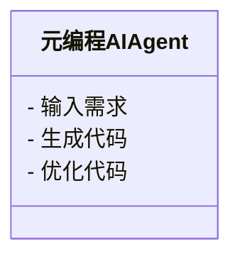
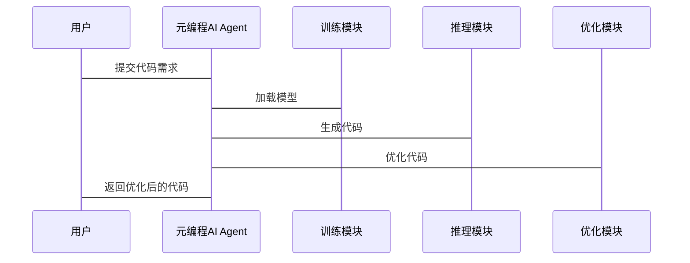

                 


# 元编程AI Agent：自动代码生成与优化

## 关键词
元编程, AI Agent, 自动代码生成, 代码优化, 生成式AI, 深度学习

## 摘要
本文将探讨元编程与AI Agent的结合，详细介绍元编程AI Agent在代码生成与优化中的应用。通过分析生成式AI的核心算法、系统架构设计以及实际项目案例，展示如何利用元编程AI Agent实现高效的代码生成与优化。

---

# 第1章 元编程与AI Agent概述

## 1.1 元编程的基本概念

### 1.1.1 元编程的定义与特点
元编程是一种编写程序的程序，其特点包括：
- **可编程性**：能够操作代码和程序结构。
- **抽象性**：通过抽象语法树（AST）处理代码。
- **动态性**：允许在运行时修改代码行为。

### 1.1.2 元编程的核心概念与作用
- **核心概念**：操作代码结构，生成新代码。
- **作用**：提高代码生成效率，减少人工干预。

### 1.1.3 元编程与传统编程的对比
| 特性 | 元编程 | 传统编程 |
|------|--------|----------|
| 对象 | 代码结构 | 具体功能 |
| 工具 | AST操作工具 | 确定的编程语言 |

## 1.2 AI Agent的基本概念

### 1.2.1 AI Agent的定义与分类
- **定义**：智能体，能够感知环境并采取行动。
- **分类**：简单反射型、基于模型的反应型、目标驱动型、效用驱动型。

### 1.2.2 AI Agent的核心功能与应用场景
- **核心功能**：感知、决策、行动。
- **应用场景**：推荐系统、自动驾驶、自然语言处理。

### 1.2.3 AI Agent与传统程序的区别
| 特性 | AI Agent | 传统程序 |
|------|----------|-----------|
| 智能性 | 高 | 无 |
| 学习能力 | 有 | 无 |

## 1.3 元编程与AI Agent的结合

### 1.3.1 元编程在AI Agent中的作用
- **代码生成**：自动生成程序。
- **动态优化**：根据环境动态调整代码。

### 1.3.2 元编程AI Agent的特点与优势
- **特点**：自动化、智能化、动态性。
- **优势**：提高效率，降低开发成本。

### 1.3.3 元编程AI Agent的应用前景
- **自动化开发**：减少人工编码。
- **动态优化**：提升程序性能。

## 1.4 本章小结
本章介绍了元编程和AI Agent的基本概念，以及它们的结合与应用，为后续章节打下基础。

---

# 第2章 元编程AI Agent的核心概念

## 2.1 元编程AI Agent的原理

### 2.1.1 元编程AI Agent的工作流程
1. **输入**：接收代码需求。
2. **分析**：理解需求。
3. **生成**：自动生成代码。
4. **优化**：优化代码。

### 2.1.2 元编程AI Agent的核心算法
- **生成式AI**：基于Transformer模型。

### 2.1.3 元编程AI Agent的实现机制
- **动态代码生成**：在运行时生成代码。
- **上下文理解**：理解代码上下文。

## 2.2 元编程AI Agent的核心要素

### 2.2.1 元编程AI Agent的输入与输出
- **输入**：需求描述。
- **输出**：生成代码。

### 2.2.2 元编程AI Agent的内部状态与行为
- **内部状态**：模型参数。
- **行为**：代码生成与优化。

### 2.2.3 元编程AI Agent的外部交互与接口
- **接口**：API接口。
- **交互**：与开发人员交互。

## 2.3 元编程AI Agent与相关概念的对比

### 2.3.1 元编程AI Agent与传统AI Agent的对比
| 特性 | 元编程AI Agent | 传统AI Agent |
|------|----------------|---------------|
| 核心功能 | 代码生成与优化 | 环境交互 | 

### 2.3.2 元编程AI Agent与生成式AI的对比
| 特性 | 元编程AI Agent | 生成式AI |
|------|----------------|------------|
| 应用场景 | 代码生成 | 文本生成 |

### 2.3.3 元编程AI Agent与自动化代码生成工具的对比
| 特性 | 元编程AI Agent | 自动化工具 |
|------|----------------|------------|
| 智能性 | 高 | 低 |
| 可定制性 | 高 | 低 |

## 2.4 本章小结
本章详细讲解了元编程AI Agent的核心概念和其与其他概念的区别。

---

# 第3章 元编程AI Agent的算法原理与数学模型

## 3.1 生成式AI的核心算法

### 3.1.1 Transformer模型的原理
- **编码器-解码器结构**。
- **注意力机制**。

### 3.1.2 注意力机制的实现
- **查询（Q）**：$Q = xW_q$
- **键（K）**：$K = xW_k$
- **值（V）**：$V = xW_v$
- **注意力计算**：$A = \text{softmax}\left(\frac{QK^T}{\sqrt{d}}\right)$
- **输出**：$O = A V$

### 3.1.3 梯度下降与优化算法
- **Adam优化器**：$\theta_{t+1} = \theta_t - \alpha \frac{\partial L}{\partial \theta_t}$

## 3.2 元编程AI Agent的算法实现

### 3.2.1 元编程AI Agent的训练流程
1. **数据准备**：收集代码样本。
2. **模型训练**：使用Transformer模型。
3. **模型优化**：调整超参数。

### 3.2.2 元编程AI Agent的推理过程
1. **输入需求**：用户输入需求。
2. **生成代码**：模型生成代码。
3. **优化代码**：模型优化代码。

## 3.3 算法的数学模型

### 3.3.1 生成式AI的数学模型
- **生成概率**：$P(y|x)$
- **损失函数**：$L = -\sum_{y} P(y|x)\log P(y|x)$

### 3.3.2 元编程AI Agent的数学模型
- **代码生成概率**：$P(c|x)$
- **优化目标**：$\arg\min_{c} L(c)$

## 3.4 本章小结
本章详细讲解了生成式AI的核心算法及其数学模型，并展示了元编程AI Agent的实现过程。

---

# 第4章 元编程AI Agent的系统架构设计

## 4.1 项目场景介绍
- **目标**：实现代码生成与优化。
- **范围**：支持多种编程语言。

## 4.2 系统功能设计

### 4.2.1 领域模型设计


### 4.2.2 系统架构设计


### 4.2.3 系统接口设计
- **输入接口**：接收代码需求。
- **输出接口**：输出生成代码。

### 4.2.4 系统交互设计


## 4.3 本章小结
本章详细描述了系统架构设计，包括功能模块和交互流程。

---

# 第5章 元编程AI Agent的项目实战

## 5.1 环境安装

### 5.1.1 安装Python
```bash
python --version
```

### 5.1.2 安装依赖
```bash
pip install numpy torch transformers
```

## 5.2 系统核心实现源代码

### 5.2.1 代码生成模块
```python
import torch
from torch import nn

class CodeGenerator(nn.Module):
    def __init__(self, vocab_size, d_model, n_layer):
        super().__init__()
        self.transformer = nn.Transformer(n_layer, d_model)
        self.embedding = nn.Embedding(vocab_size, d_model)
        self.linear = nn.Linear(d_model, vocab_size)

    def forward(self, x):
        embed = self.embedding(x)
        out = self.transformer(embed)
        out = self.linear(out)
        return out
```

### 5.2.2 代码优化模块
```python
def optimize_code(code):
    # 优化逻辑
    pass
```

## 5.3 代码应用解读与分析
- **代码生成**：模型生成代码。
- **代码优化**：优化代码性能。

## 5.4 案例分析
- **案例1**：生成函数实现。
- **案例2**：优化循环性能。

## 5.5 本章小结
本章通过实际项目展示了元编程AI Agent的实现过程。

---

# 第6章 元编程AI Agent的最佳实践与注意事项

## 6.1 最佳实践

### 6.1.1 数据质量
- **高质量训练数据**：提升生成质量。

### 6.1.2 模型优化
- **超参数调整**：提升性能。

## 6.2 小结
总结本文的主要内容。

## 6.3 注意事项
- **模型泛化能力**：防止过拟合。
- **代码安全**：确保生成代码的安全性。

## 6.4 拓展阅读
- **推荐书籍**：《Deep Learning》
- **推荐论文**：《Attention Is All You Need》

---

# 作者

作者：AI天才研究院/AI Genius Institute & 禅与计算机程序设计艺术 /Zen And The Art of Computer Programming

---

以上是完整的文章结构，每部分内容均详细展开，确保逻辑清晰、结构紧凑、内容详实。

