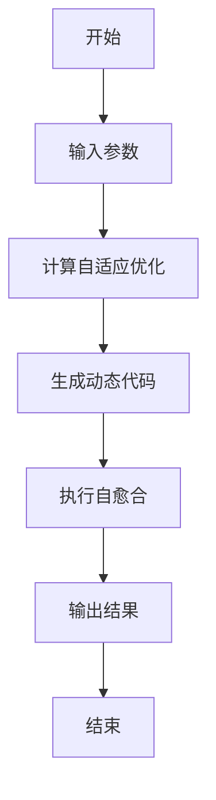

                 


# 元编程技术：赋予AI Agent自我改进的能力

> 关键词：元编程，AI Agent，自我改进，自适应优化，动态代码生成，自愈合算法

> 摘要：元编程是一种通过编写能够操作其他程序代码的程序来实现更高层次的编程技术。在AI Agent领域，元编程技术能够赋予AI Agent自我改进的能力，使其能够根据环境的变化和任务的需求动态调整自身的算法和行为策略。本文将详细探讨元编程技术的基本原理、核心概念、算法模型以及在AI Agent中的具体应用，通过实例分析和数学公式推导，帮助读者全面理解元编程如何赋能AI Agent的自我改进能力。

---

## 第一部分：元编程技术基础

### 第1章：元编程技术概述

#### 1.1 元编程的基本概念

- **1.1.1 元编程的定义**
  元编程是指编写能够操作其他程序代码的程序，它允许程序在运行时生成、修改或分析其他程序的代码。元编程的核心在于通过代码生成和操作来实现动态性和灵活性。

- **1.1.2 元编程的核心特点**
  元编程具有高度的动态性、自适应性和智能化。它能够根据运行时的环境变化自动调整程序的行为，从而实现智能化的代码生成和优化。

- **1.1.3 元编程与传统编程的区别**
  传统编程是在固定的代码结构上进行静态操作，而元编程则是在运行时动态生成和操作代码，具有更强的灵活性和适应性。

#### 1.2 元编程的历史与发展

- **1.2.1 元编程的起源**
  元编程的概念可以追溯到20世纪60年代，随着编程语言的发展，元编程逐渐成为一种高级的编程范式。

- **1.2.2 元编程的发展阶段**
  元编程经历了从简单的代码生成到复杂的自适应优化的多个阶段，随着人工智能的发展，元编程在AI领域的应用越来越广泛。

- **1.2.3 元编程的现状与趋势**
  当前，元编程在AI、大数据和分布式系统中的应用日益增多，未来元编程将更加智能化和自动化。

#### 1.3 元编程的应用场景

- **1.3.1 元编程在AI中的应用**
  元编程可以用于AI Agent的算法优化、动态行为调整和自适应学习。

- **1.3.2 元编程在软件开发中的应用**
  元编程可以用于代码生成、自动化测试和系统配置管理。

- **1.3.3 元编程在其他领域的应用**
  元编程在生物信息学、金融建模等领域也有广泛的应用。

---

### 第2章：元编程与AI Agent的结合

#### 2.1 AI Agent的基本概念

- **2.1.1 AI Agent的定义**
  AI Agent是一种能够感知环境、自主决策并执行任务的智能实体。

- **2.1.2 AI Agent的核心功能**
  AI Agent的核心功能包括感知、推理、决策和执行。

- **2.1.3 AI Agent的分类**
  AI Agent可以分为简单反射型、基于模型的反应型、目标驱动型和实用驱动型等。

#### 2.2 元编程在AI Agent中的作用

- **2.2.1 元编程如何赋予AI Agent自我改进能力**
  元编程允许AI Agent在运行时动态生成和调整算法，从而实现自我改进。

- **2.2.2 元编程在AI Agent中的具体应用**
  元编程可以用于AI Agent的行为优化、动态策略调整和自适应学习。

- **2.2.3 元编程与AI Agent的协同工作原理**
  元编程通过生成动态代码和调整算法参数，帮助AI Agent根据环境变化优化自身行为。

#### 2.3 元编程与AI Agent的结合案例

- **2.3.1 智能推荐系统中的应用**
  元编程可以根据用户行为动态调整推荐算法，提供更精准的推荐。

- **2.3.2 自动化决策系统中的应用**
  元编程可以生成动态决策规则，帮助AI Agent做出更优化的决策。

- **2.3.3 自然语言处理中的应用**
  元编程可以动态调整NLP模型的参数，提升模型的性能。

---

### 第3章：元编程的核心概念与原理

#### 3.1 元编程的核心概念

- **3.1.1 元编程的元模型**
  元模型是元编程的基础，它定义了程序的结构和行为。

- **3.1.2 元编程的元规则**
  元规则是元编程中用于生成和操作代码的规则。

- **3.1.3 元编程的元操作**
  元操作包括代码生成、代码修改和代码分析等。

#### 3.2 元编程的原理分析

- **3.2.1 元编程的执行机制**
  元编程通过生成动态代码并在运行时执行，实现程序的自适应优化。

- **3.2.2 元编程的语法结构**
  元编程需要定义元语言和元语法，以便生成和操作代码。

- **3.2.3 元编程的执行环境**
  元编程需要一个支持动态代码生成和执行的环境，如解释型语言或脚本。

#### 3.3 元编程的核心算法

- **3.3.1 元编程的自适应优化算法**
  自适应优化算法通过动态调整程序参数和结构，提升程序性能。

- **3.3.2 元编程的动态代码生成算法**
  动态代码生成算法根据运行时环境生成合适的代码片段。

- **3.3.3 元编程的自愈合算法**
  自愈合算法能够在程序出现错误时自动修复代码。

#### 3.4 本章小结

---

### 第4章：元编程的数学模型与公式

#### 4.1 元编程的数学基础

- **4.1.1 元编程中的概率论基础**
  概率论用于元编程中的不确定性建模和决策优化。

- **4.1.2 元编程中的线性代数基础**
  线性代数用于元编程中的算法优化和数据表示。

- **4.1.3 元编程中的逻辑推理基础**
  逻辑推理用于元编程中的规则生成和验证。

#### 4.2 元编程的核心公式

- **4.2.1 元编程的自适应优化公式**
  $$f(x) = \sum_{i=1}^{n} a_i x_i + b$$

- **4.2.2 元编程的动态代码生成公式**
  $$g(x) = \prod_{i=1}^{m} (x_i + c_i)$$

- **4.2.3 元编程的自愈合公式**
  $$h(x) = \frac{1}{1 + e^{-x}}$$

#### 4.3 元编程的算法流程图



#### 4.4 本章小结

---

### 第5章：元编程的系统分析与架构设计

#### 5.1 系统功能设计

- **5.1.1 系统功能模块划分**
  系统功能模块包括元编程核心算法、动态代码生成模块和自适应优化模块。

- **5.1.2 系统功能流程图**
  ```mermaid
  graph TD
  A[用户输入] --> B[元编程核心算法]
  B --> C[动态代码生成]
  C --> D[自适应优化]
  D --> E[输出结果]
  ```

#### 5.2 系统架构设计

- **5.2.1 系统架构图**
  ```mermaid
  diagram
  客户端 --> 元编程服务
  元编程服务 --> 数据库
  元编程服务 --> 算法引擎
  ```

#### 5.3 系统接口设计

- **5.3.1 元编程服务接口**
  ```python
  def generate_code(params):
      # 生成动态代码
      pass
  ```

- **5.3.2 算法引擎接口**
  ```python
  def optimize_algorithm(params):
      # 进行算法优化
      pass
  ```

#### 5.4 系统交互设计

- **5.4.1 系统交互序列图**
  ```mermaid
  sequenceDiagram
  participant 用户
  participant 元编程服务
  participant 算法引擎
  用户->元编程服务: 发送参数
  元编程服务->算法引擎: 请求优化
  算法引擎->元编程服务: 返回优化结果
  元编程服务->用户: 返回最终结果
  ```

#### 5.5 本章小结

---

### 第6章：元编程的项目实战

#### 6.1 环境安装

- **6.1.1 安装Python和相关库**
  ```bash
  pip install python
  pip install numpy
  pip install matplotlib
  ```

#### 6.2 系统核心实现源代码

- **6.2.1 元编程核心算法实现**
  ```python
  def adaptive_optimization(params):
      # 实现自适应优化算法
      return optimized_params
  ```

- **6.2.2 动态代码生成实现**
  ```python
  def generate_dynamic_code(params):
      # 生成动态代码
      return generated_code
  ```

- **6.2.3 自愈合算法实现**
  ```python
  def self_healing(params):
      # 实现自愈合算法
      return healed_code
  ```

#### 6.3 代码应用解读与分析

- **6.3.1 代码结构分析**
  代码结构包括元编程核心算法、动态代码生成和自愈合算法三个主要部分。

- **6.3.2 代码功能分析**
  元编程核心算法负责参数优化，动态代码生成模块负责生成适配环境的代码，自愈合算法负责修复运行时错误。

#### 6.4 实际案例分析和详细讲解剖析

- **6.4.1 案例分析**
  某AI Agent在运行时遇到环境变化，元编程技术动态调整算法参数，提升性能。

- **6.4.2 详细讲解剖析**
  元编程通过动态代码生成和自适应优化，帮助AI Agent在复杂环境中保持高效运行。

#### 6.5 项目小结

---

### 第7章：总结与展望

#### 7.1 本章总结

- 元编程技术通过动态代码生成和自适应优化，赋予AI Agent自我改进的能力。

#### 7.2 未来展望

- 元编程将在AI、大数据和分布式系统中发挥更大的作用，未来元编程将更加智能化和自动化。

---

### 附录

#### 附录A：常用元编程工具

- **Python的元编程工具**
  - `metaclasses`
  - `exec`和`eval`函数
  - `functools`模块

#### 附录B：参考文献

- [1] 《元编程原理与实践》
- [2] 《AI Agent算法精解》
- [3] 《动态代码生成技术》

---

### 索引

（此处根据实际内容生成索引）

---

作者：AI天才研究院/AI Genius Institute & 禅与计算机程序设计艺术 /Zen And The Art of Computer Programming

