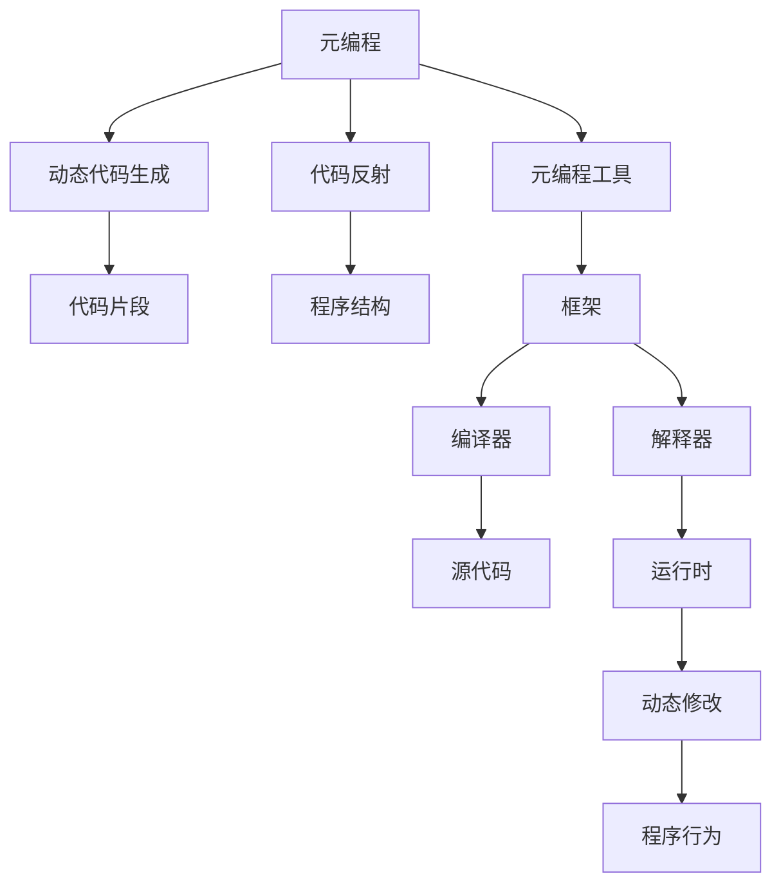
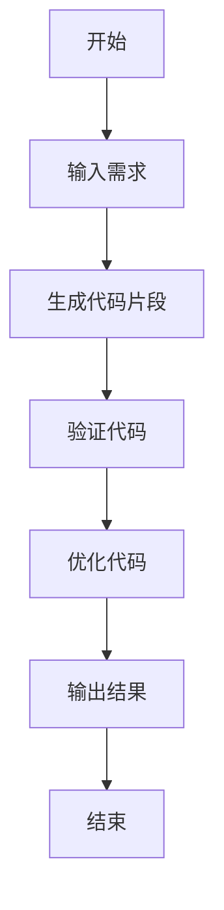
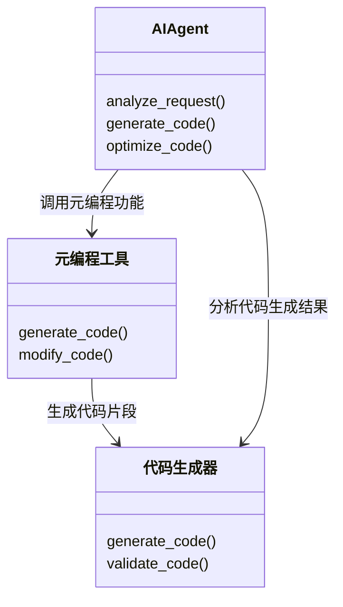
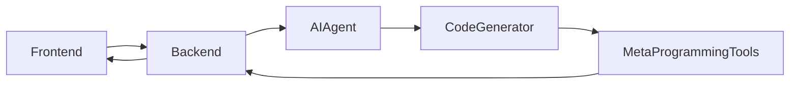

                 


# 元编程：让AI Agent生成和修改代码

> 关键词：元编程、AI Agent、代码生成、代码修改、生成式AI、机器学习

> 摘要：元编程是一种通过编写程序来操作其他程序的高级技术，而AI Agent则是一种能够感知环境、自主决策的智能体。将元编程与AI Agent相结合，能够实现代码的自动生成和动态修改，从而提升软件开发的效率和智能化水平。本文将详细探讨元编程与AI Agent的核心概念、算法原理、系统架构以及实际应用，为读者提供一个全面的视角来理解这一前沿技术。

---

## 第1章 引言

在现代软件开发中，代码生成和修改已经成为提高开发效率和代码质量的重要手段。元编程作为一种高级的编程技术，能够在运行时动态生成和修改代码，而AI Agent则能够通过学习和推理，帮助开发者完成复杂的任务。将两者结合，AI Agent可以利用元编程的能力，实现代码的自动生成和动态优化，从而推动软件开发进入一个更加智能化的阶段。

本章将介绍元编程和AI Agent的基本概念，探讨它们结合的意义和应用场景，并为后续内容奠定基础。

---

## 第2章 元编程与AI Agent的核心概念与联系

### 2.1 元编程的核心概念

元编程是指编写能够操作其他程序的程序。它允许在运行时动态生成代码、修改代码结构或执行其他与代码相关的操作。元编程的核心在于对程序的抽象和操控，能够显著提高代码的灵活性和可维护性。

- **动态代码生成**：在运行时根据需求生成代码片段。
- **代码反射**：通过反射机制访问和修改程序的内部结构。
- **元编程工具**：如代码生成框架、编译器和解释器等。

### 2.2 AI Agent的核心原理

AI Agent是一种能够感知环境、自主决策的智能体。它通过接收输入信息，利用内部模型进行分析和推理，生成相应的输出或操作。AI Agent的核心能力包括：

- **感知**：通过传感器或其他输入方式获取环境信息。
- **决策**：基于感知信息进行分析和推理，生成决策策略。
- **执行**：根据决策结果执行相应的操作。

### 2.3 元编程与AI Agent的结合

元编程与AI Agent的结合主要体现在AI Agent能够利用元编程的能力，动态生成和修改代码，从而实现更复杂的任务。这种结合不仅提高了代码生成的效率，还使得代码能够根据环境的变化进行自适应调整。

#### 2.3.1 核心概念对比与联系

| 概念       | 元编程                          | AI Agent                        |
|------------|---------------------------------|---------------------------------|
| 核心能力    | 动态生成和修改代码              | 感知、决策和执行                |
| 应用场景    | 代码生成、动态配置、反射        | 自动化任务、智能决策、人机交互  |
| 优势       | 提高代码灵活性和可维护性          | 提高系统的智能性和自主性          |
| 结合点      | 通过元编程生成代码，AI Agent调用 | AI Agent驱动元编程操作          |

#### 2.3.2 概念结构与核心要素



---

## 第3章 元编程与AI Agent的算法原理

### 3.1 生成式AI的算法原理

生成式AI（Generative AI）是基于深度学习模型的一种技术，能够生成新的数据，如文本、图像或代码。其核心算法包括：

- **循环神经网络（RNN）**：用于处理序列数据。
- **变分自编码器（VAE）**：通过编码和解码过程生成数据。
- **生成对抗网络（GAN）**：通过生成器和判别器的对抗训练生成数据。

#### 3.1.1 代码生成的算法步骤



#### 3.1.2 Python代码示例

```python
# 示例：使用生成式AI生成代码片段
def generate_code(*args):
    # 通过模型生成代码
    code = model.generate(args)
    # 验证代码
    if validate_code(code):
        return code
    else:
        return None

def validate_code(code):
    # 验证代码是否符合要求
    try:
        compile(code, '<string>', 'exec')
        return True
    except:
        return False
```

### 3.2 元编程与AI Agent的协同工作

AI Agent通过调用元编程工具，动态生成和修改代码，从而实现更复杂的任务。其协同工作流程如下：

1. **需求分析**：AI Agent接收需求，分析代码生成的条件。
2. **代码生成**：通过元编程工具生成初步代码。
3. **代码优化**：AI Agent利用生成式AI优化代码。
4. **代码验证**：验证代码是否满足需求。
5. **动态调整**：根据反馈动态修改代码。

#### 3.2.1 算法数学模型

生成式AI的数学模型通常基于概率分布，如：

$$ P(x) = \prod_{i=1}^{n} P(x_i | x_{i-1}, \ldots, x_1) $$

其中，$x_i$ 表示生成的代码片段，$P(x_i | x_{i-1}, \ldots, x_1)$ 表示在给定历史代码片段的条件下生成新的代码片段的概率。

---

## 第4章 系统分析与架构设计

### 4.1 项目场景介绍

本项目旨在开发一个能够利用AI Agent生成和修改代码的系统，目标是提高软件开发的效率和代码质量。

### 4.2 系统功能设计

- **代码生成**：根据需求生成代码片段。
- **代码优化**：通过生成式AI优化代码。
- **动态调整**：根据反馈动态修改代码。

#### 4.2.1 领域模型



### 4.3 系统架构设计

- **前端**：接收用户输入，展示生成代码。
- **后端**：处理用户请求，调用AI Agent和元编程工具。
- **AI Agent**：负责代码生成和优化。
- **元编程工具**：动态生成和修改代码。

#### 4.3.1 系统架构图



---

## 第5章 项目实战

### 5.1 环境安装

安装所需的Python库，如TensorFlow、Keras等。

### 5.2 系统核心实现

实现AI Agent和元编程工具的接口，完成代码的生成和优化。

#### 5.2.1 代码实现

```python
# 示例：AI Agent调用元编程工具生成代码
class AIAgent:
    def __init__(self):
        self.meta_tool = MetaProgrammingTools()

    def generate_code(self, request):
        code = self.meta_tool.generate(request)
        return code

class MetaProgrammingTools:
    def generate(self, request):
        # 生成代码
        return generated_code
```

### 5.3 代码应用解读与分析

通过具体案例分析，展示代码生成和优化的过程。

#### 5.3.1 案例分析

```mermaid
graph TD
    User --> AIAgent: 提交需求
    AIAgent --> MetaProgrammingTools: 调用生成代码
    MetaProgrammingTools --> AIAgent: 返回代码
    AIAgent --> User: 展示结果
```

### 5.4 项目小结

总结项目实现的关键点，分析可能遇到的问题，并提出优化建议。

---

## 第6章 最佳实践、小结、注意事项与拓展阅读

### 6.1 最佳实践

- **模型优化**：定期更新生成式AI模型，提升代码生成的准确性。
- **代码验证**：严格验证生成的代码，确保其符合需求。
- **安全性**：确保元编程操作的安全性，防止代码注入攻击。

### 6.2 小结

本文详细探讨了元编程与AI Agent的核心概念、算法原理、系统架构以及实际应用。通过理论与实践的结合，展示了如何利用这两种技术的结合来提升代码生成和修改的效率。

### 6.3 注意事项

- 元编程操作需要谨慎处理，避免对现有代码造成破坏。
- 在实际应用中，需确保AI Agent的决策逻辑准确，防止生成错误代码。
- 定期维护和更新系统，以应对不断变化的编程需求。

### 6.4 拓展阅读

- 《生成式AI：原理与应用》
- 《元编程的艺术》
- 《AI在软件开发中的应用》

---

## 作者信息

作者：AI天才研究院/AI Genius Institute  
& 禅与计算机程序设计艺术 /Zen And The Art of Computer Programming  

---

以上是《元编程：让AI Agent生成和修改代码》的完整目录和文章内容，希望对您有所帮助！

