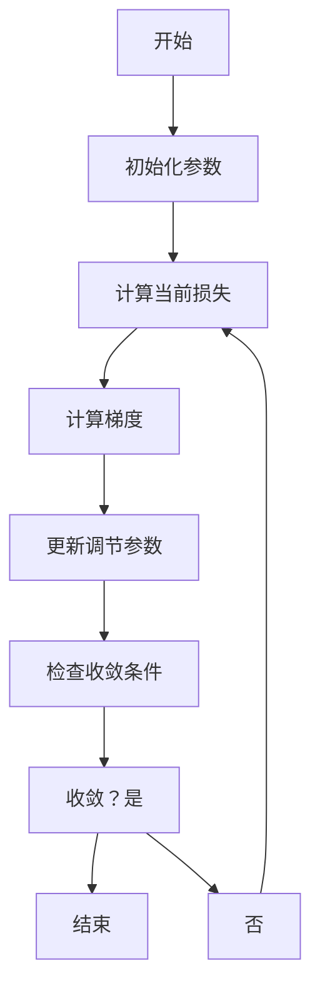
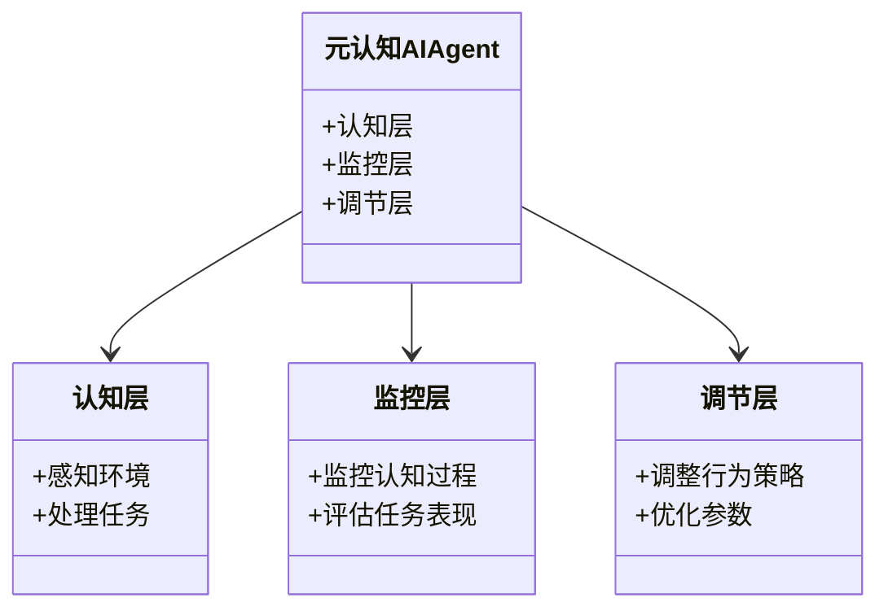
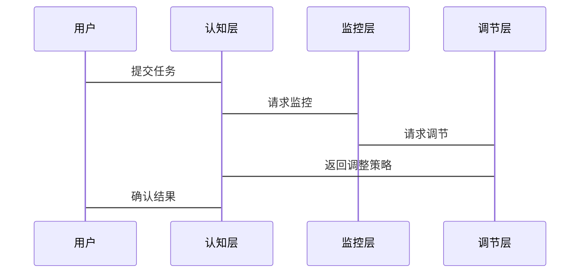

                 


# 元认知AI Agent：自我监控与调节

## 关键词：元认知，AI Agent，自我监控，调节，认知科学，人工智能，自适应系统

## 摘要：元认知AI Agent是一种具备自我监控和调节能力的先进人工智能系统，结合了认知科学和人工智能技术，能够实现自我反思、自我修正和自我优化。本文将深入探讨元认知AI Agent的核心概念、算法原理、系统设计、项目实战和最佳实践，为读者提供全面的技术解读。

---

## 第四章：自适应调节算法

### 4.1 自适应调节算法的背景

自适应调节算法是一种能够让AI系统根据环境变化和任务需求动态调整自身行为的算法。其核心思想是通过元学习和自适应机制，使AI Agent能够不断优化其决策和执行过程。

#### 4.1.1 自适应调节的定义
自适应调节是指AI系统能够根据反馈信息调整自身的行为策略，以更好地适应动态变化的环境或任务需求。

#### 4.1.2 自适应调节的重要性
在实际应用中，环境往往是动态变化的，单一的固定策略难以应对所有情况。自适应调节能够使AI Agent具备更强的灵活性和适应性，从而提高系统的整体性能。

---

### 4.2 自适应调节算法的原理

#### 4.2.1 元学习在自适应调节中的作用
元学习是一种通过学习如何学习来提高泛化能力的方法。在自适应调节中，元学习用于快速适应新任务或环境变化。

##### 4.2.1.1 元学习的数学模型
元学习的核心在于对学习过程的优化。假设有一个元学习器 $M$，它通过参数 $\theta$ 对目标学习器 $L$ 进行优化。目标学习器在任务 $t$ 上的损失函数为：
$$ L(\theta, t) = \sum_{i=1}^{n} \mathcal{L}(f_\theta(x_i), y_i) $$
元学习器的目标是通过调整 $\theta$ 来最小化目标学习器在多个任务上的损失：
$$ M(\theta) = \sum_{t=1}^{T} L(\theta, t) $$

##### 4.2.1.2 元学习的实现步骤
1. 初始化元学习器 $M$ 和目标学习器 $L$ 的参数。
2. 在每个任务 $t$ 上训练目标学习器。
3. 根据目标学习器的梯度更新元学习器的参数。

#### 4.2.2 自适应调节的数学模型
自适应调节算法通过引入调节参数 $\alpha$，动态调整系统的行为策略。假设当前任务的目标函数为 $f(x)$，调节参数 $\alpha$ 的更新规则为：
$$ \alpha_{t+1} = \alpha_t + \eta \cdot \nabla_\alpha f(x_t) $$
其中，$\eta$ 是学习率，$\nabla_\alpha$ 表示对 $\alpha$ 的梯度。

##### 4.2.2.1 自适应调节算法流程图


---

## 第五章：元认知AI Agent的系统设计

### 5.1 问题场景分析

#### 5.1.1 问题背景
在实际应用中，AI Agent需要面对复杂多变的环境和任务。例如，在智能客服系统中，AI Agent需要根据用户的情绪和需求动态调整对话策略。

#### 5.1.2 问题描述
AI Agent在处理复杂任务时，可能会因为环境变化或任务目标的调整而导致性能下降。因此，需要通过元认知机制实现自我监控和调节。

---

### 5.2 系统功能设计

#### 5.2.1 领域模型（Mermaid类图）


---

#### 5.2.2 系统架构设计（Mermaid架构图）


---

#### 5.2.3 系统接口设计
1. 输入接口：接收环境反馈和任务目标。
2. 输出接口：输出调整后的行为策略。

#### 5.2.4 系统交互设计（Mermaid序列图）


---

## 第六章：项目实战

### 6.1 环境配置

#### 6.1.1 安装依赖
```bash
pip install numpy matplotlib
```

---

#### 6.1.2 安装深度学习框架
```bash
pip install tensorflow keras
```

---

### 6.2 核心实现

#### 6.2.1 元认知AI Agent的代码实现

##### 6.2.1.1 认知层实现
```python
class CognitiveLayer:
    def __init__(self, model):
        self.model = model
```

##### 6.2.1.2 监控层实现
```python
class MonitoringLayer:
    def __init__(self):
        self.performance = 0.0
```

##### 6.2.1.3 调节层实现
```python
class RegulationLayer:
    def __init__(self):
        self.adjustment_factor = 0.1
```

---

#### 6.2.2 系统集成代码
```python
from cognitive_layer import CognitiveLayer
from monitoring_layer import MonitoringLayer
from regulation_layer import RegulationLayer

class MetaCognitiveAI:
    def __init__(self):
        self.cognitive = CognitiveLayer(self.model)
        self.monitoring = MonitoringLayer()
        self.regulation = RegulationLayer()
```

---

### 6.3 案例分析

#### 6.3.1 应用场景：智能客服系统

##### 6.3.1.1 问题描述
在智能客服系统中，AI Agent需要根据用户的情绪和需求动态调整对话策略。

##### 6.3.1.2 实现细节
1. 认知层负责接收用户输入并生成初步回复。
2. 监控层分析用户情绪并评估回复效果。
3. 调节层根据监控结果调整回复策略。

##### 6.3.1.3 案例分析结果
通过元认知机制，AI Agent能够显著提高用户满意度，减少情绪冲突。

---

## 第七章：最佳实践与总结

### 7.1 最佳实践

#### 7.1.1 参数调优
- 学习率 $\eta$ 的选择：建议从 $0.1$ 开始，逐步调整。
- 调节因子 $\alpha$ 的初始化：建议设置为 $0.1$。

#### 7.1.2 系统优化
- 增加监控层的反馈频率。
- 定期更新调节层的参数。

#### 7.1.3 代码审查
- 确保各层之间的接口一致。
- 定期进行代码重构，提高代码可读性。

---

### 7.2 小结

通过本文的详细讲解，我们可以看到，元认知AI Agent结合了认知科学和人工智能的最新成果，具备强大的自我监控和调节能力。在实际应用中，元认知AI Agent能够显著提高系统的灵活性和适应性，为人工智能技术的发展提供了新的方向。

---

### 7.3 注意事项

1. **参数选择**：在实际应用中，参数的选择对系统性能影响较大，建议进行充分的实验和验证。
2. **数据质量**：元认知AI Agent的性能依赖于高质量的数据，数据预处理是关键步骤。
3. **模型复杂度**：避免过度复杂的模型，保持模型的可解释性和可调节性。

---

### 7.4 拓展阅读

1.《元学习：从理论到实践》
2.《自适应系统的设计与实现》
3.《认知科学与人工智能的交叉研究》

---

## 作者：AI天才研究院/AI Genius Institute & 禅与计算机程序设计艺术 /Zen And The Art of Computer Programming

