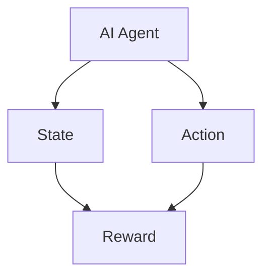
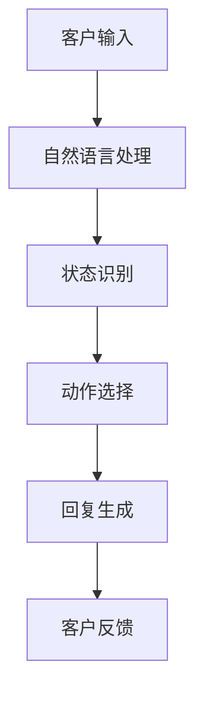
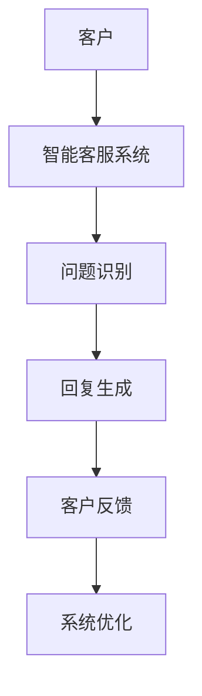

                 


```markdown
# 克服AI Agent开发挑战：常见问题及其解决方案

> 关键词：AI Agent, 开发挑战, 解决方案, 强化学习, 系统架构

> 摘要：本文深入探讨了AI Agent开发中的常见问题，并结合实际案例，详细分析了这些问题的成因及其解决方案。通过系统架构设计、算法优化和项目实战，为开发者提供了全面的指导。

---

## 第一部分: AI Agent开发背景与挑战

### 第1章: AI Agent的基本概念与挑战

#### 1.1 AI Agent的定义与核心概念
- **1.1.1 什么是AI Agent？**
  - AI Agent的定义：智能体（Agent）是指能够感知环境并采取行动以实现目标的实体。
  - 核心概念：自主性、反应性、目标导向、社交能力。

- **1.1.2 AI Agent的类型与应用场景**
  - 分类：简单反射型、基于模型的反射型、目标驱动型、效用驱动型。
  - 应用场景：游戏AI、推荐系统、自动驾驶、智能客服。

- **1.1.3 AI Agent开发中的挑战**
  - 数据质量：噪声数据影响决策。
  - 算法选择：复杂环境中选择合适算法。
  - 系统性能：处理速度和资源消耗的平衡。
  - 安全与伦理：确保安全性和合规性。

#### 1.2 AI Agent开发的核心概念与联系
- **状态空间与动作空间**
  - 状态空间：环境中的所有可能状态。
  - 动作空间：智能体可执行的所有动作。
  - 关系：动作选择依赖于当前状态。

- **策略与价值函数**
  - 策略：决定动作选择的策略。
  - 价值函数：评估状态或动作的价值。
  - 联系：策略指导动作选择，价值函数提供反馈。

- **探索与利用**
  - 探索：尝试新动作以发现更好的策略。
  - 利用：根据当前最佳策略采取行动。
  - 平衡：在探索与利用之间找到平衡点。

#### 1.3 概念属性特征对比表格
```plaintext
| 概念         | 属性               | 特征对比               |
|--------------|--------------------|-----------------------|
| 状态空间      | 离散/连续           | 离散状态易于处理       |
| 动作空间      | 离散/连续           | 离散动作便于策略优化   |
| 策略函数      | 确定性/概率性       | 概率策略更灵活         |
| 价值函数      | 状态值/动作值       | 动作值函数更直接       |
```

#### 1.4 ER实体关系图


### 第2章: AI Agent算法原理与数学模型

#### 2.1 算法原理讲解

- **Q-Learning算法**
  ```mermaid
  graph TD
  A[状态] --> B[选择动作]
  B --> C[执行动作]
  C --> D[获得奖励]
  D --> E[更新Q值]
  ```

  **Python代码实现：**
  ```python
  import numpy as np

  class QLearning:
      def __init__(self, state_space, action_space, lr=0.1, gamma=0.9):
          self.q_table = np.zeros((state_space, action_space))
          self.lr = lr
          self.gamma = gamma

      def choose_action(self, state):
          return np.argmax(self.q_table[state])

      def update_q_table(self, state, action, reward, next_state):
          self.q_table[state][action] = self.q_table[state][action] * (1 - self.lr) + self.lr * (reward + self.gamma * np.max(self.q_table[next_state]))
  ```

- **深度强化学习算法（DQN）**
  ```mermaid
  graph TD
  A[状态] --> B[神经网络处理]
  B --> C[输出策略或Q值]
  C --> D[选择动作]
  D --> E[获得奖励]
  E --> F[更新神经网络]
  ```

  **数学模型：**
  $$ Q(s, a) = Q(s, a) + \alpha (r + \gamma \max Q(s', a') - Q(s, a)) $$
  其中：
  - α 是学习率。
  - γ 是折扣因子。

#### 2.2 算法优化与数学推导
- **优势 actor-critic（A3C）算法**
  - 优点：并行训练，适用于分布式系统。
  - 数学模型：
    $$ \theta_{t+1} = \theta_t + \alpha \nabla J(\theta_t) $$
    其中，J 是目标函数，θ 是参数。

- **策略梯度（PG）方法**
  - 通过最大化策略的概率优势来更新参数。
  - 数学模型：
    $$ \nabla J = \nabla \log \pi_\theta(a|s) \cdot Q(s,a) $$

### 第3章: 系统分析与架构设计

#### 3.1 项目背景与目标
- **项目背景**：智能客服系统的开发。
- **项目目标**：提高客户满意度，降低人工客服压力。

#### 3.2 系统功能设计
- **功能模块**：
  - 状态识别：识别客户情绪。
  - 动作选择：根据状态选择合适的回复。
  - 奖励机制：根据客户反馈调整策略。

#### 3.3 系统架构设计


#### 3.4 系统交互设计


### 第4章: 项目实战

#### 4.1 环境安装
- 安装Python和相关库：
  ```bash
  pip install numpy tensorflow keras
  ```

#### 4.2 系统核心实现
- 状态识别代码：
  ```python
  def recognize_state(input_text):
      # 使用NLP模型进行状态识别
      return state
  ```

- 动作选择代码：
  ```python
  def choose_action(state):
      # 根据状态选择动作
      return action
  ```

#### 4.3 案例分析与解读
- 案例分析：客户情绪识别。
- 实际应用：智能客服回复生成。

### 第5章: 最佳实践与注意事项

#### 5.1 开发注意事项
- 数据预处理：确保数据质量。
- 算法选择：根据场景选择合适算法。
- 性能优化：减少计算开销。

#### 5.2 小结与未来趋势
- 小结：AI Agent开发需要综合考虑算法、系统架构和实际应用。
- 未来趋势：更强大的学习算法，更高效的系统架构。

---

## 作者：AI天才研究院 & 禅与计算机程序设计艺术
```

