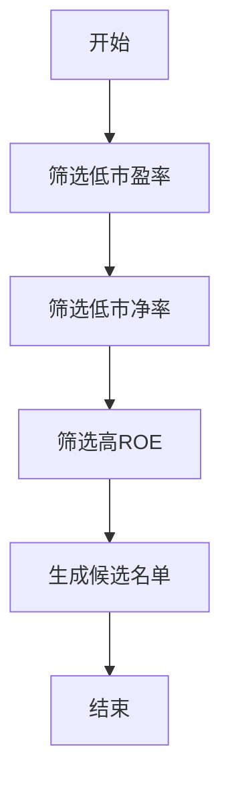

                 


# 克里斯托弗·布朗的小盘股价值投资策略

> 关键词：小盘股，价值投资，克里斯托弗·布朗，投资策略，财务分析，投资组合优化

> 摘要：本文详细探讨了克里斯托弗·布朗的小盘股价值投资策略，从策略背景、核心概念、算法原理、系统架构到项目实战和最佳实践，全面解析了该策略的理论基础和实际应用。通过丰富的案例分析和数学模型，帮助读者理解如何在小盘股市场中寻找投资机会，优化投资组合，实现长期收益。

---

## 目录

1. **小盘股价值投资策略概述**  
   1.1 小盘股的定义与特点  
   1.2 价值投资的核心理念  
   1.3 克里斯托弗·布朗的投资策略  
   1.4 小盘股价值投资的适用场景  

2. **小盘股价值投资的核心概念**  
   2.1 核心概念与联系  
   2.2 核心概念的数学模型  
   2.3 算法原理  

3. **小盘股价值投资的系统分析与架构设计**  
   3.1 系统分析  
   3.2 系统架构设计  

4. **小盘股价值投资的项目实战**  
   4.1 项目环境配置  
   4.2 核心代码实现  
   4.3 代码解读与分析  
   4.4 案例分析与总结  

5. **小盘股价值投资的最佳实践与注意事项**  
   5.1 最佳实践 tips  
   5.2 小结  
   5.3 注意事项  
   5.4 拓展阅读  

---

## 正文

### 1. 小盘股价值投资策略概述

#### 1.1 小盘股的定义与特点

小盘股通常指的是市值较小的公司股票。具体来说，小盘股的市值一般在 $100 million 到 $2 billion 之间。与大盘股相比，小盘股具有以下特点：

- **高增长潜力**：小盘股通常处于成长阶段，增长潜力较大。
- **流动性较低**：由于市场规模较小，交易量可能较低，市场深度有限。
- **波动性较高**：小盘股的价格波动通常比大盘股更大。
- **风险较高**：小盘股的投资风险相对较高，但潜在回报也更大。

#### 1.2 价值投资的核心理念

价值投资是一种长期投资策略，其核心在于寻找市场价格低于其内在价值的股票。价值投资者认为，市场短期可能 irrational，但长期会回归基本面。以下是价值投资的核心理念：

- **关注基本面**：通过分析公司的财务状况、盈利能力、行业地位等因素，寻找具有长期竞争优势的公司。
- **安全边际**：以低于公司内在价值的价格买入股票，以降低投资风险。
- **长期持有**：价值投资者通常会长期持有优质股票，等待其价值被市场发现。

#### 1.3 克里斯托弗·布朗的投资策略

克里斯托弗·布朗是小盘股价值投资领域的代表人物之一。他的策略主要包括以下几个方面：

- **精选个股**：通过严格的财务分析，筛选出具有长期增长潜力且估值合理的小盘股。
- **分散投资**：将资金分散投资于多只股票，以降低投资组合的风险。
- **长期持有**：不频繁交易，长期持有优质股票，分享公司成长的成果。

#### 1.4 小盘股价值投资的适用场景

小盘股价值投资适用于以下场景：

- **市场低迷期**：在市场低迷时，小盘股的估值可能被低估，适合价值投资者布局。
- **成长性行业**：在新兴行业或快速发展的行业中，小盘股可能具有更大的增长潜力。
- **多元化投资**：通过投资小盘股，投资者可以实现投资组合的多元化，降低风险。

---

### 2. 小盘股价值投资的核心概念

#### 2.1 核心概念与联系

小盘股价值投资的核心概念包括以下几个方面：

- **内在价值**：股票的内在价值是其未来现金流的现值，是衡量其合理价格的标准。
- **财务指标**：通过市盈率（P/E）、市净率（P/B）、ROE（净资产收益率）等指标，评估公司的财务健康状况。
- **市场估值**：通过比较市场价格与内在价值，判断股票是否被低估。

以下是一个简单的财务指标对比图：


#### 2.2 核心概念的数学模型

以下是几个关键的财务指标公式：

- **市盈率（P/E）**：
  $$ P/E = \frac{\text{股票价格}}{\text{每股收益}} $$

- **市净率（P/B）**：
  $$ P/B = \frac{\text{股票价格}}{\text{每股净资产}} $$

- **内在价值（V）**：
  $$ V = \sum_{t=1}^{n} \frac{\text{现金流}_t}{(1 + r)^t} $$
  其中，\( r \) 是折现率，\( \text{现金流}_t \) 是第 \( t \) 年的现金流。

#### 2.3 算法原理

以下是基于财务指标的股票筛选算法流程图：



---

### 3. 小盘股价值投资的系统分析与架构设计

#### 3.1 系统分析

小盘股价值投资系统需要实现以下功能：

- **数据采集**：获取小盘股的基本面数据，包括财务指标、行业信息等。
- **数据处理**：对数据进行清洗、转换和计算，生成可分析的指标。
- **策略执行**：根据筛选条件，生成投资组合。
- **风险管理**：监控投资组合的表现，控制风险。

#### 3.2 系统架构设计

以下是系统架构图：


---

### 4. 小盘股价值投资的项目实战

#### 4.1 项目环境配置

以下是项目所需的环境配置：

- **编程语言**：Python
- **库**：Pandas, NumPy, Matplotlib
- **数据源**：Yahoo Finance API

#### 4.2 核心代码实现

以下是核心代码：

```python
import pandas as pd
import numpy as np

def calculate_intrinsic_value(stock_data, discount_rate):
    cash_flows = stock_data['现金流'].values
    n = len(cash_flows)
    present_value = 0
    for t in range(n):
        present_value += cash_flows[t] / (1 + discount_rate) ** t
    return present_value

# 示例数据
stock_data = pd.DataFrame({
    '现金流': [100, 120, 140, 160],
    '折现率': [0.08] * 4
})

# 计算内在价值
intrinsic_value = calculate_intrinsic_value(stock_data, 0.08)
print(f"内在价值: {intrinsic_value:.2f}")
```

#### 4.3 代码解读与分析

以上代码实现了内在价值的计算，通过现金流的折现方法，评估股票的内在价值。以下是关键点：

- **现金流数据**：股票未来几年的现金流。
- **折现率**：用于计算现值的折现率，通常基于市场的无风险利率和风险溢价。
- **现值计算**：将未来现金流折现，求和得到内在价值。

#### 4.4 案例分析与总结

以某小盘股为例，假设其现金流如下：

| 年份 | 现金流 | 折现率 |
|------|--------|--------|
| 1    | 100    | 0.08    |
| 2    | 120    | 0.08    |
| 3    | 140    | 0.08    |
| 4    | 160    | 0.08    |

计算其内在价值：

$$ V = \frac{100}{1.08} + \frac{120}{1.08^2} + \frac{140}{1.08^3} + \frac{160}{1.08^4} $$

通过计算，得出该股票的内在价值约为 $380.19。如果市场价格低于此值，则可能被低估，适合投资。

---

### 5. 小盘股价值投资的最佳实践与注意事项

#### 5.1 最佳实践 tips

- **持续学习**：关注行业动态，学习新的财务分析方法。
- **分散投资**：避免将所有资金投入一只股票。
- **长期持有**：耐心持有优质股票，避免频繁交易。

#### 5.2 小结

克里斯托弗·布朗的小盘股价值投资策略通过精选个股、分散投资和长期持有，帮助投资者在小盘股市场中实现稳定收益。其核心在于对基本面的深入分析和对安全边际的严格控制。

#### 5.3 注意事项

- **市场风险**：小盘股波动较大，需注意市场风险。
- **信息获取**：确保数据来源可靠，避免信息滞后。
- **组合管理**：定期调整投资组合，优化配置。

#### 5.4 拓展阅读

推荐阅读以下书籍：

- 《价值投资实战策略》
- 《小盘股投资指南》

---

### 作者：AI天才研究院/AI Genius Institute & 禅与计算机程序设计艺术 /Zen And The Art of Computer Programming

