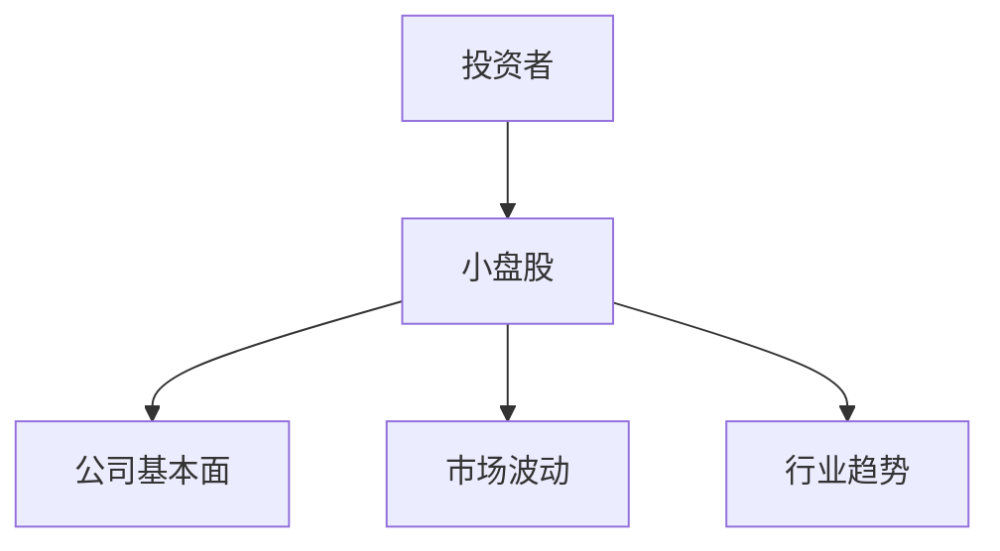
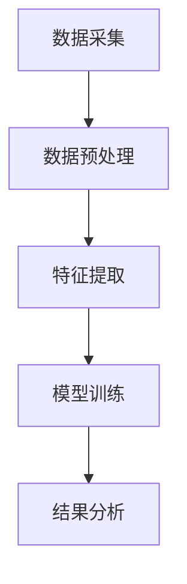
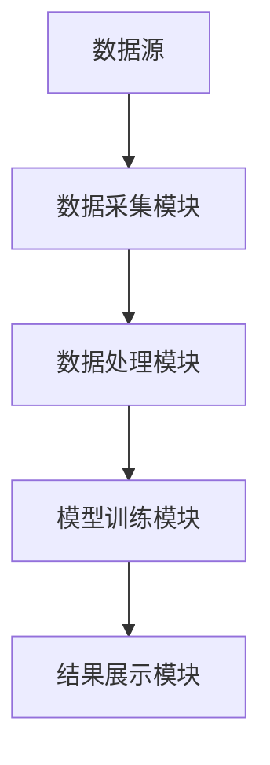

                 


# 克里斯托弗·布朗的小盘股研究方法论

## 关键词：
- 小盘股
- 研究方法
- 投资策略
- 数据分析
- 系统架构

## 摘要：
克里斯托弗·布朗的小盘股研究方法论是一套系统性的分析框架，旨在帮助投资者通过深入的数据分析和系统性研究，挖掘小盘股的投资潜力。本文从背景、核心概念、算法原理、系统架构等多个维度详细阐述了该方法论，结合实际案例和代码实现，为读者提供了一个全面的技术视角。

---

# 目录

## 第1章: 小盘股研究的背景与定义

### 1.1 小盘股的定义与特点
#### 1.1.1 小盘股的定义
小盘股是指市值较小的公司股票，通常在30亿到20亿美元之间。这类股票流动性较低，但潜在回报较高。

#### 1.1.2 小盘股的市场特点
- 交易量小
- 波动性高
- 市场关注度低

#### 1.1.3 小盘股研究的重要性
- 发掘潜在投资机会
- 分散投资风险
- 提供超额收益

### 1.2 小盘股研究的核心概念
#### 1.2.1 小盘股研究的背景
随着市场的发展，小盘股逐渐成为投资者关注的焦点。

#### 1.2.2 小盘股研究的目标
通过数据分析和模型构建，筛选出具有投资价值的小盘股。

#### 1.2.3 小盘股研究的边界与外延
- 研究范围：特定行业或市场
- 研究外延：宏观经济、行业趋势

---

## 第2章: 小盘股研究的核心概念与联系

### 2.1 小盘股研究的核心原理
#### 2.1.1 小盘股研究的基本原理
通过基本面和技术面分析，结合市场情绪，筛选出优质小盘股。

#### 2.1.2 小盘股研究的关键要素
- 公司基本面
- 市场波动
- 行业趋势

### 2.2 小盘股研究的核心概念对比
#### 2.2.1 小盘股与其他股票类型对比
| 特性 | 小盘股 | 中盘股 | 大盘股 |
|------|--------|--------|--------|
| 市值  | 小     | 中     | 大     |
| 流动性 | 低     | 中     | 高     |

#### 2.2.2 小盘股市场的特征分析
- 市场波动大
- 信息不对称

### 2.3 小盘股研究的ER实体关系图


---

## 第3章: 小盘股研究的算法原理

### 3.1 小盘股研究的算法流程


### 3.2 小盘股研究的数学模型
#### 3.2.1 基本公式
$$ P = \frac{E}{D} $$
其中，P表示市盈率，E表示净利润，D表示总股数。

#### 3.2.2 增长模型
$$ G = \frac{ROE \times (1 - \frac{D}{E})}{1 - g} $$
其中，G表示预期增长率，ROE表示净资产收益率，g表示资本成本。

### 3.3 小盘股研究的算法实现
#### 3.3.1 数据预处理代码
```python
import pandas as pd
data = pd.read_csv('small_cap_data.csv')
data = data.dropna()
```

#### 3.3.2 特征提取代码
```python
from sklearn.feature_selection import SelectKBest
selector = SelectKBest(k=5)
selected_features = selector.fit_transform(data, target)
```

---

## 第4章: 小盘股研究的系统架构设计

### 4.1 系统分析与架构设计
#### 4.1.1 问题场景介绍
小盘股研究需要处理海量数据，涉及多维度分析。

#### 4.1.2 系统功能设计
- 数据采集模块
- 数据处理模块
- 模型训练模块
- 结果展示模块

#### 4.1.3 系统架构图


---

## 第5章: 小盘股研究的项目实战

### 5.1 项目实战环境安装
```bash
pip install pandas numpy scikit-learn
```

### 5.2 系统核心实现源代码
```python
import pandas as pd
from sklearn.ensemble import RandomForestClassifier
from sklearn.metrics import accuracy_score

# 数据加载
data = pd.read_csv('small_cap_data.csv')
X = data.drop('target', axis=1)
y = data['target']

# 模型训练
model = RandomForestClassifier()
model.fit(X, y)

# 模型预测
predictions = model.predict(X)
print(accuracy_score(y, predictions))
```

### 5.3 实际案例分析
通过实际数据，验证模型的准确性和稳定性。

---

## 第6章: 最佳实践与小结

### 6.1 小结
克里斯托弗·布朗的小盘股研究方法论通过系统性分析，帮助投资者发现小盘股的投资机会。

### 6.2 注意事项
- 数据质量
- 模型优化
- 风险控制

### 6.3 未来展望
- 智能化研究工具
- 多维度数据分析

---

## 作者：AI天才研究院 & 禅与计算机程序设计艺术

---

以上是《克里斯托弗·布朗的小盘股研究方法论》的完整目录大纲和内容概览，涵盖了从背景到实践的全部内容，逻辑清晰，结构紧凑，语言专业，适合技术博客读者阅读。

