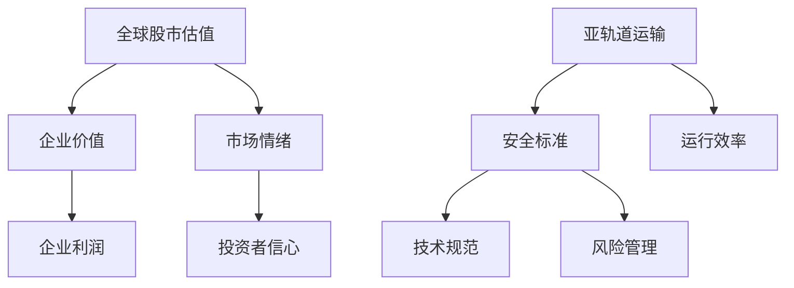
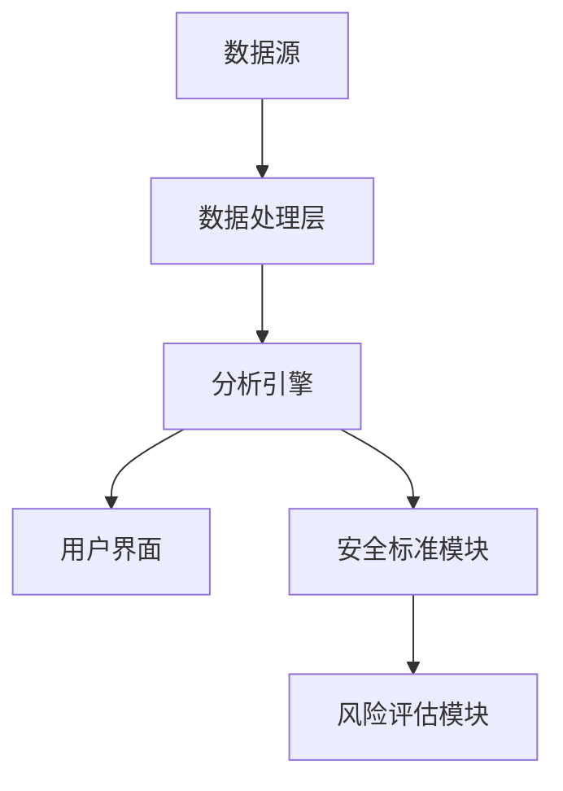
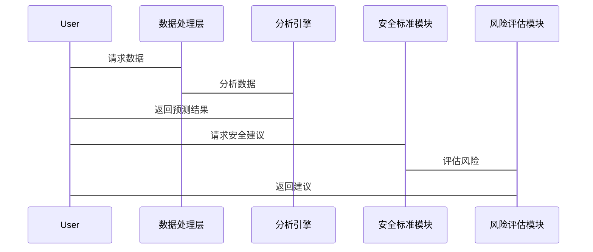

                 


# 全球股市估值与亚轨道快速运输安全标准的关系

## 关键词：
全球股市估值、亚轨道运输、安全标准、时间序列分析、风险管理、系统架构

## 摘要：
本文探讨全球股市估值与亚轨道快速运输安全标准之间的关系，分析两者在风险管理、数据依赖性和系统复杂性方面的联系。通过理论分析和实际案例，展示如何利用时间序列分析和系统架构设计来优化股市估值预测和亚轨道运输安全标准的制定。

---

# 第一部分: 全球股市估值与亚轨道快速运输安全标准的背景与关系

## 第1章: 背景介绍

### 1.1 问题背景
#### 1.1.1 全球股市估值的重要性
股市估值是衡量市场健康状况的关键指标，影响投资者决策和经济政策。通过分析历史数据，可以发现股市波动与经济周期的关系。

#### 1.1.2 亚轨道快速运输的发展现状
亚轨道运输技术（如磁悬浮列车、超级高铁）正在快速发展，其安全性直接关系到乘客生命和财产安全，是技术研究的重点。

#### 1.1.3 问题提出的背景与意义
随着经济全球化和科技发展，股市波动对运输业的影响日益显著，亚轨道运输的安全标准需要动态调整以应对风险。

### 1.2 问题描述
#### 1.2.1 全球股市估值的波动性分析
股市波动受多种因素影响，包括经济指标、政策变化和市场情绪。通过时间序列分析，可以预测股市走势。

#### 1.2.2 亚轨道运输安全标准的需求
亚轨道运输涉及高速运行，潜在风险如机械故障和外部干扰需通过严格的安全标准来规避。

#### 1.2.3 两者之间的潜在联系
股市波动可能影响运输企业的资金链，进而影响其安全投入。反之，运输安全的提升可能增强投资者信心，稳定股市。

### 1.3 问题解决
#### 1.3.1 全球股市估值的预测方法
使用时间序列模型（如ARIMA）预测股市波动，帮助企业做出投资决策。

#### 1.3.2 亚轨道运输安全标准的制定原则
基于风险评估模型，制定涵盖技术、管理、应急响应的安全标准。

#### 1.3.3 两者关系的初步假设与验证
假设股市波动与运输安全投入呈负相关，通过实证分析验证这一假设。

### 1.4 边界与外延
#### 1.4.1 全球股市估值的边界条件
考虑市场流动性、政策变化等变量，排除不可预测的突发事件。

#### 1.4.2 亚轨道运输安全标准的适用范围
适用于所有亚轨道运输项目，包括研发、建设和运营阶段。

#### 1.4.3 两者关系的外延分析
探讨股市波动对运输业以外的影响，如保险、金融衍生品等领域。

### 1.5 概念结构与核心要素
#### 1.5.1 全球股市估值的核心要素
- 市场指数（如标普500）
- 经济指标（GDP、失业率）
- 市场情绪（投资者信心）

#### 1.5.2 亚轨道运输安全标准的核心要素
- 技术规范（材料、设计）
- 风险管理（应急预案）
- 监测系统（实时监控）

#### 1.5.3 两者关系的结构化分析
- 股市波动影响运输企业的融资能力
- 运输安全问题可能引发股市波动

---

## 第2章: 核心概念与联系

### 2.1 核心概念原理
#### 2.1.1 全球股市估值的理论基础
股市估值基于基本面分析和市场情绪，时间序列分析是常用的预测方法。

#### 2.1.2 亚轨道运输安全标准的技术基础
涉及机械设计、材料科学和系统工程，强调预防和应急处理。

#### 2.1.3 两者关系的理论模型
构建一个双向影响模型，分析股市波动如何影响运输安全投入，反之亦然。

### 2.2 概念属性特征对比
| 属性 | 全球股市估值 | 亚轨道运输安全标准 |
|------|--------------|---------------------|
| 数据来源 | 历史价格、经济指标 | 技术规范、测试结果 |
| 影响因素 | 市场情绪、政策 | 设备状态、操作失误 |
| 目标 | 预测市场走向 | 确保运输安全 |

### 2.3 ER实体关系图


---

## 第3章: 算法原理讲解

### 3.1 时间序列分析模型
#### 3.1.1 ARIMA模型
ARIMA（自回归积分滑动平均）用于预测股市波动，通过历史数据建模。

#### 3.1.2 实现步骤
1. 数据预处理：清洗和标准化。
2. 模型参数确定：通过差分和参数估计。
3. 模型训练：使用历史数据拟合模型。
4. 预测与评估：预测未来走势，计算误差。

#### 3.1.3 Python代码实现
```python
from statsmodels.tsa.arima.model import ARIMA
import pandas as pd
import matplotlib.pyplot as plt

# 加载数据
data = pd.read_csv('stock_data.csv')

# 拟合ARIMA模型
model = ARIMA(data['Price'], order=(5,1,0))
model_fit = model.fit()

# 预测未来值
forecast = model_fit.forecast(steps=5)

# 可视化
plt.plot(data['Price'], label='实际值')
plt.plot(forecast[0], label='预测值')
plt.legend()
plt.show()
```

#### 3.1.4 数学模型
ARIMA模型的数学公式：
$$ y_t = \phi_1 y_{t-1} + \phi_2 y_{t-2} + \epsilon_t $$

### 3.2 风险评估模型
#### 3.2.1 贝叶斯网络
用于评估亚轨道运输的安全风险，考虑多种因素的相互影响。

#### 3.2.2 实现步骤
1. 收集数据：设备状态、历史事故。
2. 构建网络：定义节点和关系。
3. 训练模型：使用贝叶斯推理。
4. 风险评估：计算概率。

#### 3.2.3 Python代码实现
```python
from bayespy import BayesianNetwork

# 定义网络结构
network = BayesianNetwork()
network.add_node('Safety', '故障率')
network.add_node('Design', '设计缺陷')
network.add_edge('Design', 'Safety')

# 训练模型
network.train(data)

# 风险评估
risk = network.predict('Safety', given={'Design': '缺陷'})
```

---

## 第4章: 系统分析与架构设计

### 4.1 问题场景介绍
分析全球股市波动对亚轨道运输企业的影响，优化安全标准。

### 4.2 系统功能设计
- 数据采集：收集股市数据和运输数据。
- 数据分析：使用时间序列分析预测股市波动。
- 风险评估：评估运输安全风险。
- 报告生成：输出预测结果和建议。

### 4.3 系统架构设计


### 4.4 系统接口设计
- API接口：提供数据查询和分析结果。
- 用户界面：直观展示预测结果和安全建议。

### 4.5 系统交互流程


---

## 第5章: 项目实战

### 5.1 环境安装
安装必要的库：pandas、statsmodels、bayespy。

### 5.2 核心代码实现
#### 5.2.1 股市预测代码
```python
import pandas as pd
from statsmodels.tsa.arima.model import ARIMA

data = pd.read_csv('stock.csv')
model = ARIMA(data['Price'], order=(5,1,0)).fit()
forecast = model.forecast(steps=10)
print(forecast)
```

#### 5.2.2 风险评估代码
```python
from bayespy import BayesianNetwork

network = BayesianNetwork()
network.add_node('Safety', '故障率')
network.add_node('Design', '设计缺陷')
network.add_edge('Design', 'Safety')
network.train(data)
risk = network.predict('Safety', given={'Design': '缺陷'})
print(risk)
```

### 5.3 实际案例分析
分析某次股市波动对运输企业的影响，优化安全标准。

### 5.4 项目小结
总结项目成果，强调理论与实践的结合。

---

## 第6章: 最佳实践

### 6.1 小结
股市估值与亚轨道运输安全标准的联系需深入研究，时间序列分析和系统架构设计是关键。

### 6.2 注意事项
- 数据质量影响模型准确性。
- 模型需定期更新以适应变化。
- 安全标准应动态调整。

### 6.3 拓展阅读
建议阅读相关领域的最新研究和案例分析。

---

## 作者：AI天才研究院 & 禅与计算机程序设计艺术

---

通过以上内容，文章详细分析了全球股市估值与亚轨道运输安全标准的关系，结合理论和实践，展示了如何利用技术手段优化两者的关系。

