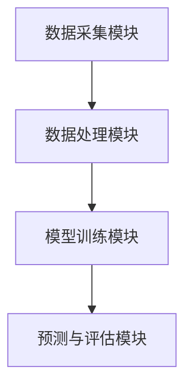

                 


# 全球股市估值与人工智能在司法系统中的应用

> 关键词：全球股市估值、人工智能、司法系统、机器学习、股票预测、法律知识图谱

> 摘要：本文探讨了全球股市估值与人工智能在司法系统中的应用，从理论到实践，详细分析了股票估值的核心概念、机器学习模型构建、系统架构设计以及人工智能在司法系统中的创新应用。通过案例分析和实战项目，展示了如何利用人工智能技术提升股市估值的准确性与司法系统的智能化水平。

---

## # 引言

在全球化经济与数字化转型的背景下，股市估值与司法系统作为两个看似独立的领域，正在经历深刻的变革。人工智能（AI）技术的快速发展，为这两个领域带来了新的机遇与挑战。本文将从股市估值的核心概念出发，结合机器学习与深度学习算法，分析如何利用AI技术提升股票估值的准确性。同时，本文还将探讨人工智能在司法系统中的创新应用，揭示AI如何助力司法决策的智能化与公平性。

---

## # 第一部分: 全球股市估值

### # 第1章: 全球股市估值基础

#### ## 1.1 股市估值的基本概念

##### ### 1.1.1 股票估值的定义
股票估值是指通过对公司基本面、市场环境等因素的分析，估算股票的内在价值或市场价格的过程。股票估值的核心目标是帮助投资者做出科学的决策，比如买入、卖出或持有某只股票。

##### ### 1.1.2 股票估值的核心要素
股票估值的核心要素包括：
1. **公司基本面**：收入、利润、资产负债表等财务数据。
2. **行业环境**：行业竞争格局、政策法规等。
3. **宏观经济**：GDP增速、利率、通货膨胀等。
4. **市场情绪**：投资者情绪、市场流动性等。

##### ### 1.1.3 股票估值的分类与应用场景
股票估值可以分为以下几种类型：
- **绝对估值**：基于公司基本面数据，估算股票的内在价值。
- **相对估值**：通过比较同类股票的估值指标，判断股票的高估或低估。
- **技术分析**：基于历史价格与成交量数据，预测未来价格走势。

股票估值的应用场景包括：
- 投资决策：帮助投资者判断股票的投资价值。
- 风险管理：评估投资组合的风险敞口。
- 公司治理：帮助管理层优化资本结构。

#### ## 1.2 股票估值的主要方法

##### ### 1.2.1 市盈率法（P/E Ratio）
市盈率=股价/每股净利润，用于衡量股票的估值水平。市盈率越低，可能意味着股票被低估。

##### ### 1.2.2 市净率法（P/B Ratio）
市净率=股价/每股净资产，用于衡量股票相对于账面价值的高低。适用于银行、房地产等资产密集型行业。

##### ### 1.2.3 股息率法（Dividend Yield）
股息率=每股股息/股价，用于衡量股票的分红收益。适用于注重稳定收益的投资者。

##### ### 1.2.4 内在价值法（Intrinsic Value）
内在价值=未来现金流的现值，用于绝对估值。常用的方法包括DCF（Discounted Cash Flow）模型。

#### ## 1.3 影响股市估值的主要因素

##### ### 1.3.1 宏观经济因素
- **GDP增速**：经济繁荣时，股市估值通常上升。
- **利率水平**：低利率环境有利于股市估值上升。
- **通货膨胀**：高通胀可能导致股市估值下降。

##### ### 1.3.2 行业因素
- **行业周期**：行业处于上升周期时，估值通常较高。
- **行业政策**：政策支持的行业通常估值较高。

##### ### 1.3.3 公司基本面因素
- **盈利能力**：净利润率高的公司估值通常较高。
- **成长性**：高成长性的公司估值通常较高。

##### ### 1.3.4 市场情绪因素
- **市场情绪**：投资者情绪高涨时，股市估值可能高于实际价值。

---

#### ## 1.4 股票估值的数学模型

##### ### 1.4.1 市盈率模型
$$ \text{市盈率} = \frac{\text{股价}}{\text{每股净利润}} $$

##### ### 1.4.2 DCF模型
$$ \text{内在价值} = \sum_{t=1}^{n} \frac{\text{自由现金流}}{(1 + r)^t} + \frac{\text{终值}}{(1 + r)^n} $$

其中，\( r \) 为折现率，\( n \) 为预测期数。

---

### # 第2章: 股票估值的机器学习模型

#### ## 2.1 机器学习在股票预测中的应用

##### ### 2.1.1 机器学习的基本概念
机器学习是一种人工智能技术，通过数据训练模型，预测未来的结果。在股票估值中，机器学习可以用于预测股价走势、识别市场趋势等。

##### ### 2.1.2 机器学习在股票预测中的优势
- **数据驱动**：机器学习基于大量数据进行预测，避免了人为情绪的干扰。
- **非线性关系**：机器学习可以捕捉复杂的非线性关系，提高预测准确性。

##### ### 2.1.3 常见的股票预测算法
- **线性回归**：适用于简单的线性关系。
- **随机森林**：适用于特征较多、关系复杂的场景。
- **神经网络**：适用于复杂的非线性关系。

#### ## 2.2 基于机器学习的股票估值模型构建

##### ### 2.2.1 数据收集与预处理
- **数据来源**：股票历史价格、财务数据、市场情绪数据等。
- **数据清洗**：处理缺失值、异常值等。

##### ### 2.2.2 特征选择与工程
- **特征选择**：选择对股价影响较大的特征，如成交量、市盈率等。
- **特征工程**：构建新的特征，如动量指标、相对强弱指数（RSI）等。

##### ### 2.2.3 模型训练与优化
- **模型训练**：使用训练数据训练模型。
- **模型优化**：通过交叉验证调整模型参数。

##### ### 2.2.4 模型评估与验证
- **评估指标**：均方误差（MSE）、平均绝对误差（MAE）、R平方值等。
- **验证方法**：使用测试数据验证模型的准确性。

#### ## 2.3 基于深度学习的股票估值模型

##### ### 2.3.1 深度学习的基本概念
深度学习是一种机器学习技术，通过多层神经网络提取数据的高层次特征。

##### ### 2.3.2 基于LSTM的股票价格预测
LSTM（长短期记忆网络）适用于时间序列数据的预测，能够捕捉股价的长期依赖关系。

##### ### 2.3.3 基于Transformer的股票价格预测
Transformer模型通过自注意力机制，能够捕捉股价的全局关系。

---

### # 第3章: 股票估值的系统架构与实现

#### ## 3.1 系统架构设计

##### ### 3.1.1 系统功能模块划分
- **数据采集模块**：采集股票数据。
- **数据处理模块**：清洗、特征工程。
- **模型训练模块**：训练机器学习模型。
- **预测与评估模块**：预测股价并评估模型性能。

##### ### 3.1.2 系统架构图


##### ### 3.1.3 系统接口设计
- **数据接口**：与数据源对接，获取股票数据。
- **API接口**：提供股票估值的API服务。

#### ## 3.2 系统实现

##### ### 3.2.1 数据库设计
```mermaid
erd
    table 股票数据表
        股票代码(string, key)
        日期(date, key)
        收盘价(float)
        成交量(integer)
```

##### ### 3.2.2 系统功能实现
- **数据采集**：使用爬虫采集股票数据。
- **特征工程**：构建技术指标，如MA、MACD等。
- **模型训练**：训练机器学习模型并保存模型。
- **预测服务**：提供API接口，接收股票代码和日期，返回估值结果。

##### ### 3.2.3 系统测试与优化
- **单元测试**：测试各功能模块。
- **性能优化**：优化模型训练时间与预测速度。

---

### # 第4章: 股票估值的实战案例分析

#### ## 4.1 案例背景介绍
假设我们希望预测某只股票在接下来的一个月内的价格走势。我们收集了过去一年的股票数据，包括收盘价、成交量、财务数据等。

#### ## 4.2 案例分析与实现

##### ### 4.2.1 数据清洗与特征工程
- **数据清洗**：处理缺失值和异常值。
- **特征工程**：构建技术指标，如动量指标、相对强弱指数（RSI）等。

##### ### 4.2.2 模型训练与优化
- **模型选择**：选择LSTM模型。
- **模型训练**：使用训练数据训练模型。
- **模型优化**：调整超参数，如学习率、批量大小等。

##### ### 4.2.3 模型评估与验证
- **评估指标**：均方误差（MSE）、平均绝对误差（MAE）、R平方值等。
- **验证方法**：使用测试数据验证模型的准确性。

##### ### 4.2.4 模型预测与解读
- **预测结果**：预测未来一个月的股价走势。
- **结果解读**：分析预测结果的合理性。

---

## # 第二部分: 人工智能在司法系统中的应用

### # 第5章: 人工智能在司法系统中的创新应用

#### ## 5.1 司法系统的智能化需求

##### ### 5.1.1 司法系统的现状
- **数据量大**：司法系统涉及大量案件数据。
- **处理效率低**：案件处理时间长，资源浪费。
- **公平性问题**：人为因素可能导致判决不公。

##### ### 5.1.2 人工智能在司法系统中的优势
- **提高效率**：自动化处理案件，缩短处理时间。
- **增强公平性**：减少人为因素干扰，提高判决的客观性。
- **降低成本**：减少人力资源投入，降低司法成本。

#### ## 5.2 人工智能在司法系统中的应用场景

##### ### 5.2.1 法律知识图谱
- **法律知识图谱**：构建法律知识图谱，帮助计算机理解法律条文和司法案例。
- **案例分析**：通过知识图谱，快速找到类似案例，辅助法官做出判决。

##### ### 5.2.2 司法大数据分析
- **案件分类**：通过大数据分析，自动分类案件类型。
- **风险评估**：评估案件的执行风险，辅助法官做出判决。

##### ### 5.2.3 智能审判系统
- **智能审判系统**：通过自然语言处理技术，自动分析案件事实，生成判决书。
- **法律咨询**：为律师和当事人提供法律咨询，辅助法律文书的撰写。

#### ## 5.3 人工智能在司法系统中的技术实现

##### ### 5.3.1 法律知识图谱的构建
- **知识抽取**：从司法案例中抽取实体和关系。
- **知识表示**：使用图数据库存储法律知识。
- **知识推理**：通过推理算法，推导出新的法律知识。

##### ### 5.3.2 司法大数据分析
- **数据采集**：采集司法系统的案件数据。
- **数据处理**：清洗、预处理数据。
- **数据分析**：使用机器学习算法分析数据，发现规律。

##### ### 5.3.3 智能审判系统的实现
- **自然语言处理**：通过NLP技术，自动分析案件事实。
- **知识图谱应用**：利用法律知识图谱，辅助生成判决书。
- **人机交互**：提供友好的人机交互界面，方便法官使用。

---

### # 第6章: 人工智能在司法系统中的案例分析

#### ## 6.1 案例背景介绍
假设我们希望构建一个智能审判系统，辅助法官处理民事纠纷案件。

#### ## 6.2 案例分析与实现

##### ### 6.2.1 数据采集与预处理
- **数据采集**：采集过去十年的民事纠纷案件数据。
- **数据清洗**：处理缺失值、异常值。

##### ### 6.2.2 法律知识图谱的构建
- **知识抽取**：从案件中抽取实体和关系。
- **知识表示**：使用图数据库存储法律知识。
- **知识推理**：通过推理算法，推导出新的法律知识。

##### ### 6.2.3 智能审判系统的实现
- **自然语言处理**：通过NLP技术，自动分析案件事实。
- **知识图谱应用**：利用法律知识图谱，辅助生成判决书。
- **人机交互**：提供友好的人机交互界面，方便法官使用。

##### ### 6.2.4 案例分析与结果解读
- **案例分析**：分析系统的准确性和效率。
- **结果解读**：总结系统的优缺点，提出改进建议。

---

## # 总结

本文从全球股市估值与人工智能在司法系统中的应用两个方面，详细探讨了人工智能技术在金融与司法领域的创新应用。通过股票估值的理论分析、机器学习模型构建、系统架构设计以及实战案例分析，展示了人工智能在提升股市估值准确性和司法系统智能化水平中的重要作用。未来，随着人工智能技术的不断发展，其在金融与司法领域的应用前景将更加广阔。

---

## # 作者

作者：AI天才研究院/AI Genius Institute & 禅与计算机程序设计艺术 /Zen And The Art of Computer Programming

